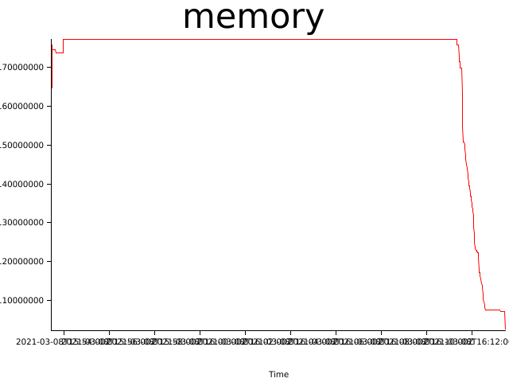
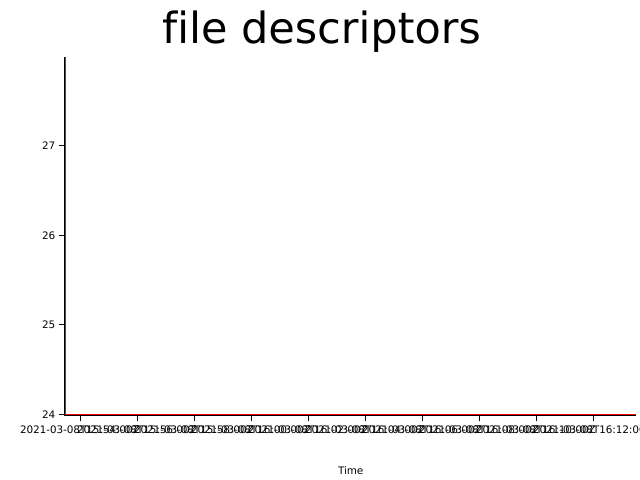

# Test results (Mon, 08 Mar 2021 15:53:02 +0000)


git revision: a2afe00774dd7cda9dfaada3340e2aee9b1159a2

test duration (seconds): 1200

## Memory consumption


## Files open


## Log Errors

```
2021-03-08 16:53:57,672 INFO  [northstar::runtime::state] Destroying context
2021-03-08 17:02:27,644 WARN  [northstar::runtime::state] Application test05:0.0.1 is not running
2021-03-08 17:02:27,644 ERROR [northstar::runtime::state] Failed to stop test05: Application is not running
2021-03-08 17:02:27,647 DEBUG [northstar::runtime::console] Client "[::1]:48048" connected
2021-03-08 17:02:27,647 INFO  [northstar::runtime::console] [::1]:47980: Connection closed
2021-03-08 17:02:27,647 INFO  [northstar::runtime::console] Connection to [::1]:47980 closed
```
```
2021-03-08 17:02:27,659 INFO  [northstar::runtime::state] Destroying context
2021-03-08 17:11:27,643 WARN  [northstar::runtime::state] Application test05:0.0.1 is not running
2021-03-08 17:11:27,643 ERROR [northstar::runtime::state] Failed to stop test05: Application is not running
2021-03-08 17:11:27,644 INFO  [northstar::runtime::console] [::1]:48048: Connection closed
2021-03-08 17:11:27,645 INFO  [northstar::runtime::console] Connection to [::1]:48048 closed
2021-03-08 17:11:27,645 DEBUG [northstar::runtime::console] Client "[::1]:48082" connected
```
