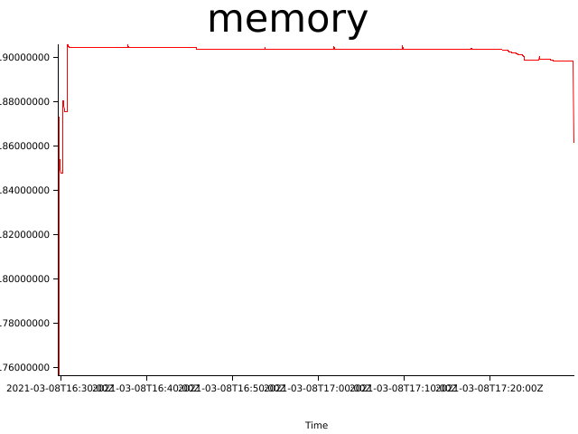
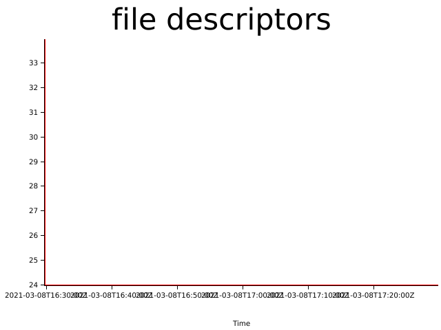

# Test results (Mon, 08 Mar 2021 16:29:20 +0000)


git revision: 748109ec85960d5d7e6f4224ad53812062a4383d

test duration (seconds): 3600

## Memory consumption


## Files open


## Log Errors

```
2021-03-08 17:29:46,912 INFO  [northstar::runtime::state] Stopped test00:0.0.1 Signaled(SIGKILL)
2021-03-08 17:29:46,912 INFO  [northstar::runtime::state] Stopping test07:0.0.1
2021-03-08 17:29:46,912 ERROR [northstar::runtime::state] Failed to stop test07: Process: Os("Failed to SIGTERM 152695", Sys(ESRCH))
2021-03-08 17:29:46,913 INFO  [northstar::runtime::state] Stopping test06:0.0.1
2021-03-08 17:29:46,913 ERROR [northstar::runtime::state] Failed to stop test06: Process: Os("Failed to SIGTERM 152698", Sys(ESRCH))
2021-03-08 17:29:46,913 INFO  [northstar::runtime::state] Stopping test05:0.0.1
```
```
2021-03-08 17:29:46,912 ERROR [northstar::runtime::state] Failed to stop test07: Process: Os("Failed to SIGTERM 152695", Sys(ESRCH))
2021-03-08 17:29:46,913 INFO  [northstar::runtime::state] Stopping test06:0.0.1
2021-03-08 17:29:46,913 ERROR [northstar::runtime::state] Failed to stop test06: Process: Os("Failed to SIGTERM 152698", Sys(ESRCH))
2021-03-08 17:29:46,913 INFO  [northstar::runtime::state] Stopping test05:0.0.1
2021-03-08 17:29:46,915 INFO  [northstar::runtime::console] [::1]:38036: Connection closed
2021-03-08 17:29:46,915 INFO  [northstar::runtime::console] Connection to [::1]:38036 closed
```
```
2021-03-08 17:29:47,916 INFO  [northstar::runtime::state] Stopped test05:0.0.1 Signaled(SIGKILL)
2021-03-08 17:29:47,916 INFO  [northstar::runtime::state] Stopping test04:0.0.1
2021-03-08 17:29:47,916 ERROR [northstar::runtime::state] Failed to stop test04: Process: Os("Failed to SIGTERM 152702", Sys(ESRCH))
2021-03-08 17:29:47,918 INFO  [northstar::runtime::console] [::1]:38042: Connection closed
2021-03-08 17:29:47,918 INFO  [northstar::runtime::console] Connection to [::1]:38042 closed
2021-03-08 17:29:47,919 DEBUG [northstar::runtime::console] Client "[::1]:38062" connected
```
```
2021-03-08 17:30:45,971 INFO  [northstar::runtime::state] Destroying context
2021-03-08 17:37:45,882 WARN  [northstar::runtime::state] Application test04:0.0.1 is not running
2021-03-08 17:37:45,882 ERROR [northstar::runtime::state] Failed to stop test04: Application is not running
2021-03-08 17:37:45,885 INFO  [northstar::runtime::console] [::1]:38060: Connection closed
2021-03-08 17:37:45,885 INFO  [northstar::runtime::console] Connection to [::1]:38060 closed
2021-03-08 17:37:45,885 DEBUG [northstar::runtime::console] Client "[::1]:38078" connected
```
```
2021-03-08 17:37:45,896 INFO  [northstar::runtime::state] Destroying context
2021-03-08 17:45:45,882 WARN  [northstar::runtime::state] Application test04:0.0.1 is not running
2021-03-08 17:45:45,882 ERROR [northstar::runtime::state] Failed to stop test04: Application is not running
2021-03-08 17:45:45,885 INFO  [northstar::runtime::console] [::1]:38078: Connection closed
2021-03-08 17:45:45,885 INFO  [northstar::runtime::console] Connection to [::1]:38078 closed
2021-03-08 17:45:45,885 DEBUG [northstar::runtime::console] Client "[::1]:38092" connected
```
```
2021-03-08 17:45:45,895 INFO  [northstar::runtime::state] Destroying context
2021-03-08 17:53:45,883 WARN  [northstar::runtime::state] Application test04:0.0.1 is not running
2021-03-08 17:53:45,883 ERROR [northstar::runtime::state] Failed to stop test04: Application is not running
2021-03-08 17:53:45,885 INFO  [northstar::runtime::console] [::1]:38092: Connection closed
2021-03-08 17:53:45,885 INFO  [northstar::runtime::console] Connection to [::1]:38092 closed
2021-03-08 17:53:45,885 DEBUG [northstar::runtime::console] Client "[::1]:38120" connected
```
```
2021-03-08 17:53:45,898 INFO  [northstar::runtime::state] Destroying context
2021-03-08 18:01:45,882 WARN  [northstar::runtime::state] Application test04:0.0.1 is not running
2021-03-08 18:01:45,882 ERROR [northstar::runtime::state] Failed to stop test04: Application is not running
2021-03-08 18:01:45,885 INFO  [northstar::runtime::console] [::1]:38120: Connection closed
2021-03-08 18:01:45,885 DEBUG [northstar::runtime::console] Client "[::1]:38142" connected
2021-03-08 18:01:45,885 INFO  [northstar::runtime::console] Connection to [::1]:38120 closed
```
```
2021-03-08 18:01:45,895 INFO  [northstar::runtime::state] Destroying context
2021-03-08 18:09:45,882 WARN  [northstar::runtime::state] Application test04:0.0.1 is not running
2021-03-08 18:09:45,883 ERROR [northstar::runtime::state] Failed to stop test04: Application is not running
2021-03-08 18:09:45,884 DEBUG [northstar::runtime::console] Client "[::1]:38154" connected
2021-03-08 18:09:45,884 INFO  [northstar::runtime::console] [::1]:38142: Connection closed
2021-03-08 18:09:45,884 INFO  [northstar::runtime::console] Connection to [::1]:38142 closed
```
```
2021-03-08 18:09:45,893 INFO  [northstar::runtime::state] Destroying context
2021-03-08 18:17:45,882 WARN  [northstar::runtime::state] Application test04:0.0.1 is not running
2021-03-08 18:17:45,883 ERROR [northstar::runtime::state] Failed to stop test04: Application is not running
2021-03-08 18:17:45,884 DEBUG [northstar::runtime::console] Client "[::1]:38170" connected
2021-03-08 18:17:45,885 INFO  [northstar::runtime::console] [::1]:38154: Connection closed
2021-03-08 18:17:45,885 INFO  [northstar::runtime::console] Connection to [::1]:38154 closed
```
```
2021-03-08 18:17:45,896 INFO  [northstar::runtime::state] Destroying context
2021-03-08 18:25:45,882 WARN  [northstar::runtime::state] Application test04:0.0.1 is not running
2021-03-08 18:25:45,882 ERROR [northstar::runtime::state] Failed to stop test04: Application is not running
2021-03-08 18:25:45,883 INFO  [northstar::runtime::console] [::1]:38170: Connection closed
2021-03-08 18:25:45,883 INFO  [northstar::runtime::console] Connection to [::1]:38170 closed
2021-03-08 18:25:45,884 DEBUG [northstar::runtime::console] Client "[::1]:38190" connected
```
