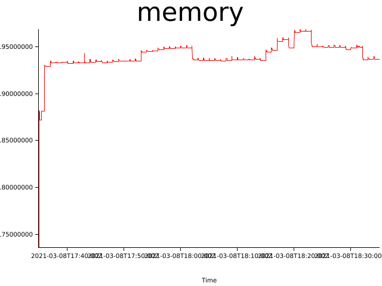
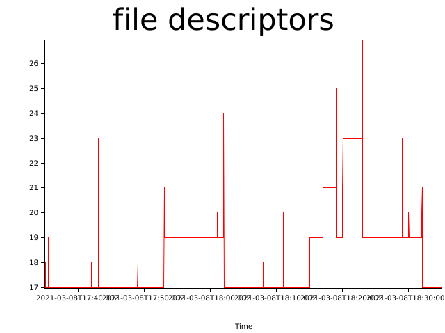

# Test results (Mon, 08 Mar 2021 17:34:35 +0000)


git revision: fcaaf530c2e895b4e5de9a00b58e0715cfadf4aa

test duration (seconds): 3600

## Memory consumption


## Files open


## Log Errors

```
2021-03-08 18:37:02,693 INFO  [northstar::runtime::state] Started test01:0.0.1
2021-03-08 18:37:02,694 WARN  [northstar::runtime::state] Application test00:0.0.1 is not running
2021-03-08 18:37:02,694 ERROR [northstar::runtime::state] Failed to stop test00: Application is not running
2021-03-08 18:37:02,694 INFO  [northstar::runtime::state] Starting test03:0.0.1
2021-03-08 18:37:02,694 DEBUG [northstar::runtime::minijail] Setting UID to 1000
2021-03-08 18:37:02,694 DEBUG [northstar::runtime::minijail] Setting GID to 1000
```
```
2021-03-08 18:38:02,690 DEBUG [northstar::runtime::console] Client "[::1]:53574" connected
2021-03-08 18:38:02,690 WARN  [northstar::runtime::state] Application test01:0.0.1 is not running
2021-03-08 18:38:02,690 ERROR [northstar::runtime::state] Failed to stop test01: Application is not running
2021-03-08 18:38:02,691 INFO  [northstar::runtime::state] Starting test03:0.0.1
2021-03-08 18:38:02,691 DEBUG [northstar::runtime::minijail] Setting UID to 1000
2021-03-08 18:38:02,691 DEBUG [northstar::runtime::minijail] Setting GID to 1000
```
```
2021-03-08 18:39:02,690 DEBUG [northstar::runtime::console] Client "[::1]:53582" connected
2021-03-08 18:39:02,691 WARN  [northstar::runtime::state] Application test00:0.0.1 is not running
2021-03-08 18:39:02,691 ERROR [northstar::runtime::state] Failed to stop test00: Application is not running
2021-03-08 18:39:02,691 INFO  [northstar::runtime::state] Starting test01:0.0.1
2021-03-08 18:39:02,691 DEBUG [northstar::runtime::minijail] Setting UID to 1000
2021-03-08 18:39:02,691 DEBUG [northstar::runtime::minijail] Setting GID to 1000
```
```
2021-03-08 18:41:02,695 INFO  [northstar::runtime::state] Started test03:0.0.1
2021-03-08 18:41:02,696 WARN  [northstar::runtime::state] Application test00:0.0.1 is not running
2021-03-08 18:41:02,696 ERROR [northstar::runtime::state] Failed to stop test00: Application is not running
2021-03-08 18:41:02,697 WARN  [northstar::runtime::state] Application test01:0.0.1 is not running
2021-03-08 18:41:02,697 ERROR [northstar::runtime::state] Failed to stop test01: Application is not running
2021-03-08 18:41:02,698 INFO  [northstar::runtime::console] [::1]:53600: Connection closed
```
```
2021-03-08 18:41:02,696 ERROR [northstar::runtime::state] Failed to stop test00: Application is not running
2021-03-08 18:41:02,697 WARN  [northstar::runtime::state] Application test01:0.0.1 is not running
2021-03-08 18:41:02,697 ERROR [northstar::runtime::state] Failed to stop test01: Application is not running
2021-03-08 18:41:02,698 INFO  [northstar::runtime::console] [::1]:53600: Connection closed
2021-03-08 18:41:02,698 INFO  [northstar::runtime::console] Connection to [::1]:53600 closed
2021-03-08 18:41:02,699 DEBUG [northstar::runtime::console] Client "[::1]:53604" connected
```
```
2021-03-08 18:43:02,690 DEBUG [northstar::runtime::console] Client "[::1]:53620" connected
2021-03-08 18:43:02,691 WARN  [northstar::runtime::state] Application test00:0.0.1 is not running
2021-03-08 18:43:02,691 ERROR [northstar::runtime::state] Failed to stop test00: Application is not running
2021-03-08 18:43:02,692 INFO  [northstar::runtime::state] Starting test03:0.0.1
2021-03-08 18:43:02,692 DEBUG [northstar::runtime::minijail] Setting UID to 1000
2021-03-08 18:43:02,692 DEBUG [northstar::runtime::minijail] Setting GID to 1000
```
```
2021-03-08 18:43:02,695 INFO  [northstar::runtime::state] Started test03:0.0.1
2021-03-08 18:43:02,695 WARN  [northstar::runtime::state] Application test04:0.0.1 is not running
2021-03-08 18:43:02,695 ERROR [northstar::runtime::state] Failed to stop test04: Application is not running
2021-03-08 18:43:02,695 INFO  [northstar::runtime::state] Starting test00:0.0.1
2021-03-08 18:43:02,695 DEBUG [northstar::runtime::minijail] Setting UID to 1000
2021-03-08 18:43:02,696 DEBUG [northstar::runtime::minijail] Setting GID to 1000
```
```
2021-03-08 18:44:02,690 DEBUG [northstar::runtime::console] Client "[::1]:53630" connected
2021-03-08 18:44:02,690 WARN  [northstar::runtime::state] Application test01:0.0.1 is not running
2021-03-08 18:44:02,690 ERROR [northstar::runtime::state] Failed to stop test01: Application is not running
2021-03-08 18:44:02,691 WARN  [northstar::runtime::state] Application test05:0.0.1 is not running
2021-03-08 18:44:02,691 ERROR [northstar::runtime::state] Failed to stop test05: Application is not running
2021-03-08 18:44:02,691 DEBUG [northstar::runtime::console] Client "[::1]:53634" connected
```
```
2021-03-08 18:44:02,690 ERROR [northstar::runtime::state] Failed to stop test01: Application is not running
2021-03-08 18:44:02,691 WARN  [northstar::runtime::state] Application test05:0.0.1 is not running
2021-03-08 18:44:02,691 ERROR [northstar::runtime::state] Failed to stop test05: Application is not running
2021-03-08 18:44:02,691 DEBUG [northstar::runtime::console] Client "[::1]:53634" connected
2021-03-08 18:44:02,692 INFO  [northstar::runtime::state] Starting test03:0.0.1
2021-03-08 18:44:02,692 DEBUG [northstar::runtime::minijail] Setting UID to 1000
```
```
2021-03-08 18:45:02,689 DEBUG [northstar::runtime::console] Client "[::1]:53646" connected
2021-03-08 18:45:02,689 WARN  [northstar::runtime::state] Application test00:0.0.1 is not running
2021-03-08 18:45:02,689 ERROR [northstar::runtime::state] Failed to stop test00: Application is not running
2021-03-08 18:45:02,690 DEBUG [northstar::runtime::console] Client "[::1]:53648" connected
2021-03-08 18:45:02,690 INFO  [northstar::runtime::console] [::1]:53646: Connection closed
2021-03-08 18:45:02,690 INFO  [northstar::runtime::state] Starting test03:0.0.1
```
```
2021-03-08 18:47:02,694 INFO  [northstar::runtime::state] Started test03:0.0.1
2021-03-08 18:47:02,694 WARN  [northstar::runtime::state] Application test01:0.0.1 is not running
2021-03-08 18:47:02,694 ERROR [northstar::runtime::state] Failed to stop test01: Application is not running
2021-03-08 18:47:02,694 WARN  [northstar::runtime::state] Application test00:0.0.1 is not running
2021-03-08 18:47:02,695 ERROR [northstar::runtime::state] Failed to stop test00: Application is not running
2021-03-08 18:47:02,698 INFO  [northstar::runtime::console] [::1]:53662: Connection closed
```
```
2021-03-08 18:47:02,694 ERROR [northstar::runtime::state] Failed to stop test01: Application is not running
2021-03-08 18:47:02,694 WARN  [northstar::runtime::state] Application test00:0.0.1 is not running
2021-03-08 18:47:02,695 ERROR [northstar::runtime::state] Failed to stop test00: Application is not running
2021-03-08 18:47:02,698 INFO  [northstar::runtime::console] [::1]:53662: Connection closed
2021-03-08 18:47:02,698 INFO  [northstar::runtime::console] Connection to [::1]:53662 closed
2021-03-08 18:47:02,699 DEBUG [northstar::runtime::console] Client "[::1]:53668" connected
```
```
2021-03-08 18:49:02,690 DEBUG [northstar::runtime::console] Client "[::1]:53680" connected
2021-03-08 18:49:02,691 WARN  [northstar::runtime::state] Application test00:0.0.1 is not running
2021-03-08 18:49:02,691 ERROR [northstar::runtime::state] Failed to stop test00: Application is not running
2021-03-08 18:49:02,692 DEBUG [northstar::runtime::console] Client "[::1]:53682" connected
2021-03-08 18:49:02,692 INFO  [northstar::runtime::state] Starting test03:0.0.1
2021-03-08 18:49:02,692 DEBUG [northstar::runtime::minijail] Setting UID to 1000
```
```
2021-03-08 18:50:02,694 INFO  [northstar::runtime::state] Started test03:0.0.1
2021-03-08 18:50:02,694 WARN  [northstar::runtime::state] Application test01:0.0.1 is not running
2021-03-08 18:50:02,694 ERROR [northstar::runtime::state] Failed to stop test01: Application is not running
2021-03-08 18:50:02,695 INFO  [northstar::runtime::console] [::1]:53692: Connection closed
2021-03-08 18:50:02,695 INFO  [northstar::runtime::console] Connection to [::1]:53692 closed
2021-03-08 18:50:02,696 DEBUG [northstar::runtime::console] Client "[::1]:53694" connected
```
```
2021-03-08 18:51:02,691 DEBUG [northstar::runtime::console] Client "[::1]:53704" connected
2021-03-08 18:51:02,692 WARN  [northstar::runtime::state] Application test00:0.0.1 is not running
2021-03-08 18:51:02,692 ERROR [northstar::runtime::state] Failed to stop test00: Application is not running
2021-03-08 18:51:02,692 INFO  [northstar::runtime::state] Starting test03:0.0.1
2021-03-08 18:51:02,692 DEBUG [northstar::runtime::minijail] Setting UID to 1000
2021-03-08 18:51:02,692 DEBUG [northstar::runtime::minijail] Setting GID to 1000
```
```
2021-03-08 18:51:02,695 INFO  [northstar::runtime::state] Started test03:0.0.1
2021-03-08 18:51:02,695 WARN  [northstar::runtime::state] Application test04:0.0.1 is not running
2021-03-08 18:51:02,695 ERROR [northstar::runtime::state] Failed to stop test04: Application is not running
2021-03-08 18:51:02,695 INFO  [northstar::runtime::console] [::1]:53700: Connection closed
2021-03-08 18:51:02,696 INFO  [northstar::runtime::console] Connection to [::1]:53700 closed
2021-03-08 18:51:02,696 DEBUG [northstar::runtime::console] Client "[::1]:53706" connected
```
```
2021-03-08 18:53:02,694 INFO  [northstar::runtime::state] Started test03:0.0.1
2021-03-08 18:53:02,695 WARN  [northstar::runtime::state] Application test01:0.0.1 is not running
2021-03-08 18:53:02,695 ERROR [northstar::runtime::state] Failed to stop test01: Application is not running
2021-03-08 18:53:02,695 WARN  [northstar::runtime::state] Application test00:0.0.1 is not running
2021-03-08 18:53:02,695 ERROR [northstar::runtime::state] Failed to stop test00: Application is not running
2021-03-08 18:53:02,695 WARN  [northstar::runtime::state] Application test05:0.0.1 is not running
```
```
2021-03-08 18:53:02,695 ERROR [northstar::runtime::state] Failed to stop test01: Application is not running
2021-03-08 18:53:02,695 WARN  [northstar::runtime::state] Application test00:0.0.1 is not running
2021-03-08 18:53:02,695 ERROR [northstar::runtime::state] Failed to stop test00: Application is not running
2021-03-08 18:53:02,695 WARN  [northstar::runtime::state] Application test05:0.0.1 is not running
2021-03-08 18:53:02,695 ERROR [northstar::runtime::state] Failed to stop test05: Application is not running
2021-03-08 18:53:02,698 INFO  [northstar::runtime::console] [::1]:53722: Connection closed
```
```
2021-03-08 18:53:02,695 ERROR [northstar::runtime::state] Failed to stop test00: Application is not running
2021-03-08 18:53:02,695 WARN  [northstar::runtime::state] Application test05:0.0.1 is not running
2021-03-08 18:53:02,695 ERROR [northstar::runtime::state] Failed to stop test05: Application is not running
2021-03-08 18:53:02,698 INFO  [northstar::runtime::console] [::1]:53722: Connection closed
2021-03-08 18:53:02,698 INFO  [northstar::runtime::console] Connection to [::1]:53722 closed
2021-03-08 18:53:02,698 DEBUG [northstar::runtime::console] Client "[::1]:53730" connected
```
```
2021-03-08 18:53:02,705 DEBUG [northstar::runtime::minijail] test_container: Executing script /input.txt
2021-03-08 18:53:02,706 WARN  [northstar::runtime::state] Application test03:0.0.1 is not running
2021-03-08 18:53:02,706 ERROR [northstar::runtime::state] Failed to stop test03: Application is not running
2021-03-08 18:53:02,706 DEBUG [northstar::runtime::process] Process 184363 exit code is 1
2021-03-08 18:53:02,706 INFO  [northstar::runtime::state] Starting test00:0.0.1
2021-03-08 18:53:02,706 DEBUG [northstar::runtime::minijail] Setting UID to 1000
```
```
2021-03-08 18:55:02,693 INFO  [northstar::runtime::state] Started test03:0.0.1
2021-03-08 18:55:02,693 WARN  [northstar::runtime::state] Application test00:0.0.1 is not running
2021-03-08 18:55:02,693 ERROR [northstar::runtime::state] Failed to stop test00: Application is not running
2021-03-08 18:55:02,694 INFO  [northstar::runtime::console] [::1]:53742: Connection closed
2021-03-08 18:55:02,694 INFO  [northstar::runtime::console] Connection to [::1]:53742 closed
2021-03-08 18:55:02,694 DEBUG [northstar::runtime::console] Client "[::1]:53746" connected
```
```
2021-03-08 18:56:02,690 DEBUG [northstar::runtime::console] Client "[::1]:53750" connected
2021-03-08 18:56:02,691 WARN  [northstar::runtime::state] Application test01:0.0.1 is not running
2021-03-08 18:56:02,691 ERROR [northstar::runtime::state] Failed to stop test01: Application is not running
2021-03-08 18:56:02,691 INFO  [northstar::runtime::state] Starting test03:0.0.1
2021-03-08 18:56:02,691 DEBUG [northstar::runtime::minijail] Setting UID to 1000
2021-03-08 18:56:02,691 DEBUG [northstar::runtime::minijail] Setting GID to 1000
```
```
2021-03-08 18:57:02,694 INFO  [northstar::runtime::state] Started test03:0.0.1
2021-03-08 18:57:02,694 WARN  [northstar::runtime::state] Application test00:0.0.1 is not running
2021-03-08 18:57:02,694 ERROR [northstar::runtime::state] Failed to stop test00: Application is not running
2021-03-08 18:57:02,696 DEBUG [northstar::runtime::console] Client "[::1]:53764" connected
2021-03-08 18:57:02,697 INFO  [northstar::runtime::console] [::1]:53762: Connection closed
2021-03-08 18:57:02,697 INFO  [northstar::runtime::console] Connection to [::1]:53762 closed
```
```
2021-03-08 18:57:02,702 INFO  [northstar::runtime::state] Started test00:0.0.1
2021-03-08 18:57:02,702 INFO  [northstar::runtime::state] Stopping test03:0.0.1
2021-03-08 18:57:02,702 ERROR [northstar::runtime::state] Failed to stop test03: Process: Os("Failed to SIGTERM 184772", Sys(ESRCH))
2021-03-08 18:57:02,703 INFO  [northstar::runtime::console] [::1]:53766: Connection closed
2021-03-08 18:57:02,703 INFO  [northstar::runtime::console] Connection to [::1]:53766 closed
2021-03-08 18:57:02,703 INFO  [northstar::runtime::console] [::1]:53764: Connection closed
```
```
2021-03-08 18:59:02,690 DEBUG [northstar::runtime::console] Client "[::1]:53776" connected
2021-03-08 18:59:02,691 WARN  [northstar::runtime::state] Application test00:0.0.1 is not running
2021-03-08 18:59:02,691 ERROR [northstar::runtime::state] Failed to stop test00: Application is not running
2021-03-08 18:59:02,691 WARN  [northstar::runtime::state] Application test01:0.0.1 is not running
2021-03-08 18:59:02,691 ERROR [northstar::runtime::state] Failed to stop test01: Application is not running
2021-03-08 18:59:02,692 DEBUG [northstar::runtime::console] Client "[::1]:53780" connected
```
```
2021-03-08 18:59:02,691 ERROR [northstar::runtime::state] Failed to stop test00: Application is not running
2021-03-08 18:59:02,691 WARN  [northstar::runtime::state] Application test01:0.0.1 is not running
2021-03-08 18:59:02,691 ERROR [northstar::runtime::state] Failed to stop test01: Application is not running
2021-03-08 18:59:02,692 DEBUG [northstar::runtime::console] Client "[::1]:53780" connected
2021-03-08 18:59:02,692 DEBUG [northstar::runtime::console] Client "[::1]:53778" connected
2021-03-08 18:59:02,692 INFO  [northstar::runtime::state] Starting test03:0.0.1
```
```
2021-03-08 18:59:02,696 INFO  [northstar::runtime::state] Started test03:0.0.1
2021-03-08 18:59:02,696 WARN  [northstar::runtime::state] Application test04:0.0.1 is not running
2021-03-08 18:59:02,696 ERROR [northstar::runtime::state] Failed to stop test04: Application is not running
2021-03-08 18:59:02,696 INFO  [northstar::runtime::state] Starting test00:0.0.1
2021-03-08 18:59:02,696 DEBUG [northstar::runtime::minijail] Setting UID to 1000
2021-03-08 18:59:02,696 DEBUG [northstar::runtime::minijail] Setting GID to 1000
```
```
2021-03-08 19:01:02,695 INFO  [northstar::runtime::state] Started test03:0.0.1
2021-03-08 19:01:02,695 WARN  [northstar::runtime::state] Application test00:0.0.1 is not running
2021-03-08 19:01:02,695 ERROR [northstar::runtime::state] Failed to stop test00: Application is not running
2021-03-08 19:01:02,696 DEBUG [northstar::runtime::console] Client "[::1]:53806" connected
2021-03-08 19:01:02,696 INFO  [northstar::runtime::console] [::1]:53802: Connection closed
2021-03-08 19:01:02,696 INFO  [northstar::runtime::console] Connection to [::1]:53802 closed
```
```
2021-03-08 19:02:02,690 DEBUG [northstar::runtime::console] Client "[::1]:53814" connected
2021-03-08 19:02:02,691 WARN  [northstar::runtime::state] Application test01:0.0.1 is not running
2021-03-08 19:02:02,691 ERROR [northstar::runtime::state] Failed to stop test01: Application is not running
2021-03-08 19:02:02,691 INFO  [northstar::runtime::state] Starting test03:0.0.1
2021-03-08 19:02:02,691 DEBUG [northstar::runtime::minijail] Setting UID to 1000
2021-03-08 19:02:02,691 DEBUG [northstar::runtime::minijail] Setting GID to 1000
```
```
2021-03-08 19:02:03,699 INFO  [northstar::runtime::state] Started test01:0.0.1
2021-03-08 19:02:03,699 INFO  [northstar::runtime::state] Stopping test03:0.0.1
2021-03-08 19:02:03,699 ERROR [northstar::runtime::state] Failed to stop test03: Process: Os("Failed to SIGTERM 185896", Sys(ESRCH))
2021-03-08 19:02:03,700 DEBUG [northstar::runtime::console] Client "[::1]:53822" connected
2021-03-08 19:02:03,700 INFO  [northstar::runtime::state] Starting test05:0.0.1
2021-03-08 19:02:03,700 INFO  [northstar::runtime::console] [::1]:53820: Connection closed
```
```
2021-03-08 19:03:02,691 DEBUG [northstar::runtime::console] Client "[::1]:53832" connected
2021-03-08 19:03:02,692 WARN  [northstar::runtime::state] Application test00:0.0.1 is not running
2021-03-08 19:03:02,692 ERROR [northstar::runtime::state] Failed to stop test00: Application is not running
2021-03-08 19:03:02,692 INFO  [northstar::runtime::state] Starting test03:0.0.1
2021-03-08 19:03:02,692 DEBUG [northstar::runtime::minijail] Setting UID to 1000
2021-03-08 19:03:02,692 DEBUG [northstar::runtime::minijail] Setting GID to 1000
```
```
2021-03-08 19:05:02,690 DEBUG [northstar::runtime::console] Client "[::1]:53850" connected
2021-03-08 19:05:02,690 WARN  [northstar::runtime::state] Application test00:0.0.1 is not running
2021-03-08 19:05:02,690 ERROR [northstar::runtime::state] Failed to stop test00: Application is not running
2021-03-08 19:05:02,690 INFO  [northstar::runtime::state] Starting test03:0.0.1
2021-03-08 19:05:02,691 DEBUG [northstar::runtime::minijail] Setting UID to 1000
2021-03-08 19:05:02,691 DEBUG [northstar::runtime::minijail] Setting GID to 1000
```
```
2021-03-08 19:05:02,694 DEBUG [northstar::runtime::console] Client "[::1]:53854" connected
2021-03-08 19:05:02,694 WARN  [northstar::runtime::state] Application test01:0.0.1 is not running
2021-03-08 19:05:02,694 ERROR [northstar::runtime::state] Failed to stop test01: Application is not running
2021-03-08 19:05:02,695 INFO  [northstar::runtime::console] [::1]:53848: Connection closed
2021-03-08 19:05:02,695 INFO  [northstar::runtime::console] Connection to [::1]:53848 closed
2021-03-08 19:05:02,695 INFO  [northstar::runtime::state] Starting test00:0.0.1
```
```
2021-03-08 19:07:02,690 DEBUG [northstar::runtime::console] Client "[::1]:53872" connected
2021-03-08 19:07:02,690 WARN  [northstar::runtime::state] Application test04:0.0.1 is not running
2021-03-08 19:07:02,690 ERROR [northstar::runtime::state] Failed to stop test04: Application is not running
2021-03-08 19:07:02,691 INFO  [northstar::runtime::state] Starting test03:0.0.1
2021-03-08 19:07:02,691 DEBUG [northstar::runtime::minijail] Setting UID to 1000
2021-03-08 19:07:02,691 DEBUG [northstar::runtime::minijail] Setting GID to 1000
```
```
2021-03-08 19:07:02,697 DEBUG [northstar::runtime::console] Client "[::1]:53874" connected
2021-03-08 19:07:02,697 WARN  [northstar::runtime::state] Application test00:0.0.1 is not running
2021-03-08 19:07:02,697 ERROR [northstar::runtime::state] Failed to stop test00: Application is not running
2021-03-08 19:07:02,698 INFO  [northstar::runtime::state] Starting test04:0.0.1
2021-03-08 19:07:02,698 DEBUG [northstar::runtime::minijail] Setting UID to 1000
2021-03-08 19:07:02,698 DEBUG [northstar::runtime::minijail] Setting GID to 1000
```
```
2021-03-08 19:08:02,690 DEBUG [northstar::runtime::console] Client "[::1]:53882" connected
2021-03-08 19:08:02,691 WARN  [northstar::runtime::state] Application test01:0.0.1 is not running
2021-03-08 19:08:02,691 ERROR [northstar::runtime::state] Failed to stop test01: Application is not running
2021-03-08 19:08:02,691 DEBUG [northstar::runtime::console] Client "[::1]:53884" connected
2021-03-08 19:08:02,692 INFO  [northstar::runtime::state] Starting test03:0.0.1
2021-03-08 19:08:02,692 DEBUG [northstar::runtime::minijail] Setting UID to 1000
```
```
2021-03-08 19:09:02,691 DEBUG [northstar::runtime::console] Client "[::1]:53898" connected
2021-03-08 19:09:02,691 WARN  [northstar::runtime::state] Application test00:0.0.1 is not running
2021-03-08 19:09:02,691 ERROR [northstar::runtime::state] Failed to stop test00: Application is not running
2021-03-08 19:09:02,691 INFO  [northstar::runtime::state] Starting test03:0.0.1
2021-03-08 19:09:02,691 DEBUG [northstar::runtime::minijail] Setting UID to 1000
2021-03-08 19:09:02,691 DEBUG [northstar::runtime::minijail] Setting GID to 1000
```
```
2021-03-08 19:11:02,690 DEBUG [northstar::runtime::console] Client "[::1]:53922" connected
2021-03-08 19:11:02,690 WARN  [northstar::runtime::state] Application test01:0.0.1 is not running
2021-03-08 19:11:02,690 ERROR [northstar::runtime::state] Failed to stop test01: Application is not running
2021-03-08 19:11:02,691 WARN  [northstar::runtime::state] Application test00:0.0.1 is not running
2021-03-08 19:11:02,691 ERROR [northstar::runtime::state] Failed to stop test00: Application is not running
2021-03-08 19:11:02,691 WARN  [northstar::runtime::state] Application test05:0.0.1 is not running
```
```
2021-03-08 19:11:02,690 ERROR [northstar::runtime::state] Failed to stop test01: Application is not running
2021-03-08 19:11:02,691 WARN  [northstar::runtime::state] Application test00:0.0.1 is not running
2021-03-08 19:11:02,691 ERROR [northstar::runtime::state] Failed to stop test00: Application is not running
2021-03-08 19:11:02,691 WARN  [northstar::runtime::state] Application test05:0.0.1 is not running
2021-03-08 19:11:02,691 ERROR [northstar::runtime::state] Failed to stop test05: Application is not running
2021-03-08 19:11:02,691 INFO  [northstar::runtime::state] Starting test03:0.0.1
```
```
2021-03-08 19:11:02,691 ERROR [northstar::runtime::state] Failed to stop test00: Application is not running
2021-03-08 19:11:02,691 WARN  [northstar::runtime::state] Application test05:0.0.1 is not running
2021-03-08 19:11:02,691 ERROR [northstar::runtime::state] Failed to stop test05: Application is not running
2021-03-08 19:11:02,691 INFO  [northstar::runtime::state] Starting test03:0.0.1
2021-03-08 19:11:02,691 DEBUG [northstar::runtime::minijail] Setting UID to 1000
2021-03-08 19:11:02,691 DEBUG [northstar::runtime::minijail] Setting GID to 1000
```
```
2021-03-08 19:11:02,700 INFO  [northstar::runtime::state] Started test05:0.0.1
2021-03-08 19:11:02,700 INFO  [northstar::runtime::state] Stopping test03:0.0.1
2021-03-08 19:11:02,700 ERROR [northstar::runtime::state] Failed to stop test03: Process: Os("Failed to SIGTERM 187541", Sys(ESRCH))
2021-03-08 19:11:02,701 DEBUG [northstar::runtime::minijail] test_container: Executing script /input.txt
2021-03-08 19:11:02,701 INFO  [northstar::runtime::console] [::1]:53926: Connection closed
2021-03-08 19:11:02,701 INFO  [northstar::runtime::console] Connection to [::1]:53926 closed
```
```
2021-03-08 19:13:02,693 INFO  [northstar::runtime::state] Started test03:0.0.1
2021-03-08 19:13:02,693 WARN  [northstar::runtime::state] Application test00:0.0.1 is not running
2021-03-08 19:13:02,693 ERROR [northstar::runtime::state] Failed to stop test00: Application is not running
2021-03-08 19:13:02,695 INFO  [northstar::runtime::console] [::1]:53940: Connection closed
2021-03-08 19:13:02,695 INFO  [northstar::runtime::console] Connection to [::1]:53940 closed
2021-03-08 19:13:02,695 DEBUG [northstar::runtime::console] Client "[::1]:53944" connected
```
```
2021-03-08 19:14:02,692 INFO  [northstar::runtime::state] Started test03:0.0.1
2021-03-08 19:14:02,692 WARN  [northstar::runtime::state] Application test01:0.0.1 is not running
2021-03-08 19:14:02,692 ERROR [northstar::runtime::state] Failed to stop test01: Application is not running
2021-03-08 19:14:02,693 INFO  [northstar::runtime::console] [::1]:53950: Connection closed
2021-03-08 19:14:02,693 INFO  [northstar::runtime::console] Connection to [::1]:53950 closed
2021-03-08 19:14:02,693 DEBUG [northstar::runtime::console] Client "[::1]:53954" connected
```
```
2021-03-08 19:15:02,690 DEBUG [northstar::runtime::console] Client "[::1]:53958" connected
2021-03-08 19:15:02,691 WARN  [northstar::runtime::state] Application test00:0.0.1 is not running
2021-03-08 19:15:02,691 ERROR [northstar::runtime::state] Failed to stop test00: Application is not running
2021-03-08 19:15:02,691 WARN  [northstar::runtime::state] Application test04:0.0.1 is not running
2021-03-08 19:15:02,691 DEBUG [northstar::runtime::console] Client "[::1]:53962" connected
2021-03-08 19:15:02,691 ERROR [northstar::runtime::state] Failed to stop test04: Application is not running
```
```
2021-03-08 19:15:02,691 WARN  [northstar::runtime::state] Application test04:0.0.1 is not running
2021-03-08 19:15:02,691 DEBUG [northstar::runtime::console] Client "[::1]:53962" connected
2021-03-08 19:15:02,691 ERROR [northstar::runtime::state] Failed to stop test04: Application is not running
2021-03-08 19:15:02,692 INFO  [northstar::runtime::state] Starting test03:0.0.1
2021-03-08 19:15:02,692 DEBUG [northstar::runtime::minijail] Setting UID to 1000
2021-03-08 19:15:02,692 DEBUG [northstar::runtime::minijail] Setting GID to 1000
```
```
2021-03-08 19:17:02,693 INFO  [northstar::runtime::state] Started test03:0.0.1
2021-03-08 19:17:02,693 WARN  [northstar::runtime::state] Application test01:0.0.1 is not running
2021-03-08 19:17:02,693 ERROR [northstar::runtime::state] Failed to stop test01: Application is not running
2021-03-08 19:17:02,694 WARN  [northstar::runtime::state] Application test00:0.0.1 is not running
2021-03-08 19:17:02,694 ERROR [northstar::runtime::state] Failed to stop test00: Application is not running
2021-03-08 19:17:02,696 DEBUG [northstar::runtime::console] Client "[::1]:53982" connected
```
```
2021-03-08 19:17:02,693 ERROR [northstar::runtime::state] Failed to stop test01: Application is not running
2021-03-08 19:17:02,694 WARN  [northstar::runtime::state] Application test00:0.0.1 is not running
2021-03-08 19:17:02,694 ERROR [northstar::runtime::state] Failed to stop test00: Application is not running
2021-03-08 19:17:02,696 DEBUG [northstar::runtime::console] Client "[::1]:53982" connected
2021-03-08 19:17:02,696 INFO  [northstar::runtime::console] [::1]:53978: Connection closed
2021-03-08 19:17:02,696 INFO  [northstar::runtime::console] Connection to [::1]:53978 closed
```
```
2021-03-08 19:17:02,702 INFO  [northstar::runtime::state] Started test00:0.0.1
2021-03-08 19:17:02,702 INFO  [northstar::runtime::state] Stopping test03:0.0.1
2021-03-08 19:17:02,702 ERROR [northstar::runtime::state] Failed to stop test03: Process: Os("Failed to SIGTERM 188748", Sys(ESRCH))
2021-03-08 19:17:02,700 DEBUG [northstar::runtime::process] Process 188748 exit code is 1
2021-03-08 19:17:02,702 WARN  [northstar::runtime::console] [::1]:53982: Connection error: Broken pipe (os error 32)
2021-03-08 19:17:02,703 INFO  [northstar::runtime::console] Connection to [::1]:53982 closed
```
```
2021-03-08 19:19:03,698 INFO  [northstar::runtime::state] Stopped test00:0.0.1 Signaled(SIGKILL)
2021-03-08 19:19:03,698 INFO  [northstar::runtime::state] Stopping test03:0.0.1
2021-03-08 19:19:03,698 ERROR [northstar::runtime::state] Failed to stop test03: Process: Os("Failed to SIGTERM 189026", Sys(ESRCH))
2021-03-08 19:19:03,699 INFO  [northstar::runtime::console] [::1]:54000: Connection closed
2021-03-08 19:19:03,699 INFO  [northstar::runtime::console] Connection to [::1]:54000 closed
2021-03-08 19:19:03,700 DEBUG [northstar::runtime::console] Client "[::1]:54002" connected
```
```
2021-03-08 19:20:02,691 DEBUG [northstar::runtime::console] Client "[::1]:54008" connected
2021-03-08 19:20:02,691 WARN  [northstar::runtime::state] Application test01:0.0.1 is not running
2021-03-08 19:20:02,691 ERROR [northstar::runtime::state] Failed to stop test01: Application is not running
2021-03-08 19:20:02,692 WARN  [northstar::runtime::state] Application test05:0.0.1 is not running
2021-03-08 19:20:02,692 ERROR [northstar::runtime::state] Failed to stop test05: Application is not running
2021-03-08 19:20:02,692 INFO  [northstar::runtime::state] Starting test03:0.0.1
```
```
2021-03-08 19:20:02,691 ERROR [northstar::runtime::state] Failed to stop test01: Application is not running
2021-03-08 19:20:02,692 WARN  [northstar::runtime::state] Application test05:0.0.1 is not running
2021-03-08 19:20:02,692 ERROR [northstar::runtime::state] Failed to stop test05: Application is not running
2021-03-08 19:20:02,692 INFO  [northstar::runtime::state] Starting test03:0.0.1
2021-03-08 19:20:02,692 DEBUG [northstar::runtime::minijail] Setting UID to 1000
2021-03-08 19:20:02,692 DEBUG [northstar::runtime::minijail] Setting GID to 1000
```
```
2021-03-08 19:21:02,691 DEBUG [northstar::runtime::console] Client "[::1]:54018" connected
2021-03-08 19:21:02,691 WARN  [northstar::runtime::state] Application test00:0.0.1 is not running
2021-03-08 19:21:02,692 ERROR [northstar::runtime::state] Failed to stop test00: Application is not running
2021-03-08 19:21:02,692 DEBUG [northstar::runtime::console] Client "[::1]:54020" connected
2021-03-08 19:21:02,692 INFO  [northstar::runtime::state] Starting test03:0.0.1
2021-03-08 19:21:02,692 DEBUG [northstar::runtime::minijail] Setting UID to 1000
```
```
2021-03-08 19:23:03,699 INFO  [northstar::runtime::console] Connection to [::1]:54038 closed
2021-03-08 19:23:03,700 WARN  [northstar::runtime::state] Application test00:0.0.1 is not running
2021-03-08 19:23:03,700 ERROR [northstar::runtime::state] Failed to stop test00: Application is not running
2021-03-08 19:23:03,700 INFO  [northstar::runtime::state] Stopping test01:0.0.1
2021-03-08 19:23:03,700 DEBUG [northstar::runtime::console] Client "[::1]:54042" connected
2021-03-08 19:23:03,702 INFO  [northstar::runtime::console] [::1]:54034: Connection closed
```
```
2021-03-08 19:23:04,707 INFO  [northstar::runtime::state] Stopping test03:0.0.1
2021-03-08 19:23:04,707 WARN  [northstar::runtime::console] [::1]:54042: Connection error: Broken pipe (os error 32)
2021-03-08 19:23:04,707 ERROR [northstar::runtime::state] Failed to stop test03: Process: Os("Failed to SIGTERM 189447", Sys(ESRCH))
2021-03-08 19:23:04,708 INFO  [northstar::runtime::console] Connection to [::1]:54042 closed
2021-03-08 19:23:04,708 INFO  [northstar::runtime::state] Starting test01:0.0.1
2021-03-08 19:23:04,708 DEBUG [northstar::runtime::minijail] Setting UID to 1000
```
```
2021-03-08 19:25:02,694 INFO  [northstar::runtime::state] Started test03:0.0.1
2021-03-08 19:25:02,694 WARN  [northstar::runtime::state] Application test00:0.0.1 is not running
2021-03-08 19:25:02,694 ERROR [northstar::runtime::state] Failed to stop test00: Application is not running
2021-03-08 19:25:02,695 WARN  [northstar::runtime::state] Application test06:0.0.1 is not running
2021-03-08 19:25:02,695 ERROR [northstar::runtime::state] Failed to stop test06: Application is not running
2021-03-08 19:25:02,697 INFO  [northstar::runtime::console] [::1]:54060: Connection closed
```
```
2021-03-08 19:25:02,694 ERROR [northstar::runtime::state] Failed to stop test00: Application is not running
2021-03-08 19:25:02,695 WARN  [northstar::runtime::state] Application test06:0.0.1 is not running
2021-03-08 19:25:02,695 ERROR [northstar::runtime::state] Failed to stop test06: Application is not running
2021-03-08 19:25:02,697 INFO  [northstar::runtime::console] [::1]:54060: Connection closed
2021-03-08 19:25:02,697 INFO  [northstar::runtime::console] Connection to [::1]:54060 closed
2021-03-08 19:25:02,697 DEBUG [northstar::runtime::console] Client "[::1]:54062" connected
```
```
2021-03-08 19:26:02,694 INFO  [northstar::runtime::state] Started test03:0.0.1
2021-03-08 19:26:02,694 WARN  [northstar::runtime::state] Application test01:0.0.1 is not running
2021-03-08 19:26:02,695 ERROR [northstar::runtime::state] Failed to stop test01: Application is not running
2021-03-08 19:26:02,697 DEBUG [northstar::runtime::console] Client "[::1]:54072" connected
2021-03-08 19:26:02,698 INFO  [northstar::runtime::console] [::1]:54070: Connection closed
2021-03-08 19:26:02,698 INFO  [northstar::runtime::console] [::1]:54068: Connection closed
```
```
2021-03-08 19:27:02,692 DEBUG [northstar::runtime::console] Client "[::1]:54078" connected
2021-03-08 19:27:02,692 WARN  [northstar::runtime::state] Application test00:0.0.1 is not running
2021-03-08 19:27:02,692 ERROR [northstar::runtime::state] Failed to stop test00: Application is not running
2021-03-08 19:27:02,693 DEBUG [northstar::runtime::console] Client "[::1]:54080" connected
2021-03-08 19:27:02,694 INFO  [northstar::runtime::state] Starting test03:0.0.1
2021-03-08 19:27:02,694 DEBUG [northstar::runtime::console] Client "[::1]:54082" connected
```
```
2021-03-08 19:29:03,696 INFO  [northstar::runtime::state] Stopped test05:0.0.1 Signaled(SIGKILL)
2021-03-08 19:29:03,696 WARN  [northstar::runtime::state] Application test00:0.0.1 is not running
2021-03-08 19:29:03,696 ERROR [northstar::runtime::state] Failed to stop test00: Application is not running
2021-03-08 19:29:03,696 WARN  [northstar::runtime::state] Application test01:0.0.1 is not running
2021-03-08 19:29:03,697 ERROR [northstar::runtime::state] Failed to stop test01: Application is not running
2021-03-08 19:29:03,697 INFO  [northstar::runtime::state] Starting test03:0.0.1
```
```
2021-03-08 19:29:03,696 ERROR [northstar::runtime::state] Failed to stop test00: Application is not running
2021-03-08 19:29:03,696 WARN  [northstar::runtime::state] Application test01:0.0.1 is not running
2021-03-08 19:29:03,697 ERROR [northstar::runtime::state] Failed to stop test01: Application is not running
2021-03-08 19:29:03,697 INFO  [northstar::runtime::state] Starting test03:0.0.1
2021-03-08 19:29:03,697 DEBUG [northstar::runtime::minijail] Setting UID to 1000
2021-03-08 19:29:03,697 DEBUG [northstar::runtime::minijail] Setting GID to 1000
```
```
2021-03-08 19:31:02,690 DEBUG [northstar::runtime::console] Client "[::1]:54114" connected
2021-03-08 19:31:02,691 WARN  [northstar::runtime::state] Application test04:0.0.1 is not running
2021-03-08 19:31:02,691 ERROR [northstar::runtime::state] Failed to stop test04: Application is not running
2021-03-08 19:31:02,691 DEBUG [northstar::runtime::console] Client "[::1]:54118" connected
2021-03-08 19:31:02,691 DEBUG [northstar::runtime::console] Client "[::1]:54116" connected
2021-03-08 19:31:02,692 WARN  [northstar::runtime::state] Application test00:0.0.1 is not running
```
```
2021-03-08 19:31:02,691 DEBUG [northstar::runtime::console] Client "[::1]:54116" connected
2021-03-08 19:31:02,692 WARN  [northstar::runtime::state] Application test00:0.0.1 is not running
2021-03-08 19:31:02,692 ERROR [northstar::runtime::state] Failed to stop test00: Application is not running
2021-03-08 19:31:02,692 INFO  [northstar::runtime::state] Starting test03:0.0.1
2021-03-08 19:31:02,692 DEBUG [northstar::runtime::minijail] Setting UID to 1000
2021-03-08 19:31:02,692 DEBUG [northstar::runtime::minijail] Setting GID to 1000
```
```
2021-03-08 19:33:02,690 DEBUG [northstar::runtime::console] Client "[::1]:54142" connected
2021-03-08 19:33:02,691 WARN  [northstar::runtime::state] Application test00:0.0.1 is not running
2021-03-08 19:33:02,691 ERROR [northstar::runtime::state] Failed to stop test00: Application is not running
2021-03-08 19:33:02,691 DEBUG [northstar::runtime::console] Client "[::1]:54144" connected
2021-03-08 19:33:02,691 INFO  [northstar::runtime::state] Starting test03:0.0.1
2021-03-08 19:33:02,692 DEBUG [northstar::runtime::minijail] Setting UID to 1000
```
