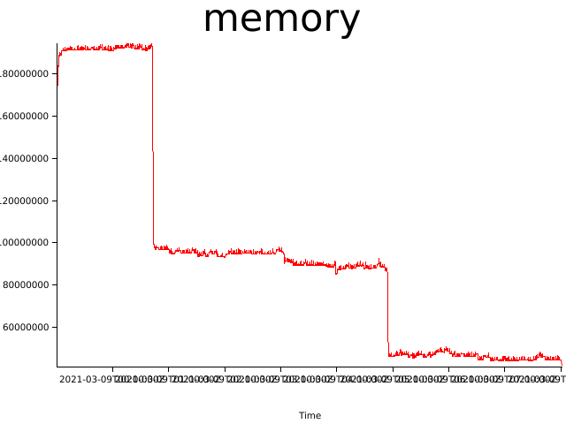
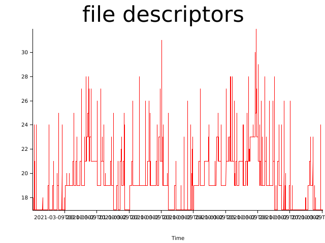

# Test results (Mon, 08 Mar 2021 23:00:23 +0000)


git revision: bd8c1355d8c8c9ebbe0eedac5416b448f110bc59

test duration (seconds): 32400

## Memory consumption


## Files open


## Log Errors

```
2021-03-09 00:02:47,742 DEBUG [northstar::runtime::console] Client "[::1]:57520" connected
2021-03-09 00:02:47,742 WARN  [northstar::runtime::state] Application test00:0.0.1 is not running
2021-03-09 00:02:47,743 ERROR [northstar::runtime::state] Failed to stop test00: Application is not running
2021-03-09 00:02:47,744 DEBUG [northstar::runtime::console] Client "[::1]:57522" connected
2021-03-09 00:02:47,744 DEBUG [northstar::runtime::console] Client "[::1]:57524" connected
2021-03-09 00:02:47,744 INFO  [northstar::runtime::console] [::1]:57520: Connection closed
```
```
2021-03-09 00:04:47,741 DEBUG [northstar::runtime::console] Client "[::1]:57540" connected
2021-03-09 00:04:47,742 WARN  [northstar::runtime::state] Application test00:0.0.1 is not running
2021-03-09 00:04:47,742 ERROR [northstar::runtime::state] Failed to stop test00: Application is not running
2021-03-09 00:04:47,743 INFO  [northstar::runtime::state] Starting test03:0.0.1
2021-03-09 00:04:47,743 DEBUG [northstar::runtime::minijail] Setting UID to 1000
2021-03-09 00:04:47,743 DEBUG [northstar::runtime::minijail] Setting GID to 1000
```
```
2021-03-09 00:06:47,741 DEBUG [northstar::runtime::console] Client "[::1]:57556" connected
2021-03-09 00:06:47,742 WARN  [northstar::runtime::state] Application test00:0.0.1 is not running
2021-03-09 00:06:47,742 ERROR [northstar::runtime::state] Failed to stop test00: Application is not running
2021-03-09 00:06:47,742 WARN  [northstar::runtime::state] Application test01:0.0.1 is not running
2021-03-09 00:06:47,742 ERROR [northstar::runtime::state] Failed to stop test01: Application is not running
2021-03-09 00:06:47,743 INFO  [northstar::runtime::state] Starting test03:0.0.1
```
```
2021-03-09 00:06:47,742 ERROR [northstar::runtime::state] Failed to stop test00: Application is not running
2021-03-09 00:06:47,742 WARN  [northstar::runtime::state] Application test01:0.0.1 is not running
2021-03-09 00:06:47,742 ERROR [northstar::runtime::state] Failed to stop test01: Application is not running
2021-03-09 00:06:47,743 INFO  [northstar::runtime::state] Starting test03:0.0.1
2021-03-09 00:06:47,743 DEBUG [northstar::runtime::minijail] Setting UID to 1000
2021-03-09 00:06:47,743 DEBUG [northstar::runtime::minijail] Setting GID to 1000
```
```
2021-03-09 00:08:47,741 DEBUG [northstar::runtime::console] Client "[::1]:57572" connected
2021-03-09 00:08:47,742 WARN  [northstar::runtime::state] Application test00:0.0.1 is not running
2021-03-09 00:08:47,742 ERROR [northstar::runtime::state] Failed to stop test00: Application is not running
2021-03-09 00:08:47,742 INFO  [northstar::runtime::state] Starting test03:0.0.1
2021-03-09 00:08:47,742 DEBUG [northstar::runtime::minijail] Setting UID to 1000
2021-03-09 00:08:47,742 DEBUG [northstar::runtime::minijail] Setting GID to 1000
```
```
2021-03-09 00:08:47,745 WARN  [northstar::runtime::state] Application test04:0.0.1 is not running
2021-03-09 00:08:47,745 INFO  [northstar::runtime::console] Connection to [::1]:57576 closed
2021-03-09 00:08:47,745 ERROR [northstar::runtime::state] Failed to stop test04: Application is not running
2021-03-09 00:08:47,748 DEBUG [northstar::runtime::console] Client "[::1]:57580" connected
2021-03-09 00:08:47,748 INFO  [northstar::runtime::console] [::1]:57574: Connection closed
2021-03-09 00:08:47,748 INFO  [northstar::runtime::console] Connection to [::1]:57574 closed
```
```
2021-03-09 00:09:47,745 INFO  [northstar::runtime::state] Started test03:0.0.1
2021-03-09 00:09:47,745 WARN  [northstar::runtime::state] Application test01:0.0.1 is not running
2021-03-09 00:09:47,745 ERROR [northstar::runtime::state] Failed to stop test01: Application is not running
2021-03-09 00:09:47,745 WARN  [northstar::runtime::state] Application test05:0.0.1 is not running
2021-03-09 00:09:47,745 ERROR [northstar::runtime::state] Failed to stop test05: Application is not running
2021-03-09 00:09:47,747 INFO  [northstar::runtime::console] [::1]:57588: Connection closed
```
```
2021-03-09 00:09:47,745 ERROR [northstar::runtime::state] Failed to stop test01: Application is not running
2021-03-09 00:09:47,745 WARN  [northstar::runtime::state] Application test05:0.0.1 is not running
2021-03-09 00:09:47,745 ERROR [northstar::runtime::state] Failed to stop test05: Application is not running
2021-03-09 00:09:47,747 INFO  [northstar::runtime::console] [::1]:57588: Connection closed
2021-03-09 00:09:47,747 INFO  [northstar::runtime::console] Connection to [::1]:57588 closed
2021-03-09 00:09:47,747 DEBUG [northstar::runtime::console] Client "[::1]:57594" connected
```
```
2021-03-09 00:10:47,744 INFO  [northstar::runtime::state] Started test03:0.0.1
2021-03-09 00:10:47,745 WARN  [northstar::runtime::state] Application test00:0.0.1 is not running
2021-03-09 00:10:47,746 ERROR [northstar::runtime::state] Failed to stop test00: Application is not running
2021-03-09 00:10:47,747 INFO  [northstar::runtime::console] [::1]:57602: Connection closed
2021-03-09 00:10:47,747 INFO  [northstar::runtime::console] Connection to [::1]:57602 closed
2021-03-09 00:10:47,748 INFO  [northstar::runtime::console] [::1]:57600: Connection closed
```
```
2021-03-09 00:12:47,745 INFO  [northstar::runtime::state] Started test03:0.0.1
2021-03-09 00:12:47,745 WARN  [northstar::runtime::state] Application test01:0.0.1 is not running
2021-03-09 00:12:47,745 ERROR [northstar::runtime::state] Failed to stop test01: Application is not running
2021-03-09 00:12:47,745 WARN  [northstar::runtime::state] Application test00:0.0.1 is not running
2021-03-09 00:12:47,745 ERROR [northstar::runtime::state] Failed to stop test00: Application is not running
2021-03-09 00:12:47,747 INFO  [northstar::runtime::console] [::1]:57618: Connection closed
```
```
2021-03-09 00:12:47,745 ERROR [northstar::runtime::state] Failed to stop test01: Application is not running
2021-03-09 00:12:47,745 WARN  [northstar::runtime::state] Application test00:0.0.1 is not running
2021-03-09 00:12:47,745 ERROR [northstar::runtime::state] Failed to stop test00: Application is not running
2021-03-09 00:12:47,747 INFO  [northstar::runtime::console] [::1]:57618: Connection closed
2021-03-09 00:12:47,747 INFO  [northstar::runtime::console] Connection to [::1]:57618 closed
2021-03-09 00:12:47,748 DEBUG [northstar::runtime::console] Client "[::1]:57622" connected
```
```
2021-03-09 00:14:47,742 DEBUG [northstar::runtime::console] Client "[::1]:57636" connected
2021-03-09 00:14:47,742 WARN  [northstar::runtime::state] Application test00:0.0.1 is not running
2021-03-09 00:14:47,742 ERROR [northstar::runtime::state] Failed to stop test00: Application is not running
2021-03-09 00:14:47,743 INFO  [northstar::runtime::state] Starting test03:0.0.1
2021-03-09 00:14:47,743 DEBUG [northstar::runtime::minijail] Setting UID to 1000
2021-03-09 00:14:47,743 DEBUG [northstar::runtime::minijail] Setting GID to 1000
```
```
2021-03-09 00:15:47,741 DEBUG [northstar::runtime::console] Client "[::1]:57644" connected
2021-03-09 00:15:47,742 WARN  [northstar::runtime::state] Application test01:0.0.1 is not running
2021-03-09 00:15:47,742 ERROR [northstar::runtime::state] Failed to stop test01: Application is not running
2021-03-09 00:15:47,742 INFO  [northstar::runtime::state] Starting test03:0.0.1
2021-03-09 00:15:47,742 DEBUG [northstar::runtime::minijail] Setting UID to 1000
2021-03-09 00:15:47,743 DEBUG [northstar::runtime::minijail] Setting GID to 1000
```
```
2021-03-09 00:16:47,745 INFO  [northstar::runtime::state] Started test03:0.0.1
2021-03-09 00:16:47,745 WARN  [northstar::runtime::state] Application test04:0.0.1 is not running
2021-03-09 00:16:47,745 ERROR [northstar::runtime::state] Failed to stop test04: Application is not running
2021-03-09 00:16:47,746 WARN  [northstar::runtime::state] Application test00:0.0.1 is not running
2021-03-09 00:16:47,746 ERROR [northstar::runtime::state] Failed to stop test00: Application is not running
2021-03-09 00:16:47,748 INFO  [northstar::runtime::console] [::1]:57654: Connection closed
```
```
2021-03-09 00:16:47,745 ERROR [northstar::runtime::state] Failed to stop test04: Application is not running
2021-03-09 00:16:47,746 WARN  [northstar::runtime::state] Application test00:0.0.1 is not running
2021-03-09 00:16:47,746 ERROR [northstar::runtime::state] Failed to stop test00: Application is not running
2021-03-09 00:16:47,748 INFO  [northstar::runtime::console] [::1]:57654: Connection closed
2021-03-09 00:16:47,748 INFO  [northstar::runtime::console] Connection to [::1]:57654 closed
2021-03-09 00:16:47,749 INFO  [northstar::runtime::console] [::1]:57658: Connection closed
```
```
2021-03-09 00:16:47,754 INFO  [northstar::runtime::state] Started test00:0.0.1
2021-03-09 00:16:47,755 INFO  [northstar::runtime::state] Stopping test03:0.0.1
2021-03-09 00:16:47,755 ERROR [northstar::runtime::state] Failed to stop test03: Process: Os("Failed to SIGTERM 274133", Sys(ESRCH))
2021-03-09 00:16:47,756 DEBUG [northstar::runtime::minijail] test_container: Executing script /input.txt
2021-03-09 00:16:47,757 INFO  [northstar::runtime::console] [::1]:57664: Connection closed
2021-03-09 00:16:47,757 INFO  [northstar::runtime::console] Connection to [::1]:57664 closed
```
```
2021-03-09 00:18:47,742 DEBUG [northstar::runtime::console] Client "[::1]:57674" connected
2021-03-09 00:18:47,743 WARN  [northstar::runtime::state] Application test05:0.0.1 is not running
2021-03-09 00:18:47,743 ERROR [northstar::runtime::state] Failed to stop test05: Application is not running
2021-03-09 00:18:47,743 WARN  [northstar::runtime::state] Application test01:0.0.1 is not running
2021-03-09 00:18:47,743 ERROR [northstar::runtime::state] Failed to stop test01: Application is not running
2021-03-09 00:18:47,744 WARN  [northstar::runtime::state] Application test00:0.0.1 is not running
```
```
2021-03-09 00:18:47,743 ERROR [northstar::runtime::state] Failed to stop test05: Application is not running
2021-03-09 00:18:47,743 WARN  [northstar::runtime::state] Application test01:0.0.1 is not running
2021-03-09 00:18:47,743 ERROR [northstar::runtime::state] Failed to stop test01: Application is not running
2021-03-09 00:18:47,744 WARN  [northstar::runtime::state] Application test00:0.0.1 is not running
2021-03-09 00:18:47,744 ERROR [northstar::runtime::state] Failed to stop test00: Application is not running
2021-03-09 00:18:47,744 DEBUG [northstar::runtime::console] Client "[::1]:57678" connected
```
```
2021-03-09 00:18:47,743 ERROR [northstar::runtime::state] Failed to stop test01: Application is not running
2021-03-09 00:18:47,744 WARN  [northstar::runtime::state] Application test00:0.0.1 is not running
2021-03-09 00:18:47,744 ERROR [northstar::runtime::state] Failed to stop test00: Application is not running
2021-03-09 00:18:47,744 DEBUG [northstar::runtime::console] Client "[::1]:57678" connected
2021-03-09 00:18:47,745 INFO  [northstar::runtime::state] Starting test03:0.0.1
2021-03-09 00:18:47,745 DEBUG [northstar::runtime::minijail] Setting UID to 1000
```
```
2021-03-09 00:18:47,758 INFO  [northstar::runtime::console] Connection to [::1]:57682 closed
2021-03-09 00:18:47,759 INFO  [northstar::runtime::state] Stopping test03:0.0.1
2021-03-09 00:18:47,759 ERROR [northstar::runtime::state] Failed to stop test03: Process: Os("Failed to SIGTERM 274311", Sys(ESRCH))
2021-03-09 00:18:47,760 WARN  [northstar::runtime::console] [::1]:57686: Connection error: Connection reset by peer (os error 104)
2021-03-09 00:18:47,760 INFO  [northstar::runtime::console] Connection to [::1]:57686 closed
2021-03-09 00:18:47,760 WARN  [northstar::runtime::console] [::1]:57684: Connection error: Broken pipe (os error 32)
```
```
2021-03-09 00:20:47,745 INFO  [northstar::runtime::state] Started test03:0.0.1
2021-03-09 00:20:47,745 WARN  [northstar::runtime::state] Application test00:0.0.1 is not running
2021-03-09 00:20:47,745 ERROR [northstar::runtime::state] Failed to stop test00: Application is not running
2021-03-09 00:20:47,748 DEBUG [northstar::runtime::console] Client "[::1]:57698" connected
2021-03-09 00:20:47,749 INFO  [northstar::runtime::console] [::1]:57694: Connection closed
2021-03-09 00:20:47,749 INFO  [northstar::runtime::console] Connection to [::1]:57694 closed
```
```
2021-03-09 00:21:47,741 DEBUG [northstar::runtime::console] Client "[::1]:57704" connected
2021-03-09 00:21:47,742 WARN  [northstar::runtime::state] Application test01:0.0.1 is not running
2021-03-09 00:21:47,742 ERROR [northstar::runtime::state] Failed to stop test01: Application is not running
2021-03-09 00:21:47,743 DEBUG [northstar::runtime::console] Client "[::1]:57706" connected
2021-03-09 00:21:47,743 INFO  [northstar::runtime::state] Starting test03:0.0.1
2021-03-09 00:21:47,743 DEBUG [northstar::runtime::minijail] Setting UID to 1000
```
```
2021-03-09 00:22:47,741 DEBUG [northstar::runtime::console] Client "[::1]:57726" connected
2021-03-09 00:22:47,741 WARN  [northstar::runtime::state] Application test00:0.0.1 is not running
2021-03-09 00:22:47,741 ERROR [northstar::runtime::state] Failed to stop test00: Application is not running
2021-03-09 00:22:47,741 DEBUG [northstar::runtime::console] Client "[::1]:57728" connected
2021-03-09 00:22:47,742 INFO  [northstar::runtime::state] Starting test03:0.0.1
2021-03-09 00:22:47,742 DEBUG [northstar::runtime::minijail] Setting UID to 1000
```
```
2021-03-09 00:24:47,741 DEBUG [northstar::runtime::console] Client "[::1]:57748" connected
2021-03-09 00:24:47,742 WARN  [northstar::runtime::state] Application test01:0.0.1 is not running
2021-03-09 00:24:47,742 ERROR [northstar::runtime::state] Failed to stop test01: Application is not running
2021-03-09 00:24:47,742 DEBUG [northstar::runtime::console] Client "[::1]:57752" connected
2021-03-09 00:24:47,742 INFO  [northstar::runtime::state] Starting test03:0.0.1
2021-03-09 00:24:47,742 DEBUG [northstar::runtime::minijail] Setting UID to 1000
```
```
2021-03-09 00:24:47,745 INFO  [northstar::runtime::state] Started test03:0.0.1
2021-03-09 00:24:47,745 WARN  [northstar::runtime::state] Application test04:0.0.1 is not running
2021-03-09 00:24:47,745 ERROR [northstar::runtime::state] Failed to stop test04: Application is not running
2021-03-09 00:24:47,746 WARN  [northstar::runtime::state] Application test00:0.0.1 is not running
2021-03-09 00:24:47,746 ERROR [northstar::runtime::state] Failed to stop test00: Application is not running
2021-03-09 00:24:47,747 DEBUG [northstar::runtime::console] Client "[::1]:57758" connected
```
```
2021-03-09 00:24:47,745 ERROR [northstar::runtime::state] Failed to stop test04: Application is not running
2021-03-09 00:24:47,746 WARN  [northstar::runtime::state] Application test00:0.0.1 is not running
2021-03-09 00:24:47,746 ERROR [northstar::runtime::state] Failed to stop test00: Application is not running
2021-03-09 00:24:47,747 DEBUG [northstar::runtime::console] Client "[::1]:57758" connected
2021-03-09 00:24:47,747 DEBUG [northstar::runtime::console] Client "[::1]:57756" connected
2021-03-09 00:24:47,748 INFO  [northstar::runtime::console] [::1]:57754: Connection closed
```
```
2021-03-09 00:24:47,757 INFO  [northstar::runtime::state] Started test01:0.0.1
2021-03-09 00:24:47,757 INFO  [northstar::runtime::state] Stopping test03:0.0.1
2021-03-09 00:24:47,757 ERROR [northstar::runtime::state] Failed to stop test03: Process: Os("Failed to SIGTERM 275327", Sys(ESRCH))
2021-03-09 00:24:47,758 INFO  [northstar::runtime::console] [::1]:57756: Connection closed
2021-03-09 00:24:47,758 INFO  [northstar::runtime::console] Connection to [::1]:57756 closed
2021-03-09 00:24:47,758 INFO  [northstar::runtime::console] [::1]:57760: Connection closed
```
```
2021-03-09 00:26:47,744 INFO  [northstar::runtime::state] Started test03:0.0.1
2021-03-09 00:26:47,744 WARN  [northstar::runtime::state] Application test00:0.0.1 is not running
2021-03-09 00:26:47,745 ERROR [northstar::runtime::state] Failed to stop test00: Application is not running
2021-03-09 00:26:47,747 INFO  [northstar::runtime::console] [::1]:57772: Connection closed
2021-03-09 00:26:47,747 DEBUG [northstar::runtime::console] Client "[::1]:57776" connected
2021-03-09 00:26:47,747 DEBUG [northstar::runtime::console] Client "[::1]:57778" connected
```
```
2021-03-09 00:27:47,744 INFO  [northstar::runtime::state] Started test03:0.0.1
2021-03-09 00:27:47,745 WARN  [northstar::runtime::state] Application test05:0.0.1 is not running
2021-03-09 00:27:47,745 ERROR [northstar::runtime::state] Failed to stop test05: Application is not running
2021-03-09 00:27:47,745 WARN  [northstar::runtime::state] Application test01:0.0.1 is not running
2021-03-09 00:27:47,745 ERROR [northstar::runtime::state] Failed to stop test01: Application is not running
2021-03-09 00:27:47,748 INFO  [northstar::runtime::console] [::1]:57786: Connection closed
```
```
2021-03-09 00:27:47,745 ERROR [northstar::runtime::state] Failed to stop test05: Application is not running
2021-03-09 00:27:47,745 WARN  [northstar::runtime::state] Application test01:0.0.1 is not running
2021-03-09 00:27:47,745 ERROR [northstar::runtime::state] Failed to stop test01: Application is not running
2021-03-09 00:27:47,748 INFO  [northstar::runtime::console] [::1]:57786: Connection closed
2021-03-09 00:27:47,748 INFO  [northstar::runtime::console] Connection to [::1]:57786 closed
2021-03-09 00:27:47,748 INFO  [northstar::runtime::console] [::1]:57782: Connection closed
```
```
2021-03-09 00:28:47,744 INFO  [northstar::runtime::state] Started test03:0.0.1
2021-03-09 00:28:47,745 WARN  [northstar::runtime::state] Application test00:0.0.1 is not running
2021-03-09 00:28:47,745 ERROR [northstar::runtime::state] Failed to stop test00: Application is not running
2021-03-09 00:28:47,746 DEBUG [northstar::runtime::console] Client "[::1]:57800" connected
2021-03-09 00:28:47,747 INFO  [northstar::runtime::console] [::1]:57796: Connection closed
2021-03-09 00:28:47,747 INFO  [northstar::runtime::console] Connection to [::1]:57796 closed
```
```
2021-03-09 00:30:48,749 INFO  [northstar::runtime::state] Stopped test00:0.0.1 Signaled(SIGKILL)
2021-03-09 00:30:48,749 WARN  [northstar::runtime::state] Application test01:0.0.1 is not running
2021-03-09 00:30:48,750 ERROR [northstar::runtime::state] Failed to stop test01: Application is not running
2021-03-09 00:30:48,750 INFO  [northstar::runtime::state] Stopping test03:0.0.1
2021-03-09 00:30:48,750 ERROR [northstar::runtime::state] Failed to stop test03: Process: Os("Failed to SIGTERM 276206", Sys(ESRCH))
2021-03-09 00:30:48,751 INFO  [northstar::runtime::console] [::1]:57826: Connection closed
```
```
2021-03-09 00:30:48,750 ERROR [northstar::runtime::state] Failed to stop test01: Application is not running
2021-03-09 00:30:48,750 INFO  [northstar::runtime::state] Stopping test03:0.0.1
2021-03-09 00:30:48,750 ERROR [northstar::runtime::state] Failed to stop test03: Process: Os("Failed to SIGTERM 276206", Sys(ESRCH))
2021-03-09 00:30:48,751 INFO  [northstar::runtime::console] [::1]:57826: Connection closed
2021-03-09 00:30:48,751 INFO  [northstar::runtime::console] Connection to [::1]:57826 closed
2021-03-09 00:30:48,752 INFO  [northstar::runtime::console] [::1]:57822: Connection closed
```
```
2021-03-09 00:32:47,741 DEBUG [northstar::runtime::console] Client "[::1]:57844" connected
2021-03-09 00:32:47,742 WARN  [northstar::runtime::state] Application test04:0.0.1 is not running
2021-03-09 00:32:47,742 ERROR [northstar::runtime::state] Failed to stop test04: Application is not running
2021-03-09 00:32:47,742 DEBUG [northstar::runtime::console] Client "[::1]:57848" connected
2021-03-09 00:32:47,743 DEBUG [northstar::runtime::console] Client "[::1]:57846" connected
2021-03-09 00:32:47,743 INFO  [northstar::runtime::state] Starting test03:0.0.1
```
```
2021-03-09 00:32:47,746 INFO  [northstar::runtime::state] Started test03:0.0.1
2021-03-09 00:32:47,746 WARN  [northstar::runtime::state] Application test00:0.0.1 is not running
2021-03-09 00:32:47,746 ERROR [northstar::runtime::state] Failed to stop test00: Application is not running
2021-03-09 00:32:47,747 INFO  [northstar::runtime::state] Starting test04:0.0.1
2021-03-09 00:32:47,747 DEBUG [northstar::runtime::minijail] Setting UID to 1000
2021-03-09 00:32:47,747 DEBUG [northstar::runtime::minijail] Setting GID to 1000
```
```
2021-03-09 00:33:47,745 INFO  [northstar::runtime::state] Started test03:0.0.1
2021-03-09 00:33:47,745 WARN  [northstar::runtime::state] Application test01:0.0.1 is not running
2021-03-09 00:33:47,746 ERROR [northstar::runtime::state] Failed to stop test01: Application is not running
2021-03-09 00:33:47,747 INFO  [northstar::runtime::console] [::1]:57858: Connection closed
2021-03-09 00:33:47,748 INFO  [northstar::runtime::console] Connection to [::1]:57858 closed
2021-03-09 00:33:47,748 DEBUG [northstar::runtime::console] Client "[::1]:57862" connected
```
```
2021-03-09 00:34:47,744 INFO  [northstar::runtime::state] Started test03:0.0.1
2021-03-09 00:34:47,745 WARN  [northstar::runtime::state] Application test00:0.0.1 is not running
2021-03-09 00:34:47,745 ERROR [northstar::runtime::state] Failed to stop test00: Application is not running
2021-03-09 00:34:47,749 INFO  [northstar::runtime::console] [::1]:57866: Connection closed
2021-03-09 00:34:47,749 INFO  [northstar::runtime::console] Connection to [::1]:57866 closed
2021-03-09 00:34:47,749 DEBUG [northstar::runtime::console] Client "[::1]:57872" connected
```
```
2021-03-09 00:34:47,752 INFO  [northstar::runtime::state] Started test00:0.0.1
2021-03-09 00:34:47,753 INFO  [northstar::runtime::state] Stopping test03:0.0.1
2021-03-09 00:34:47,753 ERROR [northstar::runtime::state] Failed to stop test03: Process: Os("Failed to SIGTERM 277030", Sys(ESRCH))
2021-03-09 00:34:47,754 INFO  [northstar::runtime::console] [::1]:57872: Connection closed
2021-03-09 00:34:47,754 INFO  [northstar::runtime::console] Connection to [::1]:57872 closed
2021-03-09 00:34:47,755 DEBUG [northstar::runtime::minijail] test_container: Executing script /input.txt
```
```
2021-03-09 00:36:47,744 INFO  [northstar::runtime::state] Started test03:0.0.1
2021-03-09 00:36:47,744 WARN  [northstar::runtime::state] Application test01:0.0.1 is not running
2021-03-09 00:36:47,744 ERROR [northstar::runtime::state] Failed to stop test01: Application is not running
2021-03-09 00:36:47,744 DEBUG [northstar::runtime::console] Client "[::1]:57886" connected
2021-03-09 00:36:47,744 DEBUG [northstar::runtime::console] Client "[::1]:57884" connected
2021-03-09 00:36:47,745 WARN  [northstar::runtime::state] Application test05:0.0.1 is not running
```
```
2021-03-09 00:36:47,744 DEBUG [northstar::runtime::console] Client "[::1]:57884" connected
2021-03-09 00:36:47,745 WARN  [northstar::runtime::state] Application test05:0.0.1 is not running
2021-03-09 00:36:47,745 ERROR [northstar::runtime::state] Failed to stop test05: Application is not running
2021-03-09 00:36:47,745 WARN  [northstar::runtime::state] Application test00:0.0.1 is not running
2021-03-09 00:36:47,745 ERROR [northstar::runtime::state] Failed to stop test00: Application is not running
2021-03-09 00:36:47,746 INFO  [northstar::runtime::console] [::1]:57882: Connection closed
```
```
2021-03-09 00:36:47,745 ERROR [northstar::runtime::state] Failed to stop test05: Application is not running
2021-03-09 00:36:47,745 WARN  [northstar::runtime::state] Application test00:0.0.1 is not running
2021-03-09 00:36:47,745 ERROR [northstar::runtime::state] Failed to stop test00: Application is not running
2021-03-09 00:36:47,746 INFO  [northstar::runtime::console] [::1]:57882: Connection closed
2021-03-09 00:36:47,746 INFO  [northstar::runtime::console] Connection to [::1]:57882 closed
2021-03-09 00:36:47,746 DEBUG [northstar::runtime::console] Client "[::1]:57888" connected
```
```
2021-03-09 00:36:47,752 INFO  [northstar::runtime::state] Started test00:0.0.1
2021-03-09 00:36:47,752 INFO  [northstar::runtime::state] Stopping test03:0.0.1
2021-03-09 00:36:47,752 ERROR [northstar::runtime::state] Failed to stop test03: Process: Os("Failed to SIGTERM 277208", Sys(ESRCH))
2021-03-09 00:36:47,752 INFO  [northstar::runtime::state] Starting test05:0.0.1
2021-03-09 00:36:47,752 DEBUG [northstar::runtime::minijail] Setting UID to 1000
2021-03-09 00:36:47,752 DEBUG [northstar::runtime::minijail] Setting GID to 1000
```
```
2021-03-09 00:38:48,758 INFO  [northstar::runtime::console] [::1]:57906: Connection closed
2021-03-09 00:38:48,758 INFO  [northstar::runtime::console] Connection to [::1]:57906 closed
2021-03-09 00:38:48,758 ERROR [northstar::runtime::state] Failed to stop test03: Application is not running
2021-03-09 00:38:48,759 INFO  [northstar::runtime::console] [::1]:57908: Connection closed
2021-03-09 00:38:48,759 INFO  [northstar::runtime::console] Connection to [::1]:57908 closed
2021-03-09 00:38:48,760 DEBUG [northstar::runtime::minijail] test_container: Executing script /input.txt
```
```
2021-03-09 00:39:47,741 DEBUG [northstar::runtime::console] Client "[::1]:57912" connected
2021-03-09 00:39:47,741 WARN  [northstar::runtime::state] Application test01:0.0.1 is not running
2021-03-09 00:39:47,741 ERROR [northstar::runtime::state] Failed to stop test01: Application is not running
2021-03-09 00:39:47,742 INFO  [northstar::runtime::state] Starting test03:0.0.1
2021-03-09 00:39:47,742 DEBUG [northstar::runtime::minijail] Setting UID to 1000
2021-03-09 00:39:47,742 DEBUG [northstar::runtime::minijail] Setting GID to 1000
```
```
2021-03-09 00:40:47,743 INFO  [northstar::runtime::state] Started test03:0.0.1
2021-03-09 00:40:47,744 WARN  [northstar::runtime::state] Application test00:0.0.1 is not running
2021-03-09 00:40:47,744 ERROR [northstar::runtime::state] Failed to stop test00: Application is not running
2021-03-09 00:40:47,744 WARN  [northstar::runtime::state] Application test04:0.0.1 is not running
2021-03-09 00:40:47,745 ERROR [northstar::runtime::state] Failed to stop test04: Application is not running
2021-03-09 00:40:47,746 INFO  [northstar::runtime::console] [::1]:57928: Connection closed
```
```
2021-03-09 00:40:47,744 ERROR [northstar::runtime::state] Failed to stop test00: Application is not running
2021-03-09 00:40:47,744 WARN  [northstar::runtime::state] Application test04:0.0.1 is not running
2021-03-09 00:40:47,745 ERROR [northstar::runtime::state] Failed to stop test04: Application is not running
2021-03-09 00:40:47,746 INFO  [northstar::runtime::console] [::1]:57928: Connection closed
2021-03-09 00:40:47,746 INFO  [northstar::runtime::console] Connection to [::1]:57928 closed
2021-03-09 00:40:47,746 DEBUG [northstar::runtime::console] Client "[::1]:57930" connected
```
```
2021-03-09 00:42:47,744 INFO  [northstar::runtime::state] Started test03:0.0.1
2021-03-09 00:42:47,745 WARN  [northstar::runtime::state] Application test01:0.0.1 is not running
2021-03-09 00:42:47,745 ERROR [northstar::runtime::state] Failed to stop test01: Application is not running
2021-03-09 00:42:47,745 WARN  [northstar::runtime::state] Application test00:0.0.1 is not running
2021-03-09 00:42:47,745 ERROR [northstar::runtime::state] Failed to stop test00: Application is not running
2021-03-09 00:42:47,746 INFO  [northstar::runtime::console] [::1]:57944: Connection closed
```
```
2021-03-09 00:42:47,745 ERROR [northstar::runtime::state] Failed to stop test01: Application is not running
2021-03-09 00:42:47,745 WARN  [northstar::runtime::state] Application test00:0.0.1 is not running
2021-03-09 00:42:47,745 ERROR [northstar::runtime::state] Failed to stop test00: Application is not running
2021-03-09 00:42:47,746 INFO  [northstar::runtime::console] [::1]:57944: Connection closed
2021-03-09 00:42:47,746 INFO  [northstar::runtime::console] Connection to [::1]:57944 closed
2021-03-09 00:42:47,746 DEBUG [northstar::runtime::console] Client "[::1]:57948" connected
```
```
2021-03-09 00:44:47,741 DEBUG [northstar::runtime::console] Client "[::1]:57960" connected
2021-03-09 00:44:47,742 WARN  [northstar::runtime::state] Application test00:0.0.1 is not running
2021-03-09 00:44:47,742 ERROR [northstar::runtime::state] Failed to stop test00: Application is not running
2021-03-09 00:44:47,743 INFO  [northstar::runtime::state] Starting test03:0.0.1
2021-03-09 00:44:47,743 DEBUG [northstar::runtime::minijail] Setting UID to 1000
2021-03-09 00:44:47,743 DEBUG [northstar::runtime::minijail] Setting GID to 1000
```
```
2021-03-09 00:45:47,741 DEBUG [northstar::runtime::console] Client "[::1]:57970" connected
2021-03-09 00:45:47,741 WARN  [northstar::runtime::state] Application test01:0.0.1 is not running
2021-03-09 00:45:47,741 ERROR [northstar::runtime::state] Failed to stop test01: Application is not running
2021-03-09 00:45:47,742 DEBUG [northstar::runtime::console] Client "[::1]:57974" connected
2021-03-09 00:45:47,742 WARN  [northstar::runtime::state] Application test05:0.0.1 is not running
2021-03-09 00:45:47,742 ERROR [northstar::runtime::state] Failed to stop test05: Application is not running
```
```
2021-03-09 00:45:47,742 DEBUG [northstar::runtime::console] Client "[::1]:57974" connected
2021-03-09 00:45:47,742 WARN  [northstar::runtime::state] Application test05:0.0.1 is not running
2021-03-09 00:45:47,742 ERROR [northstar::runtime::state] Failed to stop test05: Application is not running
2021-03-09 00:45:47,742 INFO  [northstar::runtime::state] Starting test03:0.0.1
2021-03-09 00:45:47,742 DEBUG [northstar::runtime::minijail] Setting UID to 1000
2021-03-09 00:45:47,742 DEBUG [northstar::runtime::minijail] Setting GID to 1000
```
```
2021-03-09 00:45:47,755 INFO  [northstar::runtime::state] Destroying context
2021-03-09 00:45:47,755 WARN  [northstar::runtime::state] Application test03:0.0.1 is not running
2021-03-09 00:45:47,755 ERROR [northstar::runtime::state] Failed to stop test03: Application is not running
2021-03-09 00:45:47,755 INFO  [northstar::runtime::console] [::1]:57978: Connection closed
2021-03-09 00:45:47,755 INFO  [northstar::runtime::console] Connection to [::1]:57978 closed
2021-03-09 00:45:47,756 WARN  [northstar::runtime::console] [::1]:57976: Connection error: Broken pipe (os error 32)
```
```
2021-03-09 00:46:47,745 INFO  [northstar::runtime::state] Started test03:0.0.1
2021-03-09 00:46:47,746 WARN  [northstar::runtime::state] Application test00:0.0.1 is not running
2021-03-09 00:46:47,746 ERROR [northstar::runtime::state] Failed to stop test00: Application is not running
2021-03-09 00:46:47,748 DEBUG [northstar::runtime::console] Client "[::1]:57988" connected
2021-03-09 00:46:47,748 INFO  [northstar::runtime::console] [::1]:57982: Connection closed
2021-03-09 00:46:47,748 DEBUG [northstar::runtime::console] Client "[::1]:57986" connected
```
```
2021-03-09 00:48:47,745 INFO  [northstar::runtime::state] Started test03:0.0.1
2021-03-09 00:48:47,746 WARN  [northstar::runtime::state] Application test04:0.0.1 is not running
2021-03-09 00:48:47,746 ERROR [northstar::runtime::state] Failed to stop test04: Application is not running
2021-03-09 00:48:47,746 INFO  [northstar::runtime::state] Stopping test01:0.0.1
2021-03-09 00:48:47,748 DEBUG [northstar::runtime::console] Client "[::1]:58006" connected
2021-03-09 00:48:47,748 INFO  [northstar::runtime::console] [::1]:58002: Connection closed
```
```
2021-03-09 00:48:48,749 INFO  [northstar::runtime::state] Stopped test01:0.0.1 Signaled(SIGKILL)
2021-03-09 00:48:48,749 WARN  [northstar::runtime::state] Application test00:0.0.1 is not running
2021-03-09 00:48:48,749 ERROR [northstar::runtime::state] Failed to stop test00: Application is not running
2021-03-09 00:48:48,749 INFO  [northstar::runtime::state] Starting test04:0.0.1
2021-03-09 00:48:48,750 DEBUG [northstar::runtime::minijail] Setting UID to 1000
2021-03-09 00:48:48,750 DEBUG [northstar::runtime::minijail] Setting GID to 1000
```
```
2021-03-09 00:48:48,753 INFO  [northstar::runtime::state] Stopping test03:0.0.1
2021-03-09 00:48:48,753 DEBUG [northstar::runtime::console] Client "[::1]:58012" connected
2021-03-09 00:48:48,753 ERROR [northstar::runtime::state] Failed to stop test03: Process: Os("Failed to SIGTERM 286159", Sys(ESRCH))
2021-03-09 00:48:48,754 INFO  [northstar::runtime::console] [::1]:58004: Connection closed
2021-03-09 00:48:48,754 INFO  [northstar::runtime::console] Connection to [::1]:58004 closed
2021-03-09 00:48:48,754 INFO  [northstar::runtime::state] Starting test01:0.0.1
```
```
2021-03-09 00:50:47,742 DEBUG [northstar::runtime::console] Client "[::1]:58022" connected
2021-03-09 00:50:47,742 WARN  [northstar::runtime::state] Application test06:0.0.1 is not running
2021-03-09 00:50:47,742 ERROR [northstar::runtime::state] Failed to stop test06: Application is not running
2021-03-09 00:50:47,742 WARN  [northstar::runtime::state] Application test00:0.0.1 is not running
2021-03-09 00:50:47,742 ERROR [northstar::runtime::state] Failed to stop test00: Application is not running
2021-03-09 00:50:47,743 DEBUG [northstar::runtime::console] Client "[::1]:58026" connected
```
```
2021-03-09 00:50:47,742 ERROR [northstar::runtime::state] Failed to stop test06: Application is not running
2021-03-09 00:50:47,742 WARN  [northstar::runtime::state] Application test00:0.0.1 is not running
2021-03-09 00:50:47,742 ERROR [northstar::runtime::state] Failed to stop test00: Application is not running
2021-03-09 00:50:47,743 DEBUG [northstar::runtime::console] Client "[::1]:58026" connected
2021-03-09 00:50:47,743 INFO  [northstar::runtime::console] [::1]:58024: Connection closed
2021-03-09 00:50:47,744 INFO  [northstar::runtime::console] Connection to [::1]:58024 closed
```
```
2021-03-09 00:51:47,742 INFO  [northstar::runtime::state] Started test03:0.0.1
2021-03-09 00:51:47,742 WARN  [northstar::runtime::state] Application test01:0.0.1 is not running
2021-03-09 00:51:47,742 ERROR [northstar::runtime::state] Failed to stop test01: Application is not running
2021-03-09 00:51:47,744 DEBUG [northstar::runtime::console] Client "[::1]:58038" connected
2021-03-09 00:51:47,744 INFO  [northstar::runtime::console] [::1]:58034: Connection closed
2021-03-09 00:51:47,744 INFO  [northstar::runtime::console] Connection to [::1]:58034 closed
```
```
2021-03-09 00:52:47,742 DEBUG [northstar::runtime::console] Client "[::1]:58046" connected
2021-03-09 00:52:47,743 WARN  [northstar::runtime::state] Application test00:0.0.1 is not running
2021-03-09 00:52:47,743 ERROR [northstar::runtime::state] Failed to stop test00: Application is not running
2021-03-09 00:52:47,743 INFO  [northstar::runtime::state] Starting test03:0.0.1
2021-03-09 00:52:47,743 DEBUG [northstar::runtime::minijail] Setting UID to 1000
2021-03-09 00:52:47,743 DEBUG [northstar::runtime::minijail] Setting GID to 1000
```
```
2021-03-09 00:52:47,753 INFO  [northstar::runtime::state] Destroying context
2021-03-09 00:52:47,753 WARN  [northstar::runtime::state] Application test03:0.0.1 is not running
2021-03-09 00:52:47,754 ERROR [northstar::runtime::state] Failed to stop test03: Application is not running
2021-03-09 00:52:47,755 INFO  [northstar::runtime::console] [::1]:58052: Connection closed
2021-03-09 00:52:47,755 INFO  [northstar::runtime::console] Connection to [::1]:58052 closed
2021-03-09 00:52:47,755 INFO  [northstar::runtime::console] [::1]:58050: Connection closed
```
```
2021-03-09 00:54:47,741 DEBUG [northstar::runtime::console] Client "[::1]:58064" connected
2021-03-09 00:54:47,742 WARN  [northstar::runtime::state] Application test01:0.0.1 is not running
2021-03-09 00:54:47,742 ERROR [northstar::runtime::state] Failed to stop test01: Application is not running
2021-03-09 00:54:47,742 INFO  [northstar::runtime::state] Starting test03:0.0.1
2021-03-09 00:54:47,742 DEBUG [northstar::runtime::minijail] Setting UID to 1000
2021-03-09 00:54:47,742 DEBUG [northstar::runtime::minijail] Setting GID to 1000
```
```
2021-03-09 00:54:47,745 INFO  [northstar::runtime::state] Started test03:0.0.1
2021-03-09 00:54:47,746 WARN  [northstar::runtime::state] Application test05:0.0.1 is not running
2021-03-09 00:54:47,746 ERROR [northstar::runtime::state] Failed to stop test05: Application is not running
2021-03-09 00:54:47,746 WARN  [northstar::runtime::state] Application test00:0.0.1 is not running
2021-03-09 00:54:47,746 ERROR [northstar::runtime::state] Failed to stop test00: Application is not running
2021-03-09 00:54:47,746 DEBUG [northstar::runtime::console] Client "[::1]:58068" connected
```
```
2021-03-09 00:54:47,746 ERROR [northstar::runtime::state] Failed to stop test05: Application is not running
2021-03-09 00:54:47,746 WARN  [northstar::runtime::state] Application test00:0.0.1 is not running
2021-03-09 00:54:47,746 ERROR [northstar::runtime::state] Failed to stop test00: Application is not running
2021-03-09 00:54:47,746 DEBUG [northstar::runtime::console] Client "[::1]:58068" connected
2021-03-09 00:54:47,746 INFO  [northstar::runtime::console] [::1]:58064: Connection closed
2021-03-09 00:54:47,747 INFO  [northstar::runtime::console] Connection to [::1]:58064 closed
```
```
2021-03-09 00:56:47,741 DEBUG [northstar::runtime::console] Client "[::1]:58082" connected
2021-03-09 00:56:47,742 WARN  [northstar::runtime::state] Application test04:0.0.1 is not running
2021-03-09 00:56:47,742 ERROR [northstar::runtime::state] Failed to stop test04: Application is not running
2021-03-09 00:56:47,742 DEBUG [northstar::runtime::console] Client "[::1]:58084" connected
2021-03-09 00:56:47,743 INFO  [northstar::runtime::state] Starting test03:0.0.1
2021-03-09 00:56:47,743 DEBUG [northstar::runtime::minijail] Setting UID to 1000
```
```
2021-03-09 00:56:47,746 INFO  [northstar::runtime::console] Connection to [::1]:58082 closed
2021-03-09 00:56:47,747 WARN  [northstar::runtime::state] Application test00:0.0.1 is not running
2021-03-09 00:56:47,747 ERROR [northstar::runtime::state] Failed to stop test00: Application is not running
2021-03-09 00:56:47,747 INFO  [northstar::runtime::state] Starting test04:0.0.1
2021-03-09 00:56:47,747 DEBUG [northstar::runtime::minijail] Setting UID to 1000
2021-03-09 00:56:47,747 DEBUG [northstar::runtime::minijail] Setting GID to 1000
```
```
2021-03-09 00:56:47,754 INFO  [northstar::runtime::state] Started test00:0.0.1
2021-03-09 00:56:47,755 INFO  [northstar::runtime::state] Stopping test03:0.0.1
2021-03-09 00:56:47,755 ERROR [northstar::runtime::state] Failed to stop test03: Process: Os("Failed to SIGTERM 286970", Sys(ESRCH))
2021-03-09 00:56:47,755 INFO  [northstar::runtime::console] [::1]:58092: Connection closed
2021-03-09 00:56:47,755 INFO  [northstar::runtime::console] Connection to [::1]:58092 closed
2021-03-09 00:56:47,756 DEBUG [northstar::runtime::minijail] test_container: Executing script /input.txt
```
```
2021-03-09 00:57:47,741 DEBUG [northstar::runtime::console] Client "[::1]:58096" connected
2021-03-09 00:57:47,741 WARN  [northstar::runtime::state] Application test01:0.0.1 is not running
2021-03-09 00:57:47,742 ERROR [northstar::runtime::state] Failed to stop test01: Application is not running
2021-03-09 00:57:47,742 INFO  [northstar::runtime::state] Starting test03:0.0.1
2021-03-09 00:57:47,742 DEBUG [northstar::runtime::minijail] Setting UID to 1000
2021-03-09 00:57:47,742 DEBUG [northstar::runtime::minijail] Setting GID to 1000
```
```
2021-03-09 00:58:47,745 INFO  [northstar::runtime::state] Started test03:0.0.1
2021-03-09 00:58:47,746 WARN  [northstar::runtime::state] Application test00:0.0.1 is not running
2021-03-09 00:58:47,746 ERROR [northstar::runtime::state] Failed to stop test00: Application is not running
2021-03-09 00:58:47,747 DEBUG [northstar::runtime::console] Client "[::1]:58108" connected
2021-03-09 00:58:47,748 INFO  [northstar::runtime::console] [::1]:58104: Connection closed
2021-03-09 00:58:47,749 INFO  [northstar::runtime::console] Connection to [::1]:58104 closed
```
```
2021-03-09 01:00:47,741 DEBUG [northstar::runtime::console] Client "[::1]:58118" connected
2021-03-09 01:00:47,742 WARN  [northstar::runtime::state] Application test01:0.0.1 is not running
2021-03-09 01:00:47,742 ERROR [northstar::runtime::state] Failed to stop test01: Application is not running
2021-03-09 01:00:47,742 DEBUG [northstar::runtime::console] Client "[::1]:58120" connected
2021-03-09 01:00:47,743 WARN  [northstar::runtime::state] Application test07:0.0.1 is not running
2021-03-09 01:00:47,743 DEBUG [northstar::runtime::console] Client "[::1]:58122" connected
```
```
2021-03-09 01:00:47,743 WARN  [northstar::runtime::state] Application test07:0.0.1 is not running
2021-03-09 01:00:47,743 DEBUG [northstar::runtime::console] Client "[::1]:58122" connected
2021-03-09 01:00:47,743 ERROR [northstar::runtime::state] Failed to stop test07: Application is not running
2021-03-09 01:00:47,744 INFO  [northstar::runtime::state] Starting test03:0.0.1
2021-03-09 01:00:47,744 DEBUG [northstar::runtime::minijail] Setting UID to 1000
2021-03-09 01:00:47,744 DEBUG [northstar::runtime::minijail] Setting GID to 1000
```
```
2021-03-09 01:00:47,753 INFO  [northstar::runtime::console] Connection to [::1]:58122 closed
2021-03-09 01:00:47,753 WARN  [northstar::runtime::state] Application test00:0.0.1 is not running
2021-03-09 01:00:47,754 ERROR [northstar::runtime::state] Failed to stop test00: Application is not running
2021-03-09 01:00:47,754 DEBUG [northstar::runtime::console] Client "[::1]:58130" connected
2021-03-09 01:00:47,754 DEBUG [northstar::runtime::minijail] test_container: Executing script /input.txt
2021-03-09 01:00:47,754 INFO  [northstar::runtime::state] Stopping test03:0.0.1
```
```
2021-03-09 01:00:47,754 DEBUG [northstar::runtime::minijail] test_container: Executing script /input.txt
2021-03-09 01:00:47,754 INFO  [northstar::runtime::state] Stopping test03:0.0.1
2021-03-09 01:00:47,755 ERROR [northstar::runtime::state] Failed to stop test03: Process: Os("Failed to SIGTERM 287667", Sys(ESRCH))
2021-03-09 01:00:47,754 DEBUG [northstar::runtime::process] Process 287667 exit code is 1
2021-03-09 01:00:47,755 INFO  [northstar::runtime::console] [::1]:58126: Connection closed
2021-03-09 01:00:47,755 INFO  [northstar::runtime::console] Connection to [::1]:58126 closed
```
```
2021-03-09 01:02:47,741 DEBUG [northstar::runtime::console] Client "[::1]:58140" connected
2021-03-09 01:02:47,742 WARN  [northstar::runtime::state] Application test00:0.0.1 is not running
2021-03-09 01:02:47,742 ERROR [northstar::runtime::state] Failed to stop test00: Application is not running
2021-03-09 01:02:47,742 INFO  [northstar::runtime::state] Starting test03:0.0.1
2021-03-09 01:02:47,742 DEBUG [northstar::runtime::minijail] Setting UID to 1000
2021-03-09 01:02:47,742 DEBUG [northstar::runtime::minijail] Setting GID to 1000
```
```
2021-03-09 01:02:47,752 INFO  [northstar::runtime::console] Connection to [::1]:58140 closed
2021-03-09 01:02:47,752 WARN  [northstar::runtime::state] Application test03:0.0.1 is not running
2021-03-09 01:02:47,752 ERROR [northstar::runtime::state] Failed to stop test03: Application is not running
2021-03-09 01:02:47,753 INFO  [northstar::runtime::console] [::1]:58146: Connection closed
2021-03-09 01:02:47,753 INFO  [northstar::runtime::console] Connection to [::1]:58146 closed
2021-03-09 01:02:47,754 DEBUG [northstar::runtime::minijail] test_container: Executing script /input.txt
```
```
2021-03-09 01:03:47,744 DEBUG [northstar::runtime::console] Client "[::1]:58154" connected
2021-03-09 01:03:47,744 WARN  [northstar::runtime::state] Application test01:0.0.1 is not running
2021-03-09 01:03:47,744 ERROR [northstar::runtime::state] Failed to stop test01: Application is not running
2021-03-09 01:03:47,745 INFO  [northstar::runtime::state] Starting test03:0.0.1
2021-03-09 01:03:47,745 DEBUG [northstar::runtime::minijail] Setting UID to 1000
2021-03-09 01:03:47,745 DEBUG [northstar::runtime::minijail] Setting GID to 1000
```
```
2021-03-09 01:03:47,748 WARN  [northstar::runtime::state] Application test05:0.0.1 is not running
2021-03-09 01:03:47,748 DEBUG [northstar::runtime::console] Client "[::1]:58156" connected
2021-03-09 01:03:47,748 ERROR [northstar::runtime::state] Failed to stop test05: Application is not running
2021-03-09 01:03:47,748 INFO  [northstar::runtime::console] [::1]:58150: Connection closed
2021-03-09 01:03:47,749 INFO  [northstar::runtime::console] Connection to [::1]:58150 closed
2021-03-09 01:03:47,750 INFO  [northstar::runtime::console] [::1]:58152: Connection closed
```
```
2021-03-09 01:04:47,745 DEBUG [northstar::runtime::console] Client "[::1]:58166" connected
2021-03-09 01:04:47,746 WARN  [northstar::runtime::state] Application test04:0.0.1 is not running
2021-03-09 01:04:47,746 ERROR [northstar::runtime::state] Failed to stop test04: Application is not running
2021-03-09 01:04:47,746 WARN  [northstar::runtime::state] Application test00:0.0.1 is not running
2021-03-09 01:04:47,746 ERROR [northstar::runtime::state] Failed to stop test00: Application is not running
2021-03-09 01:04:47,748 DEBUG [northstar::runtime::console] Client "[::1]:58168" connected
```
```
2021-03-09 01:04:47,746 ERROR [northstar::runtime::state] Failed to stop test04: Application is not running
2021-03-09 01:04:47,746 WARN  [northstar::runtime::state] Application test00:0.0.1 is not running
2021-03-09 01:04:47,746 ERROR [northstar::runtime::state] Failed to stop test00: Application is not running
2021-03-09 01:04:47,748 DEBUG [northstar::runtime::console] Client "[::1]:58168" connected
2021-03-09 01:04:47,748 INFO  [northstar::runtime::console] [::1]:58162: Connection closed
2021-03-09 01:04:47,748 INFO  [northstar::runtime::console] Connection to [::1]:58162 closed
```
```
2021-03-09 01:06:47,745 INFO  [northstar::runtime::state] Started test03:0.0.1
2021-03-09 01:06:47,746 WARN  [northstar::runtime::state] Application test00:0.0.1 is not running
2021-03-09 01:06:47,746 ERROR [northstar::runtime::state] Failed to stop test00: Application is not running
2021-03-09 01:06:47,746 WARN  [northstar::runtime::state] Application test01:0.0.1 is not running
2021-03-09 01:06:47,746 ERROR [northstar::runtime::state] Failed to stop test01: Application is not running
2021-03-09 01:06:47,748 INFO  [northstar::runtime::console] [::1]:58182: Connection closed
```
```
2021-03-09 01:06:47,746 ERROR [northstar::runtime::state] Failed to stop test00: Application is not running
2021-03-09 01:06:47,746 WARN  [northstar::runtime::state] Application test01:0.0.1 is not running
2021-03-09 01:06:47,746 ERROR [northstar::runtime::state] Failed to stop test01: Application is not running
2021-03-09 01:06:47,748 INFO  [northstar::runtime::console] [::1]:58182: Connection closed
2021-03-09 01:06:47,748 INFO  [northstar::runtime::console] Connection to [::1]:58182 closed
2021-03-09 01:06:47,748 INFO  [northstar::runtime::console] [::1]:58186: Connection closed
```
```
2021-03-09 01:08:47,745 INFO  [northstar::runtime::state] Started test03:0.0.1
2021-03-09 01:08:47,746 WARN  [northstar::runtime::state] Application test00:0.0.1 is not running
2021-03-09 01:08:47,746 ERROR [northstar::runtime::state] Failed to stop test00: Application is not running
2021-03-09 01:08:47,749 INFO  [northstar::runtime::console] [::1]:58202: Connection closed
2021-03-09 01:08:47,749 INFO  [northstar::runtime::console] Connection to [::1]:58202 closed
2021-03-09 01:08:47,749 INFO  [northstar::runtime::console] [::1]:58200: Connection closed
```
```
2021-03-09 01:09:47,745 INFO  [northstar::runtime::state] Started test03:0.0.1
2021-03-09 01:09:47,746 WARN  [northstar::runtime::state] Application test01:0.0.1 is not running
2021-03-09 01:09:47,746 ERROR [northstar::runtime::state] Failed to stop test01: Application is not running
2021-03-09 01:09:47,748 INFO  [northstar::runtime::console] [::1]:58212: Connection closed
2021-03-09 01:09:47,749 INFO  [northstar::runtime::console] Connection to [::1]:58212 closed
2021-03-09 01:09:47,749 INFO  [northstar::runtime::console] [::1]:58210: Connection closed
```
```
2021-03-09 01:10:47,741 DEBUG [northstar::runtime::console] Client "[::1]:58220" connected
2021-03-09 01:10:47,741 WARN  [northstar::runtime::state] Application test00:0.0.1 is not running
2021-03-09 01:10:47,742 ERROR [northstar::runtime::state] Failed to stop test00: Application is not running
2021-03-09 01:10:47,742 INFO  [northstar::runtime::state] Starting test03:0.0.1
2021-03-09 01:10:47,742 DEBUG [northstar::runtime::minijail] Setting UID to 1000
2021-03-09 01:10:47,742 DEBUG [northstar::runtime::minijail] Setting GID to 1000
```
```
2021-03-09 01:12:47,742 DEBUG [northstar::runtime::console] Client "[::1]:58248" connected
2021-03-09 01:12:47,743 WARN  [northstar::runtime::state] Application test01:0.0.1 is not running
2021-03-09 01:12:47,743 ERROR [northstar::runtime::state] Failed to stop test01: Application is not running
2021-03-09 01:12:47,742 DEBUG [northstar::runtime::console] Client "[::1]:58250" connected
2021-03-09 01:12:47,743 WARN  [northstar::runtime::state] Application test05:0.0.1 is not running
2021-03-09 01:12:47,743 ERROR [northstar::runtime::state] Failed to stop test05: Application is not running
```
```
2021-03-09 01:12:47,742 DEBUG [northstar::runtime::console] Client "[::1]:58250" connected
2021-03-09 01:12:47,743 WARN  [northstar::runtime::state] Application test05:0.0.1 is not running
2021-03-09 01:12:47,743 ERROR [northstar::runtime::state] Failed to stop test05: Application is not running
2021-03-09 01:12:47,743 WARN  [northstar::runtime::state] Application test00:0.0.1 is not running
2021-03-09 01:12:47,743 ERROR [northstar::runtime::state] Failed to stop test00: Application is not running
2021-03-09 01:12:47,743 WARN  [northstar::runtime::state] Application test04:0.0.1 is not running
```
```
2021-03-09 01:12:47,743 ERROR [northstar::runtime::state] Failed to stop test05: Application is not running
2021-03-09 01:12:47,743 WARN  [northstar::runtime::state] Application test00:0.0.1 is not running
2021-03-09 01:12:47,743 ERROR [northstar::runtime::state] Failed to stop test00: Application is not running
2021-03-09 01:12:47,743 WARN  [northstar::runtime::state] Application test04:0.0.1 is not running
2021-03-09 01:12:47,744 ERROR [northstar::runtime::state] Failed to stop test04: Application is not running
2021-03-09 01:12:47,744 INFO  [northstar::runtime::state] Starting test03:0.0.1
```
```
2021-03-09 01:12:47,743 ERROR [northstar::runtime::state] Failed to stop test00: Application is not running
2021-03-09 01:12:47,743 WARN  [northstar::runtime::state] Application test04:0.0.1 is not running
2021-03-09 01:12:47,744 ERROR [northstar::runtime::state] Failed to stop test04: Application is not running
2021-03-09 01:12:47,744 INFO  [northstar::runtime::state] Starting test03:0.0.1
2021-03-09 01:12:47,744 DEBUG [northstar::runtime::minijail] Setting UID to 1000
2021-03-09 01:12:47,744 DEBUG [northstar::runtime::minijail] Setting GID to 1000
```
```
2021-03-09 01:14:47,741 DEBUG [northstar::runtime::console] Client "[::1]:58278" connected
2021-03-09 01:14:47,741 WARN  [northstar::runtime::state] Application test00:0.0.1 is not running
2021-03-09 01:14:47,742 ERROR [northstar::runtime::state] Failed to stop test00: Application is not running
2021-03-09 01:14:47,742 INFO  [northstar::runtime::state] Starting test03:0.0.1
2021-03-09 01:14:47,742 DEBUG [northstar::runtime::minijail] Setting UID to 1000
2021-03-09 01:14:47,742 DEBUG [northstar::runtime::minijail] Setting GID to 1000
```
```
2021-03-09 01:15:47,745 INFO  [northstar::runtime::state] Started test03:0.0.1
2021-03-09 01:15:47,745 WARN  [northstar::runtime::state] Application test01:0.0.1 is not running
2021-03-09 01:15:47,745 ERROR [northstar::runtime::state] Failed to stop test01: Application is not running
2021-03-09 01:15:47,747 INFO  [northstar::runtime::console] [::1]:58288: Connection closed
2021-03-09 01:15:47,747 INFO  [northstar::runtime::console] Connection to [::1]:58288 closed
2021-03-09 01:15:47,748 DEBUG [northstar::runtime::console] Client "[::1]:58292" connected
```
```
2021-03-09 01:16:48,748 INFO  [northstar::runtime::state] Stopped test00:0.0.1 Signaled(SIGKILL)
2021-03-09 01:16:48,748 INFO  [northstar::runtime::state] Stopping test03:0.0.1
2021-03-09 01:16:48,749 ERROR [northstar::runtime::state] Failed to stop test03: Process: Os("Failed to SIGTERM 290478", Sys(ESRCH))
2021-03-09 01:16:48,750 INFO  [northstar::runtime::console] [::1]:58300: Connection closed
2021-03-09 01:16:48,750 INFO  [northstar::runtime::console] Connection to [::1]:58300 closed
2021-03-09 01:16:48,751 INFO  [northstar::runtime::console] [::1]:58298: Connection closed
```
```
2021-03-09 01:18:47,743 DEBUG [northstar::runtime::console] Client "[::1]:58314" connected
2021-03-09 01:18:47,743 WARN  [northstar::runtime::state] Application test00:0.0.1 is not running
2021-03-09 01:18:47,743 ERROR [northstar::runtime::state] Failed to stop test00: Application is not running
2021-03-09 01:18:47,743 WARN  [northstar::runtime::state] Application test01:0.0.1 is not running
2021-03-09 01:18:47,743 ERROR [northstar::runtime::state] Failed to stop test01: Application is not running
2021-03-09 01:18:47,743 INFO  [northstar::runtime::state] Starting test03:0.0.1
```
```
2021-03-09 01:18:47,743 ERROR [northstar::runtime::state] Failed to stop test00: Application is not running
2021-03-09 01:18:47,743 WARN  [northstar::runtime::state] Application test01:0.0.1 is not running
2021-03-09 01:18:47,743 ERROR [northstar::runtime::state] Failed to stop test01: Application is not running
2021-03-09 01:18:47,743 INFO  [northstar::runtime::state] Starting test03:0.0.1
2021-03-09 01:18:47,744 DEBUG [northstar::runtime::minijail] Setting UID to 1000
2021-03-09 01:18:47,744 DEBUG [northstar::runtime::minijail] Setting GID to 1000
```
```
2021-03-09 01:18:47,756 INFO  [northstar::runtime::state] Stopping test03:0.0.1
2021-03-09 01:18:47,756 DEBUG [northstar::runtime::process] Process 290678 exit code is 1
2021-03-09 01:18:47,756 ERROR [northstar::runtime::state] Failed to stop test03: Process: Os("Failed to SIGTERM 290678", Sys(ESRCH))
2021-03-09 01:18:47,757 INFO  [northstar::runtime::console] [::1]:58320: Connection closed
2021-03-09 01:18:47,757 INFO  [northstar::runtime::console] Connection to [::1]:58320 closed
2021-03-09 01:18:47,758 INFO  [northstar::runtime::console] [::1]:58324: Connection closed
```
```
2021-03-09 01:20:47,742 DEBUG [northstar::runtime::console] Client "[::1]:58344" connected
2021-03-09 01:20:47,742 WARN  [northstar::runtime::state] Application test00:0.0.1 is not running
2021-03-09 01:20:47,742 ERROR [northstar::runtime::state] Failed to stop test00: Application is not running
2021-03-09 01:20:47,742 WARN  [northstar::runtime::state] Application test04:0.0.1 is not running
2021-03-09 01:20:47,742 ERROR [northstar::runtime::state] Failed to stop test04: Application is not running
2021-03-09 01:20:47,743 INFO  [northstar::runtime::state] Starting test03:0.0.1
```
```
2021-03-09 01:20:47,742 ERROR [northstar::runtime::state] Failed to stop test00: Application is not running
2021-03-09 01:20:47,742 WARN  [northstar::runtime::state] Application test04:0.0.1 is not running
2021-03-09 01:20:47,742 ERROR [northstar::runtime::state] Failed to stop test04: Application is not running
2021-03-09 01:20:47,743 INFO  [northstar::runtime::state] Starting test03:0.0.1
2021-03-09 01:20:47,743 DEBUG [northstar::runtime::minijail] Setting UID to 1000
2021-03-09 01:20:47,743 DEBUG [northstar::runtime::minijail] Setting GID to 1000
```
```
2021-03-09 01:21:47,743 INFO  [northstar::runtime::state] Started test03:0.0.1
2021-03-09 01:21:47,744 WARN  [northstar::runtime::state] Application test05:0.0.1 is not running
2021-03-09 01:21:47,744 ERROR [northstar::runtime::state] Failed to stop test05: Application is not running
2021-03-09 01:21:47,744 WARN  [northstar::runtime::state] Application test01:0.0.1 is not running
2021-03-09 01:21:47,744 ERROR [northstar::runtime::state] Failed to stop test01: Application is not running
2021-03-09 01:21:47,745 INFO  [northstar::runtime::console] [::1]:58356: Connection closed
```
```
2021-03-09 01:21:47,744 ERROR [northstar::runtime::state] Failed to stop test05: Application is not running
2021-03-09 01:21:47,744 WARN  [northstar::runtime::state] Application test01:0.0.1 is not running
2021-03-09 01:21:47,744 ERROR [northstar::runtime::state] Failed to stop test01: Application is not running
2021-03-09 01:21:47,745 INFO  [northstar::runtime::console] [::1]:58356: Connection closed
2021-03-09 01:21:47,745 INFO  [northstar::runtime::console] Connection to [::1]:58356 closed
2021-03-09 01:21:47,745 DEBUG [northstar::runtime::console] Client "[::1]:58364" connected
```
```
2021-03-09 01:24:47,745 INFO  [northstar::runtime::state] Started test03:0.0.1
2021-03-09 01:24:47,746 WARN  [northstar::runtime::state] Application test00:0.0.1 is not running
2021-03-09 01:24:47,746 ERROR [northstar::runtime::state] Failed to stop test00: Application is not running
2021-03-09 01:24:47,746 WARN  [northstar::runtime::state] Application test01:0.0.1 is not running
2021-03-09 01:24:47,746 ERROR [northstar::runtime::state] Failed to stop test01: Application is not running
2021-03-09 01:24:47,748 INFO  [northstar::runtime::console] [::1]:58386: Connection closed
```
```
2021-03-09 01:24:47,746 ERROR [northstar::runtime::state] Failed to stop test00: Application is not running
2021-03-09 01:24:47,746 WARN  [northstar::runtime::state] Application test01:0.0.1 is not running
2021-03-09 01:24:47,746 ERROR [northstar::runtime::state] Failed to stop test01: Application is not running
2021-03-09 01:24:47,748 INFO  [northstar::runtime::console] [::1]:58386: Connection closed
2021-03-09 01:24:47,748 INFO  [northstar::runtime::console] Connection to [::1]:58386 closed
2021-03-09 01:24:47,748 INFO  [northstar::runtime::console] [::1]:58390: Connection closed
```
```
2021-03-09 01:26:47,743 INFO  [northstar::runtime::state] Started test03:0.0.1
2021-03-09 01:26:47,744 WARN  [northstar::runtime::state] Application test00:0.0.1 is not running
2021-03-09 01:26:47,744 ERROR [northstar::runtime::state] Failed to stop test00: Application is not running
2021-03-09 01:26:47,746 DEBUG [northstar::runtime::console] Client "[::1]:58408" connected
2021-03-09 01:26:47,746 INFO  [northstar::runtime::console] [::1]:58406: Connection closed
2021-03-09 01:26:47,747 INFO  [northstar::runtime::console] Connection to [::1]:58406 closed
```
```
2021-03-09 01:27:47,745 INFO  [northstar::runtime::state] Started test03:0.0.1
2021-03-09 01:27:47,746 WARN  [northstar::runtime::state] Application test01:0.0.1 is not running
2021-03-09 01:27:47,746 ERROR [northstar::runtime::state] Failed to stop test01: Application is not running
2021-03-09 01:27:47,747 DEBUG [northstar::runtime::console] Client "[::1]:58416" connected
2021-03-09 01:27:47,748 INFO  [northstar::runtime::console] [::1]:58414: Connection closed
2021-03-09 01:27:47,748 INFO  [northstar::runtime::console] Connection to [::1]:58414 closed
```
```
2021-03-09 01:28:47,743 INFO  [northstar::runtime::state] Started test03:0.0.1
2021-03-09 01:28:47,743 WARN  [northstar::runtime::state] Application test00:0.0.1 is not running
2021-03-09 01:28:47,743 ERROR [northstar::runtime::state] Failed to stop test00: Application is not running
2021-03-09 01:28:47,743 WARN  [northstar::runtime::state] Application test04:0.0.1 is not running
2021-03-09 01:28:47,743 ERROR [northstar::runtime::state] Failed to stop test04: Application is not running
2021-03-09 01:28:47,745 INFO  [northstar::runtime::console] [::1]:58426: Connection closed
```
```
2021-03-09 01:28:47,743 ERROR [northstar::runtime::state] Failed to stop test00: Application is not running
2021-03-09 01:28:47,743 WARN  [northstar::runtime::state] Application test04:0.0.1 is not running
2021-03-09 01:28:47,743 ERROR [northstar::runtime::state] Failed to stop test04: Application is not running
2021-03-09 01:28:47,745 INFO  [northstar::runtime::console] [::1]:58426: Connection closed
2021-03-09 01:28:47,745 INFO  [northstar::runtime::console] Connection to [::1]:58426 closed
2021-03-09 01:28:47,745 DEBUG [northstar::runtime::console] Client "[::1]:58428" connected
```
```
2021-03-09 01:30:47,742 WARN  [northstar::runtime::state] Application test05:0.0.1 is not running
2021-03-09 01:30:47,742 DEBUG [northstar::runtime::console] Client "[::1]:58440" connected
2021-03-09 01:30:47,742 ERROR [northstar::runtime::state] Failed to stop test05: Application is not running
2021-03-09 01:30:47,743 INFO  [northstar::runtime::state] Starting test03:0.0.1
2021-03-09 01:30:47,743 DEBUG [northstar::runtime::minijail] Setting UID to 1000
2021-03-09 01:30:47,743 DEBUG [northstar::runtime::minijail] Setting GID to 1000
```
```
2021-03-09 01:30:47,746 INFO  [northstar::runtime::console] Connection to [::1]:58444 closed
2021-03-09 01:30:47,746 WARN  [northstar::runtime::state] Application test01:0.0.1 is not running
2021-03-09 01:30:47,746 ERROR [northstar::runtime::state] Failed to stop test01: Application is not running
2021-03-09 01:30:47,747 INFO  [northstar::runtime::state] Stopping test00:0.0.1
2021-03-09 01:30:47,748 DEBUG [northstar::runtime::console] Client "[::1]:58450" connected
2021-03-09 01:30:47,748 INFO  [northstar::runtime::console] [::1]:58446: Connection closed
```
```
2021-03-09 01:30:48,753 INFO  [northstar::runtime::state] Started test05:0.0.1
2021-03-09 01:30:48,754 INFO  [northstar::runtime::state] Stopping test03:0.0.1
2021-03-09 01:30:48,754 ERROR [northstar::runtime::state] Failed to stop test03: Process: Os("Failed to SIGTERM 293111", Sys(ESRCH))
2021-03-09 01:30:48,754 INFO  [northstar::runtime::state] Starting test01:0.0.1
2021-03-09 01:30:48,754 DEBUG [northstar::runtime::minijail] Setting UID to 1000
2021-03-09 01:30:48,754 DEBUG [northstar::runtime::minijail] Setting GID to 1000
```
```
2021-03-09 01:32:47,745 INFO  [northstar::runtime::state] Started test03:0.0.1
2021-03-09 01:32:47,746 WARN  [northstar::runtime::state] Application test00:0.0.1 is not running
2021-03-09 01:32:47,746 ERROR [northstar::runtime::state] Failed to stop test00: Application is not running
2021-03-09 01:32:47,748 DEBUG [northstar::runtime::console] Client "[::1]:58474" connected
2021-03-09 01:32:47,748 DEBUG [northstar::runtime::console] Client "[::1]:58472" connected
2021-03-09 01:32:47,748 INFO  [northstar::runtime::console] [::1]:58470: Connection closed
```
```
2021-03-09 01:33:47,744 INFO  [northstar::runtime::state] Started test03:0.0.1
2021-03-09 01:33:47,745 WARN  [northstar::runtime::state] Application test01:0.0.1 is not running
2021-03-09 01:33:47,745 ERROR [northstar::runtime::state] Failed to stop test01: Application is not running
2021-03-09 01:33:47,746 INFO  [northstar::runtime::console] [::1]:58480: Connection closed
2021-03-09 01:33:47,747 INFO  [northstar::runtime::console] Connection to [::1]:58480 closed
2021-03-09 01:33:47,747 DEBUG [northstar::runtime::console] Client "[::1]:58482" connected
```
```
2021-03-09 01:34:47,741 DEBUG [northstar::runtime::console] Client "[::1]:58486" connected
2021-03-09 01:34:47,741 WARN  [northstar::runtime::state] Application test00:0.0.1 is not running
2021-03-09 01:34:47,741 ERROR [northstar::runtime::state] Failed to stop test00: Application is not running
2021-03-09 01:34:47,741 INFO  [northstar::runtime::state] Starting test03:0.0.1
2021-03-09 01:34:47,742 DEBUG [northstar::runtime::minijail] Setting UID to 1000
2021-03-09 01:34:47,742 DEBUG [northstar::runtime::minijail] Setting GID to 1000
```
```
2021-03-09 01:36:47,742 DEBUG [northstar::runtime::console] Client "[::1]:58504" connected
2021-03-09 01:36:47,742 WARN  [northstar::runtime::state] Application test01:0.0.1 is not running
2021-03-09 01:36:47,743 ERROR [northstar::runtime::state] Failed to stop test01: Application is not running
2021-03-09 01:36:47,743 WARN  [northstar::runtime::state] Application test04:0.0.1 is not running
2021-03-09 01:36:47,743 DEBUG [northstar::runtime::console] Client "[::1]:58508" connected
2021-03-09 01:36:47,743 DEBUG [northstar::runtime::console] Client "[::1]:58506" connected
```
```
2021-03-09 01:36:47,743 DEBUG [northstar::runtime::console] Client "[::1]:58508" connected
2021-03-09 01:36:47,743 DEBUG [northstar::runtime::console] Client "[::1]:58506" connected
2021-03-09 01:36:47,743 ERROR [northstar::runtime::state] Failed to stop test04: Application is not running
2021-03-09 01:36:47,743 INFO  [northstar::runtime::state] Starting test03:0.0.1
2021-03-09 01:36:47,743 DEBUG [northstar::runtime::minijail] Setting UID to 1000
2021-03-09 01:36:47,743 DEBUG [northstar::runtime::minijail] Setting GID to 1000
```
```
2021-03-09 01:36:47,746 INFO  [northstar::runtime::console] Connection to [::1]:58504 closed
2021-03-09 01:36:47,747 WARN  [northstar::runtime::state] Application test00:0.0.1 is not running
2021-03-09 01:36:47,747 ERROR [northstar::runtime::state] Failed to stop test00: Application is not running
2021-03-09 01:36:47,747 INFO  [northstar::runtime::state] Starting test01:0.0.1
2021-03-09 01:36:47,747 DEBUG [northstar::runtime::minijail] Setting UID to 1000
2021-03-09 01:36:47,747 DEBUG [northstar::runtime::minijail] Setting GID to 1000
```
```
2021-03-09 01:38:47,741 DEBUG [northstar::runtime::console] Client "[::1]:58524" connected
2021-03-09 01:38:47,741 WARN  [northstar::runtime::state] Application test00:0.0.1 is not running
2021-03-09 01:38:47,741 ERROR [northstar::runtime::state] Failed to stop test00: Application is not running
2021-03-09 01:38:47,742 INFO  [northstar::runtime::state] Starting test03:0.0.1
2021-03-09 01:38:47,742 DEBUG [northstar::runtime::minijail] Setting UID to 1000
2021-03-09 01:38:47,742 DEBUG [northstar::runtime::minijail] Setting GID to 1000
```
```
2021-03-09 01:39:47,741 DEBUG [northstar::runtime::console] Client "[::1]:58534" connected
2021-03-09 01:39:47,742 WARN  [northstar::runtime::state] Application test05:0.0.1 is not running
2021-03-09 01:39:47,742 ERROR [northstar::runtime::state] Failed to stop test05: Application is not running
2021-03-09 01:39:47,741 DEBUG [northstar::runtime::console] Client "[::1]:58536" connected
2021-03-09 01:39:47,742 WARN  [northstar::runtime::state] Application test01:0.0.1 is not running
2021-03-09 01:39:47,742 ERROR [northstar::runtime::state] Failed to stop test01: Application is not running
```
```
2021-03-09 01:39:47,741 DEBUG [northstar::runtime::console] Client "[::1]:58536" connected
2021-03-09 01:39:47,742 WARN  [northstar::runtime::state] Application test01:0.0.1 is not running
2021-03-09 01:39:47,742 ERROR [northstar::runtime::state] Failed to stop test01: Application is not running
2021-03-09 01:39:47,743 INFO  [northstar::runtime::state] Starting test03:0.0.1
2021-03-09 01:39:47,743 DEBUG [northstar::runtime::minijail] Setting UID to 1000
2021-03-09 01:39:47,743 DEBUG [northstar::runtime::minijail] Setting GID to 1000
```
```
2021-03-09 01:40:47,741 DEBUG [northstar::runtime::console] Client "[::1]:58548" connected
2021-03-09 01:40:47,742 WARN  [northstar::runtime::state] Application test06:0.0.1 is not running
2021-03-09 01:40:47,742 ERROR [northstar::runtime::state] Failed to stop test06: Application is not running
2021-03-09 01:40:47,743 INFO  [northstar::runtime::state] Starting test03:0.0.1
2021-03-09 01:40:47,743 DEBUG [northstar::runtime::minijail] Setting UID to 1000
2021-03-09 01:40:47,743 DEBUG [northstar::runtime::minijail] Setting GID to 1000
```
```
2021-03-09 01:40:47,746 INFO  [northstar::runtime::state] Started test03:0.0.1
2021-03-09 01:40:47,746 WARN  [northstar::runtime::state] Application test00:0.0.1 is not running
2021-03-09 01:40:47,746 ERROR [northstar::runtime::state] Failed to stop test00: Application is not running
2021-03-09 01:40:47,747 INFO  [northstar::runtime::state] Starting test06:0.0.1
2021-03-09 01:40:47,747 DEBUG [northstar::runtime::minijail] Setting UID to 1000
2021-03-09 01:40:47,747 DEBUG [northstar::runtime::minijail] Setting GID to 1000
```
```
2021-03-09 01:42:47,741 DEBUG [northstar::runtime::console] Client "[::1]:58568" connected
2021-03-09 01:42:47,741 WARN  [northstar::runtime::state] Application test01:0.0.1 is not running
2021-03-09 01:42:47,741 ERROR [northstar::runtime::state] Failed to stop test01: Application is not running
2021-03-09 01:42:47,742 INFO  [northstar::runtime::state] Starting test03:0.0.1
2021-03-09 01:42:47,742 DEBUG [northstar::runtime::minijail] Setting UID to 1000
2021-03-09 01:42:47,742 DEBUG [northstar::runtime::minijail] Setting GID to 1000
```
```
2021-03-09 01:42:47,744 INFO  [northstar::runtime::console] Connection to [::1]:58564 closed
2021-03-09 01:42:47,744 WARN  [northstar::runtime::state] Application test00:0.0.1 is not running
2021-03-09 01:42:47,744 ERROR [northstar::runtime::state] Failed to stop test00: Application is not running
2021-03-09 01:42:47,744 INFO  [northstar::runtime::state] Starting test01:0.0.1
2021-03-09 01:42:47,744 DEBUG [northstar::runtime::minijail] Setting UID to 1000
2021-03-09 01:42:47,744 DEBUG [northstar::runtime::minijail] Setting GID to 1000
```
```
2021-03-09 01:44:48,744 INFO  [northstar::runtime::state] Stopped test04:0.0.1 Signaled(SIGKILL)
2021-03-09 01:44:48,745 WARN  [northstar::runtime::state] Application test00:0.0.1 is not running
2021-03-09 01:44:48,745 ERROR [northstar::runtime::state] Failed to stop test00: Application is not running
2021-03-09 01:44:48,745 INFO  [northstar::runtime::state] Starting test03:0.0.1
2021-03-09 01:44:48,745 DEBUG [northstar::runtime::minijail] Setting UID to 1000
2021-03-09 01:44:48,745 DEBUG [northstar::runtime::minijail] Setting GID to 1000
```
```
2021-03-09 01:45:48,746 INFO  [northstar::runtime::state] Stopped test01:0.0.1 Signaled(SIGKILL)
2021-03-09 01:45:48,746 INFO  [northstar::runtime::state] Stopping test03:0.0.1
2021-03-09 01:45:48,747 ERROR [northstar::runtime::state] Failed to stop test03: Process: Os("Failed to SIGTERM 316489", Sys(ESRCH))
2021-03-09 01:45:48,748 WARN  [northstar::runtime::console] [::1]:58598: Connection error: Broken pipe (os error 32)
2021-03-09 01:45:48,748 INFO  [northstar::runtime::console] Connection to [::1]:58598 closed
2021-03-09 01:45:48,749 DEBUG [northstar::runtime::console] Client "[::1]:58600" connected
```
```
2021-03-09 01:46:47,742 DEBUG [northstar::runtime::console] Client "[::1]:58606" connected
2021-03-09 01:46:47,742 WARN  [northstar::runtime::state] Application test00:0.0.1 is not running
2021-03-09 01:46:47,742 ERROR [northstar::runtime::state] Failed to stop test00: Application is not running
2021-03-09 01:46:47,742 INFO  [northstar::runtime::state] Starting test03:0.0.1
2021-03-09 01:46:47,742 DEBUG [northstar::runtime::minijail] Setting UID to 1000
2021-03-09 01:46:47,742 DEBUG [northstar::runtime::minijail] Setting GID to 1000
```
```
2021-03-09 01:48:48,745 INFO  [northstar::runtime::state] Stopped test00:0.0.1 Signaled(SIGKILL)
2021-03-09 01:48:48,745 WARN  [northstar::runtime::state] Application test01:0.0.1 is not running
2021-03-09 01:48:48,745 ERROR [northstar::runtime::state] Failed to stop test01: Application is not running
2021-03-09 01:48:48,745 WARN  [northstar::runtime::state] Application test05:0.0.1 is not running
2021-03-09 01:48:48,745 ERROR [northstar::runtime::state] Failed to stop test05: Application is not running
2021-03-09 01:48:48,745 INFO  [northstar::runtime::state] Starting test03:0.0.1
```
```
2021-03-09 01:48:48,745 ERROR [northstar::runtime::state] Failed to stop test01: Application is not running
2021-03-09 01:48:48,745 WARN  [northstar::runtime::state] Application test05:0.0.1 is not running
2021-03-09 01:48:48,745 ERROR [northstar::runtime::state] Failed to stop test05: Application is not running
2021-03-09 01:48:48,745 INFO  [northstar::runtime::state] Starting test03:0.0.1
2021-03-09 01:48:48,745 DEBUG [northstar::runtime::minijail] Setting UID to 1000
2021-03-09 01:48:48,745 DEBUG [northstar::runtime::minijail] Setting GID to 1000
```
```
2021-03-09 01:50:47,745 INFO  [northstar::runtime::state] Started test03:0.0.1
2021-03-09 01:50:47,745 WARN  [northstar::runtime::state] Application test00:0.0.1 is not running
2021-03-09 01:50:47,746 ERROR [northstar::runtime::state] Failed to stop test00: Application is not running
2021-03-09 01:50:47,748 INFO  [northstar::runtime::console] [::1]:58652: Connection closed
2021-03-09 01:50:47,748 INFO  [northstar::runtime::console] Connection to [::1]:58652 closed
2021-03-09 01:50:47,748 DEBUG [northstar::runtime::console] Client "[::1]:58658" connected
```
```
2021-03-09 01:51:47,744 INFO  [northstar::runtime::state] Started test03:0.0.1
2021-03-09 01:51:47,745 WARN  [northstar::runtime::state] Application test01:0.0.1 is not running
2021-03-09 01:51:47,745 ERROR [northstar::runtime::state] Failed to stop test01: Application is not running
2021-03-09 01:51:47,747 INFO  [northstar::runtime::console] [::1]:58664: Connection closed
2021-03-09 01:51:47,747 INFO  [northstar::runtime::console] Connection to [::1]:58664 closed
2021-03-09 01:51:47,747 DEBUG [northstar::runtime::console] Client "[::1]:58666" connected
```
```
2021-03-09 01:51:47,753 INFO  [northstar::runtime::state] Started test01:0.0.1
2021-03-09 01:51:47,753 INFO  [northstar::runtime::state] Stopping test03:0.0.1
2021-03-09 01:51:47,753 ERROR [northstar::runtime::state] Failed to stop test03: Process: Os("Failed to SIGTERM 318638", Sys(ESRCH))
2021-03-09 01:51:47,755 INFO  [northstar::runtime::console] [::1]:58668: Connection closed
2021-03-09 01:51:47,755 INFO  [northstar::runtime::console] Connection to [::1]:58668 closed
2021-03-09 01:51:47,755 INFO  [northstar::runtime::console] [::1]:58666: Connection closed
```
```
2021-03-09 01:52:47,745 INFO  [northstar::runtime::state] Started test03:0.0.1
2021-03-09 01:52:47,746 WARN  [northstar::runtime::state] Application test00:0.0.1 is not running
2021-03-09 01:52:47,746 ERROR [northstar::runtime::state] Failed to stop test00: Application is not running
2021-03-09 01:52:47,746 WARN  [northstar::runtime::state] Application test04:0.0.1 is not running
2021-03-09 01:52:47,746 ERROR [northstar::runtime::state] Failed to stop test04: Application is not running
2021-03-09 01:52:47,749 INFO  [northstar::runtime::console] [::1]:58672: Connection closed
```
```
2021-03-09 01:52:47,746 ERROR [northstar::runtime::state] Failed to stop test00: Application is not running
2021-03-09 01:52:47,746 WARN  [northstar::runtime::state] Application test04:0.0.1 is not running
2021-03-09 01:52:47,746 ERROR [northstar::runtime::state] Failed to stop test04: Application is not running
2021-03-09 01:52:47,749 INFO  [northstar::runtime::console] [::1]:58672: Connection closed
2021-03-09 01:52:47,749 INFO  [northstar::runtime::console] Connection to [::1]:58672 closed
2021-03-09 01:52:47,749 DEBUG [northstar::runtime::console] Client "[::1]:58678" connected
```
```
2021-03-09 01:54:47,740 DEBUG [northstar::runtime::console] Client "[::1]:58690" connected
2021-03-09 01:54:47,741 WARN  [northstar::runtime::state] Application test01:0.0.1 is not running
2021-03-09 01:54:47,741 ERROR [northstar::runtime::state] Failed to stop test01: Application is not running
2021-03-09 01:54:47,741 DEBUG [northstar::runtime::console] Client "[::1]:58694" connected
2021-03-09 01:54:47,741 DEBUG [northstar::runtime::console] Client "[::1]:58692" connected
2021-03-09 01:54:47,742 INFO  [northstar::runtime::state] Starting test03:0.0.1
```
```
2021-03-09 01:54:47,745 INFO  [northstar::runtime::state] Started test03:0.0.1
2021-03-09 01:54:47,746 WARN  [northstar::runtime::state] Application test00:0.0.1 is not running
2021-03-09 01:54:47,746 ERROR [northstar::runtime::state] Failed to stop test00: Application is not running
2021-03-09 01:54:47,746 INFO  [northstar::runtime::state] Starting test01:0.0.1
2021-03-09 01:54:47,746 DEBUG [northstar::runtime::minijail] Setting UID to 1000
2021-03-09 01:54:47,746 DEBUG [northstar::runtime::minijail] Setting GID to 1000
```
```
2021-03-09 01:54:47,752 DEBUG [northstar::runtime::process] Process 318951 exit code is 1
2021-03-09 01:54:47,752 INFO  [northstar::runtime::state] Stopping test03:0.0.1
2021-03-09 01:54:47,753 ERROR [northstar::runtime::state] Failed to stop test03: Process: Os("Failed to SIGTERM 318951", Sys(ESRCH))
2021-03-09 01:54:47,753 INFO  [northstar::runtime::console] [::1]:58698: Connection closed
2021-03-09 01:54:47,754 INFO  [northstar::runtime::console] Connection to [::1]:58698 closed
2021-03-09 01:54:47,754 INFO  [northstar::runtime::console] [::1]:58700: Connection closed
```
```
2021-03-09 01:56:47,741 DEBUG [northstar::runtime::console] Client "[::1]:58708" connected
2021-03-09 01:56:47,742 WARN  [northstar::runtime::state] Application test00:0.0.1 is not running
2021-03-09 01:56:47,742 ERROR [northstar::runtime::state] Failed to stop test00: Application is not running
2021-03-09 01:56:47,742 INFO  [northstar::runtime::state] Starting test03:0.0.1
2021-03-09 01:56:47,742 DEBUG [northstar::runtime::minijail] Setting UID to 1000
2021-03-09 01:56:47,742 DEBUG [northstar::runtime::minijail] Setting GID to 1000
```
```
2021-03-09 01:57:47,741 DEBUG [northstar::runtime::console] Client "[::1]:58720" connected
2021-03-09 01:57:47,741 WARN  [northstar::runtime::state] Application test05:0.0.1 is not running
2021-03-09 01:57:47,742 ERROR [northstar::runtime::state] Failed to stop test05: Application is not running
2021-03-09 01:57:47,742 DEBUG [northstar::runtime::console] Client "[::1]:58722" connected
2021-03-09 01:57:47,742 WARN  [northstar::runtime::state] Application test01:0.0.1 is not running
2021-03-09 01:57:47,742 ERROR [northstar::runtime::state] Failed to stop test01: Application is not running
```
```
2021-03-09 01:57:47,742 DEBUG [northstar::runtime::console] Client "[::1]:58722" connected
2021-03-09 01:57:47,742 WARN  [northstar::runtime::state] Application test01:0.0.1 is not running
2021-03-09 01:57:47,742 ERROR [northstar::runtime::state] Failed to stop test01: Application is not running
2021-03-09 01:57:47,742 INFO  [northstar::runtime::state] Starting test03:0.0.1
2021-03-09 01:57:47,742 DEBUG [northstar::runtime::minijail] Setting UID to 1000
2021-03-09 01:57:47,742 DEBUG [northstar::runtime::minijail] Setting GID to 1000
```
```
2021-03-09 01:57:47,755 INFO  [northstar::runtime::state] Destroying context
2021-03-09 01:57:47,755 WARN  [northstar::runtime::state] Application test03:0.0.1 is not running
2021-03-09 01:57:47,755 ERROR [northstar::runtime::state] Failed to stop test03: Application is not running
2021-03-09 01:57:47,756 INFO  [northstar::runtime::console] [::1]:58726: Connection closed
2021-03-09 01:57:47,756 INFO  [northstar::runtime::console] Connection to [::1]:58726 closed
2021-03-09 01:57:47,756 DEBUG [northstar::runtime::minijail] test_container: Executing script /input.txt
```
```
2021-03-09 01:58:47,745 INFO  [northstar::runtime::state] Started test03:0.0.1
2021-03-09 01:58:47,745 WARN  [northstar::runtime::state] Application test00:0.0.1 is not running
2021-03-09 01:58:47,745 ERROR [northstar::runtime::state] Failed to stop test00: Application is not running
2021-03-09 01:58:47,747 DEBUG [northstar::runtime::console] Client "[::1]:58734" connected
2021-03-09 01:58:47,748 INFO  [northstar::runtime::console] [::1]:58730: Connection closed
2021-03-09 01:58:47,748 INFO  [northstar::runtime::console] Connection to [::1]:58730 closed
```
```
2021-03-09 01:58:47,752 INFO  [northstar::runtime::state] Started test00:0.0.1
2021-03-09 01:58:47,753 INFO  [northstar::runtime::state] Stopping test03:0.0.1
2021-03-09 01:58:47,753 ERROR [northstar::runtime::state] Failed to stop test03: Process: Os("Failed to SIGTERM 319335", Sys(ESRCH))
2021-03-09 01:58:47,755 INFO  [northstar::runtime::console] [::1]:58734: Connection closed
2021-03-09 01:58:47,755 INFO  [northstar::runtime::console] [::1]:58736: Connection closed
2021-03-09 01:58:47,755 INFO  [northstar::runtime::console] Connection to [::1]:58736 closed
```
```
2021-03-09 02:00:47,741 DEBUG [northstar::runtime::console] Client "[::1]:58748" connected
2021-03-09 02:00:47,741 WARN  [northstar::runtime::state] Application test00:0.0.1 is not running
2021-03-09 02:00:47,741 ERROR [northstar::runtime::state] Failed to stop test00: Application is not running
2021-03-09 02:00:47,741 INFO  [northstar::runtime::state] Stopping test07:0.0.1
2021-03-09 02:00:47,742 INFO  [northstar::runtime::console] [::1]:58746: Connection closed
2021-03-09 02:00:47,742 INFO  [northstar::runtime::console] Connection to [::1]:58746 closed
```
```
2021-03-09 02:00:48,745 INFO  [northstar::runtime::state] Stopped test07:0.0.1 Signaled(SIGKILL)
2021-03-09 02:00:48,745 WARN  [northstar::runtime::state] Application test04:0.0.1 is not running
2021-03-09 02:00:48,745 ERROR [northstar::runtime::state] Failed to stop test04: Application is not running
2021-03-09 02:00:48,745 INFO  [northstar::runtime::state] Starting test00:0.0.1
2021-03-09 02:00:48,745 DEBUG [northstar::runtime::minijail] Setting UID to 1000
2021-03-09 02:00:48,745 DEBUG [northstar::runtime::minijail] Setting GID to 1000
```
```
2021-03-09 02:00:48,753 DEBUG [northstar::runtime::minijail] test_container: Executing script /input.txt
2021-03-09 02:00:48,753 WARN  [northstar::runtime::state] Application test01:0.0.1 is not running
2021-03-09 02:00:48,753 ERROR [northstar::runtime::state] Failed to stop test01: Application is not running
2021-03-09 02:00:48,754 WARN  [northstar::runtime::console] [::1]:58754: Connection error: Connection reset by peer (os error 104)
2021-03-09 02:00:48,754 INFO  [northstar::runtime::console] Connection to [::1]:58754 closed
2021-03-09 02:00:48,755 INFO  [northstar::runtime::state] Starting test07:0.0.1
```
```
2021-03-09 02:00:48,763 INFO  [northstar::runtime::console] Connection to [::1]:58758 closed
2021-03-09 02:00:48,763 INFO  [northstar::runtime::state] Stopping test03:0.0.1
2021-03-09 02:00:48,764 ERROR [northstar::runtime::state] Failed to stop test03: Process: Os("Failed to SIGTERM 320091", Sys(ESRCH))
2021-03-09 02:00:48,764 INFO  [northstar::runtime::state] Process test00:0.0.1 exited after 16.396735ms and status Exit(1)
2021-03-09 02:00:48,764 WARN  [northstar::runtime::console] [::1]:58760: Connection error: Broken pipe (os error 32)
2021-03-09 02:00:48,764 INFO  [northstar::runtime::console] Connection to [::1]:58760 closed
```
```
2021-03-09 02:02:47,741 DEBUG [northstar::runtime::console] Client "[::1]:58772" connected
2021-03-09 02:02:47,741 WARN  [northstar::runtime::state] Application test00:0.0.1 is not running
2021-03-09 02:02:47,741 ERROR [northstar::runtime::state] Failed to stop test00: Application is not running
2021-03-09 02:02:47,742 DEBUG [northstar::runtime::console] Client "[::1]:58774" connected
2021-03-09 02:02:47,743 INFO  [northstar::runtime::state] Starting test03:0.0.1
2021-03-09 02:02:47,743 DEBUG [northstar::runtime::minijail] Setting UID to 1000
```
```
2021-03-09 02:02:47,753 DEBUG [northstar::runtime::process] Process 320481 exit code is 1
2021-03-09 02:02:47,753 INFO  [northstar::runtime::state] Stopping test03:0.0.1
2021-03-09 02:02:47,753 ERROR [northstar::runtime::state] Failed to stop test03: Process: Os("Failed to SIGTERM 320481", Sys(ESRCH))
2021-03-09 02:02:47,755 INFO  [northstar::runtime::console] [::1]:58778: Connection closed
2021-03-09 02:02:47,755 INFO  [northstar::runtime::console] Connection to [::1]:58778 closed
2021-03-09 02:02:47,755 DEBUG [northstar::runtime::minijail] test_container: Executing script /input.txt
```
```
2021-03-09 02:03:47,745 INFO  [northstar::runtime::state] Started test03:0.0.1
2021-03-09 02:03:47,745 WARN  [northstar::runtime::state] Application test01:0.0.1 is not running
2021-03-09 02:03:47,745 ERROR [northstar::runtime::state] Failed to stop test01: Application is not running
2021-03-09 02:03:47,747 INFO  [northstar::runtime::console] [::1]:58780: Connection closed
2021-03-09 02:03:47,747 INFO  [northstar::runtime::console] Connection to [::1]:58780 closed
2021-03-09 02:03:47,748 DEBUG [northstar::runtime::console] Client "[::1]:58786" connected
```
```
2021-03-09 02:04:47,744 INFO  [northstar::runtime::state] Started test03:0.0.1
2021-03-09 02:04:47,744 WARN  [northstar::runtime::state] Application test00:0.0.1 is not running
2021-03-09 02:04:47,744 ERROR [northstar::runtime::state] Failed to stop test00: Application is not running
2021-03-09 02:04:47,747 INFO  [northstar::runtime::console] [::1]:58790: Connection closed
2021-03-09 02:04:47,747 INFO  [northstar::runtime::console] Connection to [::1]:58790 closed
2021-03-09 02:04:47,747 INFO  [northstar::runtime::console] [::1]:58792: Connection closed
```
```
2021-03-09 02:06:47,742 DEBUG [northstar::runtime::console] Client "[::1]:58806" connected
2021-03-09 02:06:47,742 WARN  [northstar::runtime::state] Application test00:0.0.1 is not running
2021-03-09 02:06:47,742 ERROR [northstar::runtime::state] Failed to stop test00: Application is not running
2021-03-09 02:06:47,743 DEBUG [northstar::runtime::console] Client "[::1]:58810" connected
2021-03-09 02:06:47,743 INFO  [northstar::runtime::state] Starting test03:0.0.1
2021-03-09 02:06:47,743 DEBUG [northstar::runtime::minijail] Setting UID to 1000
```
```
2021-03-09 02:06:47,746 INFO  [northstar::runtime::state] Started test03:0.0.1
2021-03-09 02:06:47,746 WARN  [northstar::runtime::state] Application test05:0.0.1 is not running
2021-03-09 02:06:47,746 ERROR [northstar::runtime::state] Failed to stop test05: Application is not running
2021-03-09 02:06:47,747 WARN  [northstar::runtime::state] Application test01:0.0.1 is not running
2021-03-09 02:06:47,747 ERROR [northstar::runtime::state] Failed to stop test01: Application is not running
2021-03-09 02:06:47,747 INFO  [northstar::runtime::state] Starting test00:0.0.1
```
```
2021-03-09 02:06:47,746 ERROR [northstar::runtime::state] Failed to stop test05: Application is not running
2021-03-09 02:06:47,747 WARN  [northstar::runtime::state] Application test01:0.0.1 is not running
2021-03-09 02:06:47,747 ERROR [northstar::runtime::state] Failed to stop test01: Application is not running
2021-03-09 02:06:47,747 INFO  [northstar::runtime::state] Starting test00:0.0.1
2021-03-09 02:06:47,747 DEBUG [northstar::runtime::minijail] Setting UID to 1000
2021-03-09 02:06:47,747 DEBUG [northstar::runtime::minijail] Setting GID to 1000
```
```
2021-03-09 02:08:47,746 DEBUG [northstar::runtime::console] Client "[::1]:58832" connected
2021-03-09 02:08:47,746 WARN  [northstar::runtime::state] Application test04:0.0.1 is not running
2021-03-09 02:08:47,746 ERROR [northstar::runtime::state] Failed to stop test04: Application is not running
2021-03-09 02:08:47,747 WARN  [northstar::runtime::state] Application test00:0.0.1 is not running
2021-03-09 02:08:47,747 ERROR [northstar::runtime::state] Failed to stop test00: Application is not running
2021-03-09 02:08:47,749 DEBUG [northstar::runtime::console] Client "[::1]:58834" connected
```
```
2021-03-09 02:08:47,746 ERROR [northstar::runtime::state] Failed to stop test04: Application is not running
2021-03-09 02:08:47,747 WARN  [northstar::runtime::state] Application test00:0.0.1 is not running
2021-03-09 02:08:47,747 ERROR [northstar::runtime::state] Failed to stop test00: Application is not running
2021-03-09 02:08:47,749 DEBUG [northstar::runtime::console] Client "[::1]:58834" connected
2021-03-09 02:08:47,749 INFO  [northstar::runtime::console] [::1]:58832: Connection closed
2021-03-09 02:08:47,749 INFO  [northstar::runtime::console] Connection to [::1]:58832 closed
```
```
2021-03-09 02:08:47,753 INFO  [northstar::runtime::state] Started test00:0.0.1
2021-03-09 02:08:47,754 INFO  [northstar::runtime::state] Stopping test03:0.0.1
2021-03-09 02:08:47,754 ERROR [northstar::runtime::state] Failed to stop test03: Process: Os("Failed to SIGTERM 321232", Sys(ESRCH))
2021-03-09 02:08:47,754 INFO  [northstar::runtime::state] Starting test04:0.0.1
2021-03-09 02:08:47,754 INFO  [northstar::runtime::console] [::1]:58834: Connection closed
2021-03-09 02:08:47,754 DEBUG [northstar::runtime::minijail] Setting UID to 1000
```
```
2021-03-09 02:10:47,740 DEBUG [northstar::runtime::console] Client "[::1]:58850" connected
2021-03-09 02:10:47,741 WARN  [northstar::runtime::state] Application test00:0.0.1 is not running
2021-03-09 02:10:47,741 ERROR [northstar::runtime::state] Failed to stop test00: Application is not running
2021-03-09 02:10:47,742 INFO  [northstar::runtime::state] Starting test03:0.0.1
2021-03-09 02:10:47,742 DEBUG [northstar::runtime::minijail] Setting UID to 1000
2021-03-09 02:10:47,742 DEBUG [northstar::runtime::minijail] Setting GID to 1000
```
```
2021-03-09 02:12:48,751 INFO  [northstar::runtime::console] Connection to [::1]:58864 closed
2021-03-09 02:12:48,751 WARN  [northstar::runtime::state] Application test00:0.0.1 is not running
2021-03-09 02:12:48,751 ERROR [northstar::runtime::state] Failed to stop test00: Application is not running
2021-03-09 02:12:48,752 INFO  [northstar::runtime::state] Starting test01:0.0.1
2021-03-09 02:12:48,752 DEBUG [northstar::runtime::minijail] Setting UID to 1000
2021-03-09 02:12:48,752 DEBUG [northstar::runtime::minijail] Setting GID to 1000
```
```
2021-03-09 02:12:48,758 DEBUG [northstar::runtime::console] Client "[::1]:58874" connected
2021-03-09 02:12:48,758 WARN  [northstar::runtime::state] Application test03:0.0.1 is not running
2021-03-09 02:12:48,758 ERROR [northstar::runtime::state] Failed to stop test03: Application is not running
2021-03-09 02:12:48,759 INFO  [northstar::runtime::console] [::1]:58872: Connection closed
2021-03-09 02:12:48,759 INFO  [northstar::runtime::console] Connection to [::1]:58872 closed
2021-03-09 02:12:48,759 INFO  [northstar::runtime::state] Starting test00:0.0.1
```
```
2021-03-09 02:14:47,742 DEBUG [northstar::runtime::console] Client "[::1]:58882" connected
2021-03-09 02:14:47,742 WARN  [northstar::runtime::state] Application test00:0.0.1 is not running
2021-03-09 02:14:47,742 ERROR [northstar::runtime::state] Failed to stop test00: Application is not running
2021-03-09 02:14:47,743 INFO  [northstar::runtime::state] Starting test03:0.0.1
2021-03-09 02:14:47,743 DEBUG [northstar::runtime::minijail] Setting UID to 1000
2021-03-09 02:14:47,743 DEBUG [northstar::runtime::minijail] Setting GID to 1000
```
```
2021-03-09 02:15:47,745 INFO  [northstar::runtime::state] Started test03:0.0.1
2021-03-09 02:15:47,746 WARN  [northstar::runtime::state] Application test01:0.0.1 is not running
2021-03-09 02:15:47,746 ERROR [northstar::runtime::state] Failed to stop test01: Application is not running
2021-03-09 02:15:47,746 WARN  [northstar::runtime::state] Application test05:0.0.1 is not running
2021-03-09 02:15:47,746 ERROR [northstar::runtime::state] Failed to stop test05: Application is not running
2021-03-09 02:15:47,749 INFO  [northstar::runtime::console] [::1]:58896: Connection closed
```
```
2021-03-09 02:15:47,746 ERROR [northstar::runtime::state] Failed to stop test01: Application is not running
2021-03-09 02:15:47,746 WARN  [northstar::runtime::state] Application test05:0.0.1 is not running
2021-03-09 02:15:47,746 ERROR [northstar::runtime::state] Failed to stop test05: Application is not running
2021-03-09 02:15:47,749 INFO  [northstar::runtime::console] [::1]:58896: Connection closed
2021-03-09 02:15:47,749 INFO  [northstar::runtime::console] Connection to [::1]:58896 closed
2021-03-09 02:15:47,749 DEBUG [northstar::runtime::console] Client "[::1]:58898" connected
```
```
2021-03-09 02:16:47,745 INFO  [northstar::runtime::state] Started test03:0.0.1
2021-03-09 02:16:47,746 WARN  [northstar::runtime::state] Application test00:0.0.1 is not running
2021-03-09 02:16:47,746 ERROR [northstar::runtime::state] Failed to stop test00: Application is not running
2021-03-09 02:16:47,746 WARN  [northstar::runtime::state] Application test04:0.0.1 is not running
2021-03-09 02:16:47,746 ERROR [northstar::runtime::state] Failed to stop test04: Application is not running
2021-03-09 02:16:47,748 INFO  [northstar::runtime::console] [::1]:58904: Connection closed
```
```
2021-03-09 02:16:47,746 ERROR [northstar::runtime::state] Failed to stop test00: Application is not running
2021-03-09 02:16:47,746 WARN  [northstar::runtime::state] Application test04:0.0.1 is not running
2021-03-09 02:16:47,746 ERROR [northstar::runtime::state] Failed to stop test04: Application is not running
2021-03-09 02:16:47,748 INFO  [northstar::runtime::console] [::1]:58904: Connection closed
2021-03-09 02:16:47,748 INFO  [northstar::runtime::console] Connection to [::1]:58904 closed
2021-03-09 02:16:47,748 DEBUG [northstar::runtime::console] Client "[::1]:58910" connected
```
```
2021-03-09 02:18:47,742 DEBUG [northstar::runtime::console] Client "[::1]:58924" connected
2021-03-09 02:18:47,742 WARN  [northstar::runtime::state] Application test01:0.0.1 is not running
2021-03-09 02:18:47,742 ERROR [northstar::runtime::state] Failed to stop test01: Application is not running
2021-03-09 02:18:47,743 DEBUG [northstar::runtime::console] Client "[::1]:58926" connected
2021-03-09 02:18:47,743 INFO  [northstar::runtime::state] Starting test03:0.0.1
2021-03-09 02:18:47,743 DEBUG [northstar::runtime::minijail] Setting UID to 1000
```
```
2021-03-09 02:18:47,746 INFO  [northstar::runtime::state] Started test03:0.0.1
2021-03-09 02:18:47,746 WARN  [northstar::runtime::state] Application test00:0.0.1 is not running
2021-03-09 02:18:47,746 ERROR [northstar::runtime::state] Failed to stop test00: Application is not running
2021-03-09 02:18:47,747 INFO  [northstar::runtime::state] Starting test01:0.0.1
2021-03-09 02:18:47,747 DEBUG [northstar::runtime::minijail] Setting UID to 1000
2021-03-09 02:18:47,747 DEBUG [northstar::runtime::minijail] Setting GID to 1000
```
```
2021-03-09 02:20:47,741 DEBUG [northstar::runtime::console] Client "[::1]:58942" connected
2021-03-09 02:20:47,741 WARN  [northstar::runtime::state] Application test00:0.0.1 is not running
2021-03-09 02:20:47,741 ERROR [northstar::runtime::state] Failed to stop test00: Application is not running
2021-03-09 02:20:47,742 INFO  [northstar::runtime::state] Starting test03:0.0.1
2021-03-09 02:20:47,742 DEBUG [northstar::runtime::minijail] Setting UID to 1000
2021-03-09 02:20:47,742 DEBUG [northstar::runtime::minijail] Setting GID to 1000
```
```
2021-03-09 02:21:47,743 INFO  [northstar::runtime::state] Started test03:0.0.1
2021-03-09 02:21:47,743 WARN  [northstar::runtime::state] Application test01:0.0.1 is not running
2021-03-09 02:21:47,743 ERROR [northstar::runtime::state] Failed to stop test01: Application is not running
2021-03-09 02:21:47,745 DEBUG [northstar::runtime::console] Client "[::1]:58954" connected
2021-03-09 02:21:47,746 INFO  [northstar::runtime::console] [::1]:58952: Connection closed
2021-03-09 02:21:47,746 INFO  [northstar::runtime::console] Connection to [::1]:58952 closed
```
```
2021-03-09 02:22:47,744 INFO  [northstar::runtime::state] Started test03:0.0.1
2021-03-09 02:22:47,745 WARN  [northstar::runtime::state] Application test00:0.0.1 is not running
2021-03-09 02:22:47,745 ERROR [northstar::runtime::state] Failed to stop test00: Application is not running
2021-03-09 02:22:47,747 DEBUG [northstar::runtime::console] Client "[::1]:58966" connected
2021-03-09 02:22:47,747 INFO  [northstar::runtime::console] [::1]:58964: Connection closed
2021-03-09 02:22:47,747 INFO  [northstar::runtime::console] Connection to [::1]:58964 closed
```
```
2021-03-09 02:24:47,741 DEBUG [northstar::runtime::console] Client "[::1]:58978" connected
2021-03-09 02:24:47,742 WARN  [northstar::runtime::state] Application test00:0.0.1 is not running
2021-03-09 02:24:47,742 ERROR [northstar::runtime::state] Failed to stop test00: Application is not running
2021-03-09 02:24:47,742 DEBUG [northstar::runtime::console] Client "[::1]:58984" connected
2021-03-09 02:24:47,742 DEBUG [northstar::runtime::console] Client "[::1]:58982" connected
2021-03-09 02:24:47,742 WARN  [northstar::runtime::state] Application test05:0.0.1 is not running
```
```
2021-03-09 02:24:47,742 DEBUG [northstar::runtime::console] Client "[::1]:58982" connected
2021-03-09 02:24:47,742 WARN  [northstar::runtime::state] Application test05:0.0.1 is not running
2021-03-09 02:24:47,742 ERROR [northstar::runtime::state] Failed to stop test05: Application is not running
2021-03-09 02:24:47,742 WARN  [northstar::runtime::state] Application test04:0.0.1 is not running
2021-03-09 02:24:47,743 ERROR [northstar::runtime::state] Failed to stop test04: Application is not running
2021-03-09 02:24:47,743 INFO  [northstar::runtime::state] Starting test03:0.0.1
```
```
2021-03-09 02:24:47,742 ERROR [northstar::runtime::state] Failed to stop test05: Application is not running
2021-03-09 02:24:47,742 WARN  [northstar::runtime::state] Application test04:0.0.1 is not running
2021-03-09 02:24:47,743 ERROR [northstar::runtime::state] Failed to stop test04: Application is not running
2021-03-09 02:24:47,743 INFO  [northstar::runtime::state] Starting test03:0.0.1
2021-03-09 02:24:47,743 DEBUG [northstar::runtime::minijail] Setting UID to 1000
2021-03-09 02:24:47,743 DEBUG [northstar::runtime::minijail] Setting GID to 1000
```
```
2021-03-09 02:24:47,746 INFO  [northstar::runtime::state] Started test03:0.0.1
2021-03-09 02:24:47,747 WARN  [northstar::runtime::state] Application test01:0.0.1 is not running
2021-03-09 02:24:47,747 ERROR [northstar::runtime::state] Failed to stop test01: Application is not running
2021-03-09 02:24:47,747 INFO  [northstar::runtime::state] Starting test00:0.0.1
2021-03-09 02:24:47,747 DEBUG [northstar::runtime::minijail] Setting UID to 1000
2021-03-09 02:24:47,747 DEBUG [northstar::runtime::minijail] Setting GID to 1000
```
```
2021-03-09 02:24:47,758 INFO  [northstar::runtime::state] Started test04:0.0.1
2021-03-09 02:24:47,759 INFO  [northstar::runtime::state] Stopping test03:0.0.1
2021-03-09 02:24:47,759 ERROR [northstar::runtime::state] Failed to stop test03: Process: Os("Failed to SIGTERM 324204", Sys(ESRCH))
2021-03-09 02:24:47,759 INFO  [northstar::runtime::state] Starting test01:0.0.1
2021-03-09 02:24:47,759 DEBUG [northstar::runtime::minijail] Setting UID to 1000
2021-03-09 02:24:47,759 DEBUG [northstar::runtime::minijail] Setting GID to 1000
```
```
2021-03-09 02:27:47,741 DEBUG [northstar::runtime::console] Client "[::1]:59010" connected
2021-03-09 02:27:47,741 WARN  [northstar::runtime::state] Application test01:0.0.1 is not running
2021-03-09 02:27:47,741 ERROR [northstar::runtime::state] Failed to stop test01: Application is not running
2021-03-09 02:27:47,741 INFO  [northstar::runtime::state] Starting test03:0.0.1
2021-03-09 02:27:47,741 DEBUG [northstar::runtime::minijail] Setting UID to 1000
2021-03-09 02:27:47,741 DEBUG [northstar::runtime::minijail] Setting GID to 1000
```
```
2021-03-09 02:28:47,744 INFO  [northstar::runtime::state] Started test03:0.0.1
2021-03-09 02:28:47,744 WARN  [northstar::runtime::state] Application test00:0.0.1 is not running
2021-03-09 02:28:47,744 ERROR [northstar::runtime::state] Failed to stop test00: Application is not running
2021-03-09 02:28:47,745 INFO  [northstar::runtime::console] [::1]:59020: Connection closed
2021-03-09 02:28:47,745 INFO  [northstar::runtime::console] Connection to [::1]:59020 closed
2021-03-09 02:28:47,746 INFO  [northstar::runtime::console] [::1]:59022: Connection closed
```
```
2021-03-09 02:30:48,750 INFO  [northstar::runtime::state] Stopped test06:0.0.1 Signaled(SIGKILL)
2021-03-09 02:30:48,750 WARN  [northstar::runtime::state] Application test00:0.0.1 is not running
2021-03-09 02:30:48,750 ERROR [northstar::runtime::state] Failed to stop test00: Application is not running
2021-03-09 02:30:48,751 WARN  [northstar::runtime::state] Application test01:0.0.1 is not running
2021-03-09 02:30:48,751 ERROR [northstar::runtime::state] Failed to stop test01: Application is not running
2021-03-09 02:30:48,751 INFO  [northstar::runtime::state] Stopping test03:0.0.1
```
```
2021-03-09 02:30:48,750 ERROR [northstar::runtime::state] Failed to stop test00: Application is not running
2021-03-09 02:30:48,751 WARN  [northstar::runtime::state] Application test01:0.0.1 is not running
2021-03-09 02:30:48,751 ERROR [northstar::runtime::state] Failed to stop test01: Application is not running
2021-03-09 02:30:48,751 INFO  [northstar::runtime::state] Stopping test03:0.0.1
2021-03-09 02:30:48,753 INFO  [northstar::runtime::console] [::1]:59038: Connection closed
2021-03-09 02:30:48,753 INFO  [northstar::runtime::console] Connection to [::1]:59038 closed
```
```
2021-03-09 02:32:47,741 DEBUG [northstar::runtime::console] Client "[::1]:59064" connected
2021-03-09 02:32:47,742 WARN  [northstar::runtime::state] Application test04:0.0.1 is not running
2021-03-09 02:32:47,742 ERROR [northstar::runtime::state] Failed to stop test04: Application is not running
2021-03-09 02:32:47,742 WARN  [northstar::runtime::state] Application test00:0.0.1 is not running
2021-03-09 02:32:47,742 ERROR [northstar::runtime::state] Failed to stop test00: Application is not running
2021-03-09 02:32:47,742 INFO  [northstar::runtime::state] Starting test03:0.0.1
```
```
2021-03-09 02:32:47,742 ERROR [northstar::runtime::state] Failed to stop test04: Application is not running
2021-03-09 02:32:47,742 WARN  [northstar::runtime::state] Application test00:0.0.1 is not running
2021-03-09 02:32:47,742 ERROR [northstar::runtime::state] Failed to stop test00: Application is not running
2021-03-09 02:32:47,742 INFO  [northstar::runtime::state] Starting test03:0.0.1
2021-03-09 02:32:47,742 DEBUG [northstar::runtime::minijail] Setting UID to 1000
2021-03-09 02:32:47,742 DEBUG [northstar::runtime::minijail] Setting GID to 1000
```
```
2021-03-09 02:33:47,742 DEBUG [northstar::runtime::console] Client "[::1]:59080" connected
2021-03-09 02:33:47,742 WARN  [northstar::runtime::state] Application test01:0.0.1 is not running
2021-03-09 02:33:47,743 ERROR [northstar::runtime::state] Failed to stop test01: Application is not running
2021-03-09 02:33:47,743 INFO  [northstar::runtime::state] Starting test03:0.0.1
2021-03-09 02:33:47,743 DEBUG [northstar::runtime::minijail] Setting UID to 1000
2021-03-09 02:33:47,743 DEBUG [northstar::runtime::minijail] Setting GID to 1000
```
```
2021-03-09 02:33:47,746 INFO  [northstar::runtime::state] Started test03:0.0.1
2021-03-09 02:33:47,746 WARN  [northstar::runtime::state] Application test05:0.0.1 is not running
2021-03-09 02:33:47,747 ERROR [northstar::runtime::state] Failed to stop test05: Application is not running
2021-03-09 02:33:47,747 INFO  [northstar::runtime::state] Starting test01:0.0.1
2021-03-09 02:33:47,747 DEBUG [northstar::runtime::minijail] Setting UID to 1000
2021-03-09 02:33:47,747 DEBUG [northstar::runtime::minijail] Setting GID to 1000
```
```
2021-03-09 02:34:47,742 DEBUG [northstar::runtime::console] Client "[::1]:59088" connected
2021-03-09 02:34:47,742 WARN  [northstar::runtime::state] Application test00:0.0.1 is not running
2021-03-09 02:34:47,742 ERROR [northstar::runtime::state] Failed to stop test00: Application is not running
2021-03-09 02:34:47,743 INFO  [northstar::runtime::state] Starting test03:0.0.1
2021-03-09 02:34:47,743 DEBUG [northstar::runtime::minijail] Setting UID to 1000
2021-03-09 02:34:47,743 DEBUG [northstar::runtime::minijail] Setting GID to 1000
```
```
2021-03-09 02:36:47,741 DEBUG [northstar::runtime::console] Client "[::1]:59104" connected
2021-03-09 02:36:47,741 WARN  [northstar::runtime::state] Application test01:0.0.1 is not running
2021-03-09 02:36:47,741 ERROR [northstar::runtime::state] Failed to stop test01: Application is not running
2021-03-09 02:36:47,741 INFO  [northstar::runtime::state] Starting test03:0.0.1
2021-03-09 02:36:47,741 DEBUG [northstar::runtime::minijail] Setting UID to 1000
2021-03-09 02:36:47,741 DEBUG [northstar::runtime::minijail] Setting GID to 1000
```
```
2021-03-09 02:36:47,743 INFO  [northstar::runtime::state] Started test03:0.0.1
2021-03-09 02:36:47,743 WARN  [northstar::runtime::state] Application test00:0.0.1 is not running
2021-03-09 02:36:47,743 ERROR [northstar::runtime::state] Failed to stop test00: Application is not running
2021-03-09 02:36:47,743 DEBUG [northstar::runtime::console] Client "[::1]:59108" connected
2021-03-09 02:36:47,744 INFO  [northstar::runtime::state] Starting test01:0.0.1
2021-03-09 02:36:47,744 DEBUG [northstar::runtime::minijail] Setting UID to 1000
```
```
2021-03-09 02:38:47,740 DEBUG [northstar::runtime::console] Client "[::1]:59120" connected
2021-03-09 02:38:47,741 WARN  [northstar::runtime::state] Application test00:0.0.1 is not running
2021-03-09 02:38:47,741 ERROR [northstar::runtime::state] Failed to stop test00: Application is not running
2021-03-09 02:38:47,741 INFO  [northstar::runtime::state] Starting test03:0.0.1
2021-03-09 02:38:47,742 DEBUG [northstar::runtime::minijail] Setting UID to 1000
2021-03-09 02:38:47,742 DEBUG [northstar::runtime::minijail] Setting GID to 1000
```
```
2021-03-09 02:40:47,744 INFO  [northstar::runtime::state] Started test03:0.0.1
2021-03-09 02:40:47,744 WARN  [northstar::runtime::state] Application test04:0.0.1 is not running
2021-03-09 02:40:47,744 ERROR [northstar::runtime::state] Failed to stop test04: Application is not running
2021-03-09 02:40:47,744 WARN  [northstar::runtime::state] Application test00:0.0.1 is not running
2021-03-09 02:40:47,745 ERROR [northstar::runtime::state] Failed to stop test00: Application is not running
2021-03-09 02:40:47,746 INFO  [northstar::runtime::console] [::1]:59142: Connection closed
```
```
2021-03-09 02:40:47,744 ERROR [northstar::runtime::state] Failed to stop test04: Application is not running
2021-03-09 02:40:47,744 WARN  [northstar::runtime::state] Application test00:0.0.1 is not running
2021-03-09 02:40:47,745 ERROR [northstar::runtime::state] Failed to stop test00: Application is not running
2021-03-09 02:40:47,746 INFO  [northstar::runtime::console] [::1]:59142: Connection closed
2021-03-09 02:40:47,747 INFO  [northstar::runtime::console] Connection to [::1]:59142 closed
2021-03-09 02:40:47,747 DEBUG [northstar::runtime::console] Client "[::1]:59144" connected
```
```
2021-03-09 02:42:47,741 DEBUG [northstar::runtime::console] Client "[::1]:59160" connected
2021-03-09 02:42:47,741 WARN  [northstar::runtime::state] Application test01:0.0.1 is not running
2021-03-09 02:42:47,741 ERROR [northstar::runtime::state] Failed to stop test01: Application is not running
2021-03-09 02:42:47,741 WARN  [northstar::runtime::state] Application test05:0.0.1 is not running
2021-03-09 02:42:47,741 ERROR [northstar::runtime::state] Failed to stop test05: Application is not running
2021-03-09 02:42:47,742 INFO  [northstar::runtime::state] Starting test03:0.0.1
```
```
2021-03-09 02:42:47,741 ERROR [northstar::runtime::state] Failed to stop test01: Application is not running
2021-03-09 02:42:47,741 WARN  [northstar::runtime::state] Application test05:0.0.1 is not running
2021-03-09 02:42:47,741 ERROR [northstar::runtime::state] Failed to stop test05: Application is not running
2021-03-09 02:42:47,742 INFO  [northstar::runtime::state] Starting test03:0.0.1
2021-03-09 02:42:47,742 DEBUG [northstar::runtime::minijail] Setting UID to 1000
2021-03-09 02:42:47,742 DEBUG [northstar::runtime::minijail] Setting GID to 1000
```
```
2021-03-09 02:42:47,745 INFO  [northstar::runtime::state] Started test03:0.0.1
2021-03-09 02:42:47,745 WARN  [northstar::runtime::state] Application test00:0.0.1 is not running
2021-03-09 02:42:47,745 ERROR [northstar::runtime::state] Failed to stop test00: Application is not running
2021-03-09 02:42:47,746 INFO  [northstar::runtime::state] Starting test05:0.0.1
2021-03-09 02:42:47,746 DEBUG [northstar::runtime::minijail] Setting UID to 1000
2021-03-09 02:42:47,746 DEBUG [northstar::runtime::minijail] Setting GID to 1000
```
```
2021-03-09 02:44:47,745 INFO  [northstar::runtime::state] Started test03:0.0.1
2021-03-09 02:44:47,745 WARN  [northstar::runtime::state] Application test00:0.0.1 is not running
2021-03-09 02:44:47,745 ERROR [northstar::runtime::state] Failed to stop test00: Application is not running
2021-03-09 02:44:47,749 DEBUG [northstar::runtime::console] Client "[::1]:59182" connected
2021-03-09 02:44:47,749 INFO  [northstar::runtime::console] [::1]:59180: Connection closed
2021-03-09 02:44:47,749 INFO  [northstar::runtime::console] Connection to [::1]:59180 closed
```
```
2021-03-09 02:46:47,745 INFO  [northstar::runtime::state] Started test03:0.0.1
2021-03-09 02:46:47,745 WARN  [northstar::runtime::state] Application test00:0.0.1 is not running
2021-03-09 02:46:47,745 ERROR [northstar::runtime::state] Failed to stop test00: Application is not running
2021-03-09 02:46:47,747 DEBUG [northstar::runtime::console] Client "[::1]:59202" connected
2021-03-09 02:46:47,748 INFO  [northstar::runtime::state] Starting test00:0.0.1
2021-03-09 02:46:47,748 DEBUG [northstar::runtime::minijail] Setting UID to 1000
```
```
2021-03-09 02:46:47,752 INFO  [northstar::runtime::state] Started test00:0.0.1
2021-03-09 02:46:47,752 INFO  [northstar::runtime::state] Stopping test03:0.0.1
2021-03-09 02:46:47,752 ERROR [northstar::runtime::state] Failed to stop test03: Process: Os("Failed to SIGTERM 327360", Sys(ESRCH))
2021-03-09 02:46:47,752 INFO  [northstar::runtime::console] [::1]:59202: Connection closed
2021-03-09 02:46:47,752 INFO  [northstar::runtime::console] Connection to [::1]:59202 closed
2021-03-09 02:46:47,753 INFO  [northstar::runtime::console] [::1]:59204: Connection closed
```
```
2021-03-09 02:48:47,745 INFO  [northstar::runtime::state] Started test03:0.0.1
2021-03-09 02:48:47,745 WARN  [northstar::runtime::state] Application test04:0.0.1 is not running
2021-03-09 02:48:47,745 ERROR [northstar::runtime::state] Failed to stop test04: Application is not running
2021-03-09 02:48:47,749 INFO  [northstar::runtime::console] [::1]:59212: Connection closed
2021-03-09 02:48:47,749 INFO  [northstar::runtime::console] Connection to [::1]:59212 closed
2021-03-09 02:48:47,751 INFO  [northstar::runtime::console] [::1]:59214: Connection closed
```
```
2021-03-09 02:48:47,752 DEBUG [northstar::runtime::console] Client "[::1]:59216" connected
2021-03-09 02:48:47,753 WARN  [northstar::runtime::state] Application test03:0.0.1 is not running
2021-03-09 02:48:47,753 ERROR [northstar::runtime::state] Failed to stop test03: Application is not running
2021-03-09 02:48:47,753 WARN  [northstar::runtime::state] Application test00:0.0.1 is not running
2021-03-09 02:48:47,753 ERROR [northstar::runtime::state] Failed to stop test00: Application is not running
2021-03-09 02:48:47,754 INFO  [northstar::runtime::state] Starting test04:0.0.1
```
```
2021-03-09 02:48:47,753 ERROR [northstar::runtime::state] Failed to stop test03: Application is not running
2021-03-09 02:48:47,753 WARN  [northstar::runtime::state] Application test00:0.0.1 is not running
2021-03-09 02:48:47,753 ERROR [northstar::runtime::state] Failed to stop test00: Application is not running
2021-03-09 02:48:47,754 INFO  [northstar::runtime::state] Starting test04:0.0.1
2021-03-09 02:48:47,754 DEBUG [northstar::runtime::minijail] Setting UID to 1000
2021-03-09 02:48:47,754 DEBUG [northstar::runtime::minijail] Setting GID to 1000
```
```
2021-03-09 02:48:47,756 DEBUG [northstar::runtime::console] Client "[::1]:59224" connected
2021-03-09 02:48:47,756 WARN  [northstar::runtime::state] Application test01:0.0.1 is not running
2021-03-09 02:48:47,756 ERROR [northstar::runtime::state] Failed to stop test01: Application is not running
2021-03-09 02:48:47,756 INFO  [northstar::runtime::state] Starting test00:0.0.1
2021-03-09 02:48:47,756 DEBUG [northstar::runtime::minijail] Setting UID to 1000
2021-03-09 02:48:47,756 DEBUG [northstar::runtime::minijail] Setting GID to 1000
```
```
2021-03-09 02:50:48,749 INFO  [northstar::runtime::state] Stopped test00:0.0.1 Signaled(SIGKILL)
2021-03-09 02:50:48,749 INFO  [northstar::runtime::state] Stopping test03:0.0.1
2021-03-09 02:50:48,749 ERROR [northstar::runtime::state] Failed to stop test03: Process: Os("Failed to SIGTERM 327911", Sys(ESRCH))
2021-03-09 02:50:48,751 INFO  [northstar::runtime::console] [::1]:59238: Connection closed
2021-03-09 02:50:48,751 INFO  [northstar::runtime::console] Connection to [::1]:59238 closed
2021-03-09 02:50:48,751 INFO  [northstar::runtime::console] [::1]:59234: Connection closed
```
```
2021-03-09 02:51:47,741 DEBUG [northstar::runtime::console] Client "[::1]:59242" connected
2021-03-09 02:51:47,741 WARN  [northstar::runtime::state] Application test01:0.0.1 is not running
2021-03-09 02:51:47,742 ERROR [northstar::runtime::state] Failed to stop test01: Application is not running
2021-03-09 02:51:47,742 DEBUG [northstar::runtime::console] Client "[::1]:59246" connected
2021-03-09 02:51:47,742 INFO  [northstar::runtime::state] Starting test03:0.0.1
2021-03-09 02:51:47,742 DEBUG [northstar::runtime::minijail] Setting UID to 1000
```
```
2021-03-09 02:51:48,752 INFO  [northstar::runtime::state] Stopping test03:0.0.1
2021-03-09 02:51:48,752 INFO  [northstar::runtime::console] Connection to [::1]:59246 closed
2021-03-09 02:51:48,752 ERROR [northstar::runtime::state] Failed to stop test03: Process: Os("Failed to SIGTERM 327986", Sys(ESRCH))
2021-03-09 02:51:48,753 INFO  [northstar::runtime::state] Starting test05:0.0.1
2021-03-09 02:51:48,753 DEBUG [northstar::runtime::minijail] Setting UID to 1000
2021-03-09 02:51:48,753 DEBUG [northstar::runtime::minijail] Setting GID to 1000
```
```
2021-03-09 02:52:47,745 INFO  [northstar::runtime::state] Started test03:0.0.1
2021-03-09 02:52:47,745 WARN  [northstar::runtime::state] Application test00:0.0.1 is not running
2021-03-09 02:52:47,745 ERROR [northstar::runtime::state] Failed to stop test00: Application is not running
2021-03-09 02:52:47,748 DEBUG [northstar::runtime::console] Client "[::1]:59262" connected
2021-03-09 02:52:47,748 DEBUG [northstar::runtime::console] Client "[::1]:59264" connected
2021-03-09 02:52:47,749 INFO  [northstar::runtime::console] [::1]:59260: Connection closed
```
```
2021-03-09 02:54:47,744 INFO  [northstar::runtime::state] Started test03:0.0.1
2021-03-09 02:54:47,745 WARN  [northstar::runtime::state] Application test01:0.0.1 is not running
2021-03-09 02:54:47,745 ERROR [northstar::runtime::state] Failed to stop test01: Application is not running
2021-03-09 02:54:47,745 WARN  [northstar::runtime::state] Application test00:0.0.1 is not running
2021-03-09 02:54:47,745 ERROR [northstar::runtime::state] Failed to stop test00: Application is not running
2021-03-09 02:54:47,746 INFO  [northstar::runtime::console] [::1]:59274: Connection closed
```
```
2021-03-09 02:54:47,745 ERROR [northstar::runtime::state] Failed to stop test01: Application is not running
2021-03-09 02:54:47,745 WARN  [northstar::runtime::state] Application test00:0.0.1 is not running
2021-03-09 02:54:47,745 ERROR [northstar::runtime::state] Failed to stop test00: Application is not running
2021-03-09 02:54:47,746 INFO  [northstar::runtime::console] [::1]:59274: Connection closed
2021-03-09 02:54:47,746 INFO  [northstar::runtime::console] Connection to [::1]:59274 closed
2021-03-09 02:54:47,746 DEBUG [northstar::runtime::console] Client "[::1]:59278" connected
```
```
2021-03-09 02:56:47,742 DEBUG [northstar::runtime::console] Client "[::1]:59294" connected
2021-03-09 02:56:47,742 WARN  [northstar::runtime::state] Application test00:0.0.1 is not running
2021-03-09 02:56:47,742 ERROR [northstar::runtime::state] Failed to stop test00: Application is not running
2021-03-09 02:56:47,743 INFO  [northstar::runtime::state] Starting test03:0.0.1
2021-03-09 02:56:47,743 DEBUG [northstar::runtime::minijail] Setting UID to 1000
2021-03-09 02:56:47,743 DEBUG [northstar::runtime::minijail] Setting GID to 1000
```
```
2021-03-09 02:56:47,746 INFO  [northstar::runtime::state] Started test03:0.0.1
2021-03-09 02:56:47,746 WARN  [northstar::runtime::state] Application test04:0.0.1 is not running
2021-03-09 02:56:47,746 ERROR [northstar::runtime::state] Failed to stop test04: Application is not running
2021-03-09 02:56:47,746 INFO  [northstar::runtime::state] Starting test00:0.0.1
2021-03-09 02:56:47,746 DEBUG [northstar::runtime::minijail] Setting UID to 1000
2021-03-09 02:56:47,747 DEBUG [northstar::runtime::minijail] Setting GID to 1000
```
```
2021-03-09 02:57:47,741 DEBUG [northstar::runtime::console] Client "[::1]:59304" connected
2021-03-09 02:57:47,741 WARN  [northstar::runtime::state] Application test01:0.0.1 is not running
2021-03-09 02:57:47,741 ERROR [northstar::runtime::state] Failed to stop test01: Application is not running
2021-03-09 02:57:47,741 DEBUG [northstar::runtime::console] Client "[::1]:59306" connected
2021-03-09 02:57:47,742 DEBUG [northstar::runtime::console] Client "[::1]:59308" connected
2021-03-09 02:57:47,742 INFO  [northstar::runtime::console] [::1]:59304: Connection closed
```
```
2021-03-09 02:58:47,744 INFO  [northstar::runtime::state] Started test03:0.0.1
2021-03-09 02:58:47,745 WARN  [northstar::runtime::state] Application test00:0.0.1 is not running
2021-03-09 02:58:47,745 ERROR [northstar::runtime::state] Failed to stop test00: Application is not running
2021-03-09 02:58:47,747 INFO  [northstar::runtime::console] [::1]:59314: Connection closed
2021-03-09 02:58:47,747 INFO  [northstar::runtime::console] Connection to [::1]:59314 closed
2021-03-09 02:58:47,747 DEBUG [northstar::runtime::console] Client "[::1]:59316" connected
```
```
2021-03-09 03:00:47,741 DEBUG [northstar::runtime::console] Client "[::1]:59334" connected
2021-03-09 03:00:47,742 WARN  [northstar::runtime::state] Application test01:0.0.1 is not running
2021-03-09 03:00:47,742 ERROR [northstar::runtime::state] Failed to stop test01: Application is not running
2021-03-09 03:00:47,741 DEBUG [northstar::runtime::console] Client "[::1]:59332" connected
2021-03-09 03:00:47,741 DEBUG [northstar::runtime::console] Client "[::1]:59326" connected
2021-03-09 03:00:47,742 DEBUG [northstar::runtime::console] Client "[::1]:59330" connected
```
```
2021-03-09 03:00:47,742 INFO  [northstar::runtime::console] [::1]:59328: Connection closed
2021-03-09 03:00:47,742 INFO  [northstar::runtime::console] Connection to [::1]:59328 closed
2021-03-09 03:00:47,742 ERROR [northstar::runtime::state] Failed to stop test05: Application is not running
2021-03-09 03:00:47,742 WARN  [northstar::runtime::state] Application test07:0.0.1 is not running
2021-03-09 03:00:47,742 DEBUG [northstar::runtime::console] Client "[::1]:59336" connected
2021-03-09 03:00:47,742 ERROR [northstar::runtime::state] Failed to stop test07: Application is not running
```
```
2021-03-09 03:00:47,742 WARN  [northstar::runtime::state] Application test07:0.0.1 is not running
2021-03-09 03:00:47,742 DEBUG [northstar::runtime::console] Client "[::1]:59336" connected
2021-03-09 03:00:47,742 ERROR [northstar::runtime::state] Failed to stop test07: Application is not running
2021-03-09 03:00:47,743 WARN  [northstar::runtime::state] Application test00:0.0.1 is not running
2021-03-09 03:00:47,743 ERROR [northstar::runtime::state] Failed to stop test00: Application is not running
2021-03-09 03:00:47,743 INFO  [northstar::runtime::state] Starting test03:0.0.1
```
```
2021-03-09 03:00:47,742 ERROR [northstar::runtime::state] Failed to stop test07: Application is not running
2021-03-09 03:00:47,743 WARN  [northstar::runtime::state] Application test00:0.0.1 is not running
2021-03-09 03:00:47,743 ERROR [northstar::runtime::state] Failed to stop test00: Application is not running
2021-03-09 03:00:47,743 INFO  [northstar::runtime::state] Starting test03:0.0.1
2021-03-09 03:00:47,743 DEBUG [northstar::runtime::minijail] Setting UID to 1000
2021-03-09 03:00:47,743 DEBUG [northstar::runtime::minijail] Setting GID to 1000
```
```
2021-03-09 03:02:47,744 INFO  [northstar::runtime::state] Started test03:0.0.1
2021-03-09 03:02:47,745 WARN  [northstar::runtime::state] Application test00:0.0.1 is not running
2021-03-09 03:02:47,745 ERROR [northstar::runtime::state] Failed to stop test00: Application is not running
2021-03-09 03:02:47,747 INFO  [northstar::runtime::console] [::1]:59356: Connection closed
2021-03-09 03:02:47,747 INFO  [northstar::runtime::console] Connection to [::1]:59356 closed
2021-03-09 03:02:47,748 DEBUG [northstar::runtime::console] Client "[::1]:59358" connected
```
```
2021-03-09 03:03:47,741 WARN  [northstar::runtime::state] Application test01:0.0.1 is not running
2021-03-09 03:03:47,741 DEBUG [northstar::runtime::console] Client "[::1]:59378" connected
2021-03-09 03:03:47,741 ERROR [northstar::runtime::state] Failed to stop test01: Application is not running
2021-03-09 03:03:47,743 DEBUG [northstar::runtime::console] Client "[::1]:59380" connected
2021-03-09 03:03:47,743 INFO  [northstar::runtime::console] [::1]:59376: Connection closed
2021-03-09 03:03:47,743 INFO  [northstar::runtime::console] Connection to [::1]:59376 closed
```
```
2021-03-09 03:04:47,741 DEBUG [northstar::runtime::console] Client "[::1]:59386" connected
2021-03-09 03:04:47,742 WARN  [northstar::runtime::state] Application test04:0.0.1 is not running
2021-03-09 03:04:47,742 ERROR [northstar::runtime::state] Failed to stop test04: Application is not running
2021-03-09 03:04:47,743 DEBUG [northstar::runtime::console] Client "[::1]:59388" connected
2021-03-09 03:04:47,743 WARN  [northstar::runtime::state] Application test00:0.0.1 is not running
2021-03-09 03:04:47,743 ERROR [northstar::runtime::state] Failed to stop test00: Application is not running
```
```
2021-03-09 03:04:47,743 DEBUG [northstar::runtime::console] Client "[::1]:59388" connected
2021-03-09 03:04:47,743 WARN  [northstar::runtime::state] Application test00:0.0.1 is not running
2021-03-09 03:04:47,743 ERROR [northstar::runtime::state] Failed to stop test00: Application is not running
2021-03-09 03:04:47,743 DEBUG [northstar::runtime::console] Client "[::1]:59390" connected
2021-03-09 03:04:47,744 INFO  [northstar::runtime::console] [::1]:59388: Connection closed
2021-03-09 03:04:47,744 INFO  [northstar::runtime::console] Connection to [::1]:59388 closed
```
```
2021-03-09 03:06:47,742 DEBUG [northstar::runtime::console] Client "[::1]:59412" connected
2021-03-09 03:06:47,742 WARN  [northstar::runtime::state] Application test01:0.0.1 is not running
2021-03-09 03:06:47,743 ERROR [northstar::runtime::state] Failed to stop test01: Application is not running
2021-03-09 03:06:47,743 DEBUG [northstar::runtime::console] Client "[::1]:59410" connected
2021-03-09 03:06:47,743 INFO  [northstar::runtime::state] Starting test03:0.0.1
2021-03-09 03:06:47,743 DEBUG [northstar::runtime::minijail] Setting UID to 1000
```
```
2021-03-09 03:06:48,754 INFO  [northstar::runtime::state] Started test01:0.0.1
2021-03-09 03:06:48,754 INFO  [northstar::runtime::state] Stopping test03:0.0.1
2021-03-09 03:06:48,755 ERROR [northstar::runtime::state] Failed to stop test03: Process: Os("Failed to SIGTERM 330398", Sys(ESRCH))
2021-03-09 03:06:48,755 DEBUG [northstar::runtime::console] Client "[::1]:59418" connected
2021-03-09 03:06:48,756 INFO  [northstar::runtime::console] [::1]:59416: Connection closed
2021-03-09 03:06:48,756 INFO  [northstar::runtime::console] Connection to [::1]:59416 closed
```
```
2021-03-09 03:08:47,744 INFO  [northstar::runtime::state] Started test03:0.0.1
2021-03-09 03:08:47,745 WARN  [northstar::runtime::state] Application test00:0.0.1 is not running
2021-03-09 03:08:47,745 ERROR [northstar::runtime::state] Failed to stop test00: Application is not running
2021-03-09 03:08:47,748 INFO  [northstar::runtime::console] [::1]:59428: Connection closed
2021-03-09 03:08:47,748 INFO  [northstar::runtime::console] [::1]:59430: Connection closed
2021-03-09 03:08:47,748 INFO  [northstar::runtime::console] Connection to [::1]:59430 closed
```
```
2021-03-09 03:08:47,752 INFO  [northstar::runtime::state] Started test00:0.0.1
2021-03-09 03:08:47,752 INFO  [northstar::runtime::state] Stopping test03:0.0.1
2021-03-09 03:08:47,753 ERROR [northstar::runtime::state] Failed to stop test03: Process: Os("Failed to SIGTERM 330729", Sys(ESRCH))
2021-03-09 03:08:47,754 INFO  [northstar::runtime::console] [::1]:59434: Connection closed
2021-03-09 03:08:47,754 INFO  [northstar::runtime::console] [::1]:59432: Connection closed
2021-03-09 03:08:47,754 INFO  [northstar::runtime::console] Connection to [::1]:59432 closed
```
```
2021-03-09 03:09:47,742 DEBUG [northstar::runtime::console] Client "[::1]:59446" connected
2021-03-09 03:09:47,742 WARN  [northstar::runtime::state] Application test05:0.0.1 is not running
2021-03-09 03:09:47,743 ERROR [northstar::runtime::state] Failed to stop test05: Application is not running
2021-03-09 03:09:47,743 INFO  [northstar::runtime::state] Starting test03:0.0.1
2021-03-09 03:09:47,743 DEBUG [northstar::runtime::minijail] Setting UID to 1000
2021-03-09 03:09:47,743 DEBUG [northstar::runtime::minijail] Setting GID to 1000
```
```
2021-03-09 03:09:47,747 INFO  [northstar::runtime::state] Started test03:0.0.1
2021-03-09 03:09:47,747 WARN  [northstar::runtime::state] Application test01:0.0.1 is not running
2021-03-09 03:09:47,747 ERROR [northstar::runtime::state] Failed to stop test01: Application is not running
2021-03-09 03:09:47,748 INFO  [northstar::runtime::state] Starting test05:0.0.1
2021-03-09 03:09:47,748 DEBUG [northstar::runtime::minijail] Setting UID to 1000
2021-03-09 03:09:47,748 DEBUG [northstar::runtime::minijail] Setting GID to 1000
```
```
2021-03-09 03:10:47,744 INFO  [northstar::runtime::state] Started test03:0.0.1
2021-03-09 03:10:47,745 WARN  [northstar::runtime::state] Application test00:0.0.1 is not running
2021-03-09 03:10:47,745 ERROR [northstar::runtime::state] Failed to stop test00: Application is not running
2021-03-09 03:10:47,746 INFO  [northstar::runtime::console] [::1]:59464: Connection closed
2021-03-09 03:10:47,747 INFO  [northstar::runtime::console] Connection to [::1]:59464 closed
2021-03-09 03:10:47,747 DEBUG [northstar::runtime::console] Client "[::1]:59470" connected
```
```
2021-03-09 03:12:47,741 DEBUG [northstar::runtime::console] Client "[::1]:59488" connected
2021-03-09 03:12:47,741 WARN  [northstar::runtime::state] Application test04:0.0.1 is not running
2021-03-09 03:12:47,742 ERROR [northstar::runtime::state] Failed to stop test04: Application is not running
2021-03-09 03:12:47,742 WARN  [northstar::runtime::state] Application test01:0.0.1 is not running
2021-03-09 03:12:47,742 ERROR [northstar::runtime::state] Failed to stop test01: Application is not running
2021-03-09 03:12:47,742 INFO  [northstar::runtime::state] Starting test03:0.0.1
```
```
2021-03-09 03:12:47,742 ERROR [northstar::runtime::state] Failed to stop test04: Application is not running
2021-03-09 03:12:47,742 WARN  [northstar::runtime::state] Application test01:0.0.1 is not running
2021-03-09 03:12:47,742 ERROR [northstar::runtime::state] Failed to stop test01: Application is not running
2021-03-09 03:12:47,742 INFO  [northstar::runtime::state] Starting test03:0.0.1
2021-03-09 03:12:47,742 DEBUG [northstar::runtime::minijail] Setting UID to 1000
2021-03-09 03:12:47,742 DEBUG [northstar::runtime::minijail] Setting GID to 1000
```
```
2021-03-09 03:12:47,745 INFO  [northstar::runtime::state] Started test03:0.0.1
2021-03-09 03:12:47,745 WARN  [northstar::runtime::state] Application test00:0.0.1 is not running
2021-03-09 03:12:47,745 ERROR [northstar::runtime::state] Failed to stop test00: Application is not running
2021-03-09 03:12:47,746 INFO  [northstar::runtime::state] Starting test04:0.0.1
2021-03-09 03:12:47,746 DEBUG [northstar::runtime::minijail] Setting UID to 1000
2021-03-09 03:12:47,746 DEBUG [northstar::runtime::minijail] Setting GID to 1000
```
```
2021-03-09 03:14:47,741 DEBUG [northstar::runtime::console] Client "[::1]:59504" connected
2021-03-09 03:14:47,742 WARN  [northstar::runtime::state] Application test00:0.0.1 is not running
2021-03-09 03:14:47,742 ERROR [northstar::runtime::state] Failed to stop test00: Application is not running
2021-03-09 03:14:47,742 INFO  [northstar::runtime::state] Starting test03:0.0.1
2021-03-09 03:14:47,742 DEBUG [northstar::runtime::minijail] Setting UID to 1000
2021-03-09 03:14:47,742 DEBUG [northstar::runtime::minijail] Setting GID to 1000
```
```
2021-03-09 03:15:47,741 DEBUG [northstar::runtime::console] Client "[::1]:59516" connected
2021-03-09 03:15:47,741 WARN  [northstar::runtime::state] Application test01:0.0.1 is not running
2021-03-09 03:15:47,741 ERROR [northstar::runtime::state] Failed to stop test01: Application is not running
2021-03-09 03:15:47,742 INFO  [northstar::runtime::state] Starting test03:0.0.1
2021-03-09 03:15:47,742 DEBUG [northstar::runtime::minijail] Setting UID to 1000
2021-03-09 03:15:47,742 DEBUG [northstar::runtime::minijail] Setting GID to 1000
```
```
2021-03-09 03:16:47,745 INFO  [northstar::runtime::state] Started test03:0.0.1
2021-03-09 03:16:47,746 WARN  [northstar::runtime::state] Application test00:0.0.1 is not running
2021-03-09 03:16:47,746 ERROR [northstar::runtime::state] Failed to stop test00: Application is not running
2021-03-09 03:16:47,748 INFO  [northstar::runtime::console] [::1]:59526: Connection closed
2021-03-09 03:16:47,748 INFO  [northstar::runtime::console] Connection to [::1]:59526 closed
2021-03-09 03:16:47,748 DEBUG [northstar::runtime::console] Client "[::1]:59528" connected
```
```
2021-03-09 03:18:47,743 WARN  [northstar::runtime::state] Application test05:0.0.1 is not running
2021-03-09 03:18:47,743 DEBUG [northstar::runtime::console] Client "[::1]:59544" connected
2021-03-09 03:18:47,743 ERROR [northstar::runtime::state] Failed to stop test05: Application is not running
2021-03-09 03:18:47,744 WARN  [northstar::runtime::state] Application test01:0.0.1 is not running
2021-03-09 03:18:47,744 ERROR [northstar::runtime::state] Failed to stop test01: Application is not running
2021-03-09 03:18:47,744 WARN  [northstar::runtime::state] Application test00:0.0.1 is not running
```
```
2021-03-09 03:18:47,743 ERROR [northstar::runtime::state] Failed to stop test05: Application is not running
2021-03-09 03:18:47,744 WARN  [northstar::runtime::state] Application test01:0.0.1 is not running
2021-03-09 03:18:47,744 ERROR [northstar::runtime::state] Failed to stop test01: Application is not running
2021-03-09 03:18:47,744 WARN  [northstar::runtime::state] Application test00:0.0.1 is not running
2021-03-09 03:18:47,744 ERROR [northstar::runtime::state] Failed to stop test00: Application is not running
2021-03-09 03:18:47,745 INFO  [northstar::runtime::console] [::1]:59538: Connection closed
```
```
2021-03-09 03:18:47,744 ERROR [northstar::runtime::state] Failed to stop test01: Application is not running
2021-03-09 03:18:47,744 WARN  [northstar::runtime::state] Application test00:0.0.1 is not running
2021-03-09 03:18:47,744 ERROR [northstar::runtime::state] Failed to stop test00: Application is not running
2021-03-09 03:18:47,745 INFO  [northstar::runtime::console] [::1]:59538: Connection closed
2021-03-09 03:18:47,745 INFO  [northstar::runtime::console] Connection to [::1]:59538 closed
2021-03-09 03:18:47,745 DEBUG [northstar::runtime::console] Client "[::1]:59546" connected
```
```
2021-03-09 03:20:47,741 DEBUG [northstar::runtime::console] Client "[::1]:59560" connected
2021-03-09 03:20:47,742 WARN  [northstar::runtime::state] Application test00:0.0.1 is not running
2021-03-09 03:20:47,742 ERROR [northstar::runtime::state] Failed to stop test00: Application is not running
2021-03-09 03:20:47,742 DEBUG [northstar::runtime::console] Client "[::1]:59564" connected
2021-03-09 03:20:47,743 INFO  [northstar::runtime::state] Starting test03:0.0.1
2021-03-09 03:20:47,743 DEBUG [northstar::runtime::minijail] Setting UID to 1000
```
```
2021-03-09 03:20:47,746 INFO  [northstar::runtime::state] Started test03:0.0.1
2021-03-09 03:20:47,746 WARN  [northstar::runtime::state] Application test06:0.0.1 is not running
2021-03-09 03:20:47,746 ERROR [northstar::runtime::state] Failed to stop test06: Application is not running
2021-03-09 03:20:47,747 INFO  [northstar::runtime::state] Starting test00:0.0.1
2021-03-09 03:20:47,747 DEBUG [northstar::runtime::minijail] Setting UID to 1000
2021-03-09 03:20:47,747 DEBUG [northstar::runtime::minijail] Setting GID to 1000
```
```
2021-03-09 03:20:47,749 INFO  [northstar::runtime::state] Started test00:0.0.1
2021-03-09 03:20:47,749 WARN  [northstar::runtime::state] Application test04:0.0.1 is not running
2021-03-09 03:20:47,749 ERROR [northstar::runtime::state] Failed to stop test04: Application is not running
2021-03-09 03:20:47,748 DEBUG [northstar::runtime::console] Client "[::1]:59570" connected
2021-03-09 03:20:47,750 INFO  [northstar::runtime::state] Stopping test03:0.0.1
2021-03-09 03:20:47,751 DEBUG [northstar::runtime::console] Client "[::1]:59572" connected
```
```
2021-03-09 03:21:47,744 INFO  [northstar::runtime::state] Started test03:0.0.1
2021-03-09 03:21:47,745 WARN  [northstar::runtime::state] Application test01:0.0.1 is not running
2021-03-09 03:21:47,745 ERROR [northstar::runtime::state] Failed to stop test01: Application is not running
2021-03-09 03:21:47,746 INFO  [northstar::runtime::console] [::1]:59578: Connection closed
2021-03-09 03:21:47,747 INFO  [northstar::runtime::console] Connection to [::1]:59578 closed
2021-03-09 03:21:47,747 DEBUG [northstar::runtime::console] Client "[::1]:59582" connected
```
```
2021-03-09 03:22:47,745 INFO  [northstar::runtime::state] Started test03:0.0.1
2021-03-09 03:22:47,745 WARN  [northstar::runtime::state] Application test00:0.0.1 is not running
2021-03-09 03:22:47,745 ERROR [northstar::runtime::state] Failed to stop test00: Application is not running
2021-03-09 03:22:47,747 INFO  [northstar::runtime::console] [::1]:59588: Connection closed
2021-03-09 03:22:47,747 INFO  [northstar::runtime::console] Connection to [::1]:59588 closed
2021-03-09 03:22:47,747 DEBUG [northstar::runtime::console] Client "[::1]:59594" connected
```
```
2021-03-09 03:24:47,741 DEBUG [northstar::runtime::console] Client "[::1]:59604" connected
2021-03-09 03:24:47,741 WARN  [northstar::runtime::state] Application test00:0.0.1 is not running
2021-03-09 03:24:47,741 ERROR [northstar::runtime::state] Failed to stop test00: Application is not running
2021-03-09 03:24:47,741 WARN  [northstar::runtime::state] Application test01:0.0.1 is not running
2021-03-09 03:24:47,741 ERROR [northstar::runtime::state] Failed to stop test01: Application is not running
2021-03-09 03:24:47,742 DEBUG [northstar::runtime::console] Client "[::1]:59606" connected
```
```
2021-03-09 03:24:47,741 ERROR [northstar::runtime::state] Failed to stop test00: Application is not running
2021-03-09 03:24:47,741 WARN  [northstar::runtime::state] Application test01:0.0.1 is not running
2021-03-09 03:24:47,741 ERROR [northstar::runtime::state] Failed to stop test01: Application is not running
2021-03-09 03:24:47,742 DEBUG [northstar::runtime::console] Client "[::1]:59606" connected
2021-03-09 03:24:47,742 INFO  [northstar::runtime::state] Starting test03:0.0.1
2021-03-09 03:24:47,743 DEBUG [northstar::runtime::minijail] Setting UID to 1000
```
```
2021-03-09 03:26:47,745 INFO  [northstar::runtime::state] Started test03:0.0.1
2021-03-09 03:26:47,746 WARN  [northstar::runtime::state] Application test00:0.0.1 is not running
2021-03-09 03:26:47,746 ERROR [northstar::runtime::state] Failed to stop test00: Application is not running
2021-03-09 03:26:47,748 DEBUG [northstar::runtime::console] Client "[::1]:59624" connected
2021-03-09 03:26:47,749 INFO  [northstar::runtime::console] [::1]:59622: Connection closed
2021-03-09 03:26:47,749 INFO  [northstar::runtime::console] Connection to [::1]:59622 closed
```
```
2021-03-09 03:26:47,753 INFO  [northstar::runtime::state] Started test00:0.0.1
2021-03-09 03:26:47,753 INFO  [northstar::runtime::state] Stopping test03:0.0.1
2021-03-09 03:26:47,753 ERROR [northstar::runtime::state] Failed to stop test03: Process: Os("Failed to SIGTERM 333952", Sys(ESRCH))
2021-03-09 03:26:47,754 INFO  [northstar::runtime::console] [::1]:59626: Connection closed
2021-03-09 03:26:47,754 INFO  [northstar::runtime::console] Connection to [::1]:59626 closed
2021-03-09 03:26:47,754 INFO  [northstar::runtime::console] [::1]:59624: Connection closed
```
```
2021-03-09 03:27:47,745 INFO  [northstar::runtime::state] Started test03:0.0.1
2021-03-09 03:27:47,745 WARN  [northstar::runtime::state] Application test05:0.0.1 is not running
2021-03-09 03:27:47,745 ERROR [northstar::runtime::state] Failed to stop test05: Application is not running
2021-03-09 03:27:47,745 WARN  [northstar::runtime::state] Application test01:0.0.1 is not running
2021-03-09 03:27:47,746 ERROR [northstar::runtime::state] Failed to stop test01: Application is not running
2021-03-09 03:27:47,748 DEBUG [northstar::runtime::console] Client "[::1]:59638" connected
```
```
2021-03-09 03:27:47,745 ERROR [northstar::runtime::state] Failed to stop test05: Application is not running
2021-03-09 03:27:47,745 WARN  [northstar::runtime::state] Application test01:0.0.1 is not running
2021-03-09 03:27:47,746 ERROR [northstar::runtime::state] Failed to stop test01: Application is not running
2021-03-09 03:27:47,748 DEBUG [northstar::runtime::console] Client "[::1]:59638" connected
2021-03-09 03:27:47,748 DEBUG [northstar::runtime::console] Client "[::1]:59636" connected
2021-03-09 03:27:47,748 INFO  [northstar::runtime::console] [::1]:59634: Connection closed
```
```
2021-03-09 03:27:47,752 INFO  [northstar::runtime::state] Started test01:0.0.1
2021-03-09 03:27:47,752 INFO  [northstar::runtime::state] Stopping test03:0.0.1
2021-03-09 03:27:47,753 ERROR [northstar::runtime::state] Failed to stop test03: Process: Os("Failed to SIGTERM 334044", Sys(ESRCH))
2021-03-09 03:27:47,753 INFO  [northstar::runtime::console] [::1]:59638: Connection closed
2021-03-09 03:27:47,753 INFO  [northstar::runtime::console] Connection to [::1]:59638 closed
2021-03-09 03:27:47,753 INFO  [northstar::runtime::state] Starting test05:0.0.1
```
```
2021-03-09 03:28:47,743 DEBUG [northstar::runtime::console] Client "[::1]:59646" connected
2021-03-09 03:28:47,743 WARN  [northstar::runtime::state] Application test00:0.0.1 is not running
2021-03-09 03:28:47,743 ERROR [northstar::runtime::state] Failed to stop test00: Application is not running
2021-03-09 03:28:47,744 WARN  [northstar::runtime::state] Application test04:0.0.1 is not running
2021-03-09 03:28:47,744 ERROR [northstar::runtime::state] Failed to stop test04: Application is not running
2021-03-09 03:28:47,744 INFO  [northstar::runtime::state] Starting test03:0.0.1
```
```
2021-03-09 03:28:47,743 ERROR [northstar::runtime::state] Failed to stop test00: Application is not running
2021-03-09 03:28:47,744 WARN  [northstar::runtime::state] Application test04:0.0.1 is not running
2021-03-09 03:28:47,744 ERROR [northstar::runtime::state] Failed to stop test04: Application is not running
2021-03-09 03:28:47,744 INFO  [northstar::runtime::state] Starting test03:0.0.1
2021-03-09 03:28:47,744 DEBUG [northstar::runtime::minijail] Setting UID to 1000
2021-03-09 03:28:47,744 DEBUG [northstar::runtime::minijail] Setting GID to 1000
```
```
2021-03-09 03:28:47,754 DEBUG [northstar::runtime::process] Process 334139 exit code is 1
2021-03-09 03:28:47,754 INFO  [northstar::runtime::state] Stopping test03:0.0.1
2021-03-09 03:28:47,754 ERROR [northstar::runtime::state] Failed to stop test03: Process: Os("Failed to SIGTERM 334139", Sys(ESRCH))
2021-03-09 03:28:47,754 INFO  [northstar::runtime::state] Starting test04:0.0.1
2021-03-09 03:28:47,754 DEBUG [northstar::runtime::minijail] Setting UID to 1000
2021-03-09 03:28:47,754 DEBUG [northstar::runtime::minijail] Setting GID to 1000
```
```
2021-03-09 03:30:47,741 DEBUG [northstar::runtime::console] Client "[::1]:59666" connected
2021-03-09 03:30:47,741 WARN  [northstar::runtime::state] Application test00:0.0.1 is not running
2021-03-09 03:30:47,741 ERROR [northstar::runtime::state] Failed to stop test00: Application is not running
2021-03-09 03:30:47,742 WARN  [northstar::runtime::state] Application test01:0.0.1 is not running
2021-03-09 03:30:47,742 DEBUG [northstar::runtime::console] Client "[::1]:59670" connected
2021-03-09 03:30:47,742 ERROR [northstar::runtime::state] Failed to stop test01: Application is not running
```
```
2021-03-09 03:30:47,742 WARN  [northstar::runtime::state] Application test01:0.0.1 is not running
2021-03-09 03:30:47,742 DEBUG [northstar::runtime::console] Client "[::1]:59670" connected
2021-03-09 03:30:47,742 ERROR [northstar::runtime::state] Failed to stop test01: Application is not running
2021-03-09 03:30:47,742 INFO  [northstar::runtime::state] Starting test03:0.0.1
2021-03-09 03:30:47,742 DEBUG [northstar::runtime::minijail] Setting UID to 1000
2021-03-09 03:30:47,742 DEBUG [northstar::runtime::minijail] Setting GID to 1000
```
```
2021-03-09 03:32:47,740 DEBUG [northstar::runtime::console] Client "[::1]:59684" connected
2021-03-09 03:32:47,741 WARN  [northstar::runtime::state] Application test00:0.0.1 is not running
2021-03-09 03:32:47,741 ERROR [northstar::runtime::state] Failed to stop test00: Application is not running
2021-03-09 03:32:47,741 DEBUG [northstar::runtime::console] Client "[::1]:59686" connected
2021-03-09 03:32:47,742 DEBUG [northstar::runtime::console] Client "[::1]:59688" connected
2021-03-09 03:32:47,742 INFO  [northstar::runtime::console] [::1]:59684: Connection closed
```
```
2021-03-09 03:33:47,743 INFO  [northstar::runtime::state] Started test03:0.0.1
2021-03-09 03:33:47,743 WARN  [northstar::runtime::state] Application test01:0.0.1 is not running
2021-03-09 03:33:47,743 ERROR [northstar::runtime::state] Failed to stop test01: Application is not running
2021-03-09 03:33:47,745 DEBUG [northstar::runtime::console] Client "[::1]:59700" connected
2021-03-09 03:33:47,745 DEBUG [northstar::runtime::console] Client "[::1]:59698" connected
2021-03-09 03:33:47,745 INFO  [northstar::runtime::console] [::1]:59694: Connection closed
```
```
2021-03-09 03:34:47,740 DEBUG [northstar::runtime::console] Client "[::1]:59702" connected
2021-03-09 03:34:47,741 WARN  [northstar::runtime::state] Application test00:0.0.1 is not running
2021-03-09 03:34:47,741 ERROR [northstar::runtime::state] Failed to stop test00: Application is not running
2021-03-09 03:34:47,741 INFO  [northstar::runtime::state] Starting test03:0.0.1
2021-03-09 03:34:47,741 DEBUG [northstar::runtime::minijail] Setting UID to 1000
2021-03-09 03:34:47,741 DEBUG [northstar::runtime::minijail] Setting GID to 1000
```
```
2021-03-09 03:36:47,743 DEBUG [northstar::runtime::console] Client "[::1]:59724" connected
2021-03-09 03:36:47,743 WARN  [northstar::runtime::state] Application test04:0.0.1 is not running
2021-03-09 03:36:47,743 ERROR [northstar::runtime::state] Failed to stop test04: Application is not running
2021-03-09 03:36:47,743 WARN  [northstar::runtime::state] Application test01:0.0.1 is not running
2021-03-09 03:36:47,744 ERROR [northstar::runtime::state] Failed to stop test01: Application is not running
2021-03-09 03:36:47,744 INFO  [northstar::runtime::state] Stopping test00:0.0.1
```
```
2021-03-09 03:36:47,743 ERROR [northstar::runtime::state] Failed to stop test04: Application is not running
2021-03-09 03:36:47,743 WARN  [northstar::runtime::state] Application test01:0.0.1 is not running
2021-03-09 03:36:47,744 ERROR [northstar::runtime::state] Failed to stop test01: Application is not running
2021-03-09 03:36:47,744 INFO  [northstar::runtime::state] Stopping test00:0.0.1
2021-03-09 03:36:47,745 DEBUG [northstar::runtime::console] Client "[::1]:59728" connected
2021-03-09 03:36:47,745 INFO  [northstar::runtime::console] [::1]:59722: Connection closed
```
```
2021-03-09 03:36:48,751 DEBUG [northstar::runtime::console] Client "[::1]:59732" connected
2021-03-09 03:36:48,751 WARN  [northstar::runtime::state] Application test05:0.0.1 is not running
2021-03-09 03:36:48,751 ERROR [northstar::runtime::state] Failed to stop test05: Application is not running
2021-03-09 03:36:48,752 INFO  [northstar::runtime::state] Starting test04:0.0.1
2021-03-09 03:36:48,752 DEBUG [northstar::runtime::minijail] Setting UID to 1000
2021-03-09 03:36:48,752 INFO  [northstar::runtime::console] [::1]:59720: Connection closed
```
```
2021-03-09 03:36:48,761 INFO  [northstar::runtime::state] Started test00:0.0.1
2021-03-09 03:36:48,761 INFO  [northstar::runtime::state] Stopping test03:0.0.1
2021-03-09 03:36:48,762 ERROR [northstar::runtime::state] Failed to stop test03: Process: Os("Failed to SIGTERM 335558", Sys(ESRCH))
2021-03-09 03:36:48,762 INFO  [northstar::runtime::state] Starting test05:0.0.1
2021-03-09 03:36:48,762 DEBUG [northstar::runtime::minijail] Setting UID to 1000
2021-03-09 03:36:48,762 DEBUG [northstar::runtime::minijail] Setting GID to 1000
```
```
2021-03-09 03:38:48,748 INFO  [northstar::runtime::state] Stopped test00:0.0.1 Signaled(SIGKILL)
2021-03-09 03:38:48,748 INFO  [northstar::runtime::state] Stopping test03:0.0.1
2021-03-09 03:38:48,749 ERROR [northstar::runtime::state] Failed to stop test03: Process: Os("Failed to SIGTERM 335721", Sys(ESRCH))
2021-03-09 03:38:48,750 INFO  [northstar::runtime::console] [::1]:59748: Connection closed
2021-03-09 03:38:48,750 INFO  [northstar::runtime::console] Connection to [::1]:59748 closed
2021-03-09 03:38:48,751 INFO  [northstar::runtime::console] [::1]:59744: Connection closed
```
```
2021-03-09 03:39:47,741 DEBUG [northstar::runtime::console] Client "[::1]:59754" connected
2021-03-09 03:39:47,741 WARN  [northstar::runtime::state] Application test01:0.0.1 is not running
2021-03-09 03:39:47,742 ERROR [northstar::runtime::state] Failed to stop test01: Application is not running
2021-03-09 03:39:47,742 INFO  [northstar::runtime::state] Starting test03:0.0.1
2021-03-09 03:39:47,742 DEBUG [northstar::runtime::minijail] Setting UID to 1000
2021-03-09 03:39:47,742 DEBUG [northstar::runtime::minijail] Setting GID to 1000
```
```
2021-03-09 03:40:47,745 INFO  [northstar::runtime::state] Started test03:0.0.1
2021-03-09 03:40:47,745 WARN  [northstar::runtime::state] Application test00:0.0.1 is not running
2021-03-09 03:40:47,745 ERROR [northstar::runtime::state] Failed to stop test00: Application is not running
2021-03-09 03:40:47,747 INFO  [northstar::runtime::console] [::1]:59764: Connection closed
2021-03-09 03:40:47,747 INFO  [northstar::runtime::console] Connection to [::1]:59764 closed
2021-03-09 03:40:47,747 DEBUG [northstar::runtime::console] Client "[::1]:59768" connected
```
```
2021-03-09 03:42:47,740 DEBUG [northstar::runtime::console] Client "[::1]:59778" connected
2021-03-09 03:42:47,741 WARN  [northstar::runtime::state] Application test01:0.0.1 is not running
2021-03-09 03:42:47,741 ERROR [northstar::runtime::state] Failed to stop test01: Application is not running
2021-03-09 03:42:47,741 DEBUG [northstar::runtime::console] Client "[::1]:59776" connected
2021-03-09 03:42:47,741 INFO  [northstar::runtime::state] Starting test03:0.0.1
2021-03-09 03:42:47,741 DEBUG [northstar::runtime::minijail] Setting UID to 1000
```
```
2021-03-09 03:42:47,743 INFO  [northstar::runtime::console] Connection to [::1]:59774 closed
2021-03-09 03:42:47,743 WARN  [northstar::runtime::state] Application test00:0.0.1 is not running
2021-03-09 03:42:47,743 ERROR [northstar::runtime::state] Failed to stop test00: Application is not running
2021-03-09 03:42:47,743 DEBUG [northstar::runtime::console] Client "[::1]:59780" connected
2021-03-09 03:42:47,744 INFO  [northstar::runtime::console] [::1]:59778: Connection closed
2021-03-09 03:42:47,744 INFO  [northstar::runtime::console] Connection to [::1]:59778 closed
```
```
2021-03-09 03:44:47,743 INFO  [northstar::runtime::state] Started test03:0.0.1
2021-03-09 03:44:47,745 WARN  [northstar::runtime::state] Application test04:0.0.1 is not running
2021-03-09 03:44:47,745 ERROR [northstar::runtime::state] Failed to stop test04: Application is not running
2021-03-09 03:44:47,746 INFO  [northstar::runtime::console] [::1]:59796: Connection closed
2021-03-09 03:44:47,746 INFO  [northstar::runtime::console] Connection to [::1]:59796 closed
2021-03-09 03:44:47,746 DEBUG [northstar::runtime::console] Client "[::1]:59798" connected
```
```
2021-03-09 03:44:47,746 DEBUG [northstar::runtime::console] Client "[::1]:59800" connected
2021-03-09 03:44:47,746 WARN  [northstar::runtime::state] Application test00:0.0.1 is not running
2021-03-09 03:44:47,746 ERROR [northstar::runtime::state] Failed to stop test00: Application is not running
2021-03-09 03:44:47,747 DEBUG [northstar::runtime::minijail] test_container: Executing script /input.txt
2021-03-09 03:44:47,747 INFO  [northstar::runtime::state] Stopping test03:0.0.1
2021-03-09 03:44:47,747 DEBUG [northstar::runtime::console] Client "[::1]:59802" connected
```
```
2021-03-09 03:45:47,741 DEBUG [northstar::runtime::console] Client "[::1]:59810" connected
2021-03-09 03:45:47,741 WARN  [northstar::runtime::state] Application test01:0.0.1 is not running
2021-03-09 03:45:47,741 ERROR [northstar::runtime::state] Failed to stop test01: Application is not running
2021-03-09 03:45:47,741 INFO  [northstar::runtime::state] Starting test03:0.0.1
2021-03-09 03:45:47,741 DEBUG [northstar::runtime::minijail] Setting UID to 1000
2021-03-09 03:45:47,741 DEBUG [northstar::runtime::minijail] Setting GID to 1000
```
```
2021-03-09 03:45:47,744 INFO  [northstar::runtime::state] Started test03:0.0.1
2021-03-09 03:45:47,744 WARN  [northstar::runtime::state] Application test05:0.0.1 is not running
2021-03-09 03:45:47,744 ERROR [northstar::runtime::state] Failed to stop test05: Application is not running
2021-03-09 03:45:47,745 INFO  [northstar::runtime::state] Starting test01:0.0.1
2021-03-09 03:45:47,745 DEBUG [northstar::runtime::minijail] Setting UID to 1000
2021-03-09 03:45:47,745 DEBUG [northstar::runtime::minijail] Setting GID to 1000
```
```
2021-03-09 03:45:47,752 WARN  [northstar::runtime::state] Application test03:0.0.1 is not running
2021-03-09 03:45:47,752 DEBUG [northstar::runtime::console] Client "[::1]:59816" connected
2021-03-09 03:45:47,753 ERROR [northstar::runtime::state] Failed to stop test03: Application is not running
2021-03-09 03:45:47,753 INFO  [northstar::runtime::console] [::1]:59814: Connection closed
2021-03-09 03:45:47,753 INFO  [northstar::runtime::console] Connection to [::1]:59814 closed
2021-03-09 03:45:47,753 INFO  [northstar::runtime::state] Starting test05:0.0.1
```
```
2021-03-09 03:46:47,740 DEBUG [northstar::runtime::console] Client "[::1]:59820" connected
2021-03-09 03:46:47,741 WARN  [northstar::runtime::state] Application test00:0.0.1 is not running
2021-03-09 03:46:47,741 ERROR [northstar::runtime::state] Failed to stop test00: Application is not running
2021-03-09 03:46:47,741 INFO  [northstar::runtime::state] Starting test03:0.0.1
2021-03-09 03:46:47,741 DEBUG [northstar::runtime::minijail] Setting UID to 1000
2021-03-09 03:46:47,741 DEBUG [northstar::runtime::minijail] Setting GID to 1000
```
```
2021-03-09 03:48:47,741 DEBUG [northstar::runtime::console] Client "[::1]:59844" connected
2021-03-09 03:48:47,741 WARN  [northstar::runtime::state] Application test01:0.0.1 is not running
2021-03-09 03:48:47,742 ERROR [northstar::runtime::state] Failed to stop test01: Application is not running
2021-03-09 03:48:47,742 DEBUG [northstar::runtime::console] Client "[::1]:59846" connected
2021-03-09 03:48:47,743 INFO  [northstar::runtime::state] Starting test03:0.0.1
2021-03-09 03:48:47,743 DEBUG [northstar::runtime::minijail] Setting UID to 1000
```
```
2021-03-09 03:48:47,749 INFO  [northstar::runtime::state] Started test01:0.0.1
2021-03-09 03:48:47,749 WARN  [northstar::runtime::state] Application test00:0.0.1 is not running
2021-03-09 03:48:47,749 ERROR [northstar::runtime::state] Failed to stop test00: Application is not running
2021-03-09 03:48:47,752 INFO  [northstar::runtime::console] [::1]:59850: Connection closed
2021-03-09 03:48:47,752 INFO  [northstar::runtime::console] Connection to [::1]:59850 closed
2021-03-09 03:48:47,753 DEBUG [northstar::runtime::console] Client "[::1]:59852" connected
```
```
2021-03-09 03:50:47,741 DEBUG [northstar::runtime::console] Client "[::1]:59862" connected
2021-03-09 03:50:47,741 WARN  [northstar::runtime::state] Application test00:0.0.1 is not running
2021-03-09 03:50:47,741 ERROR [northstar::runtime::state] Failed to stop test00: Application is not running
2021-03-09 03:50:47,741 DEBUG [northstar::runtime::console] Client "[::1]:59864" connected
2021-03-09 03:50:47,742 INFO  [northstar::runtime::state] Starting test03:0.0.1
2021-03-09 03:50:47,742 DEBUG [northstar::runtime::minijail] Setting UID to 1000
```
```
2021-03-09 03:51:47,745 INFO  [northstar::runtime::state] Started test03:0.0.1
2021-03-09 03:51:47,746 WARN  [northstar::runtime::state] Application test01:0.0.1 is not running
2021-03-09 03:51:47,746 ERROR [northstar::runtime::state] Failed to stop test01: Application is not running
2021-03-09 03:51:47,748 INFO  [northstar::runtime::console] [::1]:59872: Connection closed
2021-03-09 03:51:47,748 INFO  [northstar::runtime::console] Connection to [::1]:59872 closed
2021-03-09 03:51:47,748 DEBUG [northstar::runtime::console] Client "[::1]:59874" connected
```
```
2021-03-09 03:52:48,745 INFO  [northstar::runtime::state] Stopped test00:0.0.1 Signaled(SIGKILL)
2021-03-09 03:52:48,745 WARN  [northstar::runtime::state] Application test04:0.0.1 is not running
2021-03-09 03:52:48,745 ERROR [northstar::runtime::state] Failed to stop test04: Application is not running
2021-03-09 03:52:48,745 INFO  [northstar::runtime::state] Starting test03:0.0.1
2021-03-09 03:52:48,745 DEBUG [northstar::runtime::minijail] Setting UID to 1000
2021-03-09 03:52:48,745 DEBUG [northstar::runtime::minijail] Setting GID to 1000
```
```
2021-03-09 03:54:47,741 DEBUG [northstar::runtime::console] Client "[::1]:59902" connected
2021-03-09 03:54:47,741 WARN  [northstar::runtime::state] Application test05:0.0.1 is not running
2021-03-09 03:54:47,741 ERROR [northstar::runtime::state] Failed to stop test05: Application is not running
2021-03-09 03:54:47,741 WARN  [northstar::runtime::state] Application test01:0.0.1 is not running
2021-03-09 03:54:47,742 ERROR [northstar::runtime::state] Failed to stop test01: Application is not running
2021-03-09 03:54:47,742 DEBUG [northstar::runtime::console] Client "[::1]:59906" connected
```
```
2021-03-09 03:54:47,741 ERROR [northstar::runtime::state] Failed to stop test05: Application is not running
2021-03-09 03:54:47,741 WARN  [northstar::runtime::state] Application test01:0.0.1 is not running
2021-03-09 03:54:47,742 ERROR [northstar::runtime::state] Failed to stop test01: Application is not running
2021-03-09 03:54:47,742 DEBUG [northstar::runtime::console] Client "[::1]:59906" connected
2021-03-09 03:54:47,742 DEBUG [northstar::runtime::console] Client "[::1]:59904" connected
2021-03-09 03:54:47,743 INFO  [northstar::runtime::console] [::1]:59900: Connection closed
```
```
2021-03-09 03:54:47,743 DEBUG [northstar::runtime::console] Client "[::1]:59910" connected
2021-03-09 03:54:47,743 DEBUG [northstar::runtime::console] Client "[::1]:59908" connected
2021-03-09 03:54:47,743 ERROR [northstar::runtime::state] Failed to stop test00: Application is not running
2021-03-09 03:54:47,744 INFO  [northstar::runtime::state] Starting test03:0.0.1
2021-03-09 03:54:47,744 DEBUG [northstar::runtime::minijail] Setting UID to 1000
2021-03-09 03:54:47,744 DEBUG [northstar::runtime::minijail] Setting GID to 1000
```
```
2021-03-09 03:54:47,755 INFO  [northstar::runtime::console] Connection to [::1]:59908 closed
2021-03-09 03:54:47,755 INFO  [northstar::runtime::state] Stopping test03:0.0.1
2021-03-09 03:54:47,755 ERROR [northstar::runtime::state] Failed to stop test03: Process: Os("Failed to SIGTERM 338535", Sys(ESRCH))
2021-03-09 03:54:47,756 WARN  [northstar::runtime::console] [::1]:59912: Connection error: Connection reset by peer (os error 104)
2021-03-09 03:54:47,756 WARN  [northstar::runtime::console] [::1]:59914: Connection error: Connection reset by peer (os error 104)
2021-03-09 03:54:47,756 INFO  [northstar::runtime::console] Connection to [::1]:59912 closed
```
```
2021-03-09 03:56:47,745 DEBUG [northstar::runtime::console] Client "[::1]:59924" connected
2021-03-09 03:56:47,745 WARN  [northstar::runtime::state] Application test00:0.0.1 is not running
2021-03-09 03:56:47,745 ERROR [northstar::runtime::state] Failed to stop test00: Application is not running
2021-03-09 03:56:47,745 INFO  [northstar::runtime::state] Stopping test03:0.0.1
2021-03-09 03:56:47,747 INFO  [northstar::runtime::console] [::1]:59924: Connection closed
2021-03-09 03:56:47,747 INFO  [northstar::runtime::console] Connection to [::1]:59924 closed
```
```
2021-03-09 03:57:48,746 INFO  [northstar::runtime::state] Stopped test01:0.0.1 Signaled(SIGKILL)
2021-03-09 03:57:48,746 INFO  [northstar::runtime::state] Stopping test03:0.0.1
2021-03-09 03:57:48,746 ERROR [northstar::runtime::state] Failed to stop test03: Process: Os("Failed to SIGTERM 338835", Sys(ESRCH))
2021-03-09 03:57:48,748 INFO  [northstar::runtime::console] [::1]:59936: Connection closed
2021-03-09 03:57:48,748 INFO  [northstar::runtime::console] Connection to [::1]:59936 closed
2021-03-09 03:57:48,748 DEBUG [northstar::runtime::console] Client "[::1]:59938" connected
```
```
2021-03-09 03:58:47,744 INFO  [northstar::runtime::state] Started test03:0.0.1
2021-03-09 03:58:47,744 WARN  [northstar::runtime::state] Application test00:0.0.1 is not running
2021-03-09 03:58:47,744 ERROR [northstar::runtime::state] Failed to stop test00: Application is not running
2021-03-09 03:58:47,746 DEBUG [northstar::runtime::console] Client "[::1]:59946" connected
2021-03-09 03:58:47,747 INFO  [northstar::runtime::console] [::1]:59944: Connection closed
2021-03-09 03:58:47,747 DEBUG [northstar::runtime::console] Client "[::1]:59948" connected
```
```
2021-03-09 04:00:47,741 DEBUG [northstar::runtime::console] Client "[::1]:59958" connected
2021-03-09 04:00:47,741 WARN  [northstar::runtime::state] Application test00:0.0.1 is not running
2021-03-09 04:00:47,742 ERROR [northstar::runtime::state] Failed to stop test00: Application is not running
2021-03-09 04:00:47,742 WARN  [northstar::runtime::state] Application test01:0.0.1 is not running
2021-03-09 04:00:47,742 ERROR [northstar::runtime::state] Failed to stop test01: Application is not running
2021-03-09 04:00:47,742 DEBUG [northstar::runtime::console] Client "[::1]:59962" connected
```
```
2021-03-09 04:00:47,742 ERROR [northstar::runtime::state] Failed to stop test00: Application is not running
2021-03-09 04:00:47,742 WARN  [northstar::runtime::state] Application test01:0.0.1 is not running
2021-03-09 04:00:47,742 ERROR [northstar::runtime::state] Failed to stop test01: Application is not running
2021-03-09 04:00:47,742 DEBUG [northstar::runtime::console] Client "[::1]:59962" connected
2021-03-09 04:00:47,742 WARN  [northstar::runtime::state] Application test04:0.0.1 is not running
2021-03-09 04:00:47,742 ERROR [northstar::runtime::state] Failed to stop test04: Application is not running
```
```
2021-03-09 04:00:47,742 DEBUG [northstar::runtime::console] Client "[::1]:59962" connected
2021-03-09 04:00:47,742 WARN  [northstar::runtime::state] Application test04:0.0.1 is not running
2021-03-09 04:00:47,742 ERROR [northstar::runtime::state] Failed to stop test04: Application is not running
2021-03-09 04:00:47,742 DEBUG [northstar::runtime::console] Client "[::1]:59964" connected
2021-03-09 04:00:47,743 INFO  [northstar::runtime::state] Starting test03:0.0.1
2021-03-09 04:00:47,743 DEBUG [northstar::runtime::minijail] Setting UID to 1000
```
```
2021-03-09 04:00:48,757 INFO  [northstar::runtime::state] Stopped test07:0.0.1 Signaled(SIGKILL)
2021-03-09 04:00:48,758 INFO  [northstar::runtime::state] Stopping test03:0.0.1
2021-03-09 04:00:48,758 ERROR [northstar::runtime::state] Failed to stop test03: Process: Os("Failed to SIGTERM 339432", Sys(ESRCH))
2021-03-09 04:00:48,759 INFO  [northstar::runtime::state] Process test01:0.0.1 exited after 1.009433571s and status Exit(1)
2021-03-09 04:00:48,759 INFO  [northstar::runtime::state] Destroying context
2021-03-09 04:00:48,760 INFO  [northstar::runtime::state] Process test04:0.0.1 exited after 1.007884354s and status Exit(1)
```
```
2021-03-09 04:03:47,744 INFO  [northstar::runtime::state] Started test03:0.0.1
2021-03-09 04:03:47,744 WARN  [northstar::runtime::state] Application test01:0.0.1 is not running
2021-03-09 04:03:47,744 ERROR [northstar::runtime::state] Failed to stop test01: Application is not running
2021-03-09 04:03:47,744 INFO  [northstar::runtime::state] Stopping test05:0.0.1
2021-03-09 04:03:47,746 DEBUG [northstar::runtime::console] Client "[::1]:60008" connected
2021-03-09 04:03:47,746 INFO  [northstar::runtime::console] [::1]:60002: Connection closed
```
```
2021-03-09 04:03:48,747 INFO  [northstar::runtime::state] Stopped test05:0.0.1 Signaled(SIGKILL)
2021-03-09 04:03:48,748 INFO  [northstar::runtime::state] Stopping test03:0.0.1
2021-03-09 04:03:48,748 ERROR [northstar::runtime::state] Failed to stop test03: Process: Os("Failed to SIGTERM 340230", Sys(ESRCH))
2021-03-09 04:03:48,748 INFO  [northstar::runtime::state] Starting test01:0.0.1
2021-03-09 04:03:48,748 DEBUG [northstar::runtime::minijail] Setting UID to 1000
2021-03-09 04:03:48,748 DEBUG [northstar::runtime::minijail] Setting GID to 1000
```
```
2021-03-09 04:04:47,741 DEBUG [northstar::runtime::console] Client "[::1]:60014" connected
2021-03-09 04:04:47,742 WARN  [northstar::runtime::state] Application test00:0.0.1 is not running
2021-03-09 04:04:47,742 ERROR [northstar::runtime::state] Failed to stop test00: Application is not running
2021-03-09 04:04:47,742 DEBUG [northstar::runtime::console] Client "[::1]:60016" connected
2021-03-09 04:04:47,743 DEBUG [northstar::runtime::console] Client "[::1]:60018" connected
2021-03-09 04:04:47,743 INFO  [northstar::runtime::state] Starting test03:0.0.1
```
```
2021-03-09 04:06:47,745 INFO  [northstar::runtime::state] Started test03:0.0.1
2021-03-09 04:06:47,746 WARN  [northstar::runtime::state] Application test00:0.0.1 is not running
2021-03-09 04:06:47,746 ERROR [northstar::runtime::state] Failed to stop test00: Application is not running
2021-03-09 04:06:47,746 WARN  [northstar::runtime::state] Application test01:0.0.1 is not running
2021-03-09 04:06:47,746 ERROR [northstar::runtime::state] Failed to stop test01: Application is not running
2021-03-09 04:06:47,748 DEBUG [northstar::runtime::console] Client "[::1]:60034" connected
```
```
2021-03-09 04:06:47,746 ERROR [northstar::runtime::state] Failed to stop test00: Application is not running
2021-03-09 04:06:47,746 WARN  [northstar::runtime::state] Application test01:0.0.1 is not running
2021-03-09 04:06:47,746 ERROR [northstar::runtime::state] Failed to stop test01: Application is not running
2021-03-09 04:06:47,748 DEBUG [northstar::runtime::console] Client "[::1]:60034" connected
2021-03-09 04:06:47,748 INFO  [northstar::runtime::state] Stopping test03:0.0.1
2021-03-09 04:06:47,748 INFO  [northstar::runtime::console] [::1]:60028: Connection closed
```
```
2021-03-09 04:08:47,741 DEBUG [northstar::runtime::console] Client "[::1]:60048" connected
2021-03-09 04:08:47,741 WARN  [northstar::runtime::state] Application test04:0.0.1 is not running
2021-03-09 04:08:47,742 ERROR [northstar::runtime::state] Failed to stop test04: Application is not running
2021-03-09 04:08:47,742 WARN  [northstar::runtime::state] Application test00:0.0.1 is not running
2021-03-09 04:08:47,742 ERROR [northstar::runtime::state] Failed to stop test00: Application is not running
2021-03-09 04:08:47,742 INFO  [northstar::runtime::state] Starting test03:0.0.1
```
```
2021-03-09 04:08:47,742 ERROR [northstar::runtime::state] Failed to stop test04: Application is not running
2021-03-09 04:08:47,742 WARN  [northstar::runtime::state] Application test00:0.0.1 is not running
2021-03-09 04:08:47,742 ERROR [northstar::runtime::state] Failed to stop test00: Application is not running
2021-03-09 04:08:47,742 INFO  [northstar::runtime::state] Starting test03:0.0.1
2021-03-09 04:08:47,742 DEBUG [northstar::runtime::minijail] Setting UID to 1000
2021-03-09 04:08:47,742 DEBUG [northstar::runtime::minijail] Setting GID to 1000
```
```
2021-03-09 04:09:47,741 DEBUG [northstar::runtime::console] Client "[::1]:60060" connected
2021-03-09 04:09:47,741 WARN  [northstar::runtime::state] Application test01:0.0.1 is not running
2021-03-09 04:09:47,741 ERROR [northstar::runtime::state] Failed to stop test01: Application is not running
2021-03-09 04:09:47,742 INFO  [northstar::runtime::state] Starting test03:0.0.1
2021-03-09 04:09:47,742 DEBUG [northstar::runtime::minijail] Setting UID to 1000
2021-03-09 04:09:47,742 DEBUG [northstar::runtime::minijail] Setting GID to 1000
```
```
2021-03-09 04:09:47,751 INFO  [northstar::runtime::state] Started test01:0.0.1
2021-03-09 04:09:47,752 INFO  [northstar::runtime::state] Stopping test03:0.0.1
2021-03-09 04:09:47,752 ERROR [northstar::runtime::state] Failed to stop test03: Process: Os("Failed to SIGTERM 341017", Sys(ESRCH))
2021-03-09 04:09:47,752 INFO  [northstar::runtime::console] [::1]:60066: Connection closed
2021-03-09 04:09:47,752 INFO  [northstar::runtime::console] Connection to [::1]:60066 closed
2021-03-09 04:09:47,753 INFO  [northstar::runtime::console] [::1]:60068: Connection closed
```
```
2021-03-09 04:10:47,742 DEBUG [northstar::runtime::console] Client "[::1]:60070" connected
2021-03-09 04:10:47,743 WARN  [northstar::runtime::state] Application test06:0.0.1 is not running
2021-03-09 04:10:47,743 ERROR [northstar::runtime::state] Failed to stop test06: Application is not running
2021-03-09 04:10:47,742 DEBUG [northstar::runtime::console] Client "[::1]:60072" connected
2021-03-09 04:10:47,743 DEBUG [northstar::runtime::console] Client "[::1]:60074" connected
2021-03-09 04:10:47,743 WARN  [northstar::runtime::state] Application test00:0.0.1 is not running
```
```
2021-03-09 04:10:47,743 DEBUG [northstar::runtime::console] Client "[::1]:60074" connected
2021-03-09 04:10:47,743 WARN  [northstar::runtime::state] Application test00:0.0.1 is not running
2021-03-09 04:10:47,743 ERROR [northstar::runtime::state] Failed to stop test00: Application is not running
2021-03-09 04:10:47,744 DEBUG [northstar::runtime::console] Client "[::1]:60076" connected
2021-03-09 04:10:47,744 INFO  [northstar::runtime::console] [::1]:60070: Connection closed
2021-03-09 04:10:47,744 INFO  [northstar::runtime::console] Connection to [::1]:60070 closed
```
```
2021-03-09 04:12:47,745 INFO  [northstar::runtime::state] Started test03:0.0.1
2021-03-09 04:12:47,746 WARN  [northstar::runtime::state] Application test01:0.0.1 is not running
2021-03-09 04:12:47,746 ERROR [northstar::runtime::state] Failed to stop test01: Application is not running
2021-03-09 04:12:47,746 INFO  [northstar::runtime::state] Stopping test05:0.0.1
2021-03-09 04:12:47,748 DEBUG [northstar::runtime::console] Client "[::1]:60096" connected
2021-03-09 04:12:47,748 INFO  [northstar::runtime::console] [::1]:60090: Connection closed
```
```
2021-03-09 04:12:48,749 INFO  [northstar::runtime::state] Stopped test05:0.0.1 Signaled(SIGKILL)
2021-03-09 04:12:48,749 WARN  [northstar::runtime::state] Application test00:0.0.1 is not running
2021-03-09 04:12:48,749 ERROR [northstar::runtime::state] Failed to stop test00: Application is not running
2021-03-09 04:12:48,751 INFO  [northstar::runtime::console] [::1]:60092: Connection closed
2021-03-09 04:12:48,751 INFO  [northstar::runtime::state] Starting test01:0.0.1
2021-03-09 04:12:48,751 INFO  [northstar::runtime::console] Connection to [::1]:60092 closed
```
```
2021-03-09 04:12:48,753 INFO  [northstar::runtime::state] Started test01:0.0.1
2021-03-09 04:12:48,754 INFO  [northstar::runtime::state] Stopping test03:0.0.1
2021-03-09 04:12:48,754 ERROR [northstar::runtime::state] Failed to stop test03: Process: Os("Failed to SIGTERM 341347", Sys(ESRCH))
2021-03-09 04:12:48,755 DEBUG [northstar::runtime::console] Client "[::1]:60102" connected
2021-03-09 04:12:48,755 INFO  [northstar::runtime::console] [::1]:60094: Connection closed
2021-03-09 04:12:48,755 INFO  [northstar::runtime::console] Connection to [::1]:60094 closed
```
```
2021-03-09 04:14:47,743 INFO  [northstar::runtime::state] Started test03:0.0.1
2021-03-09 04:14:47,743 WARN  [northstar::runtime::state] Application test00:0.0.1 is not running
2021-03-09 04:14:47,743 ERROR [northstar::runtime::state] Failed to stop test00: Application is not running
2021-03-09 04:14:47,745 INFO  [northstar::runtime::console] [::1]:60112: Connection closed
2021-03-09 04:14:47,745 INFO  [northstar::runtime::console] Connection to [::1]:60112 closed
2021-03-09 04:14:47,745 DEBUG [northstar::runtime::console] Client "[::1]:60114" connected
```
```
2021-03-09 04:15:47,741 DEBUG [northstar::runtime::console] Client "[::1]:60120" connected
2021-03-09 04:15:47,742 WARN  [northstar::runtime::state] Application test01:0.0.1 is not running
2021-03-09 04:15:47,742 ERROR [northstar::runtime::state] Failed to stop test01: Application is not running
2021-03-09 04:15:47,742 DEBUG [northstar::runtime::console] Client "[::1]:60122" connected
2021-03-09 04:15:47,743 INFO  [northstar::runtime::state] Starting test03:0.0.1
2021-03-09 04:15:47,743 DEBUG [northstar::runtime::minijail] Setting UID to 1000
```
```
2021-03-09 04:16:47,741 DEBUG [northstar::runtime::console] Client "[::1]:60132" connected
2021-03-09 04:16:47,743 WARN  [northstar::runtime::state] Application test04:0.0.1 is not running
2021-03-09 04:16:47,743 ERROR [northstar::runtime::state] Failed to stop test04: Application is not running
2021-03-09 04:16:47,743 INFO  [northstar::runtime::state] Starting test03:0.0.1
2021-03-09 04:16:47,743 DEBUG [northstar::runtime::console] Client "[::1]:60134" connected
2021-03-09 04:16:47,743 DEBUG [northstar::runtime::minijail] Setting UID to 1000
```
```
2021-03-09 04:16:47,747 INFO  [northstar::runtime::state] Started test03:0.0.1
2021-03-09 04:16:47,747 WARN  [northstar::runtime::state] Application test00:0.0.1 is not running
2021-03-09 04:16:47,747 ERROR [northstar::runtime::state] Failed to stop test00: Application is not running
2021-03-09 04:16:47,747 INFO  [northstar::runtime::state] Starting test04:0.0.1
2021-03-09 04:16:47,747 DEBUG [northstar::runtime::minijail] Setting UID to 1000
2021-03-09 04:16:47,748 DEBUG [northstar::runtime::minijail] Setting GID to 1000
```
```
2021-03-09 04:18:47,744 INFO  [northstar::runtime::state] Started test03:0.0.1
2021-03-09 04:18:47,745 WARN  [northstar::runtime::state] Application test01:0.0.1 is not running
2021-03-09 04:18:47,745 ERROR [northstar::runtime::state] Failed to stop test01: Application is not running
2021-03-09 04:18:47,745 WARN  [northstar::runtime::state] Application test00:0.0.1 is not running
2021-03-09 04:18:47,745 ERROR [northstar::runtime::state] Failed to stop test00: Application is not running
2021-03-09 04:18:47,750 INFO  [northstar::runtime::console] [::1]:60150: Connection closed
```
```
2021-03-09 04:18:47,745 ERROR [northstar::runtime::state] Failed to stop test01: Application is not running
2021-03-09 04:18:47,745 WARN  [northstar::runtime::state] Application test00:0.0.1 is not running
2021-03-09 04:18:47,745 ERROR [northstar::runtime::state] Failed to stop test00: Application is not running
2021-03-09 04:18:47,750 INFO  [northstar::runtime::console] [::1]:60150: Connection closed
2021-03-09 04:18:47,750 INFO  [northstar::runtime::console] Connection to [::1]:60150 closed
2021-03-09 04:18:47,750 DEBUG [northstar::runtime::minijail] test_container: Executing script /input.txt
```
```
2021-03-09 04:18:47,753 INFO  [northstar::runtime::state] Destroying context
2021-03-09 04:18:47,753 WARN  [northstar::runtime::state] Application test03:0.0.1 is not running
2021-03-09 04:18:47,753 ERROR [northstar::runtime::state] Failed to stop test03: Application is not running
2021-03-09 04:18:47,753 INFO  [northstar::runtime::state] Starting test01:0.0.1
2021-03-09 04:18:47,753 DEBUG [northstar::runtime::minijail] Setting UID to 1000
2021-03-09 04:18:47,753 DEBUG [northstar::runtime::minijail] Setting GID to 1000
```
```
2021-03-09 04:20:47,741 DEBUG [northstar::runtime::console] Client "[::1]:60166" connected
2021-03-09 04:20:47,742 WARN  [northstar::runtime::state] Application test00:0.0.1 is not running
2021-03-09 04:20:47,742 ERROR [northstar::runtime::state] Failed to stop test00: Application is not running
2021-03-09 04:20:47,742 DEBUG [northstar::runtime::console] Client "[::1]:60168" connected
2021-03-09 04:20:47,743 INFO  [northstar::runtime::state] Starting test03:0.0.1
2021-03-09 04:20:47,743 DEBUG [northstar::runtime::minijail] Setting UID to 1000
```
```
2021-03-09 04:21:47,741 DEBUG [northstar::runtime::console] Client "[::1]:60180" connected
2021-03-09 04:21:47,742 WARN  [northstar::runtime::state] Application test01:0.0.1 is not running
2021-03-09 04:21:47,742 ERROR [northstar::runtime::state] Failed to stop test01: Application is not running
2021-03-09 04:21:47,742 WARN  [northstar::runtime::state] Application test05:0.0.1 is not running
2021-03-09 04:21:47,742 ERROR [northstar::runtime::state] Failed to stop test05: Application is not running
2021-03-09 04:21:47,742 INFO  [northstar::runtime::state] Starting test03:0.0.1
```
```
2021-03-09 04:21:47,742 ERROR [northstar::runtime::state] Failed to stop test01: Application is not running
2021-03-09 04:21:47,742 WARN  [northstar::runtime::state] Application test05:0.0.1 is not running
2021-03-09 04:21:47,742 ERROR [northstar::runtime::state] Failed to stop test05: Application is not running
2021-03-09 04:21:47,742 INFO  [northstar::runtime::state] Starting test03:0.0.1
2021-03-09 04:21:47,742 DEBUG [northstar::runtime::minijail] Setting UID to 1000
2021-03-09 04:21:47,742 DEBUG [northstar::runtime::minijail] Setting GID to 1000
```
```
2021-03-09 04:22:47,745 INFO  [northstar::runtime::state] Started test03:0.0.1
2021-03-09 04:22:47,746 WARN  [northstar::runtime::state] Application test00:0.0.1 is not running
2021-03-09 04:22:47,746 ERROR [northstar::runtime::state] Failed to stop test00: Application is not running
2021-03-09 04:22:47,748 INFO  [northstar::runtime::console] [::1]:60190: Connection closed
2021-03-09 04:22:47,749 INFO  [northstar::runtime::console] Connection to [::1]:60190 closed
2021-03-09 04:22:47,749 DEBUG [northstar::runtime::console] Client "[::1]:60194" connected
```
```
2021-03-09 04:24:47,742 DEBUG [northstar::runtime::console] Client "[::1]:60210" connected
2021-03-09 04:24:47,743 WARN  [northstar::runtime::state] Application test04:0.0.1 is not running
2021-03-09 04:24:47,743 ERROR [northstar::runtime::state] Failed to stop test04: Application is not running
2021-03-09 04:24:47,743 WARN  [northstar::runtime::state] Application test01:0.0.1 is not running
2021-03-09 04:24:47,743 ERROR [northstar::runtime::state] Failed to stop test01: Application is not running
2021-03-09 04:24:47,743 INFO  [northstar::runtime::state] Starting test03:0.0.1
```
```
2021-03-09 04:24:47,743 ERROR [northstar::runtime::state] Failed to stop test04: Application is not running
2021-03-09 04:24:47,743 WARN  [northstar::runtime::state] Application test01:0.0.1 is not running
2021-03-09 04:24:47,743 ERROR [northstar::runtime::state] Failed to stop test01: Application is not running
2021-03-09 04:24:47,743 INFO  [northstar::runtime::state] Starting test03:0.0.1
2021-03-09 04:24:47,743 DEBUG [northstar::runtime::minijail] Setting UID to 1000
2021-03-09 04:24:47,743 DEBUG [northstar::runtime::minijail] Setting GID to 1000
```
```
2021-03-09 04:24:47,746 DEBUG [northstar::runtime::console] Client "[::1]:60218" connected
2021-03-09 04:24:47,746 WARN  [northstar::runtime::state] Application test00:0.0.1 is not running
2021-03-09 04:24:47,746 ERROR [northstar::runtime::state] Failed to stop test00: Application is not running
2021-03-09 04:24:47,747 INFO  [northstar::runtime::state] Starting test04:0.0.1
2021-03-09 04:24:47,747 DEBUG [northstar::runtime::minijail] Setting UID to 1000
2021-03-09 04:24:47,747 DEBUG [northstar::runtime::minijail] Setting GID to 1000
```
```
2021-03-09 04:26:47,743 INFO  [northstar::runtime::state] Started test03:0.0.1
2021-03-09 04:26:47,743 WARN  [northstar::runtime::state] Application test00:0.0.1 is not running
2021-03-09 04:26:47,743 ERROR [northstar::runtime::state] Failed to stop test00: Application is not running
2021-03-09 04:26:47,745 INFO  [northstar::runtime::console] [::1]:60234: Connection closed
2021-03-09 04:26:47,746 INFO  [northstar::runtime::console] Connection to [::1]:60234 closed
2021-03-09 04:26:47,746 DEBUG [northstar::runtime::console] Client "[::1]:60236" connected
```
```
2021-03-09 04:28:47,742 DEBUG [northstar::runtime::console] Client "[::1]:60250" connected
2021-03-09 04:28:47,742 WARN  [northstar::runtime::state] Application test00:0.0.1 is not running
2021-03-09 04:28:47,742 ERROR [northstar::runtime::state] Failed to stop test00: Application is not running
2021-03-09 04:28:47,743 INFO  [northstar::runtime::state] Starting test03:0.0.1
2021-03-09 04:28:47,743 DEBUG [northstar::runtime::minijail] Setting UID to 1000
2021-03-09 04:28:47,743 DEBUG [northstar::runtime::minijail] Setting GID to 1000
```
```
2021-03-09 04:30:47,745 INFO  [northstar::runtime::state] Started test03:0.0.1
2021-03-09 04:30:47,745 WARN  [northstar::runtime::state] Application test05:0.0.1 is not running
2021-03-09 04:30:47,745 ERROR [northstar::runtime::state] Failed to stop test05: Application is not running
2021-03-09 04:30:47,746 WARN  [northstar::runtime::state] Application test00:0.0.1 is not running
2021-03-09 04:30:47,746 ERROR [northstar::runtime::state] Failed to stop test00: Application is not running
2021-03-09 04:30:47,746 WARN  [northstar::runtime::state] Application test01:0.0.1 is not running
```
```
2021-03-09 04:30:47,745 ERROR [northstar::runtime::state] Failed to stop test05: Application is not running
2021-03-09 04:30:47,746 WARN  [northstar::runtime::state] Application test00:0.0.1 is not running
2021-03-09 04:30:47,746 ERROR [northstar::runtime::state] Failed to stop test00: Application is not running
2021-03-09 04:30:47,746 WARN  [northstar::runtime::state] Application test01:0.0.1 is not running
2021-03-09 04:30:47,746 ERROR [northstar::runtime::state] Failed to stop test01: Application is not running
2021-03-09 04:30:47,748 DEBUG [northstar::runtime::console] Client "[::1]:60272" connected
```
```
2021-03-09 04:30:47,746 ERROR [northstar::runtime::state] Failed to stop test00: Application is not running
2021-03-09 04:30:47,746 WARN  [northstar::runtime::state] Application test01:0.0.1 is not running
2021-03-09 04:30:47,746 ERROR [northstar::runtime::state] Failed to stop test01: Application is not running
2021-03-09 04:30:47,748 DEBUG [northstar::runtime::console] Client "[::1]:60272" connected
2021-03-09 04:30:47,749 DEBUG [northstar::runtime::console] Client "[::1]:60274" connected
2021-03-09 04:30:47,749 INFO  [northstar::runtime::state] Starting test01:0.0.1
```
```
2021-03-09 04:30:47,754 INFO  [northstar::runtime::state] Started test01:0.0.1
2021-03-09 04:30:47,754 INFO  [northstar::runtime::state] Stopping test03:0.0.1
2021-03-09 04:30:47,755 ERROR [northstar::runtime::state] Failed to stop test03: Process: Os("Failed to SIGTERM 344612", Sys(ESRCH))
2021-03-09 04:30:47,755 INFO  [northstar::runtime::console] [::1]:60272: Connection closed
2021-03-09 04:30:47,755 INFO  [northstar::runtime::console] Connection to [::1]:60272 closed
2021-03-09 04:30:47,755 INFO  [northstar::runtime::state] Starting test05:0.0.1
```
```
2021-03-09 04:32:47,741 WARN  [northstar::runtime::state] Application test04:0.0.1 is not running
2021-03-09 04:32:47,741 DEBUG [northstar::runtime::console] Client "[::1]:60294" connected
2021-03-09 04:32:47,741 ERROR [northstar::runtime::state] Failed to stop test04: Application is not running
2021-03-09 04:32:47,742 DEBUG [northstar::runtime::console] Client "[::1]:60296" connected
2021-03-09 04:32:47,742 INFO  [northstar::runtime::state] Starting test03:0.0.1
2021-03-09 04:32:47,742 DEBUG [northstar::runtime::minijail] Setting UID to 1000
```
```
2021-03-09 04:32:47,745 INFO  [northstar::runtime::state] Started test03:0.0.1
2021-03-09 04:32:47,745 WARN  [northstar::runtime::state] Application test00:0.0.1 is not running
2021-03-09 04:32:47,745 ERROR [northstar::runtime::state] Failed to stop test00: Application is not running
2021-03-09 04:32:47,746 INFO  [northstar::runtime::state] Starting test04:0.0.1
2021-03-09 04:32:47,746 DEBUG [northstar::runtime::minijail] Setting UID to 1000
2021-03-09 04:32:47,746 DEBUG [northstar::runtime::minijail] Setting GID to 1000
```
```
2021-03-09 04:33:47,742 DEBUG [northstar::runtime::console] Client "[::1]:60308" connected
2021-03-09 04:33:47,743 WARN  [northstar::runtime::state] Application test01:0.0.1 is not running
2021-03-09 04:33:47,743 ERROR [northstar::runtime::state] Failed to stop test01: Application is not running
2021-03-09 04:33:47,743 INFO  [northstar::runtime::state] Starting test03:0.0.1
2021-03-09 04:33:47,743 DEBUG [northstar::runtime::minijail] Setting UID to 1000
2021-03-09 04:33:47,744 DEBUG [northstar::runtime::minijail] Setting GID to 1000
```
```
2021-03-09 04:34:47,741 DEBUG [northstar::runtime::console] Client "[::1]:60316" connected
2021-03-09 04:34:47,741 WARN  [northstar::runtime::state] Application test00:0.0.1 is not running
2021-03-09 04:34:47,741 ERROR [northstar::runtime::state] Failed to stop test00: Application is not running
2021-03-09 04:34:47,742 INFO  [northstar::runtime::state] Starting test03:0.0.1
2021-03-09 04:34:47,742 DEBUG [northstar::runtime::minijail] Setting UID to 1000
2021-03-09 04:34:47,742 DEBUG [northstar::runtime::minijail] Setting GID to 1000
```
```
2021-03-09 04:36:47,742 DEBUG [northstar::runtime::console] Client "[::1]:60332" connected
2021-03-09 04:36:47,742 WARN  [northstar::runtime::state] Application test01:0.0.1 is not running
2021-03-09 04:36:47,742 ERROR [northstar::runtime::state] Failed to stop test01: Application is not running
2021-03-09 04:36:47,743 WARN  [northstar::runtime::state] Application test00:0.0.1 is not running
2021-03-09 04:36:47,743 ERROR [northstar::runtime::state] Failed to stop test00: Application is not running
2021-03-09 04:36:47,743 INFO  [northstar::runtime::state] Starting test03:0.0.1
```
```
2021-03-09 04:36:47,742 ERROR [northstar::runtime::state] Failed to stop test01: Application is not running
2021-03-09 04:36:47,743 WARN  [northstar::runtime::state] Application test00:0.0.1 is not running
2021-03-09 04:36:47,743 ERROR [northstar::runtime::state] Failed to stop test00: Application is not running
2021-03-09 04:36:47,743 INFO  [northstar::runtime::state] Starting test03:0.0.1
2021-03-09 04:36:47,744 DEBUG [northstar::runtime::minijail] Setting UID to 1000
2021-03-09 04:36:47,744 DEBUG [northstar::runtime::minijail] Setting GID to 1000
```
```
2021-03-09 04:36:47,756 DEBUG [northstar::runtime::process] Process 345823 exit code is 1
2021-03-09 04:36:47,756 INFO  [northstar::runtime::state] Stopping test03:0.0.1
2021-03-09 04:36:47,756 ERROR [northstar::runtime::state] Failed to stop test03: Process: Os("Failed to SIGTERM 345823", Sys(ESRCH))
2021-03-09 04:36:47,756 INFO  [northstar::runtime::console] [::1]:60334: Connection closed
2021-03-09 04:36:47,757 INFO  [northstar::runtime::console] Connection to [::1]:60334 closed
2021-03-09 04:36:47,757 WARN  [northstar::runtime::console] [::1]:60338: Connection error: Broken pipe (os error 32)
```
```
2021-03-09 04:38:47,742 DEBUG [northstar::runtime::console] Client "[::1]:60348" connected
2021-03-09 04:38:47,742 WARN  [northstar::runtime::state] Application test00:0.0.1 is not running
2021-03-09 04:38:47,742 ERROR [northstar::runtime::state] Failed to stop test00: Application is not running
2021-03-09 04:38:47,743 INFO  [northstar::runtime::state] Starting test03:0.0.1
2021-03-09 04:38:47,743 DEBUG [northstar::runtime::minijail] Setting UID to 1000
2021-03-09 04:38:47,743 DEBUG [northstar::runtime::minijail] Setting GID to 1000
```
```
2021-03-09 04:38:47,751 DEBUG [northstar::runtime::minijail] test_container: Executing script /input.txt
2021-03-09 04:38:47,751 INFO  [northstar::runtime::state] Stopping test03:0.0.1
2021-03-09 04:38:47,752 ERROR [northstar::runtime::state] Failed to stop test03: Process: Os("Failed to SIGTERM 346008", Sys(ESRCH))
2021-03-09 04:38:47,752 INFO  [northstar::runtime::console] [::1]:60350: Connection closed
2021-03-09 04:38:47,752 INFO  [northstar::runtime::console] Connection to [::1]:60350 closed
2021-03-09 04:38:47,752 INFO  [northstar::runtime::console] [::1]:60352: Connection closed
```
```
2021-03-09 04:39:47,741 DEBUG [northstar::runtime::console] Client "[::1]:60358" connected
2021-03-09 04:39:47,742 WARN  [northstar::runtime::state] Application test05:0.0.1 is not running
2021-03-09 04:39:47,742 ERROR [northstar::runtime::state] Failed to stop test05: Application is not running
2021-03-09 04:39:47,742 DEBUG [northstar::runtime::console] Client "[::1]:60360" connected
2021-03-09 04:39:47,743 INFO  [northstar::runtime::state] Starting test03:0.0.1
2021-03-09 04:39:47,743 DEBUG [northstar::runtime::minijail] Setting UID to 1000
```
```
2021-03-09 04:39:47,746 INFO  [northstar::runtime::state] Started test03:0.0.1
2021-03-09 04:39:47,746 WARN  [northstar::runtime::state] Application test01:0.0.1 is not running
2021-03-09 04:39:47,746 ERROR [northstar::runtime::state] Failed to stop test01: Application is not running
2021-03-09 04:39:47,747 INFO  [northstar::runtime::console] [::1]:60356: Connection closed
2021-03-09 04:39:47,747 INFO  [northstar::runtime::console] Connection to [::1]:60356 closed
2021-03-09 04:39:47,748 DEBUG [northstar::runtime::console] Client "[::1]:60362" connected
```
```
2021-03-09 04:39:47,756 DEBUG [northstar::runtime::process] Process 346194 exit code is 1
2021-03-09 04:39:47,756 INFO  [northstar::runtime::state] Stopping test03:0.0.1
2021-03-09 04:39:47,757 ERROR [northstar::runtime::state] Failed to stop test03: Process: Os("Failed to SIGTERM 346194", Sys(ESRCH))
2021-03-09 04:39:47,757 DEBUG [northstar::runtime::minijail] test_container: Executing script /input.txt
2021-03-09 04:39:47,757 INFO  [northstar::runtime::console] [::1]:60366: Connection closed
2021-03-09 04:39:47,757 INFO  [northstar::runtime::console] Connection to [::1]:60366 closed
```
```
2021-03-09 04:40:47,745 INFO  [northstar::runtime::state] Started test03:0.0.1
2021-03-09 04:40:47,745 WARN  [northstar::runtime::state] Application test04:0.0.1 is not running
2021-03-09 04:40:47,746 ERROR [northstar::runtime::state] Failed to stop test04: Application is not running
2021-03-09 04:40:47,746 WARN  [northstar::runtime::state] Application test00:0.0.1 is not running
2021-03-09 04:40:47,746 ERROR [northstar::runtime::state] Failed to stop test00: Application is not running
2021-03-09 04:40:47,748 DEBUG [northstar::runtime::console] Client "[::1]:60378" connected
```
```
2021-03-09 04:40:47,746 ERROR [northstar::runtime::state] Failed to stop test04: Application is not running
2021-03-09 04:40:47,746 WARN  [northstar::runtime::state] Application test00:0.0.1 is not running
2021-03-09 04:40:47,746 ERROR [northstar::runtime::state] Failed to stop test00: Application is not running
2021-03-09 04:40:47,748 DEBUG [northstar::runtime::console] Client "[::1]:60378" connected
2021-03-09 04:40:47,748 DEBUG [northstar::runtime::console] Client "[::1]:60376" connected
2021-03-09 04:40:47,749 INFO  [northstar::runtime::console] [::1]:60372: Connection closed
```
```
2021-03-09 04:42:47,745 INFO  [northstar::runtime::state] Started test03:0.0.1
2021-03-09 04:42:47,745 WARN  [northstar::runtime::state] Application test00:0.0.1 is not running
2021-03-09 04:42:47,745 ERROR [northstar::runtime::state] Failed to stop test00: Application is not running
2021-03-09 04:42:47,745 WARN  [northstar::runtime::state] Application test01:0.0.1 is not running
2021-03-09 04:42:47,745 ERROR [northstar::runtime::state] Failed to stop test01: Application is not running
2021-03-09 04:42:47,747 DEBUG [northstar::runtime::console] Client "[::1]:60396" connected
```
```
2021-03-09 04:42:47,745 ERROR [northstar::runtime::state] Failed to stop test00: Application is not running
2021-03-09 04:42:47,745 WARN  [northstar::runtime::state] Application test01:0.0.1 is not running
2021-03-09 04:42:47,745 ERROR [northstar::runtime::state] Failed to stop test01: Application is not running
2021-03-09 04:42:47,747 DEBUG [northstar::runtime::console] Client "[::1]:60396" connected
2021-03-09 04:42:47,747 DEBUG [northstar::runtime::console] Client "[::1]:60394" connected
2021-03-09 04:42:47,747 INFO  [northstar::runtime::console] [::1]:60390: Connection closed
```
```
2021-03-09 04:44:47,743 INFO  [northstar::runtime::state] Started test03:0.0.1
2021-03-09 04:44:47,743 WARN  [northstar::runtime::state] Application test00:0.0.1 is not running
2021-03-09 04:44:47,743 ERROR [northstar::runtime::state] Failed to stop test00: Application is not running
2021-03-09 04:44:47,744 INFO  [northstar::runtime::console] [::1]:60406: Connection closed
2021-03-09 04:44:47,744 INFO  [northstar::runtime::console] Connection to [::1]:60406 closed
2021-03-09 04:44:47,744 DEBUG [northstar::runtime::console] Client "[::1]:60412" connected
```
```
2021-03-09 04:45:47,742 DEBUG [northstar::runtime::console] Client "[::1]:60414" connected
2021-03-09 04:45:47,742 WARN  [northstar::runtime::state] Application test01:0.0.1 is not running
2021-03-09 04:45:47,742 ERROR [northstar::runtime::state] Failed to stop test01: Application is not running
2021-03-09 04:45:47,743 INFO  [northstar::runtime::state] Starting test03:0.0.1
2021-03-09 04:45:47,743 DEBUG [northstar::runtime::minijail] Setting UID to 1000
2021-03-09 04:45:47,743 DEBUG [northstar::runtime::minijail] Setting GID to 1000
```
```
2021-03-09 04:46:47,743 INFO  [northstar::runtime::state] Started test03:0.0.1
2021-03-09 04:46:47,743 WARN  [northstar::runtime::state] Application test00:0.0.1 is not running
2021-03-09 04:46:47,743 ERROR [northstar::runtime::state] Failed to stop test00: Application is not running
2021-03-09 04:46:47,746 INFO  [northstar::runtime::console] [::1]:60426: Connection closed
2021-03-09 04:46:47,746 INFO  [northstar::runtime::console] Connection to [::1]:60426 closed
2021-03-09 04:46:47,746 DEBUG [northstar::runtime::console] Client "[::1]:60428" connected
```
```
2021-03-09 04:48:47,742 DEBUG [northstar::runtime::console] Client "[::1]:60440" connected
2021-03-09 04:48:47,742 WARN  [northstar::runtime::state] Application test01:0.0.1 is not running
2021-03-09 04:48:47,742 ERROR [northstar::runtime::state] Failed to stop test01: Application is not running
2021-03-09 04:48:47,741 DEBUG [northstar::runtime::console] Client "[::1]:60442" connected
2021-03-09 04:48:47,742 DEBUG [northstar::runtime::console] Client "[::1]:60444" connected
2021-03-09 04:48:47,742 WARN  [northstar::runtime::state] Application test05:0.0.1 is not running
```
```
2021-03-09 04:48:47,742 DEBUG [northstar::runtime::console] Client "[::1]:60444" connected
2021-03-09 04:48:47,742 WARN  [northstar::runtime::state] Application test05:0.0.1 is not running
2021-03-09 04:48:47,743 ERROR [northstar::runtime::state] Failed to stop test05: Application is not running
2021-03-09 04:48:47,743 WARN  [northstar::runtime::state] Application test04:0.0.1 is not running
2021-03-09 04:48:47,743 ERROR [northstar::runtime::state] Failed to stop test04: Application is not running
2021-03-09 04:48:47,745 INFO  [northstar::runtime::console] [::1]:60440: Connection closed
```
```
2021-03-09 04:48:47,743 ERROR [northstar::runtime::state] Failed to stop test05: Application is not running
2021-03-09 04:48:47,743 WARN  [northstar::runtime::state] Application test04:0.0.1 is not running
2021-03-09 04:48:47,743 ERROR [northstar::runtime::state] Failed to stop test04: Application is not running
2021-03-09 04:48:47,745 INFO  [northstar::runtime::console] [::1]:60440: Connection closed
2021-03-09 04:48:47,745 INFO  [northstar::runtime::console] Connection to [::1]:60440 closed
2021-03-09 04:48:47,745 WARN  [northstar::runtime::state] Application test00:0.0.1 is not running
```
```
2021-03-09 04:48:47,745 INFO  [northstar::runtime::console] Connection to [::1]:60440 closed
2021-03-09 04:48:47,745 WARN  [northstar::runtime::state] Application test00:0.0.1 is not running
2021-03-09 04:48:47,745 ERROR [northstar::runtime::state] Failed to stop test00: Application is not running
2021-03-09 04:48:47,745 INFO  [northstar::runtime::console] [::1]:60438: Connection closed
2021-03-09 04:48:47,745 INFO  [northstar::runtime::console] Connection to [::1]:60438 closed
2021-03-09 04:48:47,745 INFO  [northstar::runtime::console] [::1]:60442: Connection closed
```
```
2021-03-09 04:50:47,741 DEBUG [northstar::runtime::console] Client "[::1]:60466" connected
2021-03-09 04:50:47,741 WARN  [northstar::runtime::state] Application test00:0.0.1 is not running
2021-03-09 04:50:47,741 ERROR [northstar::runtime::state] Failed to stop test00: Application is not running
2021-03-09 04:50:47,741 DEBUG [northstar::runtime::console] Client "[::1]:60464" connected
2021-03-09 04:50:47,742 INFO  [northstar::runtime::state] Starting test03:0.0.1
2021-03-09 04:50:47,742 DEBUG [northstar::runtime::minijail] Setting UID to 1000
```
```
2021-03-09 04:51:47,744 INFO  [northstar::runtime::state] Started test03:0.0.1
2021-03-09 04:51:47,745 WARN  [northstar::runtime::state] Application test01:0.0.1 is not running
2021-03-09 04:51:47,745 ERROR [northstar::runtime::state] Failed to stop test01: Application is not running
2021-03-09 04:51:47,748 INFO  [northstar::runtime::console] [::1]:60476: Connection closed
2021-03-09 04:51:47,748 INFO  [northstar::runtime::console] Connection to [::1]:60476 closed
2021-03-09 04:51:47,748 INFO  [northstar::runtime::console] [::1]:60478: Connection closed
```
```
2021-03-09 04:52:47,744 INFO  [northstar::runtime::state] Started test03:0.0.1
2021-03-09 04:52:47,744 WARN  [northstar::runtime::state] Application test00:0.0.1 is not running
2021-03-09 04:52:47,744 ERROR [northstar::runtime::state] Failed to stop test00: Application is not running
2021-03-09 04:52:47,746 INFO  [northstar::runtime::console] [::1]:60488: Connection closed
2021-03-09 04:52:47,746 INFO  [northstar::runtime::console] Connection to [::1]:60488 closed
2021-03-09 04:52:47,746 DEBUG [northstar::runtime::console] Client "[::1]:60490" connected
```
```
2021-03-09 04:52:47,751 INFO  [northstar::runtime::state] Started test00:0.0.1
2021-03-09 04:52:47,751 INFO  [northstar::runtime::state] Stopping test03:0.0.1
2021-03-09 04:52:47,752 ERROR [northstar::runtime::state] Failed to stop test03: Process: Os("Failed to SIGTERM 350611", Sys(ESRCH))
2021-03-09 04:52:47,752 INFO  [northstar::runtime::console] [::1]:60492: Connection closed
2021-03-09 04:52:47,752 INFO  [northstar::runtime::console] Connection to [::1]:60492 closed
2021-03-09 04:52:47,753 INFO  [northstar::runtime::console] [::1]:60490: Connection closed
```
```
2021-03-09 04:54:47,742 DEBUG [northstar::runtime::console] Client "[::1]:60500" connected
2021-03-09 04:54:47,742 WARN  [northstar::runtime::state] Application test01:0.0.1 is not running
2021-03-09 04:54:47,742 ERROR [northstar::runtime::state] Failed to stop test01: Application is not running
2021-03-09 04:54:47,742 WARN  [northstar::runtime::state] Application test00:0.0.1 is not running
2021-03-09 04:54:47,742 ERROR [northstar::runtime::state] Failed to stop test00: Application is not running
2021-03-09 04:54:47,742 DEBUG [northstar::runtime::console] Client "[::1]:60504" connected
```
```
2021-03-09 04:54:47,742 ERROR [northstar::runtime::state] Failed to stop test01: Application is not running
2021-03-09 04:54:47,742 WARN  [northstar::runtime::state] Application test00:0.0.1 is not running
2021-03-09 04:54:47,742 ERROR [northstar::runtime::state] Failed to stop test00: Application is not running
2021-03-09 04:54:47,742 DEBUG [northstar::runtime::console] Client "[::1]:60504" connected
2021-03-09 04:54:47,743 INFO  [northstar::runtime::state] Starting test03:0.0.1
2021-03-09 04:54:47,743 DEBUG [northstar::runtime::console] Client "[::1]:60506" connected
```
```
2021-03-09 04:55:47,749 DEBUG [northstar::runtime::process] Process 353344 exit code is 1
2021-03-09 04:55:47,750 INFO  [northstar::runtime::state] Stopping test03:0.0.1
2021-03-09 04:55:47,750 ERROR [northstar::runtime::state] Failed to stop test03: Process: Os("Failed to SIGTERM 353344", Sys(ESRCH))
2021-03-09 04:55:47,751 INFO  [northstar::runtime::console] [::1]:60516: Connection closed
2021-03-09 04:55:47,751 INFO  [northstar::runtime::console] Connection to [::1]:60516 closed
2021-03-09 04:56:47,741 DEBUG [northstar::runtime::console] Client "[::1]:60520" connected
```
```
2021-03-09 04:56:47,742 DEBUG [northstar::runtime::console] Client "[::1]:60524" connected
2021-03-09 04:56:47,742 WARN  [northstar::runtime::state] Application test04:0.0.1 is not running
2021-03-09 04:56:47,742 ERROR [northstar::runtime::state] Failed to stop test04: Application is not running
2021-03-09 04:56:47,742 WARN  [northstar::runtime::state] Application test00:0.0.1 is not running
2021-03-09 04:56:47,742 ERROR [northstar::runtime::state] Failed to stop test00: Application is not running
2021-03-09 04:56:47,743 INFO  [northstar::runtime::state] Starting test03:0.0.1
```
```
2021-03-09 04:56:47,742 ERROR [northstar::runtime::state] Failed to stop test04: Application is not running
2021-03-09 04:56:47,742 WARN  [northstar::runtime::state] Application test00:0.0.1 is not running
2021-03-09 04:56:47,742 ERROR [northstar::runtime::state] Failed to stop test00: Application is not running
2021-03-09 04:56:47,743 INFO  [northstar::runtime::state] Starting test03:0.0.1
2021-03-09 04:56:47,743 DEBUG [northstar::runtime::minijail] Setting UID to 1000
2021-03-09 04:56:47,743 DEBUG [northstar::runtime::minijail] Setting GID to 1000
```
```
2021-03-09 04:56:47,754 INFO  [northstar::runtime::state] Started test00:0.0.1
2021-03-09 04:56:47,755 INFO  [northstar::runtime::state] Stopping test03:0.0.1
2021-03-09 04:56:47,755 ERROR [northstar::runtime::state] Failed to stop test03: Process: Os("Failed to SIGTERM 354092", Sys(ESRCH))
2021-03-09 04:56:47,756 INFO  [northstar::runtime::console] [::1]:60530: Connection closed
2021-03-09 04:56:47,756 INFO  [northstar::runtime::console] Connection to [::1]:60530 closed
2021-03-09 04:56:47,756 INFO  [northstar::runtime::console] [::1]:60528: Connection closed
```
```
2021-03-09 04:57:47,742 DEBUG [northstar::runtime::console] Client "[::1]:60536" connected
2021-03-09 04:57:47,742 WARN  [northstar::runtime::state] Application test01:0.0.1 is not running
2021-03-09 04:57:47,743 ERROR [northstar::runtime::state] Failed to stop test01: Application is not running
2021-03-09 04:57:47,743 WARN  [northstar::runtime::state] Application test05:0.0.1 is not running
2021-03-09 04:57:47,743 ERROR [northstar::runtime::state] Failed to stop test05: Application is not running
2021-03-09 04:57:47,744 INFO  [northstar::runtime::state] Starting test03:0.0.1
```
```
2021-03-09 04:57:47,743 ERROR [northstar::runtime::state] Failed to stop test01: Application is not running
2021-03-09 04:57:47,743 WARN  [northstar::runtime::state] Application test05:0.0.1 is not running
2021-03-09 04:57:47,743 ERROR [northstar::runtime::state] Failed to stop test05: Application is not running
2021-03-09 04:57:47,744 INFO  [northstar::runtime::state] Starting test03:0.0.1
2021-03-09 04:57:47,744 DEBUG [northstar::runtime::minijail] Setting UID to 1000
2021-03-09 04:57:47,744 DEBUG [northstar::runtime::minijail] Setting GID to 1000
```
```
2021-03-09 04:58:48,748 INFO  [northstar::runtime::state] Stopped test00:0.0.1 Signaled(SIGKILL)
2021-03-09 04:58:48,748 INFO  [northstar::runtime::state] Stopping test03:0.0.1
2021-03-09 04:58:48,748 ERROR [northstar::runtime::state] Failed to stop test03: Process: Os("Failed to SIGTERM 355575", Sys(ESRCH))
2021-03-09 04:58:48,750 INFO  [northstar::runtime::console] [::1]:60550: Connection closed
2021-03-09 04:58:48,750 INFO  [northstar::runtime::console] Connection to [::1]:60550 closed
2021-03-09 04:58:48,750 DEBUG [northstar::runtime::console] Client "[::1]:60552" connected
```
```
2021-03-09 05:00:47,745 INFO  [northstar::runtime::state] Started test03:0.0.1
2021-03-09 05:00:47,745 WARN  [northstar::runtime::state] Application test07:0.0.1 is not running
2021-03-09 05:00:47,745 ERROR [northstar::runtime::state] Failed to stop test07: Application is not running
2021-03-09 05:00:47,746 WARN  [northstar::runtime::state] Application test01:0.0.1 is not running
2021-03-09 05:00:47,746 ERROR [northstar::runtime::state] Failed to stop test01: Application is not running
2021-03-09 05:00:47,746 WARN  [northstar::runtime::state] Application test06:0.0.1 is not running
```
```
2021-03-09 05:00:47,745 ERROR [northstar::runtime::state] Failed to stop test07: Application is not running
2021-03-09 05:00:47,746 WARN  [northstar::runtime::state] Application test01:0.0.1 is not running
2021-03-09 05:00:47,746 ERROR [northstar::runtime::state] Failed to stop test01: Application is not running
2021-03-09 05:00:47,746 WARN  [northstar::runtime::state] Application test06:0.0.1 is not running
2021-03-09 05:00:47,746 ERROR [northstar::runtime::state] Failed to stop test06: Application is not running
2021-03-09 05:00:47,746 WARN  [northstar::runtime::state] Application test00:0.0.1 is not running
```
```
2021-03-09 05:00:47,746 ERROR [northstar::runtime::state] Failed to stop test01: Application is not running
2021-03-09 05:00:47,746 WARN  [northstar::runtime::state] Application test06:0.0.1 is not running
2021-03-09 05:00:47,746 ERROR [northstar::runtime::state] Failed to stop test06: Application is not running
2021-03-09 05:00:47,746 WARN  [northstar::runtime::state] Application test00:0.0.1 is not running
2021-03-09 05:00:47,746 ERROR [northstar::runtime::state] Failed to stop test00: Application is not running
2021-03-09 05:00:47,747 INFO  [northstar::runtime::console] [::1]:60572: Connection closed
```
```
2021-03-09 05:00:47,746 ERROR [northstar::runtime::state] Failed to stop test06: Application is not running
2021-03-09 05:00:47,746 WARN  [northstar::runtime::state] Application test00:0.0.1 is not running
2021-03-09 05:00:47,746 ERROR [northstar::runtime::state] Failed to stop test00: Application is not running
2021-03-09 05:00:47,747 INFO  [northstar::runtime::console] [::1]:60572: Connection closed
2021-03-09 05:00:47,747 INFO  [northstar::runtime::console] Connection to [::1]:60572 closed
2021-03-09 05:00:47,747 DEBUG [northstar::runtime::console] Client "[::1]:60576" connected
```
```
2021-03-09 05:02:47,741 DEBUG [northstar::runtime::console] Client "[::1]:60592" connected
2021-03-09 05:02:47,742 WARN  [northstar::runtime::state] Application test00:0.0.1 is not running
2021-03-09 05:02:47,742 ERROR [northstar::runtime::state] Failed to stop test00: Application is not running
2021-03-09 05:02:47,742 INFO  [northstar::runtime::state] Starting test03:0.0.1
2021-03-09 05:02:47,742 DEBUG [northstar::runtime::minijail] Setting UID to 1000
2021-03-09 05:02:47,742 DEBUG [northstar::runtime::minijail] Setting GID to 1000
```
```
2021-03-09 05:03:47,742 DEBUG [northstar::runtime::console] Client "[::1]:60602" connected
2021-03-09 05:03:47,742 WARN  [northstar::runtime::state] Application test01:0.0.1 is not running
2021-03-09 05:03:47,742 ERROR [northstar::runtime::state] Failed to stop test01: Application is not running
2021-03-09 05:03:47,743 DEBUG [northstar::runtime::console] Client "[::1]:60604" connected
2021-03-09 05:03:47,743 INFO  [northstar::runtime::state] Starting test03:0.0.1
2021-03-09 05:03:47,743 DEBUG [northstar::runtime::minijail] Setting UID to 1000
```
```
2021-03-09 05:04:47,741 DEBUG [northstar::runtime::console] Client "[::1]:60610" connected
2021-03-09 05:04:47,742 WARN  [northstar::runtime::state] Application test00:0.0.1 is not running
2021-03-09 05:04:47,742 ERROR [northstar::runtime::state] Failed to stop test00: Application is not running
2021-03-09 05:04:47,742 DEBUG [northstar::runtime::console] Client "[::1]:60614" connected
2021-03-09 05:04:47,742 INFO  [northstar::runtime::state] Starting test03:0.0.1
2021-03-09 05:04:47,743 DEBUG [northstar::runtime::minijail] Setting UID to 1000
```
```
2021-03-09 05:04:47,746 INFO  [northstar::runtime::state] Started test03:0.0.1
2021-03-09 05:04:47,747 WARN  [northstar::runtime::state] Application test04:0.0.1 is not running
2021-03-09 05:04:47,747 ERROR [northstar::runtime::state] Failed to stop test04: Application is not running
2021-03-09 05:04:47,747 INFO  [northstar::runtime::state] Starting test00:0.0.1
2021-03-09 05:04:47,747 DEBUG [northstar::runtime::minijail] Setting UID to 1000
2021-03-09 05:04:47,748 DEBUG [northstar::runtime::minijail] Setting GID to 1000
```
```
2021-03-09 05:06:47,741 DEBUG [northstar::runtime::console] Client "[::1]:60628" connected
2021-03-09 05:06:47,742 WARN  [northstar::runtime::state] Application test00:0.0.1 is not running
2021-03-09 05:06:47,742 ERROR [northstar::runtime::state] Failed to stop test00: Application is not running
2021-03-09 05:06:47,742 DEBUG [northstar::runtime::console] Client "[::1]:60630" connected
2021-03-09 05:06:47,742 DEBUG [northstar::runtime::console] Client "[::1]:60634" connected
2021-03-09 05:06:47,742 WARN  [northstar::runtime::state] Application test05:0.0.1 is not running
```
```
2021-03-09 05:06:47,742 DEBUG [northstar::runtime::console] Client "[::1]:60634" connected
2021-03-09 05:06:47,742 WARN  [northstar::runtime::state] Application test05:0.0.1 is not running
2021-03-09 05:06:47,743 ERROR [northstar::runtime::state] Failed to stop test05: Application is not running
2021-03-09 05:06:47,741 DEBUG [northstar::runtime::console] Client "[::1]:60632" connected
2021-03-09 05:06:47,744 INFO  [northstar::runtime::console] [::1]:60630: Connection closed
2021-03-09 05:06:47,744 INFO  [northstar::runtime::console] Connection to [::1]:60630 closed
```
```
2021-03-09 05:06:47,744 INFO  [northstar::runtime::console] Connection to [::1]:60630 closed
2021-03-09 05:06:47,744 WARN  [northstar::runtime::state] Application test01:0.0.1 is not running
2021-03-09 05:06:47,744 ERROR [northstar::runtime::state] Failed to stop test01: Application is not running
2021-03-09 05:06:47,745 INFO  [northstar::runtime::state] Starting test03:0.0.1
2021-03-09 05:06:47,745 DEBUG [northstar::runtime::console] Client "[::1]:60638" connected
2021-03-09 05:06:47,745 INFO  [northstar::runtime::console] [::1]:60628: Connection closed
```
```
2021-03-09 05:08:47,744 INFO  [northstar::runtime::state] Started test03:0.0.1
2021-03-09 05:08:47,745 WARN  [northstar::runtime::state] Application test00:0.0.1 is not running
2021-03-09 05:08:47,745 ERROR [northstar::runtime::state] Failed to stop test00: Application is not running
2021-03-09 05:08:47,748 INFO  [northstar::runtime::console] [::1]:60650: Connection closed
2021-03-09 05:08:47,748 INFO  [northstar::runtime::console] Connection to [::1]:60650 closed
2021-03-09 05:08:47,748 INFO  [northstar::runtime::console] [::1]:60652: Connection closed
```
```
2021-03-09 05:09:47,742 WARN  [northstar::runtime::state] Application test01:0.0.1 is not running
2021-03-09 05:09:47,741 DEBUG [northstar::runtime::console] Client "[::1]:60660" connected
2021-03-09 05:09:47,742 ERROR [northstar::runtime::state] Failed to stop test01: Application is not running
2021-03-09 05:09:47,743 INFO  [northstar::runtime::state] Starting test03:0.0.1
2021-03-09 05:09:47,743 DEBUG [northstar::runtime::minijail] Setting UID to 1000
2021-03-09 05:09:47,743 DEBUG [northstar::runtime::minijail] Setting GID to 1000
```
```
2021-03-09 05:10:47,744 INFO  [northstar::runtime::state] Started test03:0.0.1
2021-03-09 05:10:47,745 WARN  [northstar::runtime::state] Application test00:0.0.1 is not running
2021-03-09 05:10:47,745 ERROR [northstar::runtime::state] Failed to stop test00: Application is not running
2021-03-09 05:10:47,747 INFO  [northstar::runtime::console] [::1]:60672: Connection closed
2021-03-09 05:10:47,747 INFO  [northstar::runtime::console] Connection to [::1]:60672 closed
2021-03-09 05:10:47,748 INFO  [northstar::runtime::console] [::1]:60670: Connection closed
```
```
2021-03-09 05:12:47,743 DEBUG [northstar::runtime::console] Client "[::1]:60690" connected
2021-03-09 05:12:47,743 WARN  [northstar::runtime::state] Application test04:0.0.1 is not running
2021-03-09 05:12:47,744 ERROR [northstar::runtime::state] Failed to stop test04: Application is not running
2021-03-09 05:12:47,744 WARN  [northstar::runtime::state] Application test00:0.0.1 is not running
2021-03-09 05:12:47,744 ERROR [northstar::runtime::state] Failed to stop test00: Application is not running
2021-03-09 05:12:47,745 INFO  [northstar::runtime::state] Starting test03:0.0.1
```
```
2021-03-09 05:12:47,744 ERROR [northstar::runtime::state] Failed to stop test04: Application is not running
2021-03-09 05:12:47,744 WARN  [northstar::runtime::state] Application test00:0.0.1 is not running
2021-03-09 05:12:47,744 ERROR [northstar::runtime::state] Failed to stop test00: Application is not running
2021-03-09 05:12:47,745 INFO  [northstar::runtime::state] Starting test03:0.0.1
2021-03-09 05:12:47,745 DEBUG [northstar::runtime::minijail] Setting UID to 1000
2021-03-09 05:12:47,745 DEBUG [northstar::runtime::minijail] Setting GID to 1000
```
```
2021-03-09 05:12:48,760 INFO  [northstar::runtime::console] Connection to [::1]:60694 closed
2021-03-09 05:12:48,760 INFO  [northstar::runtime::state] Stopping test03:0.0.1
2021-03-09 05:12:48,761 ERROR [northstar::runtime::state] Failed to stop test03: Process: Os("Failed to SIGTERM 359079", Sys(ESRCH))
2021-03-09 05:12:48,761 INFO  [northstar::runtime::state] Starting test01:0.0.1
2021-03-09 05:12:48,761 DEBUG [northstar::runtime::minijail] Setting UID to 1000
2021-03-09 05:12:48,761 DEBUG [northstar::runtime::minijail] Setting GID to 1000
```
```
2021-03-09 05:14:47,741 DEBUG [northstar::runtime::console] Client "[::1]:60708" connected
2021-03-09 05:14:47,741 WARN  [northstar::runtime::state] Application test00:0.0.1 is not running
2021-03-09 05:14:47,741 ERROR [northstar::runtime::state] Failed to stop test00: Application is not running
2021-03-09 05:14:47,742 INFO  [northstar::runtime::state] Starting test03:0.0.1
2021-03-09 05:14:47,742 DEBUG [northstar::runtime::minijail] Setting UID to 1000
2021-03-09 05:14:47,742 DEBUG [northstar::runtime::minijail] Setting GID to 1000
```
```
2021-03-09 05:14:47,752 DEBUG [northstar::runtime::process] Process 359376 exit code is 1
2021-03-09 05:14:47,752 INFO  [northstar::runtime::state] Stopping test03:0.0.1
2021-03-09 05:14:47,752 ERROR [northstar::runtime::state] Failed to stop test03: Process: Os("Failed to SIGTERM 359376", Sys(ESRCH))
2021-03-09 05:14:47,753 INFO  [northstar::runtime::console] [::1]:60714: Connection closed
2021-03-09 05:14:47,754 INFO  [northstar::runtime::console] Connection to [::1]:60714 closed
2021-03-09 05:14:47,755 DEBUG [northstar::runtime::minijail] test_container: Executing script /input.txt
```
```
2021-03-09 05:15:47,742 DEBUG [northstar::runtime::console] Client "[::1]:60720" connected
2021-03-09 05:15:47,742 WARN  [northstar::runtime::state] Application test01:0.0.1 is not running
2021-03-09 05:15:47,742 ERROR [northstar::runtime::state] Failed to stop test01: Application is not running
2021-03-09 05:15:47,742 WARN  [northstar::runtime::state] Application test05:0.0.1 is not running
2021-03-09 05:15:47,743 ERROR [northstar::runtime::state] Failed to stop test05: Application is not running
2021-03-09 05:15:47,743 INFO  [northstar::runtime::state] Starting test03:0.0.1
```
```
2021-03-09 05:15:47,742 ERROR [northstar::runtime::state] Failed to stop test01: Application is not running
2021-03-09 05:15:47,742 WARN  [northstar::runtime::state] Application test05:0.0.1 is not running
2021-03-09 05:15:47,743 ERROR [northstar::runtime::state] Failed to stop test05: Application is not running
2021-03-09 05:15:47,743 INFO  [northstar::runtime::state] Starting test03:0.0.1
2021-03-09 05:15:47,743 DEBUG [northstar::runtime::minijail] Setting UID to 1000
2021-03-09 05:15:47,743 DEBUG [northstar::runtime::minijail] Setting GID to 1000
```
```
2021-03-09 05:16:47,745 INFO  [northstar::runtime::state] Started test03:0.0.1
2021-03-09 05:16:47,745 WARN  [northstar::runtime::state] Application test00:0.0.1 is not running
2021-03-09 05:16:47,745 ERROR [northstar::runtime::state] Failed to stop test00: Application is not running
2021-03-09 05:16:47,747 INFO  [northstar::runtime::console] [::1]:60732: Connection closed
2021-03-09 05:16:47,747 INFO  [northstar::runtime::console] Connection to [::1]:60732 closed
2021-03-09 05:16:47,747 DEBUG [northstar::runtime::console] Client "[::1]:60734" connected
```
```
2021-03-09 05:18:47,741 DEBUG [northstar::runtime::console] Client "[::1]:60748" connected
2021-03-09 05:18:47,742 WARN  [northstar::runtime::state] Application test01:0.0.1 is not running
2021-03-09 05:18:47,742 ERROR [northstar::runtime::state] Failed to stop test01: Application is not running
2021-03-09 05:18:47,742 WARN  [northstar::runtime::state] Application test00:0.0.1 is not running
2021-03-09 05:18:47,742 ERROR [northstar::runtime::state] Failed to stop test00: Application is not running
2021-03-09 05:18:47,742 INFO  [northstar::runtime::state] Starting test03:0.0.1
```
```
2021-03-09 05:18:47,742 ERROR [northstar::runtime::state] Failed to stop test01: Application is not running
2021-03-09 05:18:47,742 WARN  [northstar::runtime::state] Application test00:0.0.1 is not running
2021-03-09 05:18:47,742 ERROR [northstar::runtime::state] Failed to stop test00: Application is not running
2021-03-09 05:18:47,742 INFO  [northstar::runtime::state] Starting test03:0.0.1
2021-03-09 05:18:47,742 DEBUG [northstar::runtime::minijail] Setting UID to 1000
2021-03-09 05:18:47,742 DEBUG [northstar::runtime::minijail] Setting GID to 1000
```
```
2021-03-09 05:18:47,755 INFO  [northstar::runtime::state] Started test01:0.0.1
2021-03-09 05:18:47,756 INFO  [northstar::runtime::state] Stopping test03:0.0.1
2021-03-09 05:18:47,756 ERROR [northstar::runtime::state] Failed to stop test03: Process: Os("Failed to SIGTERM 359924", Sys(ESRCH))
2021-03-09 05:18:47,756 INFO  [northstar::runtime::console] [::1]:60754: Connection closed
2021-03-09 05:18:47,756 INFO  [northstar::runtime::console] Connection to [::1]:60754 closed
2021-03-09 05:18:47,757 INFO  [northstar::runtime::console] [::1]:60756: Connection closed
```
```
2021-03-09 05:20:47,741 DEBUG [northstar::runtime::console] Client "[::1]:60764" connected
2021-03-09 05:20:47,742 WARN  [northstar::runtime::state] Application test04:0.0.1 is not running
2021-03-09 05:20:47,742 ERROR [northstar::runtime::state] Failed to stop test04: Application is not running
2021-03-09 05:20:47,742 DEBUG [northstar::runtime::console] Client "[::1]:60768" connected
2021-03-09 05:20:47,742 INFO  [northstar::runtime::state] Starting test03:0.0.1
2021-03-09 05:20:47,742 DEBUG [northstar::runtime::minijail] Setting UID to 1000
```
```
2021-03-09 05:20:47,746 WARN  [northstar::runtime::state] Application test00:0.0.1 is not running
2021-03-09 05:20:47,746 DEBUG [northstar::runtime::console] Client "[::1]:60770" connected
2021-03-09 05:20:47,746 ERROR [northstar::runtime::state] Failed to stop test00: Application is not running
2021-03-09 05:20:47,746 INFO  [northstar::runtime::console] [::1]:60764: Connection closed
2021-03-09 05:20:47,746 INFO  [northstar::runtime::console] Connection to [::1]:60764 closed
2021-03-09 05:20:47,747 INFO  [northstar::runtime::state] Starting test04:0.0.1
```
```
2021-03-09 05:21:47,741 DEBUG [northstar::runtime::console] Client "[::1]:60778" connected
2021-03-09 05:21:47,741 WARN  [northstar::runtime::state] Application test01:0.0.1 is not running
2021-03-09 05:21:47,741 ERROR [northstar::runtime::state] Failed to stop test01: Application is not running
2021-03-09 05:21:47,741 INFO  [northstar::runtime::state] Starting test03:0.0.1
2021-03-09 05:21:47,741 DEBUG [northstar::runtime::minijail] Setting UID to 1000
2021-03-09 05:21:47,741 DEBUG [northstar::runtime::minijail] Setting GID to 1000
```
```
2021-03-09 05:22:47,745 INFO  [northstar::runtime::state] Started test03:0.0.1
2021-03-09 05:22:47,745 WARN  [northstar::runtime::state] Application test00:0.0.1 is not running
2021-03-09 05:22:47,746 ERROR [northstar::runtime::state] Failed to stop test00: Application is not running
2021-03-09 05:22:47,747 INFO  [northstar::runtime::console] [::1]:60786: Connection closed
2021-03-09 05:22:47,747 INFO  [northstar::runtime::console] Connection to [::1]:60786 closed
2021-03-09 05:22:47,747 DEBUG [northstar::runtime::console] Client "[::1]:60790" connected
```
```
2021-03-09 05:24:47,741 DEBUG [northstar::runtime::console] Client "[::1]:60804" connected
2021-03-09 05:24:47,742 WARN  [northstar::runtime::state] Application test01:0.0.1 is not running
2021-03-09 05:24:47,742 ERROR [northstar::runtime::state] Failed to stop test01: Application is not running
2021-03-09 05:24:47,742 DEBUG [northstar::runtime::console] Client "[::1]:60802" connected
2021-03-09 05:24:47,743 DEBUG [northstar::runtime::console] Client "[::1]:60806" connected
2021-03-09 05:24:47,743 WARN  [northstar::runtime::state] Application test05:0.0.1 is not running
```
```
2021-03-09 05:24:47,743 DEBUG [northstar::runtime::console] Client "[::1]:60806" connected
2021-03-09 05:24:47,743 WARN  [northstar::runtime::state] Application test05:0.0.1 is not running
2021-03-09 05:24:47,743 ERROR [northstar::runtime::state] Failed to stop test05: Application is not running
2021-03-09 05:24:47,744 INFO  [northstar::runtime::state] Starting test03:0.0.1
2021-03-09 05:24:47,744 DEBUG [northstar::runtime::minijail] Setting UID to 1000
2021-03-09 05:24:47,744 DEBUG [northstar::runtime::minijail] Setting GID to 1000
```
```
2021-03-09 05:24:47,747 INFO  [northstar::runtime::state] Started test03:0.0.1
2021-03-09 05:24:47,747 WARN  [northstar::runtime::state] Application test00:0.0.1 is not running
2021-03-09 05:24:47,747 ERROR [northstar::runtime::state] Failed to stop test00: Application is not running
2021-03-09 05:24:47,747 INFO  [northstar::runtime::state] Starting test01:0.0.1
2021-03-09 05:24:47,747 DEBUG [northstar::runtime::minijail] Setting UID to 1000
2021-03-09 05:24:47,747 DEBUG [northstar::runtime::minijail] Setting GID to 1000
```
```
2021-03-09 05:26:47,743 INFO  [northstar::runtime::state] Started test03:0.0.1
2021-03-09 05:26:47,744 WARN  [northstar::runtime::state] Application test00:0.0.1 is not running
2021-03-09 05:26:47,744 ERROR [northstar::runtime::state] Failed to stop test00: Application is not running
2021-03-09 05:26:47,745 INFO  [northstar::runtime::console] [::1]:60824: Connection closed
2021-03-09 05:26:47,745 INFO  [northstar::runtime::console] Connection to [::1]:60824 closed
2021-03-09 05:26:47,745 INFO  [northstar::runtime::console] [::1]:60822: Connection closed
```
```
2021-03-09 05:27:47,741 DEBUG [northstar::runtime::console] Client "[::1]:60834" connected
2021-03-09 05:27:47,742 WARN  [northstar::runtime::state] Application test01:0.0.1 is not running
2021-03-09 05:27:47,742 ERROR [northstar::runtime::state] Failed to stop test01: Application is not running
2021-03-09 05:27:47,743 INFO  [northstar::runtime::state] Starting test03:0.0.1
2021-03-09 05:27:47,743 DEBUG [northstar::runtime::minijail] Setting UID to 1000
2021-03-09 05:27:47,743 DEBUG [northstar::runtime::minijail] Setting GID to 1000
```
```
2021-03-09 05:28:48,747 INFO  [northstar::runtime::state] Started test03:0.0.1
2021-03-09 05:28:48,747 WARN  [northstar::runtime::state] Application test00:0.0.1 is not running
2021-03-09 05:28:48,748 ERROR [northstar::runtime::state] Failed to stop test00: Application is not running
2021-03-09 05:28:48,748 INFO  [northstar::runtime::state] Starting test04:0.0.1
2021-03-09 05:28:48,748 DEBUG [northstar::runtime::minijail] Setting UID to 1000
2021-03-09 05:28:48,748 DEBUG [northstar::runtime::minijail] Setting GID to 1000
```
```
2021-03-09 05:30:47,741 DEBUG [northstar::runtime::console] Client "[::1]:60864" connected
2021-03-09 05:30:47,741 WARN  [northstar::runtime::state] Application test00:0.0.1 is not running
2021-03-09 05:30:47,741 ERROR [northstar::runtime::state] Failed to stop test00: Application is not running
2021-03-09 05:30:47,741 WARN  [northstar::runtime::state] Application test01:0.0.1 is not running
2021-03-09 05:30:47,741 ERROR [northstar::runtime::state] Failed to stop test01: Application is not running
2021-03-09 05:30:47,741 INFO  [northstar::runtime::state] Starting test03:0.0.1
```
```
2021-03-09 05:30:47,741 ERROR [northstar::runtime::state] Failed to stop test00: Application is not running
2021-03-09 05:30:47,741 WARN  [northstar::runtime::state] Application test01:0.0.1 is not running
2021-03-09 05:30:47,741 ERROR [northstar::runtime::state] Failed to stop test01: Application is not running
2021-03-09 05:30:47,741 INFO  [northstar::runtime::state] Starting test03:0.0.1
2021-03-09 05:30:47,741 DEBUG [northstar::runtime::minijail] Setting UID to 1000
2021-03-09 05:30:47,741 DEBUG [northstar::runtime::minijail] Setting GID to 1000
```
```
2021-03-09 05:32:47,745 INFO  [northstar::runtime::state] Started test03:0.0.1
2021-03-09 05:32:47,745 WARN  [northstar::runtime::state] Application test00:0.0.1 is not running
2021-03-09 05:32:47,745 ERROR [northstar::runtime::state] Failed to stop test00: Application is not running
2021-03-09 05:32:47,747 INFO  [northstar::runtime::console] [::1]:60884: Connection closed
2021-03-09 05:32:47,747 INFO  [northstar::runtime::console] Connection to [::1]:60884 closed
2021-03-09 05:32:47,747 DEBUG [northstar::runtime::console] Client "[::1]:60888" connected
```
```
2021-03-09 05:33:47,741 DEBUG [northstar::runtime::console] Client "[::1]:60898" connected
2021-03-09 05:33:47,742 WARN  [northstar::runtime::state] Application test01:0.0.1 is not running
2021-03-09 05:33:47,742 ERROR [northstar::runtime::state] Failed to stop test01: Application is not running
2021-03-09 05:33:47,742 INFO  [northstar::runtime::state] Starting test03:0.0.1
2021-03-09 05:33:47,742 DEBUG [northstar::runtime::minijail] Setting UID to 1000
2021-03-09 05:33:47,742 DEBUG [northstar::runtime::minijail] Setting GID to 1000
```
```
2021-03-09 05:33:47,745 DEBUG [northstar::runtime::console] Client "[::1]:60900" connected
2021-03-09 05:33:47,746 WARN  [northstar::runtime::state] Application test05:0.0.1 is not running
2021-03-09 05:33:47,746 ERROR [northstar::runtime::state] Failed to stop test05: Application is not running
2021-03-09 05:33:47,747 INFO  [northstar::runtime::console] [::1]:60896: Connection closed
2021-03-09 05:33:47,747 INFO  [northstar::runtime::console] Connection to [::1]:60896 closed
2021-03-09 05:33:47,748 INFO  [northstar::runtime::state] Starting test01:0.0.1
```
```
2021-03-09 05:34:47,745 INFO  [northstar::runtime::state] Started test03:0.0.1
2021-03-09 05:34:47,745 WARN  [northstar::runtime::state] Application test00:0.0.1 is not running
2021-03-09 05:34:47,745 ERROR [northstar::runtime::state] Failed to stop test00: Application is not running
2021-03-09 05:34:47,747 INFO  [northstar::runtime::console] [::1]:60910: Connection closed
2021-03-09 05:34:47,747 INFO  [northstar::runtime::console] Connection to [::1]:60910 closed
2021-03-09 05:34:47,747 INFO  [northstar::runtime::console] [::1]:60908: Connection closed
```
```
2021-03-09 05:36:47,741 DEBUG [northstar::runtime::console] Client "[::1]:60926" connected
2021-03-09 05:36:47,741 WARN  [northstar::runtime::state] Application test01:0.0.1 is not running
2021-03-09 05:36:47,742 ERROR [northstar::runtime::state] Failed to stop test01: Application is not running
2021-03-09 05:36:47,742 DEBUG [northstar::runtime::console] Client "[::1]:60928" connected
2021-03-09 05:36:47,742 INFO  [northstar::runtime::state] Starting test03:0.0.1
2021-03-09 05:36:47,742 DEBUG [northstar::runtime::minijail] Setting UID to 1000
```
```
2021-03-09 05:36:47,745 INFO  [northstar::runtime::state] Started test03:0.0.1
2021-03-09 05:36:47,746 WARN  [northstar::runtime::state] Application test00:0.0.1 is not running
2021-03-09 05:36:47,746 ERROR [northstar::runtime::state] Failed to stop test00: Application is not running
2021-03-09 05:36:47,746 WARN  [northstar::runtime::state] Application test04:0.0.1 is not running
2021-03-09 05:36:47,746 ERROR [northstar::runtime::state] Failed to stop test04: Application is not running
2021-03-09 05:36:47,746 INFO  [northstar::runtime::state] Starting test01:0.0.1
```
```
2021-03-09 05:36:47,746 ERROR [northstar::runtime::state] Failed to stop test00: Application is not running
2021-03-09 05:36:47,746 WARN  [northstar::runtime::state] Application test04:0.0.1 is not running
2021-03-09 05:36:47,746 ERROR [northstar::runtime::state] Failed to stop test04: Application is not running
2021-03-09 05:36:47,746 INFO  [northstar::runtime::state] Starting test01:0.0.1
2021-03-09 05:36:47,747 DEBUG [northstar::runtime::minijail] Setting UID to 1000
2021-03-09 05:36:47,747 DEBUG [northstar::runtime::minijail] Setting GID to 1000
```
```
2021-03-09 05:38:47,745 INFO  [northstar::runtime::state] Started test03:0.0.1
2021-03-09 05:38:47,745 WARN  [northstar::runtime::state] Application test00:0.0.1 is not running
2021-03-09 05:38:47,745 ERROR [northstar::runtime::state] Failed to stop test00: Application is not running
2021-03-09 05:38:47,747 INFO  [northstar::runtime::console] [::1]:60944: Connection closed
2021-03-09 05:38:47,747 INFO  [northstar::runtime::console] Connection to [::1]:60944 closed
2021-03-09 05:38:47,747 DEBUG [northstar::runtime::console] Client "[::1]:60948" connected
```
```
2021-03-09 05:39:47,745 INFO  [northstar::runtime::state] Started test03:0.0.1
2021-03-09 05:39:47,745 WARN  [northstar::runtime::state] Application test01:0.0.1 is not running
2021-03-09 05:39:47,745 ERROR [northstar::runtime::state] Failed to stop test01: Application is not running
2021-03-09 05:39:47,747 INFO  [northstar::runtime::console] [::1]:60956: Connection closed
2021-03-09 05:39:47,748 INFO  [northstar::runtime::console] Connection to [::1]:60956 closed
2021-03-09 05:39:47,748 INFO  [northstar::runtime::console] [::1]:60954: Connection closed
```
```
2021-03-09 05:40:47,741 DEBUG [northstar::runtime::console] Client "[::1]:60964" connected
2021-03-09 05:40:47,743 WARN  [northstar::runtime::state] Application test00:0.0.1 is not running
2021-03-09 05:40:47,743 ERROR [northstar::runtime::state] Failed to stop test00: Application is not running
2021-03-09 05:40:47,743 INFO  [northstar::runtime::state] Starting test03:0.0.1
2021-03-09 05:40:47,743 DEBUG [northstar::runtime::minijail] Setting UID to 1000
2021-03-09 05:40:47,743 DEBUG [northstar::runtime::minijail] Setting GID to 1000
```
```
2021-03-09 05:42:47,741 DEBUG [northstar::runtime::console] Client "[::1]:60982" connected
2021-03-09 05:42:47,742 WARN  [northstar::runtime::state] Application test05:0.0.1 is not running
2021-03-09 05:42:47,742 ERROR [northstar::runtime::state] Failed to stop test05: Application is not running
2021-03-09 05:42:47,742 INFO  [northstar::runtime::state] Starting test03:0.0.1
2021-03-09 05:42:47,742 DEBUG [northstar::runtime::minijail] Setting UID to 1000
2021-03-09 05:42:47,742 DEBUG [northstar::runtime::minijail] Setting GID to 1000
```
```
2021-03-09 05:42:47,745 INFO  [northstar::runtime::console] Connection to [::1]:60980 closed
2021-03-09 05:42:47,746 WARN  [northstar::runtime::state] Application test00:0.0.1 is not running
2021-03-09 05:42:47,746 ERROR [northstar::runtime::state] Failed to stop test00: Application is not running
2021-03-09 05:42:47,746 WARN  [northstar::runtime::state] Application test01:0.0.1 is not running
2021-03-09 05:42:47,746 ERROR [northstar::runtime::state] Failed to stop test01: Application is not running
2021-03-09 05:42:47,746 INFO  [northstar::runtime::state] Starting test05:0.0.1
```
```
2021-03-09 05:42:47,746 ERROR [northstar::runtime::state] Failed to stop test00: Application is not running
2021-03-09 05:42:47,746 WARN  [northstar::runtime::state] Application test01:0.0.1 is not running
2021-03-09 05:42:47,746 ERROR [northstar::runtime::state] Failed to stop test01: Application is not running
2021-03-09 05:42:47,746 INFO  [northstar::runtime::state] Starting test05:0.0.1
2021-03-09 05:42:47,747 DEBUG [northstar::runtime::minijail] Setting UID to 1000
2021-03-09 05:42:47,747 DEBUG [northstar::runtime::minijail] Setting GID to 1000
```
```
2021-03-09 05:44:47,741 DEBUG [northstar::runtime::console] Client "[::1]:32770" connected
2021-03-09 05:44:47,741 WARN  [northstar::runtime::state] Application test04:0.0.1 is not running
2021-03-09 05:44:47,741 ERROR [northstar::runtime::state] Failed to stop test04: Application is not running
2021-03-09 05:44:47,742 INFO  [northstar::runtime::state] Starting test03:0.0.1
2021-03-09 05:44:47,742 DEBUG [northstar::runtime::minijail] Setting UID to 1000
2021-03-09 05:44:47,742 DEBUG [northstar::runtime::minijail] Setting GID to 1000
```
```
2021-03-09 05:44:47,744 INFO  [northstar::runtime::state] Started test03:0.0.1
2021-03-09 05:44:47,744 WARN  [northstar::runtime::state] Application test00:0.0.1 is not running
2021-03-09 05:44:47,744 ERROR [northstar::runtime::state] Failed to stop test00: Application is not running
2021-03-09 05:44:47,744 INFO  [northstar::runtime::console] [::1]:32772: Connection closed
2021-03-09 05:44:47,744 INFO  [northstar::runtime::state] Starting test04:0.0.1
2021-03-09 05:44:47,745 INFO  [northstar::runtime::console] Connection to [::1]:32772 closed
```
```
2021-03-09 05:46:47,741 DEBUG [northstar::runtime::console] Client "[::1]:32790" connected
2021-03-09 05:46:47,741 WARN  [northstar::runtime::state] Application test00:0.0.1 is not running
2021-03-09 05:46:47,742 ERROR [northstar::runtime::state] Failed to stop test00: Application is not running
2021-03-09 05:46:47,742 INFO  [northstar::runtime::state] Starting test03:0.0.1
2021-03-09 05:46:47,742 DEBUG [northstar::runtime::minijail] Setting UID to 1000
2021-03-09 05:46:47,742 DEBUG [northstar::runtime::minijail] Setting GID to 1000
```
```
2021-03-09 05:48:47,742 DEBUG [northstar::runtime::console] Client "[::1]:32816" connected
2021-03-09 05:48:47,743 WARN  [northstar::runtime::state] Application test00:0.0.1 is not running
2021-03-09 05:48:47,743 ERROR [northstar::runtime::state] Failed to stop test00: Application is not running
2021-03-09 05:48:47,743 INFO  [northstar::runtime::state] Starting test03:0.0.1
2021-03-09 05:48:47,743 DEBUG [northstar::runtime::minijail] Setting UID to 1000
2021-03-09 05:48:47,743 DEBUG [northstar::runtime::minijail] Setting GID to 1000
```
```
2021-03-09 05:48:47,746 INFO  [northstar::runtime::state] Started test03:0.0.1
2021-03-09 05:48:47,746 WARN  [northstar::runtime::state] Application test01:0.0.1 is not running
2021-03-09 05:48:47,746 ERROR [northstar::runtime::state] Failed to stop test01: Application is not running
2021-03-09 05:48:47,746 DEBUG [northstar::runtime::console] Client "[::1]:32822" connected
2021-03-09 05:48:47,747 INFO  [northstar::runtime::state] Starting test00:0.0.1
2021-03-09 05:48:47,747 DEBUG [northstar::runtime::minijail] Setting UID to 1000
```
```
2021-03-09 05:48:47,757 INFO  [northstar::runtime::state] Started test01:0.0.1
2021-03-09 05:48:47,757 INFO  [northstar::runtime::state] Stopping test03:0.0.1
2021-03-09 05:48:47,757 ERROR [northstar::runtime::state] Failed to stop test03: Process: Os("Failed to SIGTERM 367759", Sys(ESRCH))
2021-03-09 05:48:47,758 WARN  [northstar::runtime::console] [::1]:32824: Connection error: Broken pipe (os error 32)
2021-03-09 05:48:47,758 INFO  [northstar::runtime::console] Connection to [::1]:32824 closed
2021-03-09 05:48:47,758 INFO  [northstar::runtime::console] [::1]:32826: Connection closed
```
```
2021-03-09 05:50:47,742 DEBUG [northstar::runtime::console] Client "[::1]:32838" connected
2021-03-09 05:50:47,742 WARN  [northstar::runtime::state] Application test00:0.0.1 is not running
2021-03-09 05:50:47,742 ERROR [northstar::runtime::state] Failed to stop test00: Application is not running
2021-03-09 05:50:47,742 WARN  [northstar::runtime::state] Application test06:0.0.1 is not running
2021-03-09 05:50:47,742 ERROR [northstar::runtime::state] Failed to stop test06: Application is not running
2021-03-09 05:50:47,743 INFO  [northstar::runtime::state] Starting test03:0.0.1
```
```
2021-03-09 05:50:47,742 ERROR [northstar::runtime::state] Failed to stop test00: Application is not running
2021-03-09 05:50:47,742 WARN  [northstar::runtime::state] Application test06:0.0.1 is not running
2021-03-09 05:50:47,742 ERROR [northstar::runtime::state] Failed to stop test06: Application is not running
2021-03-09 05:50:47,743 INFO  [northstar::runtime::state] Starting test03:0.0.1
2021-03-09 05:50:47,743 DEBUG [northstar::runtime::minijail] Setting UID to 1000
2021-03-09 05:50:47,743 DEBUG [northstar::runtime::minijail] Setting GID to 1000
```
```
2021-03-09 05:51:47,741 DEBUG [northstar::runtime::console] Client "[::1]:32848" connected
2021-03-09 05:51:47,741 WARN  [northstar::runtime::state] Application test01:0.0.1 is not running
2021-03-09 05:51:47,741 ERROR [northstar::runtime::state] Failed to stop test01: Application is not running
2021-03-09 05:51:47,742 INFO  [northstar::runtime::state] Stopping test05:0.0.1
2021-03-09 05:51:47,743 DEBUG [northstar::runtime::console] Client "[::1]:32854" connected
2021-03-09 05:51:47,743 INFO  [northstar::runtime::console] [::1]:32848: Connection closed
```
```
2021-03-09 05:51:48,757 DEBUG [northstar::runtime::minijail] test_container: Executing script /input.txt
2021-03-09 05:51:48,758 INFO  [northstar::runtime::state] Stopping test03:0.0.1
2021-03-09 05:51:48,758 ERROR [northstar::runtime::state] Failed to stop test03: Process: Os("Failed to SIGTERM 377400", Sys(ESRCH))
2021-03-09 05:51:48,758 INFO  [northstar::runtime::console] [::1]:32856: Connection closed
2021-03-09 05:51:48,758 INFO  [northstar::runtime::console] Connection to [::1]:32856 closed
2021-03-09 05:51:48,759 INFO  [northstar::runtime::console] [::1]:32858: Connection closed
```
```
2021-03-09 05:52:47,741 DEBUG [northstar::runtime::console] Client "[::1]:32864" connected
2021-03-09 05:52:47,741 WARN  [northstar::runtime::state] Application test04:0.0.1 is not running
2021-03-09 05:52:47,742 ERROR [northstar::runtime::state] Failed to stop test04: Application is not running
2021-03-09 05:52:47,742 INFO  [northstar::runtime::state] Starting test03:0.0.1
2021-03-09 05:52:47,742 DEBUG [northstar::runtime::minijail] Setting UID to 1000
2021-03-09 05:52:47,742 DEBUG [northstar::runtime::minijail] Setting GID to 1000
```
```
2021-03-09 05:52:47,746 INFO  [northstar::runtime::state] Started test03:0.0.1
2021-03-09 05:52:47,746 WARN  [northstar::runtime::state] Application test00:0.0.1 is not running
2021-03-09 05:52:47,746 ERROR [northstar::runtime::state] Failed to stop test00: Application is not running
2021-03-09 05:52:47,747 INFO  [northstar::runtime::state] Starting test04:0.0.1
2021-03-09 05:52:47,747 DEBUG [northstar::runtime::minijail] Setting UID to 1000
2021-03-09 05:52:47,747 DEBUG [northstar::runtime::minijail] Setting GID to 1000
```
```
2021-03-09 05:54:47,743 DEBUG [northstar::runtime::console] Client "[::1]:32880" connected
2021-03-09 05:54:47,743 WARN  [northstar::runtime::state] Application test01:0.0.1 is not running
2021-03-09 05:54:47,744 ERROR [northstar::runtime::state] Failed to stop test01: Application is not running
2021-03-09 05:54:47,744 WARN  [northstar::runtime::state] Application test00:0.0.1 is not running
2021-03-09 05:54:47,744 ERROR [northstar::runtime::state] Failed to stop test00: Application is not running
2021-03-09 05:54:47,744 INFO  [northstar::runtime::state] Starting test03:0.0.1
```
```
2021-03-09 05:54:47,744 ERROR [northstar::runtime::state] Failed to stop test01: Application is not running
2021-03-09 05:54:47,744 WARN  [northstar::runtime::state] Application test00:0.0.1 is not running
2021-03-09 05:54:47,744 ERROR [northstar::runtime::state] Failed to stop test00: Application is not running
2021-03-09 05:54:47,744 INFO  [northstar::runtime::state] Starting test03:0.0.1
2021-03-09 05:54:47,744 DEBUG [northstar::runtime::minijail] Setting UID to 1000
2021-03-09 05:54:47,744 DEBUG [northstar::runtime::minijail] Setting GID to 1000
```
```
2021-03-09 05:56:47,741 DEBUG [northstar::runtime::console] Client "[::1]:32898" connected
2021-03-09 05:56:47,741 WARN  [northstar::runtime::state] Application test00:0.0.1 is not running
2021-03-09 05:56:47,742 ERROR [northstar::runtime::state] Failed to stop test00: Application is not running
2021-03-09 05:56:47,742 INFO  [northstar::runtime::state] Starting test03:0.0.1
2021-03-09 05:56:47,742 DEBUG [northstar::runtime::minijail] Setting UID to 1000
2021-03-09 05:56:47,742 DEBUG [northstar::runtime::minijail] Setting GID to 1000
```
```
2021-03-09 05:57:47,745 INFO  [northstar::runtime::state] Started test03:0.0.1
2021-03-09 05:57:47,745 WARN  [northstar::runtime::state] Application test01:0.0.1 is not running
2021-03-09 05:57:47,746 ERROR [northstar::runtime::state] Failed to stop test01: Application is not running
2021-03-09 05:57:47,748 DEBUG [northstar::runtime::console] Client "[::1]:32910" connected
2021-03-09 05:57:47,748 DEBUG [northstar::runtime::console] Client "[::1]:32912" connected
2021-03-09 05:57:47,749 INFO  [northstar::runtime::console] [::1]:32908: Connection closed
```
```
2021-03-09 05:58:47,742 DEBUG [northstar::runtime::console] Client "[::1]:32918" connected
2021-03-09 05:58:47,743 WARN  [northstar::runtime::state] Application test00:0.0.1 is not running
2021-03-09 05:58:47,743 ERROR [northstar::runtime::state] Failed to stop test00: Application is not running
2021-03-09 05:58:47,743 INFO  [northstar::runtime::state] Starting test03:0.0.1
2021-03-09 05:58:47,743 DEBUG [northstar::runtime::minijail] Setting UID to 1000
2021-03-09 05:58:47,743 DEBUG [northstar::runtime::minijail] Setting GID to 1000
```
```
2021-03-09 06:00:47,742 DEBUG [northstar::runtime::console] Client "[::1]:32936" connected
2021-03-09 06:00:47,743 WARN  [northstar::runtime::state] Application test00:0.0.1 is not running
2021-03-09 06:00:47,743 ERROR [northstar::runtime::state] Failed to stop test00: Application is not running
2021-03-09 06:00:47,743 WARN  [northstar::runtime::state] Application test04:0.0.1 is not running
2021-03-09 06:00:47,743 ERROR [northstar::runtime::state] Failed to stop test04: Application is not running
2021-03-09 06:00:47,743 WARN  [northstar::runtime::state] Application test05:0.0.1 is not running
```
```
2021-03-09 06:00:47,743 ERROR [northstar::runtime::state] Failed to stop test00: Application is not running
2021-03-09 06:00:47,743 WARN  [northstar::runtime::state] Application test04:0.0.1 is not running
2021-03-09 06:00:47,743 ERROR [northstar::runtime::state] Failed to stop test04: Application is not running
2021-03-09 06:00:47,743 WARN  [northstar::runtime::state] Application test05:0.0.1 is not running
2021-03-09 06:00:47,743 ERROR [northstar::runtime::state] Failed to stop test05: Application is not running
2021-03-09 06:00:47,744 INFO  [northstar::runtime::state] Starting test03:0.0.1
```
```
2021-03-09 06:00:47,743 ERROR [northstar::runtime::state] Failed to stop test04: Application is not running
2021-03-09 06:00:47,743 WARN  [northstar::runtime::state] Application test05:0.0.1 is not running
2021-03-09 06:00:47,743 ERROR [northstar::runtime::state] Failed to stop test05: Application is not running
2021-03-09 06:00:47,744 INFO  [northstar::runtime::state] Starting test03:0.0.1
2021-03-09 06:00:47,744 DEBUG [northstar::runtime::minijail] Setting UID to 1000
2021-03-09 06:00:47,744 DEBUG [northstar::runtime::minijail] Setting GID to 1000
```
```
2021-03-09 06:00:48,751 INFO  [northstar::runtime::state] Stopped test07:0.0.1 Signaled(SIGKILL)
2021-03-09 06:00:48,751 WARN  [northstar::runtime::state] Application test01:0.0.1 is not running
2021-03-09 06:00:48,751 ERROR [northstar::runtime::state] Failed to stop test01: Application is not running
2021-03-09 06:00:48,752 INFO  [northstar::runtime::state] Starting test04:0.0.1
2021-03-09 06:00:48,752 DEBUG [northstar::runtime::minijail] Setting UID to 1000
2021-03-09 06:00:48,752 DEBUG [northstar::runtime::minijail] Setting GID to 1000
```
```
2021-03-09 06:00:48,765 INFO  [northstar::runtime::state] Stopping test03:0.0.1
2021-03-09 06:00:48,765 DEBUG [northstar::runtime::minijail] test_container: Executing script /input.txt
2021-03-09 06:00:48,765 ERROR [northstar::runtime::state] Failed to stop test03: Process: Os("Failed to SIGTERM 388189", Sys(ESRCH))
2021-03-09 06:00:48,765 INFO  [northstar::runtime::console] [::1]:32948: Connection closed
2021-03-09 06:00:48,765 INFO  [northstar::runtime::console] Connection to [::1]:32948 closed
2021-03-09 06:00:48,766 INFO  [northstar::runtime::state] Starting test07:0.0.1
```
```
2021-03-09 06:02:47,745 INFO  [northstar::runtime::state] Started test03:0.0.1
2021-03-09 06:02:47,745 WARN  [northstar::runtime::state] Application test00:0.0.1 is not running
2021-03-09 06:02:47,745 ERROR [northstar::runtime::state] Failed to stop test00: Application is not running
2021-03-09 06:02:47,748 INFO  [northstar::runtime::console] [::1]:32962: Connection closed
2021-03-09 06:02:47,748 INFO  [northstar::runtime::console] Connection to [::1]:32962 closed
2021-03-09 06:02:47,748 DEBUG [northstar::runtime::console] Client "[::1]:32966" connected
```
```
2021-03-09 06:03:47,741 DEBUG [northstar::runtime::console] Client "[::1]:32974" connected
2021-03-09 06:03:47,741 WARN  [northstar::runtime::state] Application test01:0.0.1 is not running
2021-03-09 06:03:47,741 ERROR [northstar::runtime::state] Failed to stop test01: Application is not running
2021-03-09 06:03:47,742 INFO  [northstar::runtime::state] Starting test03:0.0.1
2021-03-09 06:03:47,742 DEBUG [northstar::runtime::minijail] Setting UID to 1000
2021-03-09 06:03:47,742 DEBUG [northstar::runtime::minijail] Setting GID to 1000
```
```
2021-03-09 06:04:47,741 DEBUG [northstar::runtime::console] Client "[::1]:32980" connected
2021-03-09 06:04:47,742 WARN  [northstar::runtime::state] Application test00:0.0.1 is not running
2021-03-09 06:04:47,742 ERROR [northstar::runtime::state] Failed to stop test00: Application is not running
2021-03-09 06:04:47,742 INFO  [northstar::runtime::state] Starting test03:0.0.1
2021-03-09 06:04:47,742 DEBUG [northstar::runtime::minijail] Setting UID to 1000
2021-03-09 06:04:47,742 DEBUG [northstar::runtime::minijail] Setting GID to 1000
```
```
2021-03-09 06:06:47,744 INFO  [northstar::runtime::state] Started test03:0.0.1
2021-03-09 06:06:47,745 WARN  [northstar::runtime::state] Application test00:0.0.1 is not running
2021-03-09 06:06:47,745 ERROR [northstar::runtime::state] Failed to stop test00: Application is not running
2021-03-09 06:06:47,745 WARN  [northstar::runtime::state] Application test01:0.0.1 is not running
2021-03-09 06:06:47,745 ERROR [northstar::runtime::state] Failed to stop test01: Application is not running
2021-03-09 06:06:47,747 INFO  [northstar::runtime::console] [::1]:32998: Connection closed
```
```
2021-03-09 06:06:47,745 ERROR [northstar::runtime::state] Failed to stop test00: Application is not running
2021-03-09 06:06:47,745 WARN  [northstar::runtime::state] Application test01:0.0.1 is not running
2021-03-09 06:06:47,745 ERROR [northstar::runtime::state] Failed to stop test01: Application is not running
2021-03-09 06:06:47,747 INFO  [northstar::runtime::console] [::1]:32998: Connection closed
2021-03-09 06:06:47,747 INFO  [northstar::runtime::console] Connection to [::1]:32998 closed
2021-03-09 06:06:47,748 DEBUG [northstar::runtime::console] Client "[::1]:33002" connected
```
```
2021-03-09 06:06:47,755 INFO  [northstar::runtime::state] Started test00:0.0.1
2021-03-09 06:06:47,755 INFO  [northstar::runtime::state] Stopping test03:0.0.1
2021-03-09 06:06:47,756 ERROR [northstar::runtime::state] Failed to stop test03: Process: Os("Failed to SIGTERM 389495", Sys(ESRCH))
2021-03-09 06:06:47,756 INFO  [northstar::runtime::console] [::1]:33002: Connection closed
2021-03-09 06:06:47,756 INFO  [northstar::runtime::console] Connection to [::1]:33002 closed
2021-03-09 06:06:47,757 INFO  [northstar::runtime::console] [::1]:33004: Connection closed
```
```
2021-03-09 06:08:49,753 INFO  [northstar::runtime::state] Stopped test00:0.0.1 Signaled(SIGKILL)
2021-03-09 06:08:49,754 INFO  [northstar::runtime::state] Stopping test03:0.0.1
2021-03-09 06:08:49,754 ERROR [northstar::runtime::state] Failed to stop test03: Process: Os("Failed to SIGTERM 389660", Sys(ESRCH))
2021-03-09 06:08:49,754 INFO  [northstar::runtime::state] Starting test04:0.0.1
2021-03-09 06:08:49,754 DEBUG [northstar::runtime::minijail] Setting UID to 1000
2021-03-09 06:08:49,754 DEBUG [northstar::runtime::minijail] Setting GID to 1000
```
```
2021-03-09 06:09:47,742 DEBUG [northstar::runtime::console] Client "[::1]:33026" connected
2021-03-09 06:09:47,742 WARN  [northstar::runtime::state] Application test05:0.0.1 is not running
2021-03-09 06:09:47,742 ERROR [northstar::runtime::state] Failed to stop test05: Application is not running
2021-03-09 06:09:47,743 WARN  [northstar::runtime::state] Application test01:0.0.1 is not running
2021-03-09 06:09:47,743 ERROR [northstar::runtime::state] Failed to stop test01: Application is not running
2021-03-09 06:09:47,743 INFO  [northstar::runtime::state] Starting test03:0.0.1
```
```
2021-03-09 06:09:47,742 ERROR [northstar::runtime::state] Failed to stop test05: Application is not running
2021-03-09 06:09:47,743 WARN  [northstar::runtime::state] Application test01:0.0.1 is not running
2021-03-09 06:09:47,743 ERROR [northstar::runtime::state] Failed to stop test01: Application is not running
2021-03-09 06:09:47,743 INFO  [northstar::runtime::state] Starting test03:0.0.1
2021-03-09 06:09:47,743 DEBUG [northstar::runtime::minijail] Setting UID to 1000
2021-03-09 06:09:47,743 DEBUG [northstar::runtime::minijail] Setting GID to 1000
```
```
2021-03-09 06:10:47,741 DEBUG [northstar::runtime::console] Client "[::1]:33040" connected
2021-03-09 06:10:47,742 WARN  [northstar::runtime::state] Application test00:0.0.1 is not running
2021-03-09 06:10:47,742 ERROR [northstar::runtime::state] Failed to stop test00: Application is not running
2021-03-09 06:10:47,742 INFO  [northstar::runtime::state] Starting test03:0.0.1
2021-03-09 06:10:47,742 DEBUG [northstar::runtime::minijail] Setting UID to 1000
2021-03-09 06:10:47,742 DEBUG [northstar::runtime::minijail] Setting GID to 1000
```
```
2021-03-09 06:12:47,745 INFO  [northstar::runtime::state] Started test03:0.0.1
2021-03-09 06:12:47,745 WARN  [northstar::runtime::state] Application test01:0.0.1 is not running
2021-03-09 06:12:47,745 ERROR [northstar::runtime::state] Failed to stop test01: Application is not running
2021-03-09 06:12:47,746 WARN  [northstar::runtime::state] Application test00:0.0.1 is not running
2021-03-09 06:12:47,746 ERROR [northstar::runtime::state] Failed to stop test00: Application is not running
2021-03-09 06:12:47,748 INFO  [northstar::runtime::console] [::1]:33058: Connection closed
```
```
2021-03-09 06:12:47,745 ERROR [northstar::runtime::state] Failed to stop test01: Application is not running
2021-03-09 06:12:47,746 WARN  [northstar::runtime::state] Application test00:0.0.1 is not running
2021-03-09 06:12:47,746 ERROR [northstar::runtime::state] Failed to stop test00: Application is not running
2021-03-09 06:12:47,748 INFO  [northstar::runtime::console] [::1]:33058: Connection closed
2021-03-09 06:12:47,748 INFO  [northstar::runtime::console] Connection to [::1]:33058 closed
2021-03-09 06:12:47,748 INFO  [northstar::runtime::console] [::1]:33054: Connection closed
```
```
2021-03-09 06:14:47,741 DEBUG [northstar::runtime::console] Client "[::1]:33074" connected
2021-03-09 06:14:47,741 WARN  [northstar::runtime::state] Application test00:0.0.1 is not running
2021-03-09 06:14:47,741 ERROR [northstar::runtime::state] Failed to stop test00: Application is not running
2021-03-09 06:14:47,741 INFO  [northstar::runtime::state] Starting test03:0.0.1
2021-03-09 06:14:47,742 DEBUG [northstar::runtime::minijail] Setting UID to 1000
2021-03-09 06:14:47,742 DEBUG [northstar::runtime::minijail] Setting GID to 1000
```
```
2021-03-09 06:15:47,745 INFO  [northstar::runtime::state] Started test03:0.0.1
2021-03-09 06:15:47,746 WARN  [northstar::runtime::state] Application test01:0.0.1 is not running
2021-03-09 06:15:47,746 ERROR [northstar::runtime::state] Failed to stop test01: Application is not running
2021-03-09 06:15:47,747 DEBUG [northstar::runtime::console] Client "[::1]:33088" connected
2021-03-09 06:15:47,748 INFO  [northstar::runtime::console] [::1]:33086: Connection closed
2021-03-09 06:15:47,748 INFO  [northstar::runtime::console] Connection to [::1]:33086 closed
```
```
2021-03-09 06:16:47,740 DEBUG [northstar::runtime::console] Client "[::1]:33094" connected
2021-03-09 06:16:47,741 WARN  [northstar::runtime::state] Application test00:0.0.1 is not running
2021-03-09 06:16:47,741 ERROR [northstar::runtime::state] Failed to stop test00: Application is not running
2021-03-09 06:16:47,741 INFO  [northstar::runtime::state] Starting test03:0.0.1
2021-03-09 06:16:47,741 DEBUG [northstar::runtime::minijail] Setting UID to 1000
2021-03-09 06:16:47,741 DEBUG [northstar::runtime::minijail] Setting GID to 1000
```
```
2021-03-09 06:16:48,752 INFO  [northstar::runtime::state] Started test00:0.0.1
2021-03-09 06:16:48,752 INFO  [northstar::runtime::state] Stopping test03:0.0.1
2021-03-09 06:16:48,753 ERROR [northstar::runtime::state] Failed to stop test03: Process: Os("Failed to SIGTERM 391118", Sys(ESRCH))
2021-03-09 06:16:48,753 INFO  [northstar::runtime::console] [::1]:33094: Connection closed
2021-03-09 06:16:48,753 INFO  [northstar::runtime::console] Connection to [::1]:33094 closed
2021-03-09 06:16:48,754 WARN  [northstar::runtime::console] [::1]:33098: Connection error: Connection reset by peer (os error 104)
```
```
2021-03-09 06:18:47,746 INFO  [northstar::runtime::state] Started test03:0.0.1
2021-03-09 06:18:47,746 WARN  [northstar::runtime::state] Application test00:0.0.1 is not running
2021-03-09 06:18:47,746 ERROR [northstar::runtime::state] Failed to stop test00: Application is not running
2021-03-09 06:18:47,747 WARN  [northstar::runtime::state] Application test01:0.0.1 is not running
2021-03-09 06:18:47,747 ERROR [northstar::runtime::state] Failed to stop test01: Application is not running
2021-03-09 06:18:47,747 WARN  [northstar::runtime::state] Application test05:0.0.1 is not running
```
```
2021-03-09 06:18:47,746 ERROR [northstar::runtime::state] Failed to stop test00: Application is not running
2021-03-09 06:18:47,747 WARN  [northstar::runtime::state] Application test01:0.0.1 is not running
2021-03-09 06:18:47,747 ERROR [northstar::runtime::state] Failed to stop test01: Application is not running
2021-03-09 06:18:47,747 WARN  [northstar::runtime::state] Application test05:0.0.1 is not running
2021-03-09 06:18:47,747 ERROR [northstar::runtime::state] Failed to stop test05: Application is not running
2021-03-09 06:18:47,752 INFO  [northstar::runtime::console] [::1]:33114: Connection closed
```
```
2021-03-09 06:18:47,747 ERROR [northstar::runtime::state] Failed to stop test01: Application is not running
2021-03-09 06:18:47,747 WARN  [northstar::runtime::state] Application test05:0.0.1 is not running
2021-03-09 06:18:47,747 ERROR [northstar::runtime::state] Failed to stop test05: Application is not running
2021-03-09 06:18:47,752 INFO  [northstar::runtime::console] [::1]:33114: Connection closed
2021-03-09 06:18:47,752 INFO  [northstar::runtime::console] [::1]:33112: Connection closed
2021-03-09 06:18:47,752 INFO  [northstar::runtime::console] Connection to [::1]:33114 closed
```
```
2021-03-09 06:18:47,757 INFO  [northstar::runtime::state] Started test05:0.0.1
2021-03-09 06:18:47,758 WARN  [northstar::runtime::state] Application test03:0.0.1 is not running
2021-03-09 06:18:47,758 ERROR [northstar::runtime::state] Failed to stop test03: Application is not running
2021-03-09 06:18:47,758 INFO  [northstar::runtime::state] Starting test00:0.0.1
2021-03-09 06:18:47,758 DEBUG [northstar::runtime::minijail] Setting UID to 1000
2021-03-09 06:18:47,758 DEBUG [northstar::runtime::minijail] Setting GID to 1000
```
```
2021-03-09 06:20:48,750 INFO  [northstar::runtime::state] Stopped test00:0.0.1 Signaled(SIGKILL)
2021-03-09 06:20:48,750 INFO  [northstar::runtime::state] Stopping test03:0.0.1
2021-03-09 06:20:48,751 ERROR [northstar::runtime::state] Failed to stop test03: Process: Os("Failed to SIGTERM 391775", Sys(ESRCH))
2021-03-09 06:20:48,752 INFO  [northstar::runtime::console] [::1]:33136: Connection closed
2021-03-09 06:20:48,752 INFO  [northstar::runtime::console] Connection to [::1]:33136 closed
2021-03-09 06:20:48,754 INFO  [northstar::runtime::console] [::1]:33134: Connection closed
```
```
2021-03-09 06:21:47,741 WARN  [northstar::runtime::state] Application test01:0.0.1 is not running
2021-03-09 06:21:47,741 DEBUG [northstar::runtime::console] Client "[::1]:33144" connected
2021-03-09 06:21:47,741 ERROR [northstar::runtime::state] Failed to stop test01: Application is not running
2021-03-09 06:21:47,742 INFO  [northstar::runtime::state] Starting test03:0.0.1
2021-03-09 06:21:47,742 DEBUG [northstar::runtime::minijail] Setting UID to 1000
2021-03-09 06:21:47,742 DEBUG [northstar::runtime::minijail] Setting GID to 1000
```
```
2021-03-09 06:22:47,741 DEBUG [northstar::runtime::console] Client "[::1]:33152" connected
2021-03-09 06:22:47,742 WARN  [northstar::runtime::state] Application test00:0.0.1 is not running
2021-03-09 06:22:47,742 ERROR [northstar::runtime::state] Failed to stop test00: Application is not running
2021-03-09 06:22:47,742 INFO  [northstar::runtime::state] Starting test03:0.0.1
2021-03-09 06:22:47,742 DEBUG [northstar::runtime::minijail] Setting UID to 1000
2021-03-09 06:22:47,742 DEBUG [northstar::runtime::minijail] Setting GID to 1000
```
```
2021-03-09 06:24:47,742 DEBUG [northstar::runtime::console] Client "[::1]:33164" connected
2021-03-09 06:24:47,742 WARN  [northstar::runtime::state] Application test04:0.0.1 is not running
2021-03-09 06:24:47,742 ERROR [northstar::runtime::state] Failed to stop test04: Application is not running
2021-03-09 06:24:47,742 DEBUG [northstar::runtime::console] Client "[::1]:33166" connected
2021-03-09 06:24:47,742 INFO  [northstar::runtime::state] Starting test03:0.0.1
2021-03-09 06:24:47,743 DEBUG [northstar::runtime::minijail] Setting UID to 1000
```
```
2021-03-09 06:24:47,746 INFO  [northstar::runtime::state] Started test03:0.0.1
2021-03-09 06:24:47,746 WARN  [northstar::runtime::state] Application test00:0.0.1 is not running
2021-03-09 06:24:47,746 ERROR [northstar::runtime::state] Failed to stop test00: Application is not running
2021-03-09 06:24:47,747 INFO  [northstar::runtime::console] [::1]:33164: Connection closed
2021-03-09 06:24:47,747 WARN  [northstar::runtime::state] Application test01:0.0.1 is not running
2021-03-09 06:24:47,747 ERROR [northstar::runtime::state] Failed to stop test01: Application is not running
```
```
2021-03-09 06:24:47,747 INFO  [northstar::runtime::console] [::1]:33164: Connection closed
2021-03-09 06:24:47,747 WARN  [northstar::runtime::state] Application test01:0.0.1 is not running
2021-03-09 06:24:47,747 ERROR [northstar::runtime::state] Failed to stop test01: Application is not running
2021-03-09 06:24:47,747 INFO  [northstar::runtime::console] Connection to [::1]:33164 closed
2021-03-09 06:24:47,748 INFO  [northstar::runtime::state] Starting test04:0.0.1
2021-03-09 06:24:47,748 DEBUG [northstar::runtime::minijail] Setting UID to 1000
```
```
2021-03-09 06:24:47,756 INFO  [northstar::runtime::state] Started test00:0.0.1
2021-03-09 06:24:47,756 INFO  [northstar::runtime::state] Stopping test03:0.0.1
2021-03-09 06:24:47,756 ERROR [northstar::runtime::state] Failed to stop test03: Process: Os("Failed to SIGTERM 392600", Sys(ESRCH))
2021-03-09 06:24:47,757 INFO  [northstar::runtime::console] [::1]:33178: Connection closed
2021-03-09 06:24:47,757 INFO  [northstar::runtime::console] Connection to [::1]:33178 closed
2021-03-09 06:24:47,757 WARN  [northstar::runtime::console] [::1]:33174: Connection error: Broken pipe (os error 32)
```
```
2021-03-09 06:26:47,741 DEBUG [northstar::runtime::console] Client "[::1]:33188" connected
2021-03-09 06:26:47,742 WARN  [northstar::runtime::state] Application test00:0.0.1 is not running
2021-03-09 06:26:47,742 ERROR [northstar::runtime::state] Failed to stop test00: Application is not running
2021-03-09 06:26:47,742 DEBUG [northstar::runtime::console] Client "[::1]:33190" connected
2021-03-09 06:26:47,742 INFO  [northstar::runtime::state] Starting test03:0.0.1
2021-03-09 06:26:47,742 DEBUG [northstar::runtime::minijail] Setting UID to 1000
```
```
2021-03-09 06:27:47,740 DEBUG [northstar::runtime::console] Client "[::1]:33196" connected
2021-03-09 06:27:47,741 WARN  [northstar::runtime::state] Application test01:0.0.1 is not running
2021-03-09 06:27:47,741 ERROR [northstar::runtime::state] Failed to stop test01: Application is not running
2021-03-09 06:27:47,742 DEBUG [northstar::runtime::console] Client "[::1]:33200" connected
2021-03-09 06:27:47,742 INFO  [northstar::runtime::state] Starting test03:0.0.1
2021-03-09 06:27:47,742 DEBUG [northstar::runtime::minijail] Setting UID to 1000
```
```
2021-03-09 06:27:47,745 INFO  [northstar::runtime::state] Started test03:0.0.1
2021-03-09 06:27:47,746 WARN  [northstar::runtime::state] Application test05:0.0.1 is not running
2021-03-09 06:27:47,746 ERROR [northstar::runtime::state] Failed to stop test05: Application is not running
2021-03-09 06:27:47,746 INFO  [northstar::runtime::state] Starting test01:0.0.1
2021-03-09 06:27:47,746 DEBUG [northstar::runtime::minijail] Setting UID to 1000
2021-03-09 06:27:47,746 DEBUG [northstar::runtime::minijail] Setting GID to 1000
```
```
2021-03-09 06:28:47,744 INFO  [northstar::runtime::state] Started test03:0.0.1
2021-03-09 06:28:47,744 WARN  [northstar::runtime::state] Application test00:0.0.1 is not running
2021-03-09 06:28:47,744 ERROR [northstar::runtime::state] Failed to stop test00: Application is not running
2021-03-09 06:28:47,747 INFO  [northstar::runtime::console] [::1]:33212: Connection closed
2021-03-09 06:28:47,747 INFO  [northstar::runtime::console] Connection to [::1]:33212 closed
2021-03-09 06:28:47,747 INFO  [northstar::runtime::console] [::1]:33210: Connection closed
```
```
2021-03-09 06:30:47,740 DEBUG [northstar::runtime::console] Client "[::1]:33226" connected
2021-03-09 06:30:47,741 WARN  [northstar::runtime::state] Application test01:0.0.1 is not running
2021-03-09 06:30:47,741 ERROR [northstar::runtime::state] Failed to stop test01: Application is not running
2021-03-09 06:30:47,742 DEBUG [northstar::runtime::console] Client "[::1]:33228" connected
2021-03-09 06:30:47,742 DEBUG [northstar::runtime::console] Client "[::1]:33230" connected
2021-03-09 06:30:47,742 DEBUG [northstar::runtime::console] Client "[::1]:33232" connected
```
```
2021-03-09 06:30:47,746 INFO  [northstar::runtime::state] Started test01:0.0.1
2021-03-09 06:30:47,747 WARN  [northstar::runtime::state] Application test00:0.0.1 is not running
2021-03-09 06:30:47,747 ERROR [northstar::runtime::state] Failed to stop test00: Application is not running
2021-03-09 06:30:47,747 INFO  [northstar::runtime::state] Starting test03:0.0.1
2021-03-09 06:30:47,747 DEBUG [northstar::runtime::minijail] Setting UID to 1000
2021-03-09 06:30:47,747 DEBUG [northstar::runtime::minijail] Setting GID to 1000
```
```
2021-03-09 06:32:48,749 INFO  [northstar::runtime::console] Connection to [::1]:33248 closed
2021-03-09 06:32:48,749 WARN  [northstar::runtime::state] Application test00:0.0.1 is not running
2021-03-09 06:32:48,749 ERROR [northstar::runtime::state] Failed to stop test00: Application is not running
2021-03-09 06:32:48,751 INFO  [northstar::runtime::console] [::1]:33252: Connection closed
2021-03-09 06:32:48,752 INFO  [northstar::runtime::console] Connection to [::1]:33252 closed
2021-03-09 06:32:48,752 INFO  [northstar::runtime::console] [::1]:33250: Connection closed
```
```
2021-03-09 06:33:47,741 DEBUG [northstar::runtime::console] Client "[::1]:33262" connected
2021-03-09 06:33:47,742 WARN  [northstar::runtime::state] Application test01:0.0.1 is not running
2021-03-09 06:33:47,742 ERROR [northstar::runtime::state] Failed to stop test01: Application is not running
2021-03-09 06:33:47,742 INFO  [northstar::runtime::state] Starting test03:0.0.1
2021-03-09 06:33:47,742 DEBUG [northstar::runtime::minijail] Setting UID to 1000
2021-03-09 06:33:47,742 DEBUG [northstar::runtime::minijail] Setting GID to 1000
```
```
2021-03-09 06:34:47,741 DEBUG [northstar::runtime::console] Client "[::1]:33272" connected
2021-03-09 06:34:47,742 WARN  [northstar::runtime::state] Application test00:0.0.1 is not running
2021-03-09 06:34:47,742 ERROR [northstar::runtime::state] Failed to stop test00: Application is not running
2021-03-09 06:34:47,743 INFO  [northstar::runtime::state] Starting test03:0.0.1
2021-03-09 06:34:47,743 DEBUG [northstar::runtime::minijail] Setting UID to 1000
2021-03-09 06:34:47,743 DEBUG [northstar::runtime::minijail] Setting GID to 1000
```
```
2021-03-09 06:36:47,741 DEBUG [northstar::runtime::console] Client "[::1]:33286" connected
2021-03-09 06:36:47,742 WARN  [northstar::runtime::state] Application test05:0.0.1 is not running
2021-03-09 06:36:47,742 ERROR [northstar::runtime::state] Failed to stop test05: Application is not running
2021-03-09 06:36:47,742 DEBUG [northstar::runtime::console] Client "[::1]:33290" connected
2021-03-09 06:36:47,742 INFO  [northstar::runtime::state] Starting test03:0.0.1
2021-03-09 06:36:47,742 DEBUG [northstar::runtime::minijail] Setting UID to 1000
```
```
2021-03-09 06:36:47,747 INFO  [northstar::runtime::state] Started test03:0.0.1
2021-03-09 06:36:47,747 WARN  [northstar::runtime::state] Application test01:0.0.1 is not running
2021-03-09 06:36:47,747 ERROR [northstar::runtime::state] Failed to stop test01: Application is not running
2021-03-09 06:36:47,748 WARN  [northstar::runtime::state] Application test00:0.0.1 is not running
2021-03-09 06:36:47,748 ERROR [northstar::runtime::state] Failed to stop test00: Application is not running
2021-03-09 06:36:47,748 INFO  [northstar::runtime::state] Starting test05:0.0.1
```
```
2021-03-09 06:36:47,747 ERROR [northstar::runtime::state] Failed to stop test01: Application is not running
2021-03-09 06:36:47,748 WARN  [northstar::runtime::state] Application test00:0.0.1 is not running
2021-03-09 06:36:47,748 ERROR [northstar::runtime::state] Failed to stop test00: Application is not running
2021-03-09 06:36:47,748 INFO  [northstar::runtime::state] Starting test05:0.0.1
2021-03-09 06:36:47,748 DEBUG [northstar::runtime::minijail] Setting UID to 1000
2021-03-09 06:36:47,748 DEBUG [northstar::runtime::minijail] Setting GID to 1000
```
```
2021-03-09 06:36:47,757 INFO  [northstar::runtime::state] Destroying context
2021-03-09 06:36:47,758 WARN  [northstar::runtime::state] Application test03:0.0.1 is not running
2021-03-09 06:36:47,758 ERROR [northstar::runtime::state] Failed to stop test03: Application is not running
2021-03-09 06:36:47,758 WARN  [northstar::runtime::console] [::1]:33294: Connection error: Broken pipe (os error 32)
2021-03-09 06:36:47,758 INFO  [northstar::runtime::state] Starting test00:0.0.1
2021-03-09 06:36:47,758 DEBUG [northstar::runtime::minijail] Setting UID to 1000
```
```
2021-03-09 06:38:47,745 INFO  [northstar::runtime::state] Started test03:0.0.1
2021-03-09 06:38:47,745 WARN  [northstar::runtime::state] Application test00:0.0.1 is not running
2021-03-09 06:38:47,746 ERROR [northstar::runtime::state] Failed to stop test00: Application is not running
2021-03-09 06:38:47,747 INFO  [northstar::runtime::console] [::1]:33308: Connection closed
2021-03-09 06:38:47,747 INFO  [northstar::runtime::console] Connection to [::1]:33308 closed
2021-03-09 06:38:47,747 DEBUG [northstar::runtime::console] Client "[::1]:33312" connected
```
```
2021-03-09 06:39:48,748 INFO  [northstar::runtime::state] Stopped test01:0.0.1 Signaled(SIGKILL)
2021-03-09 06:39:48,749 INFO  [northstar::runtime::state] Stopping test03:0.0.1
2021-03-09 06:39:48,749 ERROR [northstar::runtime::state] Failed to stop test03: Process: Os("Failed to SIGTERM 394929", Sys(ESRCH))
2021-03-09 06:39:48,750 INFO  [northstar::runtime::console] [::1]:33322: Connection closed
2021-03-09 06:39:48,751 INFO  [northstar::runtime::console] Connection to [::1]:33322 closed
2021-03-09 06:39:48,751 DEBUG [northstar::runtime::console] Client "[::1]:33324" connected
```
```
2021-03-09 06:40:47,741 DEBUG [northstar::runtime::console] Client "[::1]:33330" connected
2021-03-09 06:40:47,741 WARN  [northstar::runtime::state] Application test04:0.0.1 is not running
2021-03-09 06:40:47,741 ERROR [northstar::runtime::state] Failed to stop test04: Application is not running
2021-03-09 06:40:47,741 WARN  [northstar::runtime::state] Application test00:0.0.1 is not running
2021-03-09 06:40:47,741 ERROR [northstar::runtime::state] Failed to stop test00: Application is not running
2021-03-09 06:40:47,741 DEBUG [northstar::runtime::console] Client "[::1]:33332" connected
```
```
2021-03-09 06:40:47,741 ERROR [northstar::runtime::state] Failed to stop test04: Application is not running
2021-03-09 06:40:47,741 WARN  [northstar::runtime::state] Application test00:0.0.1 is not running
2021-03-09 06:40:47,741 ERROR [northstar::runtime::state] Failed to stop test00: Application is not running
2021-03-09 06:40:47,741 DEBUG [northstar::runtime::console] Client "[::1]:33332" connected
2021-03-09 06:40:47,742 DEBUG [northstar::runtime::console] Client "[::1]:33334" connected
2021-03-09 06:40:47,743 WARN  [northstar::runtime::state] Application test06:0.0.1 is not running
```
```
2021-03-09 06:40:47,742 DEBUG [northstar::runtime::console] Client "[::1]:33334" connected
2021-03-09 06:40:47,743 WARN  [northstar::runtime::state] Application test06:0.0.1 is not running
2021-03-09 06:40:47,743 ERROR [northstar::runtime::state] Failed to stop test06: Application is not running
2021-03-09 06:40:47,743 DEBUG [northstar::runtime::console] Client "[::1]:33336" connected
2021-03-09 06:40:47,743 INFO  [northstar::runtime::console] [::1]:33328: Connection closed
2021-03-09 06:40:47,744 INFO  [northstar::runtime::console] Connection to [::1]:33328 closed
```
```
2021-03-09 06:42:47,741 DEBUG [northstar::runtime::console] Client "[::1]:33352" connected
2021-03-09 06:42:47,741 WARN  [northstar::runtime::state] Application test00:0.0.1 is not running
2021-03-09 06:42:47,742 ERROR [northstar::runtime::state] Failed to stop test00: Application is not running
2021-03-09 06:42:47,742 WARN  [northstar::runtime::state] Application test01:0.0.1 is not running
2021-03-09 06:42:47,742 ERROR [northstar::runtime::state] Failed to stop test01: Application is not running
2021-03-09 06:42:47,743 DEBUG [northstar::runtime::console] Client "[::1]:33358" connected
```
```
2021-03-09 06:42:47,742 ERROR [northstar::runtime::state] Failed to stop test00: Application is not running
2021-03-09 06:42:47,742 WARN  [northstar::runtime::state] Application test01:0.0.1 is not running
2021-03-09 06:42:47,742 ERROR [northstar::runtime::state] Failed to stop test01: Application is not running
2021-03-09 06:42:47,743 DEBUG [northstar::runtime::console] Client "[::1]:33358" connected
2021-03-09 06:42:47,743 INFO  [northstar::runtime::console] [::1]:33352: Connection closed
2021-03-09 06:42:47,743 INFO  [northstar::runtime::console] Connection to [::1]:33352 closed
```
```
2021-03-09 06:44:47,745 INFO  [northstar::runtime::state] Started test03:0.0.1
2021-03-09 06:44:47,746 WARN  [northstar::runtime::state] Application test00:0.0.1 is not running
2021-03-09 06:44:47,746 ERROR [northstar::runtime::state] Failed to stop test00: Application is not running
2021-03-09 06:44:47,747 DEBUG [northstar::runtime::console] Client "[::1]:33374" connected
2021-03-09 06:44:47,747 INFO  [northstar::runtime::console] [::1]:33370: Connection closed
2021-03-09 06:44:47,747 INFO  [northstar::runtime::console] Connection to [::1]:33370 closed
```
```
2021-03-09 06:45:47,742 DEBUG [northstar::runtime::console] Client "[::1]:33380" connected
2021-03-09 06:45:47,742 WARN  [northstar::runtime::state] Application test01:0.0.1 is not running
2021-03-09 06:45:47,742 ERROR [northstar::runtime::state] Failed to stop test01: Application is not running
2021-03-09 06:45:47,742 WARN  [northstar::runtime::state] Application test05:0.0.1 is not running
2021-03-09 06:45:47,743 ERROR [northstar::runtime::state] Failed to stop test05: Application is not running
2021-03-09 06:45:47,743 INFO  [northstar::runtime::state] Starting test03:0.0.1
```
```
2021-03-09 06:45:47,742 ERROR [northstar::runtime::state] Failed to stop test01: Application is not running
2021-03-09 06:45:47,742 WARN  [northstar::runtime::state] Application test05:0.0.1 is not running
2021-03-09 06:45:47,743 ERROR [northstar::runtime::state] Failed to stop test05: Application is not running
2021-03-09 06:45:47,743 INFO  [northstar::runtime::state] Starting test03:0.0.1
2021-03-09 06:45:47,743 DEBUG [northstar::runtime::minijail] Setting UID to 1000
2021-03-09 06:45:47,743 DEBUG [northstar::runtime::minijail] Setting GID to 1000
```
```
2021-03-09 06:45:47,756 INFO  [northstar::runtime::state] Stopping test03:0.0.1
2021-03-09 06:45:47,757 DEBUG [northstar::runtime::process] Process 395713 exit code is 1
2021-03-09 06:45:47,757 ERROR [northstar::runtime::state] Failed to stop test03: Process: Os("Failed to SIGTERM 395710", Sys(ESRCH))
2021-03-09 06:45:47,757 INFO  [northstar::runtime::console] [::1]:33386: Connection closed
2021-03-09 06:45:47,757 INFO  [northstar::runtime::console] Connection to [::1]:33386 closed
2021-03-09 06:45:47,757 INFO  [northstar::runtime::state] Process test01:0.0.1 exited after 5.581794ms and status Exit(1)
```
```
2021-03-09 06:46:47,744 INFO  [northstar::runtime::state] Started test03:0.0.1
2021-03-09 06:46:47,745 WARN  [northstar::runtime::state] Application test00:0.0.1 is not running
2021-03-09 06:46:47,745 ERROR [northstar::runtime::state] Failed to stop test00: Application is not running
2021-03-09 06:46:47,746 INFO  [northstar::runtime::console] [::1]:33394: Connection closed
2021-03-09 06:46:47,746 INFO  [northstar::runtime::console] Connection to [::1]:33394 closed
2021-03-09 06:46:47,746 DEBUG [northstar::runtime::console] Client "[::1]:33396" connected
```
```
2021-03-09 06:48:47,741 DEBUG [northstar::runtime::console] Client "[::1]:33408" connected
2021-03-09 06:48:47,742 WARN  [northstar::runtime::state] Application test04:0.0.1 is not running
2021-03-09 06:48:47,742 ERROR [northstar::runtime::state] Failed to stop test04: Application is not running
2021-03-09 06:48:47,743 WARN  [northstar::runtime::state] Application test00:0.0.1 is not running
2021-03-09 06:48:47,743 ERROR [northstar::runtime::state] Failed to stop test00: Application is not running
2021-03-09 06:48:47,743 INFO  [northstar::runtime::state] Starting test03:0.0.1
```
```
2021-03-09 06:48:47,742 ERROR [northstar::runtime::state] Failed to stop test04: Application is not running
2021-03-09 06:48:47,743 WARN  [northstar::runtime::state] Application test00:0.0.1 is not running
2021-03-09 06:48:47,743 ERROR [northstar::runtime::state] Failed to stop test00: Application is not running
2021-03-09 06:48:47,743 INFO  [northstar::runtime::state] Starting test03:0.0.1
2021-03-09 06:48:47,743 DEBUG [northstar::runtime::minijail] Setting UID to 1000
2021-03-09 06:48:47,743 DEBUG [northstar::runtime::minijail] Setting GID to 1000
```
```
2021-03-09 06:48:47,753 INFO  [northstar::runtime::console] Connection to [::1]:33416 closed
2021-03-09 06:48:47,753 WARN  [northstar::runtime::state] Application test01:0.0.1 is not running
2021-03-09 06:48:47,753 ERROR [northstar::runtime::state] Failed to stop test01: Application is not running
2021-03-09 06:48:47,753 INFO  [northstar::runtime::state] Stopping test03:0.0.1
2021-03-09 06:48:47,754 INFO  [northstar::runtime::console] [::1]:33414: Connection closed
2021-03-09 06:48:47,754 INFO  [northstar::runtime::console] Connection to [::1]:33414 closed
```
```
2021-03-09 06:50:47,744 INFO  [northstar::runtime::state] Started test03:0.0.1
2021-03-09 06:50:47,745 WARN  [northstar::runtime::state] Application test00:0.0.1 is not running
2021-03-09 06:50:47,745 ERROR [northstar::runtime::state] Failed to stop test00: Application is not running
2021-03-09 06:50:47,747 INFO  [northstar::runtime::console] [::1]:33430: Connection closed
2021-03-09 06:50:47,747 INFO  [northstar::runtime::console] Connection to [::1]:33430 closed
2021-03-09 06:50:47,747 INFO  [northstar::runtime::console] [::1]:33432: Connection closed
```
```
2021-03-09 06:51:47,745 INFO  [northstar::runtime::state] Started test03:0.0.1
2021-03-09 06:51:47,746 WARN  [northstar::runtime::state] Application test01:0.0.1 is not running
2021-03-09 06:51:47,746 ERROR [northstar::runtime::state] Failed to stop test01: Application is not running
2021-03-09 06:51:47,748 INFO  [northstar::runtime::console] [::1]:33438: Connection closed
2021-03-09 06:51:47,748 INFO  [northstar::runtime::console] Connection to [::1]:33438 closed
2021-03-09 06:51:47,749 INFO  [northstar::runtime::console] [::1]:33440: Connection closed
```
```
2021-03-09 06:51:47,754 INFO  [northstar::runtime::state] Started test01:0.0.1
2021-03-09 06:51:47,754 INFO  [northstar::runtime::state] Stopping test03:0.0.1
2021-03-09 06:51:47,754 ERROR [northstar::runtime::state] Failed to stop test03: Process: Os("Failed to SIGTERM 396554", Sys(ESRCH))
2021-03-09 06:51:47,755 INFO  [northstar::runtime::console] [::1]:33442: Connection closed
2021-03-09 06:51:47,755 INFO  [northstar::runtime::console] Connection to [::1]:33442 closed
2021-03-09 06:51:47,756 INFO  [northstar::runtime::console] [::1]:33444: Connection closed
```
```
2021-03-09 06:52:47,745 INFO  [northstar::runtime::state] Started test03:0.0.1
2021-03-09 06:52:47,745 WARN  [northstar::runtime::state] Application test00:0.0.1 is not running
2021-03-09 06:52:47,745 ERROR [northstar::runtime::state] Failed to stop test00: Application is not running
2021-03-09 06:52:47,747 DEBUG [northstar::runtime::console] Client "[::1]:33452" connected
2021-03-09 06:52:47,748 INFO  [northstar::runtime::console] [::1]:33448: Connection closed
2021-03-09 06:52:47,748 INFO  [northstar::runtime::console] Connection to [::1]:33448 closed
```
```
2021-03-09 06:54:47,741 DEBUG [northstar::runtime::console] Client "[::1]:33466" connected
2021-03-09 06:54:47,741 WARN  [northstar::runtime::state] Application test00:0.0.1 is not running
2021-03-09 06:54:47,742 ERROR [northstar::runtime::state] Failed to stop test00: Application is not running
2021-03-09 06:54:47,742 INFO  [northstar::runtime::state] Stopping test05:0.0.1
2021-03-09 06:54:47,742 DEBUG [northstar::runtime::console] Client "[::1]:33468" connected
2021-03-09 06:54:47,743 INFO  [northstar::runtime::console] [::1]:33462: Connection closed
```
```
2021-03-09 06:54:48,745 INFO  [northstar::runtime::state] Stopped test05:0.0.1 Signaled(SIGKILL)
2021-03-09 06:54:48,745 WARN  [northstar::runtime::state] Application test01:0.0.1 is not running
2021-03-09 06:54:48,746 ERROR [northstar::runtime::state] Failed to stop test01: Application is not running
2021-03-09 06:54:48,746 INFO  [northstar::runtime::state] Starting test03:0.0.1
2021-03-09 06:54:48,746 DEBUG [northstar::runtime::minijail] Setting UID to 1000
2021-03-09 06:54:48,746 DEBUG [northstar::runtime::minijail] Setting GID to 1000
```
```
2021-03-09 06:56:47,741 DEBUG [northstar::runtime::console] Client "[::1]:33488" connected
2021-03-09 06:56:47,742 WARN  [northstar::runtime::state] Application test00:0.0.1 is not running
2021-03-09 06:56:47,742 ERROR [northstar::runtime::state] Failed to stop test00: Application is not running
2021-03-09 06:56:47,742 WARN  [northstar::runtime::state] Application test04:0.0.1 is not running
2021-03-09 06:56:47,742 ERROR [northstar::runtime::state] Failed to stop test04: Application is not running
2021-03-09 06:56:47,742 INFO  [northstar::runtime::state] Starting test03:0.0.1
```
```
2021-03-09 06:56:47,742 ERROR [northstar::runtime::state] Failed to stop test00: Application is not running
2021-03-09 06:56:47,742 WARN  [northstar::runtime::state] Application test04:0.0.1 is not running
2021-03-09 06:56:47,742 ERROR [northstar::runtime::state] Failed to stop test04: Application is not running
2021-03-09 06:56:47,742 INFO  [northstar::runtime::state] Starting test03:0.0.1
2021-03-09 06:56:47,742 DEBUG [northstar::runtime::minijail] Setting UID to 1000
2021-03-09 06:56:47,742 DEBUG [northstar::runtime::minijail] Setting GID to 1000
```
```
2021-03-09 06:58:47,745 INFO  [northstar::runtime::state] Started test03:0.0.1
2021-03-09 06:58:47,745 WARN  [northstar::runtime::state] Application test00:0.0.1 is not running
2021-03-09 06:58:47,745 ERROR [northstar::runtime::state] Failed to stop test00: Application is not running
2021-03-09 06:58:47,747 INFO  [northstar::runtime::console] [::1]:33506: Connection closed
2021-03-09 06:58:47,747 DEBUG [northstar::runtime::console] Client "[::1]:33512" connected
2021-03-09 06:58:47,747 DEBUG [northstar::runtime::console] Client "[::1]:33510" connected
```
```
2021-03-09 07:00:47,745 INFO  [northstar::runtime::state] Started test03:0.0.1
2021-03-09 07:00:47,746 WARN  [northstar::runtime::state] Application test00:0.0.1 is not running
2021-03-09 07:00:47,746 ERROR [northstar::runtime::state] Failed to stop test00: Application is not running
2021-03-09 07:00:47,746 INFO  [northstar::runtime::state] Stopping test07:0.0.1
2021-03-09 07:00:47,748 INFO  [northstar::runtime::console] [::1]:33522: Connection closed
2021-03-09 07:00:47,748 INFO  [northstar::runtime::console] Connection to [::1]:33522 closed
```
```
2021-03-09 07:00:48,749 INFO  [northstar::runtime::state] Stopped test07:0.0.1 Signaled(SIGKILL)
2021-03-09 07:00:48,749 WARN  [northstar::runtime::state] Application test01:0.0.1 is not running
2021-03-09 07:00:48,749 ERROR [northstar::runtime::state] Failed to stop test01: Application is not running
2021-03-09 07:00:48,750 INFO  [northstar::runtime::state] Stopping test03:0.0.1
2021-03-09 07:00:48,750 ERROR [northstar::runtime::state] Failed to stop test03: Process: Os("Failed to SIGTERM 397757", Sys(ESRCH))
2021-03-09 07:00:48,750 INFO  [northstar::runtime::state] Starting test00:0.0.1
```
```
2021-03-09 07:00:48,749 ERROR [northstar::runtime::state] Failed to stop test01: Application is not running
2021-03-09 07:00:48,750 INFO  [northstar::runtime::state] Stopping test03:0.0.1
2021-03-09 07:00:48,750 ERROR [northstar::runtime::state] Failed to stop test03: Process: Os("Failed to SIGTERM 397757", Sys(ESRCH))
2021-03-09 07:00:48,750 INFO  [northstar::runtime::state] Starting test00:0.0.1
2021-03-09 07:00:48,750 DEBUG [northstar::runtime::minijail] Setting UID to 1000
2021-03-09 07:00:48,750 DEBUG [northstar::runtime::minijail] Setting GID to 1000
```
```
2021-03-09 07:02:47,745 INFO  [northstar::runtime::state] Started test03:0.0.1
2021-03-09 07:02:47,745 WARN  [northstar::runtime::state] Application test00:0.0.1 is not running
2021-03-09 07:02:47,745 ERROR [northstar::runtime::state] Failed to stop test00: Application is not running
2021-03-09 07:02:47,748 INFO  [northstar::runtime::console] [::1]:33546: Connection closed
2021-03-09 07:02:47,748 INFO  [northstar::runtime::console] Connection to [::1]:33546 closed
2021-03-09 07:02:47,748 DEBUG [northstar::runtime::console] Client "[::1]:33548" connected
```
```
2021-03-09 07:03:48,745 INFO  [northstar::runtime::state] Stopped test05:0.0.1 Signaled(SIGKILL)
2021-03-09 07:03:48,745 WARN  [northstar::runtime::state] Application test01:0.0.1 is not running
2021-03-09 07:03:48,745 ERROR [northstar::runtime::state] Failed to stop test01: Application is not running
2021-03-09 07:03:48,745 INFO  [northstar::runtime::state] Starting test03:0.0.1
2021-03-09 07:03:48,746 DEBUG [northstar::runtime::minijail] Setting UID to 1000
2021-03-09 07:03:48,746 DEBUG [northstar::runtime::minijail] Setting GID to 1000
```
```
2021-03-09 07:04:47,745 INFO  [northstar::runtime::state] Started test03:0.0.1
2021-03-09 07:04:47,745 WARN  [northstar::runtime::state] Application test04:0.0.1 is not running
2021-03-09 07:04:47,745 ERROR [northstar::runtime::state] Failed to stop test04: Application is not running
2021-03-09 07:04:47,746 WARN  [northstar::runtime::state] Application test00:0.0.1 is not running
2021-03-09 07:04:47,746 ERROR [northstar::runtime::state] Failed to stop test00: Application is not running
2021-03-09 07:04:47,747 DEBUG [northstar::runtime::console] Client "[::1]:33572" connected
```
```
2021-03-09 07:04:47,745 ERROR [northstar::runtime::state] Failed to stop test04: Application is not running
2021-03-09 07:04:47,746 WARN  [northstar::runtime::state] Application test00:0.0.1 is not running
2021-03-09 07:04:47,746 ERROR [northstar::runtime::state] Failed to stop test00: Application is not running
2021-03-09 07:04:47,747 DEBUG [northstar::runtime::console] Client "[::1]:33572" connected
2021-03-09 07:04:47,747 INFO  [northstar::runtime::console] [::1]:33566: Connection closed
2021-03-09 07:04:47,747 INFO  [northstar::runtime::console] Connection to [::1]:33566 closed
```
```
2021-03-09 07:04:47,755 INFO  [northstar::runtime::state] Stopping test03:0.0.1
2021-03-09 07:04:47,755 DEBUG [northstar::runtime::process] Process 398551 exit code is 1
2021-03-09 07:04:47,756 ERROR [northstar::runtime::state] Failed to stop test03: Process: Os("Failed to SIGTERM 398548", Sys(ESRCH))
2021-03-09 07:04:47,756 INFO  [northstar::runtime::state] Process test04:0.0.1 exited after 4.549427ms and status Exit(1)
2021-03-09 07:04:47,756 INFO  [northstar::runtime::state] Destroying context
2021-03-09 07:04:47,757 INFO  [northstar::runtime::console] [::1]:33576: Connection closed
```
```
2021-03-09 07:06:47,741 DEBUG [northstar::runtime::console] Client "[::1]:33584" connected
2021-03-09 07:06:47,741 WARN  [northstar::runtime::state] Application test01:0.0.1 is not running
2021-03-09 07:06:47,742 ERROR [northstar::runtime::state] Failed to stop test01: Application is not running
2021-03-09 07:06:47,742 DEBUG [northstar::runtime::console] Client "[::1]:33586" connected
2021-03-09 07:06:47,743 DEBUG [northstar::runtime::console] Client "[::1]:33590" connected
2021-03-09 07:06:47,743 DEBUG [northstar::runtime::console] Client "[::1]:33588" connected
```
```
2021-03-09 07:06:48,755 DEBUG [northstar::runtime::console] Client "[::1]:33594" connected
2021-03-09 07:06:48,755 INFO  [northstar::runtime::state] Stopping test03:0.0.1
2021-03-09 07:06:48,756 ERROR [northstar::runtime::state] Failed to stop test03: Process: Os("Failed to SIGTERM 398993", Sys(ESRCH))
2021-03-09 07:06:48,756 INFO  [northstar::runtime::console] [::1]:33590: Connection closed
2021-03-09 07:06:48,756 INFO  [northstar::runtime::console] Connection to [::1]:33590 closed
2021-03-09 07:06:48,757 INFO  [northstar::runtime::state] Starting test00:0.0.1
```
```
2021-03-09 07:08:47,741 DEBUG [northstar::runtime::console] Client "[::1]:33602" connected
2021-03-09 07:08:47,743 WARN  [northstar::runtime::state] Application test00:0.0.1 is not running
2021-03-09 07:08:47,743 ERROR [northstar::runtime::state] Failed to stop test00: Application is not running
2021-03-09 07:08:47,743 INFO  [northstar::runtime::state] Starting test03:0.0.1
2021-03-09 07:08:47,743 DEBUG [northstar::runtime::minijail] Setting UID to 1000
2021-03-09 07:08:47,743 DEBUG [northstar::runtime::minijail] Setting GID to 1000
```
```
2021-03-09 07:09:47,746 INFO  [northstar::runtime::state] Started test03:0.0.1
2021-03-09 07:09:47,747 WARN  [northstar::runtime::state] Application test01:0.0.1 is not running
2021-03-09 07:09:47,747 ERROR [northstar::runtime::state] Failed to stop test01: Application is not running
2021-03-09 07:09:47,749 INFO  [northstar::runtime::console] [::1]:33612: Connection closed
2021-03-09 07:09:47,750 INFO  [northstar::runtime::console] Connection to [::1]:33612 closed
2021-03-09 07:09:47,750 DEBUG [northstar::runtime::console] Client "[::1]:33616" connected
```
```
2021-03-09 07:09:47,753 INFO  [northstar::runtime::state] Started test01:0.0.1
2021-03-09 07:09:47,754 INFO  [northstar::runtime::state] Stopping test03:0.0.1
2021-03-09 07:09:47,754 ERROR [northstar::runtime::state] Failed to stop test03: Process: Os("Failed to SIGTERM 399634", Sys(ESRCH))
2021-03-09 07:09:47,755 INFO  [northstar::runtime::console] [::1]:33616: Connection closed
2021-03-09 07:09:47,755 INFO  [northstar::runtime::console] Connection to [::1]:33616 closed
2021-03-09 07:09:47,755 INFO  [northstar::runtime::console] [::1]:33618: Connection closed
```
```
2021-03-09 07:10:47,741 DEBUG [northstar::runtime::console] Client "[::1]:33620" connected
2021-03-09 07:10:47,742 WARN  [northstar::runtime::state] Application test00:0.0.1 is not running
2021-03-09 07:10:47,742 ERROR [northstar::runtime::state] Failed to stop test00: Application is not running
2021-03-09 07:10:47,742 DEBUG [northstar::runtime::console] Client "[::1]:33622" connected
2021-03-09 07:10:47,743 INFO  [northstar::runtime::state] Starting test03:0.0.1
2021-03-09 07:10:47,743 DEBUG [northstar::runtime::minijail] Setting UID to 1000
```
```
2021-03-09 07:12:47,741 DEBUG [northstar::runtime::console] Client "[::1]:33634" connected
2021-03-09 07:12:47,741 WARN  [northstar::runtime::state] Application test01:0.0.1 is not running
2021-03-09 07:12:47,741 ERROR [northstar::runtime::state] Failed to stop test01: Application is not running
2021-03-09 07:12:47,741 DEBUG [northstar::runtime::console] Client "[::1]:33638" connected
2021-03-09 07:12:47,742 WARN  [northstar::runtime::state] Application test05:0.0.1 is not running
2021-03-09 07:12:47,742 ERROR [northstar::runtime::state] Failed to stop test05: Application is not running
```
```
2021-03-09 07:12:47,741 DEBUG [northstar::runtime::console] Client "[::1]:33638" connected
2021-03-09 07:12:47,742 WARN  [northstar::runtime::state] Application test05:0.0.1 is not running
2021-03-09 07:12:47,742 ERROR [northstar::runtime::state] Failed to stop test05: Application is not running
2021-03-09 07:12:47,742 INFO  [northstar::runtime::state] Starting test03:0.0.1
2021-03-09 07:12:47,742 DEBUG [northstar::runtime::minijail] Setting UID to 1000
2021-03-09 07:12:47,742 DEBUG [northstar::runtime::console] Client "[::1]:33640" connected
```
```
2021-03-09 07:12:47,745 INFO  [northstar::runtime::state] Started test03:0.0.1
2021-03-09 07:12:47,745 WARN  [northstar::runtime::state] Application test00:0.0.1 is not running
2021-03-09 07:12:47,745 ERROR [northstar::runtime::state] Failed to stop test00: Application is not running
2021-03-09 07:12:47,745 INFO  [northstar::runtime::console] [::1]:33638: Connection closed
2021-03-09 07:12:47,746 WARN  [northstar::runtime::state] Application test04:0.0.1 is not running
2021-03-09 07:12:47,746 ERROR [northstar::runtime::state] Failed to stop test04: Application is not running
```
```
2021-03-09 07:12:47,745 INFO  [northstar::runtime::console] [::1]:33638: Connection closed
2021-03-09 07:12:47,746 WARN  [northstar::runtime::state] Application test04:0.0.1 is not running
2021-03-09 07:12:47,746 ERROR [northstar::runtime::state] Failed to stop test04: Application is not running
2021-03-09 07:12:47,746 INFO  [northstar::runtime::state] Starting test01:0.0.1
2021-03-09 07:12:47,746 DEBUG [northstar::runtime::minijail] Setting UID to 1000
2021-03-09 07:12:47,746 DEBUG [northstar::runtime::minijail] Setting GID to 1000
```
```
2021-03-09 07:14:47,743 INFO  [northstar::runtime::state] Started test03:0.0.1
2021-03-09 07:14:47,744 WARN  [northstar::runtime::state] Application test00:0.0.1 is not running
2021-03-09 07:14:47,744 ERROR [northstar::runtime::state] Failed to stop test00: Application is not running
2021-03-09 07:14:47,745 INFO  [northstar::runtime::console] [::1]:33662: Connection closed
2021-03-09 07:14:47,745 INFO  [northstar::runtime::console] Connection to [::1]:33662 closed
2021-03-09 07:14:47,746 DEBUG [northstar::runtime::console] Client "[::1]:33666" connected
```
```
2021-03-09 07:16:47,744 INFO  [northstar::runtime::state] Started test03:0.0.1
2021-03-09 07:16:47,745 WARN  [northstar::runtime::state] Application test00:0.0.1 is not running
2021-03-09 07:16:47,745 ERROR [northstar::runtime::state] Failed to stop test00: Application is not running
2021-03-09 07:16:47,747 INFO  [northstar::runtime::console] [::1]:33680: Connection closed
2021-03-09 07:16:47,747 INFO  [northstar::runtime::console] Connection to [::1]:33680 closed
2021-03-09 07:16:47,747 INFO  [northstar::runtime::console] [::1]:33682: Connection closed
```
```
2021-03-09 07:18:47,745 INFO  [northstar::runtime::state] Started test03:0.0.1
2021-03-09 07:18:47,745 WARN  [northstar::runtime::state] Application test00:0.0.1 is not running
2021-03-09 07:18:47,745 ERROR [northstar::runtime::state] Failed to stop test00: Application is not running
2021-03-09 07:18:47,746 WARN  [northstar::runtime::state] Application test01:0.0.1 is not running
2021-03-09 07:18:47,746 ERROR [northstar::runtime::state] Failed to stop test01: Application is not running
2021-03-09 07:18:47,748 INFO  [northstar::runtime::console] [::1]:33696: Connection closed
```
```
2021-03-09 07:18:47,745 ERROR [northstar::runtime::state] Failed to stop test00: Application is not running
2021-03-09 07:18:47,746 WARN  [northstar::runtime::state] Application test01:0.0.1 is not running
2021-03-09 07:18:47,746 ERROR [northstar::runtime::state] Failed to stop test01: Application is not running
2021-03-09 07:18:47,748 INFO  [northstar::runtime::console] [::1]:33696: Connection closed
2021-03-09 07:18:47,748 INFO  [northstar::runtime::console] Connection to [::1]:33696 closed
2021-03-09 07:18:47,748 DEBUG [northstar::runtime::console] Client "[::1]:33704" connected
```
```
2021-03-09 07:18:47,752 DEBUG [northstar::runtime::process] Process 401340 exit code is 1
2021-03-09 07:18:47,752 INFO  [northstar::runtime::state] Stopping test03:0.0.1
2021-03-09 07:18:47,753 ERROR [northstar::runtime::state] Failed to stop test03: Process: Os("Failed to SIGTERM 401340", Sys(ESRCH))
2021-03-09 07:18:47,753 INFO  [northstar::runtime::state] Starting test00:0.0.1
2021-03-09 07:18:47,753 DEBUG [northstar::runtime::minijail] Setting UID to 1000
2021-03-09 07:18:47,753 DEBUG [northstar::runtime::minijail] Setting GID to 1000
```
```
2021-03-09 07:20:47,741 DEBUG [northstar::runtime::console] Client "[::1]:33714" connected
2021-03-09 07:20:47,742 WARN  [northstar::runtime::state] Application test00:0.0.1 is not running
2021-03-09 07:20:47,742 ERROR [northstar::runtime::state] Failed to stop test00: Application is not running
2021-03-09 07:20:47,742 INFO  [northstar::runtime::state] Starting test03:0.0.1
2021-03-09 07:20:47,742 DEBUG [northstar::runtime::minijail] Setting UID to 1000
2021-03-09 07:20:47,742 DEBUG [northstar::runtime::minijail] Setting GID to 1000
```
```
2021-03-09 07:20:47,745 DEBUG [northstar::runtime::console] Client "[::1]:33718" connected
2021-03-09 07:20:47,746 WARN  [northstar::runtime::state] Application test04:0.0.1 is not running
2021-03-09 07:20:47,746 ERROR [northstar::runtime::state] Failed to stop test04: Application is not running
2021-03-09 07:20:47,746 INFO  [northstar::runtime::state] Starting test00:0.0.1
2021-03-09 07:20:47,746 DEBUG [northstar::runtime::minijail] Setting UID to 1000
2021-03-09 07:20:47,746 DEBUG [northstar::runtime::minijail] Setting GID to 1000
```
```
2021-03-09 07:21:47,741 DEBUG [northstar::runtime::console] Client "[::1]:33724" connected
2021-03-09 07:21:47,742 WARN  [northstar::runtime::state] Application test05:0.0.1 is not running
2021-03-09 07:21:47,742 ERROR [northstar::runtime::state] Failed to stop test05: Application is not running
2021-03-09 07:21:47,743 DEBUG [northstar::runtime::console] Client "[::1]:33728" connected
2021-03-09 07:21:47,743 DEBUG [northstar::runtime::console] Client "[::1]:33726" connected
2021-03-09 07:21:47,744 WARN  [northstar::runtime::state] Application test01:0.0.1 is not running
```
```
2021-03-09 07:21:47,743 DEBUG [northstar::runtime::console] Client "[::1]:33726" connected
2021-03-09 07:21:47,744 WARN  [northstar::runtime::state] Application test01:0.0.1 is not running
2021-03-09 07:21:47,744 ERROR [northstar::runtime::state] Failed to stop test01: Application is not running
2021-03-09 07:21:47,744 INFO  [northstar::runtime::state] Starting test03:0.0.1
2021-03-09 07:21:47,744 DEBUG [northstar::runtime::minijail] Setting UID to 1000
2021-03-09 07:21:47,744 DEBUG [northstar::runtime::minijail] Setting GID to 1000
```
```
2021-03-09 07:22:47,744 INFO  [northstar::runtime::state] Started test03:0.0.1
2021-03-09 07:22:47,745 WARN  [northstar::runtime::state] Application test00:0.0.1 is not running
2021-03-09 07:22:47,745 ERROR [northstar::runtime::state] Failed to stop test00: Application is not running
2021-03-09 07:22:47,746 DEBUG [northstar::runtime::console] Client "[::1]:33742" connected
2021-03-09 07:22:47,747 INFO  [northstar::runtime::console] [::1]:33738: Connection closed
2021-03-09 07:22:47,747 INFO  [northstar::runtime::console] Connection to [::1]:33738 closed
```
```
2021-03-09 07:24:47,741 DEBUG [northstar::runtime::console] Client "[::1]:33756" connected
2021-03-09 07:24:47,741 WARN  [northstar::runtime::state] Application test01:0.0.1 is not running
2021-03-09 07:24:47,741 ERROR [northstar::runtime::state] Failed to stop test01: Application is not running
2021-03-09 07:24:47,742 WARN  [northstar::runtime::state] Application test00:0.0.1 is not running
2021-03-09 07:24:47,742 ERROR [northstar::runtime::state] Failed to stop test00: Application is not running
2021-03-09 07:24:47,742 INFO  [northstar::runtime::state] Starting test03:0.0.1
```
```
2021-03-09 07:24:47,741 ERROR [northstar::runtime::state] Failed to stop test01: Application is not running
2021-03-09 07:24:47,742 WARN  [northstar::runtime::state] Application test00:0.0.1 is not running
2021-03-09 07:24:47,742 ERROR [northstar::runtime::state] Failed to stop test00: Application is not running
2021-03-09 07:24:47,742 INFO  [northstar::runtime::state] Starting test03:0.0.1
2021-03-09 07:24:47,742 DEBUG [northstar::runtime::minijail] Setting UID to 1000
2021-03-09 07:24:47,742 DEBUG [northstar::runtime::minijail] Setting GID to 1000
```
```
2021-03-09 07:24:47,756 INFO  [northstar::runtime::console] [::1]:33760: Connection closed
2021-03-09 07:24:47,757 INFO  [northstar::runtime::console] Connection to [::1]:33760 closed
2021-03-09 07:24:47,757 ERROR [northstar::runtime::state] Failed to stop test03: Process: Os("Failed to SIGTERM 402269", Sys(ESRCH))
2021-03-09 07:24:47,757 INFO  [northstar::runtime::state] Process test01:0.0.1 exited after 8.486766ms and status Exit(1)
2021-03-09 07:24:47,757 INFO  [northstar::runtime::state] Destroying context
2021-03-09 07:24:47,758 DEBUG [northstar::runtime::minijail] test_container: Executing script /input.txt
```
```
2021-03-09 07:26:47,745 INFO  [northstar::runtime::state] Started test03:0.0.1
2021-03-09 07:26:47,745 WARN  [northstar::runtime::state] Application test00:0.0.1 is not running
2021-03-09 07:26:47,746 ERROR [northstar::runtime::state] Failed to stop test00: Application is not running
2021-03-09 07:26:47,748 INFO  [northstar::runtime::console] [::1]:33782: Connection closed
2021-03-09 07:26:47,748 INFO  [northstar::runtime::console] Connection to [::1]:33782 closed
2021-03-09 07:26:47,749 DEBUG [northstar::runtime::console] Client "[::1]:33788" connected
```
```
2021-03-09 07:27:47,741 DEBUG [northstar::runtime::console] Client "[::1]:33796" connected
2021-03-09 07:27:47,742 WARN  [northstar::runtime::state] Application test01:0.0.1 is not running
2021-03-09 07:27:47,743 ERROR [northstar::runtime::state] Failed to stop test01: Application is not running
2021-03-09 07:27:47,743 INFO  [northstar::runtime::state] Starting test03:0.0.1
2021-03-09 07:27:47,743 DEBUG [northstar::runtime::minijail] Setting UID to 1000
2021-03-09 07:27:47,743 DEBUG [northstar::runtime::minijail] Setting GID to 1000
```
```
2021-03-09 07:28:47,741 DEBUG [northstar::runtime::console] Client "[::1]:33810" connected
2021-03-09 07:28:47,742 WARN  [northstar::runtime::state] Application test00:0.0.1 is not running
2021-03-09 07:28:47,742 ERROR [northstar::runtime::state] Failed to stop test00: Application is not running
2021-03-09 07:28:47,742 WARN  [northstar::runtime::state] Application test04:0.0.1 is not running
2021-03-09 07:28:47,742 ERROR [northstar::runtime::state] Failed to stop test04: Application is not running
2021-03-09 07:28:47,742 INFO  [northstar::runtime::state] Starting test03:0.0.1
```
```
2021-03-09 07:28:47,742 ERROR [northstar::runtime::state] Failed to stop test00: Application is not running
2021-03-09 07:28:47,742 WARN  [northstar::runtime::state] Application test04:0.0.1 is not running
2021-03-09 07:28:47,742 ERROR [northstar::runtime::state] Failed to stop test04: Application is not running
2021-03-09 07:28:47,742 INFO  [northstar::runtime::state] Starting test03:0.0.1
2021-03-09 07:28:47,743 DEBUG [northstar::runtime::minijail] Setting UID to 1000
2021-03-09 07:28:47,743 DEBUG [northstar::runtime::minijail] Setting GID to 1000
```
```
2021-03-09 07:30:47,740 DEBUG [northstar::runtime::console] Client "[::1]:33830" connected
2021-03-09 07:30:47,741 WARN  [northstar::runtime::state] Application test01:0.0.1 is not running
2021-03-09 07:30:47,741 ERROR [northstar::runtime::state] Failed to stop test01: Application is not running
2021-03-09 07:30:47,741 DEBUG [northstar::runtime::console] Client "[::1]:33832" connected
2021-03-09 07:30:47,741 DEBUG [northstar::runtime::console] Client "[::1]:33834" connected
2021-03-09 07:30:47,742 DEBUG [northstar::runtime::console] Client "[::1]:33836" connected
```
```
2021-03-09 07:30:47,742 DEBUG [northstar::runtime::console] Client "[::1]:33836" connected
2021-03-09 07:30:47,742 WARN  [northstar::runtime::state] Application test05:0.0.1 is not running
2021-03-09 07:30:47,742 ERROR [northstar::runtime::state] Failed to stop test05: Application is not running
2021-03-09 07:30:47,742 INFO  [northstar::runtime::console] [::1]:33830: Connection closed
2021-03-09 07:30:47,742 DEBUG [northstar::runtime::console] Client "[::1]:33838" connected
2021-03-09 07:30:47,742 DEBUG [northstar::runtime::console] Client "[::1]:33840" connected
```
```
2021-03-09 07:32:47,741 DEBUG [northstar::runtime::console] Client "[::1]:33868" connected
2021-03-09 07:32:47,742 WARN  [northstar::runtime::state] Application test00:0.0.1 is not running
2021-03-09 07:32:47,742 ERROR [northstar::runtime::state] Failed to stop test00: Application is not running
2021-03-09 07:32:47,742 DEBUG [northstar::runtime::console] Client "[::1]:33870" connected
2021-03-09 07:32:47,743 INFO  [northstar::runtime::state] Starting test03:0.0.1
2021-03-09 07:32:47,743 DEBUG [northstar::runtime::minijail] Setting UID to 1000
```
```
2021-03-09 07:33:47,744 INFO  [northstar::runtime::state] Started test03:0.0.1
2021-03-09 07:33:47,745 WARN  [northstar::runtime::state] Application test01:0.0.1 is not running
2021-03-09 07:33:47,745 ERROR [northstar::runtime::state] Failed to stop test01: Application is not running
2021-03-09 07:33:47,747 DEBUG [northstar::runtime::console] Client "[::1]:33884" connected
2021-03-09 07:33:47,747 INFO  [northstar::runtime::console] [::1]:33880: Connection closed
2021-03-09 07:33:47,747 INFO  [northstar::runtime::console] Connection to [::1]:33880 closed
```
```
2021-03-09 07:34:47,741 DEBUG [northstar::runtime::console] Client "[::1]:33896" connected
2021-03-09 07:34:47,741 WARN  [northstar::runtime::state] Application test00:0.0.1 is not running
2021-03-09 07:34:47,741 ERROR [northstar::runtime::state] Failed to stop test00: Application is not running
2021-03-09 07:34:47,741 INFO  [northstar::runtime::state] Starting test03:0.0.1
2021-03-09 07:34:47,742 DEBUG [northstar::runtime::minijail] Setting UID to 1000
2021-03-09 07:34:47,742 DEBUG [northstar::runtime::minijail] Setting GID to 1000
```
```
2021-03-09 07:36:47,741 DEBUG [northstar::runtime::console] Client "[::1]:33908" connected
2021-03-09 07:36:47,741 WARN  [northstar::runtime::state] Application test01:0.0.1 is not running
2021-03-09 07:36:47,741 ERROR [northstar::runtime::state] Failed to stop test01: Application is not running
2021-03-09 07:36:47,742 DEBUG [northstar::runtime::console] Client "[::1]:33910" connected
2021-03-09 07:36:47,742 DEBUG [northstar::runtime::console] Client "[::1]:33914" connected
2021-03-09 07:36:47,742 WARN  [northstar::runtime::state] Application test00:0.0.1 is not running
```
```
2021-03-09 07:36:47,742 DEBUG [northstar::runtime::console] Client "[::1]:33914" connected
2021-03-09 07:36:47,742 WARN  [northstar::runtime::state] Application test00:0.0.1 is not running
2021-03-09 07:36:47,742 ERROR [northstar::runtime::state] Failed to stop test00: Application is not running
2021-03-09 07:36:47,742 WARN  [northstar::runtime::state] Application test04:0.0.1 is not running
2021-03-09 07:36:47,742 ERROR [northstar::runtime::state] Failed to stop test04: Application is not running
2021-03-09 07:36:47,743 INFO  [northstar::runtime::state] Starting test03:0.0.1
```
```
2021-03-09 07:36:47,742 ERROR [northstar::runtime::state] Failed to stop test00: Application is not running
2021-03-09 07:36:47,742 WARN  [northstar::runtime::state] Application test04:0.0.1 is not running
2021-03-09 07:36:47,742 ERROR [northstar::runtime::state] Failed to stop test04: Application is not running
2021-03-09 07:36:47,743 INFO  [northstar::runtime::state] Starting test03:0.0.1
2021-03-09 07:36:47,743 DEBUG [northstar::runtime::minijail] Setting UID to 1000
2021-03-09 07:36:47,743 DEBUG [northstar::runtime::minijail] Setting GID to 1000
```
```
2021-03-09 07:38:47,744 INFO  [northstar::runtime::state] Started test03:0.0.1
2021-03-09 07:38:47,745 WARN  [northstar::runtime::state] Application test00:0.0.1 is not running
2021-03-09 07:38:47,745 ERROR [northstar::runtime::state] Failed to stop test00: Application is not running
2021-03-09 07:38:47,747 DEBUG [northstar::runtime::console] Client "[::1]:33936" connected
2021-03-09 07:38:47,747 INFO  [northstar::runtime::console] [::1]:33934: Connection closed
2021-03-09 07:38:47,747 INFO  [northstar::runtime::console] Connection to [::1]:33934 closed
```
```
2021-03-09 07:38:47,753 DEBUG [northstar::runtime::process] Process 404625 exit code is 1
2021-03-09 07:38:47,753 INFO  [northstar::runtime::state] Stopping test03:0.0.1
2021-03-09 07:38:47,753 ERROR [northstar::runtime::state] Failed to stop test03: Process: Os("Failed to SIGTERM 404625", Sys(ESRCH))
2021-03-09 07:38:47,754 INFO  [northstar::runtime::console] [::1]:33936: Connection closed
2021-03-09 07:38:47,754 INFO  [northstar::runtime::console] Connection to [::1]:33936 closed
2021-03-09 07:38:47,754 INFO  [northstar::runtime::console] [::1]:33938: Connection closed
```
```
2021-03-09 07:39:47,742 DEBUG [northstar::runtime::console] Client "[::1]:33942" connected
2021-03-09 07:39:47,742 WARN  [northstar::runtime::state] Application test05:0.0.1 is not running
2021-03-09 07:39:47,743 ERROR [northstar::runtime::state] Failed to stop test05: Application is not running
2021-03-09 07:39:47,743 INFO  [northstar::runtime::state] Stopping test01:0.0.1
2021-03-09 07:39:47,744 INFO  [northstar::runtime::console] [::1]:33944: Connection closed
2021-03-09 07:39:47,744 INFO  [northstar::runtime::console] Connection to [::1]:33944 closed
```
```
2021-03-09 07:39:48,761 WARN  [northstar::runtime::console] [::1]:33948: Connection error: Connection reset by peer (os error 104)
2021-03-09 07:39:48,761 INFO  [northstar::runtime::console] Connection to [::1]:33948 closed
2021-03-09 07:39:48,761 ERROR [northstar::runtime::state] Failed to stop test03: Process: Os("Failed to SIGTERM 404808", Sys(ESRCH))
2021-03-09 07:39:48,762 DEBUG [northstar::runtime::minijail] test_container: Executing script /input.txt
2021-03-09 07:39:48,762 INFO  [northstar::runtime::console] [::1]:33950: Connection closed
2021-03-09 07:39:48,762 INFO  [northstar::runtime::console] Connection to [::1]:33950 closed
```
```
2021-03-09 07:40:47,741 DEBUG [northstar::runtime::console] Client "[::1]:33954" connected
2021-03-09 07:40:47,741 WARN  [northstar::runtime::state] Application test00:0.0.1 is not running
2021-03-09 07:40:47,741 ERROR [northstar::runtime::state] Failed to stop test00: Application is not running
2021-03-09 07:40:47,741 INFO  [northstar::runtime::state] Starting test03:0.0.1
2021-03-09 07:40:47,741 DEBUG [northstar::runtime::minijail] Setting UID to 1000
2021-03-09 07:40:47,741 DEBUG [northstar::runtime::minijail] Setting GID to 1000
```
```
2021-03-09 07:42:47,741 DEBUG [northstar::runtime::console] Client "[::1]:33970" connected
2021-03-09 07:42:47,742 WARN  [northstar::runtime::state] Application test01:0.0.1 is not running
2021-03-09 07:42:47,742 ERROR [northstar::runtime::state] Failed to stop test01: Application is not running
2021-03-09 07:42:47,741 DEBUG [northstar::runtime::console] Client "[::1]:33968" connected
2021-03-09 07:42:47,742 INFO  [northstar::runtime::state] Starting test03:0.0.1
2021-03-09 07:42:47,742 DEBUG [northstar::runtime::minijail] Setting UID to 1000
```
```
2021-03-09 07:42:47,746 DEBUG [northstar::runtime::console] Client "[::1]:33974" connected
2021-03-09 07:42:47,746 WARN  [northstar::runtime::state] Application test00:0.0.1 is not running
2021-03-09 07:42:47,746 ERROR [northstar::runtime::state] Failed to stop test00: Application is not running
2021-03-09 07:42:47,747 INFO  [northstar::runtime::state] Starting test01:0.0.1
2021-03-09 07:42:47,747 DEBUG [northstar::runtime::minijail] Setting UID to 1000
2021-03-09 07:42:47,747 DEBUG [northstar::runtime::minijail] Setting GID to 1000
```
```
2021-03-09 07:44:48,744 INFO  [northstar::runtime::state] Stopped test04:0.0.1 Signaled(SIGKILL)
2021-03-09 07:44:48,745 WARN  [northstar::runtime::state] Application test00:0.0.1 is not running
2021-03-09 07:44:48,745 ERROR [northstar::runtime::state] Failed to stop test00: Application is not running
2021-03-09 07:44:48,745 INFO  [northstar::runtime::state] Starting test03:0.0.1
2021-03-09 07:44:48,745 DEBUG [northstar::runtime::minijail] Setting UID to 1000
2021-03-09 07:44:48,745 DEBUG [northstar::runtime::minijail] Setting GID to 1000
```
```
2021-03-09 07:45:47,742 DEBUG [northstar::runtime::console] Client "[::1]:34000" connected
2021-03-09 07:45:47,742 WARN  [northstar::runtime::state] Application test01:0.0.1 is not running
2021-03-09 07:45:47,742 ERROR [northstar::runtime::state] Failed to stop test01: Application is not running
2021-03-09 07:45:47,743 INFO  [northstar::runtime::state] Starting test03:0.0.1
2021-03-09 07:45:47,743 DEBUG [northstar::runtime::minijail] Setting UID to 1000
2021-03-09 07:45:47,743 DEBUG [northstar::runtime::minijail] Setting GID to 1000
```
```
2021-03-09 07:45:47,755 INFO  [northstar::runtime::state] Started test01:0.0.1
2021-03-09 07:45:47,756 INFO  [northstar::runtime::state] Stopping test03:0.0.1
2021-03-09 07:45:47,756 ERROR [northstar::runtime::state] Failed to stop test03: Process: Os("Failed to SIGTERM 405427", Sys(ESRCH))
2021-03-09 07:45:47,756 WARN  [northstar::runtime::console] [::1]:34004: Connection error: Broken pipe (os error 32)
2021-03-09 07:45:47,756 INFO  [northstar::runtime::console] Connection to [::1]:34004 closed
2021-03-09 07:45:47,757 WARN  [northstar::runtime::console] [::1]:34006: Connection error: Broken pipe (os error 32)
```
```
2021-03-09 07:46:47,744 INFO  [northstar::runtime::state] Started test03:0.0.1
2021-03-09 07:46:47,745 WARN  [northstar::runtime::state] Application test00:0.0.1 is not running
2021-03-09 07:46:47,745 ERROR [northstar::runtime::state] Failed to stop test00: Application is not running
2021-03-09 07:46:47,747 INFO  [northstar::runtime::console] [::1]:34008: Connection closed
2021-03-09 07:46:47,747 DEBUG [northstar::runtime::console] Client "[::1]:34014" connected
2021-03-09 07:46:47,747 DEBUG [northstar::runtime::console] Client "[::1]:34012" connected
```
```
2021-03-09 07:48:47,742 DEBUG [northstar::runtime::console] Client "[::1]:34034" connected
2021-03-09 07:48:47,743 WARN  [northstar::runtime::state] Application test01:0.0.1 is not running
2021-03-09 07:48:47,743 ERROR [northstar::runtime::state] Failed to stop test01: Application is not running
2021-03-09 07:48:47,743 INFO  [northstar::runtime::state] Starting test03:0.0.1
2021-03-09 07:48:47,743 DEBUG [northstar::runtime::minijail] Setting UID to 1000
2021-03-09 07:48:47,743 DEBUG [northstar::runtime::minijail] Setting GID to 1000
```
```
2021-03-09 07:48:47,747 INFO  [northstar::runtime::console] Connection to [::1]:34034 closed
2021-03-09 07:48:47,747 DEBUG [northstar::runtime::console] Client "[::1]:34040" connected
2021-03-09 07:48:47,747 ERROR [northstar::runtime::state] Failed to stop test00: Application is not running
2021-03-09 07:48:47,748 WARN  [northstar::runtime::state] Application test05:0.0.1 is not running
2021-03-09 07:48:47,748 ERROR [northstar::runtime::state] Failed to stop test05: Application is not running
2021-03-09 07:48:47,749 INFO  [northstar::runtime::state] Starting test01:0.0.1
```
```
2021-03-09 07:48:47,747 ERROR [northstar::runtime::state] Failed to stop test00: Application is not running
2021-03-09 07:48:47,748 WARN  [northstar::runtime::state] Application test05:0.0.1 is not running
2021-03-09 07:48:47,748 ERROR [northstar::runtime::state] Failed to stop test05: Application is not running
2021-03-09 07:48:47,749 INFO  [northstar::runtime::state] Starting test01:0.0.1
2021-03-09 07:48:47,749 DEBUG [northstar::runtime::minijail] Setting UID to 1000
2021-03-09 07:48:47,749 DEBUG [northstar::runtime::minijail] Setting GID to 1000
```
```
2021-03-09 07:50:47,744 INFO  [northstar::runtime::state] Started test03:0.0.1
2021-03-09 07:50:47,745 WARN  [northstar::runtime::state] Application test00:0.0.1 is not running
2021-03-09 07:50:47,745 ERROR [northstar::runtime::state] Failed to stop test00: Application is not running
2021-03-09 07:50:47,747 INFO  [northstar::runtime::console] [::1]:34054: Connection closed
2021-03-09 07:50:47,747 INFO  [northstar::runtime::console] Connection to [::1]:34054 closed
2021-03-09 07:50:47,747 INFO  [northstar::runtime::console] [::1]:34056: Connection closed
```
```
2021-03-09 07:51:47,740 DEBUG [northstar::runtime::console] Client "[::1]:34064" connected
2021-03-09 07:51:47,740 WARN  [northstar::runtime::state] Application test01:0.0.1 is not running
2021-03-09 07:51:47,741 ERROR [northstar::runtime::state] Failed to stop test01: Application is not running
2021-03-09 07:51:47,742 DEBUG [northstar::runtime::console] Client "[::1]:34068" connected
2021-03-09 07:51:47,742 DEBUG [northstar::runtime::console] Client "[::1]:34066" connected
2021-03-09 07:51:47,742 INFO  [northstar::runtime::state] Starting test03:0.0.1
```
```
2021-03-09 07:52:47,745 INFO  [northstar::runtime::state] Started test03:0.0.1
2021-03-09 07:52:47,745 WARN  [northstar::runtime::state] Application test04:0.0.1 is not running
2021-03-09 07:52:47,745 ERROR [northstar::runtime::state] Failed to stop test04: Application is not running
2021-03-09 07:52:47,745 WARN  [northstar::runtime::state] Application test00:0.0.1 is not running
2021-03-09 07:52:47,745 ERROR [northstar::runtime::state] Failed to stop test00: Application is not running
2021-03-09 07:52:47,747 INFO  [northstar::runtime::console] [::1]:34076: Connection closed
```
```
2021-03-09 07:52:47,745 ERROR [northstar::runtime::state] Failed to stop test04: Application is not running
2021-03-09 07:52:47,745 WARN  [northstar::runtime::state] Application test00:0.0.1 is not running
2021-03-09 07:52:47,745 ERROR [northstar::runtime::state] Failed to stop test00: Application is not running
2021-03-09 07:52:47,747 INFO  [northstar::runtime::console] [::1]:34076: Connection closed
2021-03-09 07:52:47,747 INFO  [northstar::runtime::console] Connection to [::1]:34076 closed
2021-03-09 07:52:47,748 DEBUG [northstar::runtime::console] Client "[::1]:34082" connected
```
```
2021-03-09 07:52:47,756 INFO  [northstar::runtime::state] Started test04:0.0.1
2021-03-09 07:52:47,756 WARN  [northstar::runtime::state] Application test03:0.0.1 is not running
2021-03-09 07:52:47,756 ERROR [northstar::runtime::state] Failed to stop test03: Application is not running
2021-03-09 07:52:47,757 WARN  [northstar::runtime::console] [::1]:34082: Connection error: Broken pipe (os error 32)
2021-03-09 07:52:47,757 INFO  [northstar::runtime::console] Connection to [::1]:34082 closed
2021-03-09 07:52:47,757 DEBUG [northstar::runtime::minijail] test_container: Executing script /input.txt
```
```
2021-03-09 07:54:47,746 INFO  [northstar::runtime::state] Started test03:0.0.1
2021-03-09 07:54:47,746 WARN  [northstar::runtime::state] Application test01:0.0.1 is not running
2021-03-09 07:54:47,746 ERROR [northstar::runtime::state] Failed to stop test01: Application is not running
2021-03-09 07:54:47,747 WARN  [northstar::runtime::state] Application test00:0.0.1 is not running
2021-03-09 07:54:47,747 ERROR [northstar::runtime::state] Failed to stop test00: Application is not running
2021-03-09 07:54:47,748 DEBUG [northstar::runtime::console] Client "[::1]:34096" connected
```
```
2021-03-09 07:54:47,746 ERROR [northstar::runtime::state] Failed to stop test01: Application is not running
2021-03-09 07:54:47,747 WARN  [northstar::runtime::state] Application test00:0.0.1 is not running
2021-03-09 07:54:47,747 ERROR [northstar::runtime::state] Failed to stop test00: Application is not running
2021-03-09 07:54:47,748 DEBUG [northstar::runtime::console] Client "[::1]:34096" connected
2021-03-09 07:54:47,748 INFO  [northstar::runtime::console] [::1]:34094: Connection closed
2021-03-09 07:54:47,748 INFO  [northstar::runtime::console] Connection to [::1]:34094 closed
```
```
2021-03-09 07:56:47,744 INFO  [northstar::runtime::state] Started test03:0.0.1
2021-03-09 07:56:47,745 WARN  [northstar::runtime::state] Application test00:0.0.1 is not running
2021-03-09 07:56:47,745 ERROR [northstar::runtime::state] Failed to stop test00: Application is not running
2021-03-09 07:56:47,746 INFO  [northstar::runtime::console] [::1]:34108: Connection closed
2021-03-09 07:56:47,747 INFO  [northstar::runtime::console] Connection to [::1]:34108 closed
2021-03-09 07:56:47,747 DEBUG [northstar::runtime::console] Client "[::1]:34112" connected
```
```
2021-03-09 07:57:47,741 DEBUG [northstar::runtime::console] Client "[::1]:34118" connected
2021-03-09 07:57:47,742 WARN  [northstar::runtime::state] Application test01:0.0.1 is not running
2021-03-09 07:57:47,742 ERROR [northstar::runtime::state] Failed to stop test01: Application is not running
2021-03-09 07:57:47,742 WARN  [northstar::runtime::state] Application test05:0.0.1 is not running
2021-03-09 07:57:47,742 DEBUG [northstar::runtime::console] Client "[::1]:34122" connected
2021-03-09 07:57:47,742 ERROR [northstar::runtime::state] Failed to stop test05: Application is not running
```
```
2021-03-09 07:57:47,742 WARN  [northstar::runtime::state] Application test05:0.0.1 is not running
2021-03-09 07:57:47,742 DEBUG [northstar::runtime::console] Client "[::1]:34122" connected
2021-03-09 07:57:47,742 ERROR [northstar::runtime::state] Failed to stop test05: Application is not running
2021-03-09 07:57:47,742 INFO  [northstar::runtime::state] Starting test03:0.0.1
2021-03-09 07:57:47,742 DEBUG [northstar::runtime::minijail] Setting UID to 1000
2021-03-09 07:57:47,742 DEBUG [northstar::runtime::minijail] Setting GID to 1000
```
```
2021-03-09 07:58:47,741 DEBUG [northstar::runtime::console] Client "[::1]:34134" connected
2021-03-09 07:58:47,742 WARN  [northstar::runtime::state] Application test00:0.0.1 is not running
2021-03-09 07:58:47,742 ERROR [northstar::runtime::state] Failed to stop test00: Application is not running
2021-03-09 07:58:47,743 INFO  [northstar::runtime::state] Starting test03:0.0.1
2021-03-09 07:58:47,743 DEBUG [northstar::runtime::minijail] Setting UID to 1000
2021-03-09 07:58:47,743 DEBUG [northstar::runtime::minijail] Setting GID to 1000
```
```
2021-03-09 08:00:47,745 INFO  [northstar::runtime::state] Started test03:0.0.1
2021-03-09 08:00:47,746 WARN  [northstar::runtime::state] Application test07:0.0.1 is not running
2021-03-09 08:00:47,746 ERROR [northstar::runtime::state] Failed to stop test07: Application is not running
2021-03-09 08:00:47,746 WARN  [northstar::runtime::state] Application test01:0.0.1 is not running
2021-03-09 08:00:47,746 ERROR [northstar::runtime::state] Failed to stop test01: Application is not running
2021-03-09 08:00:47,746 WARN  [northstar::runtime::state] Application test04:0.0.1 is not running
```
```
2021-03-09 08:00:47,746 ERROR [northstar::runtime::state] Failed to stop test07: Application is not running
2021-03-09 08:00:47,746 WARN  [northstar::runtime::state] Application test01:0.0.1 is not running
2021-03-09 08:00:47,746 ERROR [northstar::runtime::state] Failed to stop test01: Application is not running
2021-03-09 08:00:47,746 WARN  [northstar::runtime::state] Application test04:0.0.1 is not running
2021-03-09 08:00:47,746 ERROR [northstar::runtime::state] Failed to stop test04: Application is not running
2021-03-09 08:00:47,746 INFO  [northstar::runtime::state] Stopping test00:0.0.1
```
```
2021-03-09 08:00:47,746 ERROR [northstar::runtime::state] Failed to stop test01: Application is not running
2021-03-09 08:00:47,746 WARN  [northstar::runtime::state] Application test04:0.0.1 is not running
2021-03-09 08:00:47,746 ERROR [northstar::runtime::state] Failed to stop test04: Application is not running
2021-03-09 08:00:47,746 INFO  [northstar::runtime::state] Stopping test00:0.0.1
2021-03-09 08:00:47,747 INFO  [northstar::runtime::console] [::1]:34152: Connection closed
2021-03-09 08:00:47,747 DEBUG [northstar::runtime::console] Client "[::1]:34162" connected
```
```
2021-03-09 08:02:47,745 INFO  [northstar::runtime::state] Started test03:0.0.1
2021-03-09 08:02:47,746 WARN  [northstar::runtime::state] Application test00:0.0.1 is not running
2021-03-09 08:02:47,746 ERROR [northstar::runtime::state] Failed to stop test00: Application is not running
2021-03-09 08:02:47,747 INFO  [northstar::runtime::console] [::1]:34178: Connection closed
2021-03-09 08:02:47,748 INFO  [northstar::runtime::console] Connection to [::1]:34178 closed
2021-03-09 08:02:47,748 INFO  [northstar::runtime::console] [::1]:34180: Connection closed
```
```
2021-03-09 08:03:47,745 INFO  [northstar::runtime::state] Started test03:0.0.1
2021-03-09 08:03:47,745 WARN  [northstar::runtime::state] Application test01:0.0.1 is not running
2021-03-09 08:03:47,745 ERROR [northstar::runtime::state] Failed to stop test01: Application is not running
2021-03-09 08:03:47,747 INFO  [northstar::runtime::console] [::1]:34186: Connection closed
2021-03-09 08:03:47,747 INFO  [northstar::runtime::console] Connection to [::1]:34186 closed
2021-03-09 08:03:47,748 DEBUG [northstar::runtime::console] Client "[::1]:34192" connected
```
```
2021-03-09 08:04:47,741 DEBUG [northstar::runtime::console] Client "[::1]:34196" connected
2021-03-09 08:04:47,742 WARN  [northstar::runtime::state] Application test00:0.0.1 is not running
2021-03-09 08:04:47,742 ERROR [northstar::runtime::state] Failed to stop test00: Application is not running
2021-03-09 08:04:47,742 INFO  [northstar::runtime::state] Starting test03:0.0.1
2021-03-09 08:04:47,742 DEBUG [northstar::runtime::minijail] Setting UID to 1000
2021-03-09 08:04:47,742 DEBUG [northstar::runtime::minijail] Setting GID to 1000
```
```
2021-03-09 08:06:47,741 DEBUG [northstar::runtime::console] Client "[::1]:34210" connected
2021-03-09 08:06:47,741 WARN  [northstar::runtime::state] Application test01:0.0.1 is not running
2021-03-09 08:06:47,741 ERROR [northstar::runtime::state] Failed to stop test01: Application is not running
2021-03-09 08:06:47,742 DEBUG [northstar::runtime::console] Client "[::1]:34214" connected
2021-03-09 08:06:47,742 DEBUG [northstar::runtime::console] Client "[::1]:34216" connected
2021-03-09 08:06:47,743 DEBUG [northstar::runtime::console] Client "[::1]:34218" connected
```
```
2021-03-09 08:06:47,746 INFO  [northstar::runtime::state] Started test03:0.0.1
2021-03-09 08:06:47,746 WARN  [northstar::runtime::state] Application test05:0.0.1 is not running
2021-03-09 08:06:47,746 ERROR [northstar::runtime::state] Failed to stop test05: Application is not running
2021-03-09 08:06:47,746 WARN  [northstar::runtime::state] Application test00:0.0.1 is not running
2021-03-09 08:06:47,746 ERROR [northstar::runtime::state] Failed to stop test00: Application is not running
2021-03-09 08:06:47,746 INFO  [northstar::runtime::state] Starting test01:0.0.1
```
```
2021-03-09 08:06:47,746 ERROR [northstar::runtime::state] Failed to stop test05: Application is not running
2021-03-09 08:06:47,746 WARN  [northstar::runtime::state] Application test00:0.0.1 is not running
2021-03-09 08:06:47,746 ERROR [northstar::runtime::state] Failed to stop test00: Application is not running
2021-03-09 08:06:47,746 INFO  [northstar::runtime::state] Starting test01:0.0.1
2021-03-09 08:06:47,746 DEBUG [northstar::runtime::minijail] Setting UID to 1000
2021-03-09 08:06:47,746 DEBUG [northstar::runtime::minijail] Setting GID to 1000
```
```
2021-03-09 08:08:47,742 DEBUG [northstar::runtime::console] Client "[::1]:34236" connected
2021-03-09 08:08:47,742 WARN  [northstar::runtime::state] Application test04:0.0.1 is not running
2021-03-09 08:08:47,742 ERROR [northstar::runtime::state] Failed to stop test04: Application is not running
2021-03-09 08:08:47,742 WARN  [northstar::runtime::state] Application test00:0.0.1 is not running
2021-03-09 08:08:47,743 ERROR [northstar::runtime::state] Failed to stop test00: Application is not running
2021-03-09 08:08:47,743 INFO  [northstar::runtime::state] Starting test03:0.0.1
```
```
2021-03-09 08:08:47,742 ERROR [northstar::runtime::state] Failed to stop test04: Application is not running
2021-03-09 08:08:47,742 WARN  [northstar::runtime::state] Application test00:0.0.1 is not running
2021-03-09 08:08:47,743 ERROR [northstar::runtime::state] Failed to stop test00: Application is not running
2021-03-09 08:08:47,743 INFO  [northstar::runtime::state] Starting test03:0.0.1
2021-03-09 08:08:47,743 DEBUG [northstar::runtime::minijail] Setting UID to 1000
2021-03-09 08:08:47,743 DEBUG [northstar::runtime::minijail] Setting GID to 1000
```
```
2021-03-09 08:09:47,744 INFO  [northstar::runtime::state] Started test03:0.0.1
2021-03-09 08:09:47,745 WARN  [northstar::runtime::state] Application test01:0.0.1 is not running
2021-03-09 08:09:47,745 ERROR [northstar::runtime::state] Failed to stop test01: Application is not running
2021-03-09 08:09:47,747 DEBUG [northstar::runtime::console] Client "[::1]:34250" connected
2021-03-09 08:09:47,748 INFO  [northstar::runtime::console] [::1]:34248: Connection closed
2021-03-09 08:09:47,748 INFO  [northstar::runtime::console] Connection to [::1]:34248 closed
```
```
2021-03-09 08:10:47,745 INFO  [northstar::runtime::state] Started test03:0.0.1
2021-03-09 08:10:47,745 WARN  [northstar::runtime::state] Application test00:0.0.1 is not running
2021-03-09 08:10:47,746 ERROR [northstar::runtime::state] Failed to stop test00: Application is not running
2021-03-09 08:10:47,748 INFO  [northstar::runtime::console] [::1]:34254: Connection closed
2021-03-09 08:10:47,748 INFO  [northstar::runtime::console] [::1]:34256: Connection closed
2021-03-09 08:10:47,748 INFO  [northstar::runtime::console] Connection to [::1]:34256 closed
```
```
2021-03-09 08:12:47,744 INFO  [northstar::runtime::state] Started test03:0.0.1
2021-03-09 08:12:47,744 WARN  [northstar::runtime::state] Application test01:0.0.1 is not running
2021-03-09 08:12:47,745 ERROR [northstar::runtime::state] Failed to stop test01: Application is not running
2021-03-09 08:12:47,745 WARN  [northstar::runtime::state] Application test00:0.0.1 is not running
2021-03-09 08:12:47,745 ERROR [northstar::runtime::state] Failed to stop test00: Application is not running
2021-03-09 08:12:47,746 INFO  [northstar::runtime::console] [::1]:34268: Connection closed
```
```
2021-03-09 08:12:47,745 ERROR [northstar::runtime::state] Failed to stop test01: Application is not running
2021-03-09 08:12:47,745 WARN  [northstar::runtime::state] Application test00:0.0.1 is not running
2021-03-09 08:12:47,745 ERROR [northstar::runtime::state] Failed to stop test00: Application is not running
2021-03-09 08:12:47,746 INFO  [northstar::runtime::console] [::1]:34268: Connection closed
2021-03-09 08:12:47,746 INFO  [northstar::runtime::console] Connection to [::1]:34268 closed
2021-03-09 08:12:47,747 DEBUG [northstar::runtime::console] Client "[::1]:34274" connected
```
```
2021-03-09 08:14:47,741 DEBUG [northstar::runtime::console] Client "[::1]:34288" connected
2021-03-09 08:14:47,742 WARN  [northstar::runtime::state] Application test00:0.0.1 is not running
2021-03-09 08:14:47,742 ERROR [northstar::runtime::state] Failed to stop test00: Application is not running
2021-03-09 08:14:47,742 INFO  [northstar::runtime::state] Starting test03:0.0.1
2021-03-09 08:14:47,742 DEBUG [northstar::runtime::minijail] Setting UID to 1000
2021-03-09 08:14:47,742 DEBUG [northstar::runtime::minijail] Setting GID to 1000
```
```
2021-03-09 08:15:47,745 INFO  [northstar::runtime::state] Started test03:0.0.1
2021-03-09 08:15:47,746 WARN  [northstar::runtime::state] Application test01:0.0.1 is not running
2021-03-09 08:15:47,746 ERROR [northstar::runtime::state] Failed to stop test01: Application is not running
2021-03-09 08:15:47,746 WARN  [northstar::runtime::state] Application test05:0.0.1 is not running
2021-03-09 08:15:47,746 ERROR [northstar::runtime::state] Failed to stop test05: Application is not running
2021-03-09 08:15:47,748 DEBUG [northstar::runtime::console] Client "[::1]:34302" connected
```
```
2021-03-09 08:15:47,746 ERROR [northstar::runtime::state] Failed to stop test01: Application is not running
2021-03-09 08:15:47,746 WARN  [northstar::runtime::state] Application test05:0.0.1 is not running
2021-03-09 08:15:47,746 ERROR [northstar::runtime::state] Failed to stop test05: Application is not running
2021-03-09 08:15:47,748 DEBUG [northstar::runtime::console] Client "[::1]:34302" connected
2021-03-09 08:15:47,748 INFO  [northstar::runtime::console] [::1]:34298: Connection closed
2021-03-09 08:15:47,748 INFO  [northstar::runtime::console] Connection to [::1]:34298 closed
```
```
2021-03-09 08:16:47,745 INFO  [northstar::runtime::state] Started test03:0.0.1
2021-03-09 08:16:47,745 WARN  [northstar::runtime::state] Application test00:0.0.1 is not running
2021-03-09 08:16:47,745 ERROR [northstar::runtime::state] Failed to stop test00: Application is not running
2021-03-09 08:16:47,745 WARN  [northstar::runtime::state] Application test04:0.0.1 is not running
2021-03-09 08:16:47,745 ERROR [northstar::runtime::state] Failed to stop test04: Application is not running
2021-03-09 08:16:47,746 DEBUG [northstar::runtime::console] Client "[::1]:34316" connected
```
```
2021-03-09 08:16:47,745 ERROR [northstar::runtime::state] Failed to stop test00: Application is not running
2021-03-09 08:16:47,745 WARN  [northstar::runtime::state] Application test04:0.0.1 is not running
2021-03-09 08:16:47,745 ERROR [northstar::runtime::state] Failed to stop test04: Application is not running
2021-03-09 08:16:47,746 DEBUG [northstar::runtime::console] Client "[::1]:34316" connected
2021-03-09 08:16:47,747 INFO  [northstar::runtime::console] [::1]:34310: Connection closed
2021-03-09 08:16:47,747 INFO  [northstar::runtime::console] Connection to [::1]:34310 closed
```
```
2021-03-09 08:18:47,741 DEBUG [northstar::runtime::console] Client "[::1]:34330" connected
2021-03-09 08:18:47,742 WARN  [northstar::runtime::state] Application test01:0.0.1 is not running
2021-03-09 08:18:47,742 ERROR [northstar::runtime::state] Failed to stop test01: Application is not running
2021-03-09 08:18:47,742 INFO  [northstar::runtime::state] Starting test03:0.0.1
2021-03-09 08:18:47,742 DEBUG [northstar::runtime::minijail] Setting UID to 1000
2021-03-09 08:18:47,742 DEBUG [northstar::runtime::minijail] Setting GID to 1000
```
```
2021-03-09 08:18:47,745 INFO  [northstar::runtime::state] Started test03:0.0.1
2021-03-09 08:18:47,746 WARN  [northstar::runtime::state] Application test00:0.0.1 is not running
2021-03-09 08:18:47,746 ERROR [northstar::runtime::state] Failed to stop test00: Application is not running
2021-03-09 08:18:47,747 INFO  [northstar::runtime::console] [::1]:34332: Connection closed
2021-03-09 08:18:47,747 INFO  [northstar::runtime::console] Connection to [::1]:34332 closed
2021-03-09 08:18:47,747 INFO  [northstar::runtime::console] [::1]:34330: Connection closed
```
```
2021-03-09 08:20:47,741 DEBUG [northstar::runtime::console] Client "[::1]:34348" connected
2021-03-09 08:20:47,742 WARN  [northstar::runtime::state] Application test06:0.0.1 is not running
2021-03-09 08:20:47,742 ERROR [northstar::runtime::state] Failed to stop test06: Application is not running
2021-03-09 08:20:47,742 DEBUG [northstar::runtime::console] Client "[::1]:34350" connected
2021-03-09 08:20:47,742 INFO  [northstar::runtime::state] Starting test03:0.0.1
2021-03-09 08:20:47,742 DEBUG [northstar::runtime::minijail] Setting UID to 1000
```
```
2021-03-09 08:20:47,750 INFO  [northstar::runtime::console] Connection to [::1]:34350 closed
2021-03-09 08:20:47,752 WARN  [northstar::runtime::state] Application test00:0.0.1 is not running
2021-03-09 08:20:47,752 ERROR [northstar::runtime::state] Failed to stop test00: Application is not running
2021-03-09 08:20:47,752 INFO  [northstar::runtime::console] [::1]:34354: Connection closed
2021-03-09 08:20:47,752 INFO  [northstar::runtime::console] Connection to [::1]:34354 closed
2021-03-09 08:20:47,753 INFO  [northstar::runtime::state] Stopping test03:0.0.1
```
```
2021-03-09 08:21:47,745 INFO  [northstar::runtime::state] Started test03:0.0.1
2021-03-09 08:21:47,745 WARN  [northstar::runtime::state] Application test01:0.0.1 is not running
2021-03-09 08:21:47,745 ERROR [northstar::runtime::state] Failed to stop test01: Application is not running
2021-03-09 08:21:47,747 INFO  [northstar::runtime::console] [::1]:34362: Connection closed
2021-03-09 08:21:47,747 INFO  [northstar::runtime::console] Connection to [::1]:34362 closed
2021-03-09 08:21:47,748 DEBUG [northstar::runtime::console] Client "[::1]:34366" connected
```
```
2021-03-09 08:22:47,746 INFO  [northstar::runtime::state] Started test03:0.0.1
2021-03-09 08:22:47,746 WARN  [northstar::runtime::state] Application test00:0.0.1 is not running
2021-03-09 08:22:47,746 ERROR [northstar::runtime::state] Failed to stop test00: Application is not running
2021-03-09 08:22:47,748 INFO  [northstar::runtime::console] [::1]:34372: Connection closed
2021-03-09 08:22:47,748 INFO  [northstar::runtime::console] Connection to [::1]:34372 closed
2021-03-09 08:22:47,748 DEBUG [northstar::runtime::console] Client "[::1]:34374" connected
```
```
2021-03-09 08:24:47,743 DEBUG [northstar::runtime::console] Client "[::1]:34394" connected
2021-03-09 08:24:47,743 WARN  [northstar::runtime::state] Application test04:0.0.1 is not running
2021-03-09 08:24:47,743 ERROR [northstar::runtime::state] Failed to stop test04: Application is not running
2021-03-09 08:24:47,744 INFO  [northstar::runtime::state] Starting test03:0.0.1
2021-03-09 08:24:47,744 DEBUG [northstar::runtime::minijail] Setting UID to 1000
2021-03-09 08:24:47,744 DEBUG [northstar::runtime::minijail] Setting GID to 1000
```
```
2021-03-09 08:24:47,747 INFO  [northstar::runtime::state] Started test03:0.0.1
2021-03-09 08:24:47,748 WARN  [northstar::runtime::state] Application test05:0.0.1 is not running
2021-03-09 08:24:47,748 ERROR [northstar::runtime::state] Failed to stop test05: Application is not running
2021-03-09 08:24:47,748 WARN  [northstar::runtime::state] Application test01:0.0.1 is not running
2021-03-09 08:24:47,748 ERROR [northstar::runtime::state] Failed to stop test01: Application is not running
2021-03-09 08:24:47,748 WARN  [northstar::runtime::state] Application test00:0.0.1 is not running
```
```
2021-03-09 08:24:47,748 ERROR [northstar::runtime::state] Failed to stop test05: Application is not running
2021-03-09 08:24:47,748 WARN  [northstar::runtime::state] Application test01:0.0.1 is not running
2021-03-09 08:24:47,748 ERROR [northstar::runtime::state] Failed to stop test01: Application is not running
2021-03-09 08:24:47,748 WARN  [northstar::runtime::state] Application test00:0.0.1 is not running
2021-03-09 08:24:47,748 ERROR [northstar::runtime::state] Failed to stop test00: Application is not running
2021-03-09 08:24:47,749 INFO  [northstar::runtime::state] Starting test04:0.0.1
```
```
2021-03-09 08:24:47,748 ERROR [northstar::runtime::state] Failed to stop test01: Application is not running
2021-03-09 08:24:47,748 WARN  [northstar::runtime::state] Application test00:0.0.1 is not running
2021-03-09 08:24:47,748 ERROR [northstar::runtime::state] Failed to stop test00: Application is not running
2021-03-09 08:24:47,749 INFO  [northstar::runtime::state] Starting test04:0.0.1
2021-03-09 08:24:47,749 DEBUG [northstar::runtime::minijail] Setting UID to 1000
2021-03-09 08:24:47,749 DEBUG [northstar::runtime::minijail] Setting GID to 1000
```
```
2021-03-09 08:26:47,745 INFO  [northstar::runtime::state] Started test03:0.0.1
2021-03-09 08:26:47,745 WARN  [northstar::runtime::state] Application test00:0.0.1 is not running
2021-03-09 08:26:47,745 ERROR [northstar::runtime::state] Failed to stop test00: Application is not running
2021-03-09 08:26:47,747 DEBUG [northstar::runtime::console] Client "[::1]:34418" connected
2021-03-09 08:26:47,747 INFO  [northstar::runtime::console] [::1]:34416: Connection closed
2021-03-09 08:26:47,747 INFO  [northstar::runtime::console] Connection to [::1]:34416 closed
```
```
2021-03-09 08:27:47,745 INFO  [northstar::runtime::state] Started test03:0.0.1
2021-03-09 08:27:47,745 WARN  [northstar::runtime::state] Application test01:0.0.1 is not running
2021-03-09 08:27:47,745 ERROR [northstar::runtime::state] Failed to stop test01: Application is not running
2021-03-09 08:27:47,747 DEBUG [northstar::runtime::console] Client "[::1]:34426" connected
2021-03-09 08:27:47,747 INFO  [northstar::runtime::console] [::1]:34424: Connection closed
2021-03-09 08:27:47,747 INFO  [northstar::runtime::console] Connection to [::1]:34424 closed
```
```
2021-03-09 08:28:47,741 DEBUG [northstar::runtime::console] Client "[::1]:34434" connected
2021-03-09 08:28:47,742 WARN  [northstar::runtime::state] Application test00:0.0.1 is not running
2021-03-09 08:28:47,742 ERROR [northstar::runtime::state] Failed to stop test00: Application is not running
2021-03-09 08:28:47,742 INFO  [northstar::runtime::state] Starting test03:0.0.1
2021-03-09 08:28:47,742 DEBUG [northstar::runtime::minijail] Setting UID to 1000
2021-03-09 08:28:47,742 DEBUG [northstar::runtime::minijail] Setting GID to 1000
```
```
2021-03-09 08:30:47,741 DEBUG [northstar::runtime::console] Client "[::1]:34450" connected
2021-03-09 08:30:47,741 WARN  [northstar::runtime::state] Application test00:0.0.1 is not running
2021-03-09 08:30:47,741 ERROR [northstar::runtime::state] Failed to stop test00: Application is not running
2021-03-09 08:30:47,742 DEBUG [northstar::runtime::console] Client "[::1]:34452" connected
2021-03-09 08:30:47,741 DEBUG [northstar::runtime::console] Client "[::1]:34448" connected
2021-03-09 08:30:47,742 INFO  [northstar::runtime::state] Starting test03:0.0.1
```
```
2021-03-09 08:30:47,746 INFO  [northstar::runtime::state] Started test03:0.0.1
2021-03-09 08:30:47,746 WARN  [northstar::runtime::state] Application test01:0.0.1 is not running
2021-03-09 08:30:47,746 ERROR [northstar::runtime::state] Failed to stop test01: Application is not running
2021-03-09 08:30:47,746 INFO  [northstar::runtime::state] Starting test00:0.0.1
2021-03-09 08:30:47,746 DEBUG [northstar::runtime::minijail] Setting UID to 1000
2021-03-09 08:30:47,747 DEBUG [northstar::runtime::minijail] Setting GID to 1000
```
```
2021-03-09 08:32:47,741 DEBUG [northstar::runtime::console] Client "[::1]:34488" connected
2021-03-09 08:32:47,742 WARN  [northstar::runtime::state] Application test04:0.0.1 is not running
2021-03-09 08:32:47,742 ERROR [northstar::runtime::state] Failed to stop test04: Application is not running
2021-03-09 08:32:47,743 INFO  [northstar::runtime::state] Starting test03:0.0.1
2021-03-09 08:32:47,743 DEBUG [northstar::runtime::minijail] Setting UID to 1000
2021-03-09 08:32:47,743 DEBUG [northstar::runtime::minijail] Setting GID to 1000
```
```
2021-03-09 08:32:47,746 INFO  [northstar::runtime::state] Started test03:0.0.1
2021-03-09 08:32:47,747 WARN  [northstar::runtime::state] Application test00:0.0.1 is not running
2021-03-09 08:32:47,747 ERROR [northstar::runtime::state] Failed to stop test00: Application is not running
2021-03-09 08:32:47,747 INFO  [northstar::runtime::state] Starting test04:0.0.1
2021-03-09 08:32:47,747 DEBUG [northstar::runtime::minijail] Setting UID to 1000
2021-03-09 08:32:47,747 DEBUG [northstar::runtime::minijail] Setting GID to 1000
```
```
2021-03-09 08:33:47,742 DEBUG [northstar::runtime::console] Client "[::1]:34500" connected
2021-03-09 08:33:47,742 WARN  [northstar::runtime::state] Application test05:0.0.1 is not running
2021-03-09 08:33:47,742 ERROR [northstar::runtime::state] Failed to stop test05: Application is not running
2021-03-09 08:33:47,742 INFO  [northstar::runtime::state] Starting test03:0.0.1
2021-03-09 08:33:47,742 DEBUG [northstar::runtime::minijail] Setting UID to 1000
2021-03-09 08:33:47,742 DEBUG [northstar::runtime::minijail] Setting GID to 1000
```
```
2021-03-09 08:33:47,746 INFO  [northstar::runtime::console] Connection to [::1]:34500 closed
2021-03-09 08:33:47,746 WARN  [northstar::runtime::state] Application test01:0.0.1 is not running
2021-03-09 08:33:47,746 ERROR [northstar::runtime::state] Failed to stop test01: Application is not running
2021-03-09 08:33:47,746 INFO  [northstar::runtime::state] Starting test05:0.0.1
2021-03-09 08:33:47,746 DEBUG [northstar::runtime::minijail] Setting UID to 1000
2021-03-09 08:33:47,747 DEBUG [northstar::runtime::minijail] Setting GID to 1000
```
```
2021-03-09 08:34:47,745 INFO  [northstar::runtime::state] Started test03:0.0.1
2021-03-09 08:34:47,746 WARN  [northstar::runtime::state] Application test00:0.0.1 is not running
2021-03-09 08:34:47,746 ERROR [northstar::runtime::state] Failed to stop test00: Application is not running
2021-03-09 08:34:47,748 INFO  [northstar::runtime::console] [::1]:34514: Connection closed
2021-03-09 08:34:47,748 INFO  [northstar::runtime::console] Connection to [::1]:34514 closed
2021-03-09 08:34:47,749 DEBUG [northstar::runtime::console] Client "[::1]:34516" connected
```
```
2021-03-09 08:36:47,741 DEBUG [northstar::runtime::console] Client "[::1]:34528" connected
2021-03-09 08:36:47,741 WARN  [northstar::runtime::state] Application test01:0.0.1 is not running
2021-03-09 08:36:47,741 ERROR [northstar::runtime::state] Failed to stop test01: Application is not running
2021-03-09 08:36:47,742 WARN  [northstar::runtime::state] Application test00:0.0.1 is not running
2021-03-09 08:36:47,742 DEBUG [northstar::runtime::console] Client "[::1]:34532" connected
2021-03-09 08:36:47,742 ERROR [northstar::runtime::state] Failed to stop test00: Application is not running
```
```
2021-03-09 08:36:47,742 WARN  [northstar::runtime::state] Application test00:0.0.1 is not running
2021-03-09 08:36:47,742 DEBUG [northstar::runtime::console] Client "[::1]:34532" connected
2021-03-09 08:36:47,742 ERROR [northstar::runtime::state] Failed to stop test00: Application is not running
2021-03-09 08:36:47,742 INFO  [northstar::runtime::state] Starting test03:0.0.1
2021-03-09 08:36:47,742 DEBUG [northstar::runtime::minijail] Setting UID to 1000
2021-03-09 08:36:47,742 DEBUG [northstar::runtime::minijail] Setting GID to 1000
```
```
2021-03-09 08:39:47,745 INFO  [northstar::runtime::state] Started test03:0.0.1
2021-03-09 08:39:47,745 WARN  [northstar::runtime::state] Application test01:0.0.1 is not running
2021-03-09 08:39:47,745 ERROR [northstar::runtime::state] Failed to stop test01: Application is not running
2021-03-09 08:39:47,747 INFO  [northstar::runtime::console] [::1]:34558: Connection closed
2021-03-09 08:39:47,748 INFO  [northstar::runtime::console] Connection to [::1]:34558 closed
2021-03-09 08:39:47,748 DEBUG [northstar::runtime::console] Client "[::1]:34562" connected
```
```
2021-03-09 08:40:47,741 DEBUG [northstar::runtime::console] Client "[::1]:34566" connected
2021-03-09 08:40:47,742 WARN  [northstar::runtime::state] Application test04:0.0.1 is not running
2021-03-09 08:40:47,742 ERROR [northstar::runtime::state] Failed to stop test04: Application is not running
2021-03-09 08:40:47,742 DEBUG [northstar::runtime::console] Client "[::1]:34570" connected
2021-03-09 08:40:47,742 INFO  [northstar::runtime::state] Starting test03:0.0.1
2021-03-09 08:40:47,742 DEBUG [northstar::runtime::minijail] Setting UID to 1000
```
```
2021-03-09 08:40:47,745 DEBUG [northstar::runtime::console] Client "[::1]:34572" connected
2021-03-09 08:40:47,746 WARN  [northstar::runtime::state] Application test00:0.0.1 is not running
2021-03-09 08:40:47,746 ERROR [northstar::runtime::state] Failed to stop test00: Application is not running
2021-03-09 08:40:47,747 INFO  [northstar::runtime::state] Starting test04:0.0.1
2021-03-09 08:40:47,747 DEBUG [northstar::runtime::minijail] Setting UID to 1000
2021-03-09 08:40:47,747 DEBUG [northstar::runtime::minijail] Setting GID to 1000
```
```
2021-03-09 08:42:47,742 DEBUG [northstar::runtime::console] Client "[::1]:34590" connected
2021-03-09 08:42:47,742 WARN  [northstar::runtime::state] Application test01:0.0.1 is not running
2021-03-09 08:42:47,743 ERROR [northstar::runtime::state] Failed to stop test01: Application is not running
2021-03-09 08:42:47,743 WARN  [northstar::runtime::state] Application test00:0.0.1 is not running
2021-03-09 08:42:47,743 DEBUG [northstar::runtime::console] Client "[::1]:34592" connected
2021-03-09 08:42:47,743 ERROR [northstar::runtime::state] Failed to stop test00: Application is not running
```
```
2021-03-09 08:42:47,743 WARN  [northstar::runtime::state] Application test00:0.0.1 is not running
2021-03-09 08:42:47,743 DEBUG [northstar::runtime::console] Client "[::1]:34592" connected
2021-03-09 08:42:47,743 ERROR [northstar::runtime::state] Failed to stop test00: Application is not running
2021-03-09 08:42:47,743 INFO  [northstar::runtime::state] Stopping test05:0.0.1
2021-03-09 08:42:47,745 DEBUG [northstar::runtime::console] Client "[::1]:34594" connected
2021-03-09 08:42:47,745 INFO  [northstar::runtime::console] [::1]:34586: Connection closed
```
```
2021-03-09 08:42:48,760 INFO  [northstar::runtime::state] Started test05:0.0.1
2021-03-09 08:42:48,761 INFO  [northstar::runtime::state] Stopping test03:0.0.1
2021-03-09 08:42:48,761 ERROR [northstar::runtime::state] Failed to stop test03: Process: Os("Failed to SIGTERM 415097", Sys(ESRCH))
2021-03-09 08:42:48,762 INFO  [northstar::runtime::console] [::1]:34600: Connection closed
2021-03-09 08:42:48,762 INFO  [northstar::runtime::console] Connection to [::1]:34600 closed
2021-03-09 08:42:48,762 INFO  [northstar::runtime::console] [::1]:34598: Connection closed
```
```
2021-03-09 08:44:47,741 DEBUG [northstar::runtime::console] Client "[::1]:34608" connected
2021-03-09 08:44:47,742 WARN  [northstar::runtime::state] Application test00:0.0.1 is not running
2021-03-09 08:44:47,742 ERROR [northstar::runtime::state] Failed to stop test00: Application is not running
2021-03-09 08:44:47,742 DEBUG [northstar::runtime::console] Client "[::1]:34610" connected
2021-03-09 08:44:47,743 INFO  [northstar::runtime::state] Starting test03:0.0.1
2021-03-09 08:44:47,743 DEBUG [northstar::runtime::minijail] Setting UID to 1000
```
```
2021-03-09 08:45:47,745 INFO  [northstar::runtime::state] Started test03:0.0.1
2021-03-09 08:45:47,747 WARN  [northstar::runtime::state] Application test01:0.0.1 is not running
2021-03-09 08:45:47,747 ERROR [northstar::runtime::state] Failed to stop test01: Application is not running
2021-03-09 08:45:47,749 INFO  [northstar::runtime::console] [::1]:34618: Connection closed
2021-03-09 08:45:47,749 INFO  [northstar::runtime::console] Connection to [::1]:34618 closed
2021-03-09 08:45:47,750 DEBUG [northstar::runtime::console] Client "[::1]:34624" connected
```
```
2021-03-09 08:46:47,745 INFO  [northstar::runtime::state] Started test03:0.0.1
2021-03-09 08:46:47,745 WARN  [northstar::runtime::state] Application test00:0.0.1 is not running
2021-03-09 08:46:47,745 ERROR [northstar::runtime::state] Failed to stop test00: Application is not running
2021-03-09 08:46:47,747 INFO  [northstar::runtime::console] [::1]:34628: Connection closed
2021-03-09 08:46:47,747 INFO  [northstar::runtime::console] Connection to [::1]:34628 closed
2021-03-09 08:46:47,748 INFO  [northstar::runtime::console] [::1]:34626: Connection closed
```
```
2021-03-09 08:48:47,745 INFO  [northstar::runtime::state] Started test03:0.0.1
2021-03-09 08:48:47,745 WARN  [northstar::runtime::state] Application test01:0.0.1 is not running
2021-03-09 08:48:47,745 ERROR [northstar::runtime::state] Failed to stop test01: Application is not running
2021-03-09 08:48:47,746 WARN  [northstar::runtime::state] Application test00:0.0.1 is not running
2021-03-09 08:48:47,746 ERROR [northstar::runtime::state] Failed to stop test00: Application is not running
2021-03-09 08:48:47,746 WARN  [northstar::runtime::state] Application test04:0.0.1 is not running
```
```
2021-03-09 08:48:47,745 ERROR [northstar::runtime::state] Failed to stop test01: Application is not running
2021-03-09 08:48:47,746 WARN  [northstar::runtime::state] Application test00:0.0.1 is not running
2021-03-09 08:48:47,746 ERROR [northstar::runtime::state] Failed to stop test00: Application is not running
2021-03-09 08:48:47,746 WARN  [northstar::runtime::state] Application test04:0.0.1 is not running
2021-03-09 08:48:47,746 ERROR [northstar::runtime::state] Failed to stop test04: Application is not running
2021-03-09 08:48:47,747 INFO  [northstar::runtime::console] [::1]:34644: Connection closed
```
```
2021-03-09 08:48:47,746 ERROR [northstar::runtime::state] Failed to stop test00: Application is not running
2021-03-09 08:48:47,746 WARN  [northstar::runtime::state] Application test04:0.0.1 is not running
2021-03-09 08:48:47,746 ERROR [northstar::runtime::state] Failed to stop test04: Application is not running
2021-03-09 08:48:47,747 INFO  [northstar::runtime::console] [::1]:34644: Connection closed
2021-03-09 08:48:47,747 INFO  [northstar::runtime::console] Connection to [::1]:34644 closed
2021-03-09 08:48:47,747 DEBUG [northstar::runtime::console] Client "[::1]:34650" connected
```
```
2021-03-09 08:48:47,754 INFO  [northstar::runtime::state] Started test00:0.0.1
2021-03-09 08:48:47,755 INFO  [northstar::runtime::state] Stopping test03:0.0.1
2021-03-09 08:48:47,755 ERROR [northstar::runtime::state] Failed to stop test03: Process: Os("Failed to SIGTERM 415780", Sys(ESRCH))
2021-03-09 08:48:47,755 INFO  [northstar::runtime::state] Starting test04:0.0.1
2021-03-09 08:48:47,755 DEBUG [northstar::runtime::minijail] Setting UID to 1000
2021-03-09 08:48:47,755 DEBUG [northstar::runtime::minijail] Setting GID to 1000
```
```
2021-03-09 08:50:47,745 INFO  [northstar::runtime::state] Started test03:0.0.1
2021-03-09 08:50:47,745 WARN  [northstar::runtime::state] Application test00:0.0.1 is not running
2021-03-09 08:50:47,746 ERROR [northstar::runtime::state] Failed to stop test00: Application is not running
2021-03-09 08:50:47,749 INFO  [northstar::runtime::console] [::1]:34664: Connection closed
2021-03-09 08:50:47,749 INFO  [northstar::runtime::console] Connection to [::1]:34664 closed
2021-03-09 08:50:47,749 DEBUG [northstar::runtime::console] Client "[::1]:34670" connected
```
```
2021-03-09 08:51:47,745 INFO  [northstar::runtime::state] Started test03:0.0.1
2021-03-09 08:51:47,745 WARN  [northstar::runtime::state] Application test01:0.0.1 is not running
2021-03-09 08:51:47,745 ERROR [northstar::runtime::state] Failed to stop test01: Application is not running
2021-03-09 08:51:47,746 WARN  [northstar::runtime::state] Application test05:0.0.1 is not running
2021-03-09 08:51:47,746 ERROR [northstar::runtime::state] Failed to stop test05: Application is not running
2021-03-09 08:51:47,747 DEBUG [northstar::runtime::console] Client "[::1]:34680" connected
```
```
2021-03-09 08:51:47,745 ERROR [northstar::runtime::state] Failed to stop test01: Application is not running
2021-03-09 08:51:47,746 WARN  [northstar::runtime::state] Application test05:0.0.1 is not running
2021-03-09 08:51:47,746 ERROR [northstar::runtime::state] Failed to stop test05: Application is not running
2021-03-09 08:51:47,747 DEBUG [northstar::runtime::console] Client "[::1]:34680" connected
2021-03-09 08:51:47,747 INFO  [northstar::runtime::console] [::1]:34674: Connection closed
2021-03-09 08:51:47,747 DEBUG [northstar::runtime::console] Client "[::1]:34678" connected
```
```
2021-03-09 08:52:47,740 DEBUG [northstar::runtime::console] Client "[::1]:34686" connected
2021-03-09 08:52:47,741 WARN  [northstar::runtime::state] Application test00:0.0.1 is not running
2021-03-09 08:52:47,741 ERROR [northstar::runtime::state] Failed to stop test00: Application is not running
2021-03-09 08:52:47,742 DEBUG [northstar::runtime::console] Client "[::1]:34690" connected
2021-03-09 08:52:47,742 DEBUG [northstar::runtime::console] Client "[::1]:34688" connected
2021-03-09 08:52:47,743 INFO  [northstar::runtime::console] [::1]:34686: Connection closed
```
```
2021-03-09 08:54:47,741 WARN  [northstar::runtime::state] Application test00:0.0.1 is not running
2021-03-09 08:54:47,741 DEBUG [northstar::runtime::console] Client "[::1]:34702" connected
2021-03-09 08:54:47,741 ERROR [northstar::runtime::state] Failed to stop test00: Application is not running
2021-03-09 08:54:47,741 INFO  [northstar::runtime::state] Starting test03:0.0.1
2021-03-09 08:54:47,742 DEBUG [northstar::runtime::minijail] Setting UID to 1000
2021-03-09 08:54:47,742 DEBUG [northstar::runtime::minijail] Setting GID to 1000
```
```
2021-03-09 08:54:47,745 INFO  [northstar::runtime::state] Started test03:0.0.1
2021-03-09 08:54:47,745 WARN  [northstar::runtime::state] Application test01:0.0.1 is not running
2021-03-09 08:54:47,745 ERROR [northstar::runtime::state] Failed to stop test01: Application is not running
2021-03-09 08:54:47,746 INFO  [northstar::runtime::state] Starting test00:0.0.1
2021-03-09 08:54:47,746 DEBUG [northstar::runtime::minijail] Setting UID to 1000
2021-03-09 08:54:47,746 DEBUG [northstar::runtime::minijail] Setting GID to 1000
```
```
2021-03-09 08:56:47,741 DEBUG [northstar::runtime::console] Client "[::1]:34718" connected
2021-03-09 08:56:47,741 WARN  [northstar::runtime::state] Application test04:0.0.1 is not running
2021-03-09 08:56:47,741 ERROR [northstar::runtime::state] Failed to stop test04: Application is not running
2021-03-09 08:56:47,742 INFO  [northstar::runtime::state] Starting test03:0.0.1
2021-03-09 08:56:47,742 DEBUG [northstar::runtime::minijail] Setting UID to 1000
2021-03-09 08:56:47,742 DEBUG [northstar::runtime::minijail] Setting GID to 1000
```
```
2021-03-09 08:56:47,749 INFO  [northstar::runtime::state] Started test04:0.0.1
2021-03-09 08:56:47,749 WARN  [northstar::runtime::state] Application test00:0.0.1 is not running
2021-03-09 08:56:47,749 ERROR [northstar::runtime::state] Failed to stop test00: Application is not running
2021-03-09 08:56:47,750 INFO  [northstar::runtime::state] Stopping test03:0.0.1
2021-03-09 08:56:47,751 DEBUG [northstar::runtime::console] Client "[::1]:34728" connected
2021-03-09 08:56:47,752 INFO  [northstar::runtime::console] [::1]:34722: Connection closed
```
```
2021-03-09 08:57:47,741 DEBUG [northstar::runtime::console] Client "[::1]:34734" connected
2021-03-09 08:57:47,742 WARN  [northstar::runtime::state] Application test01:0.0.1 is not running
2021-03-09 08:57:47,742 ERROR [northstar::runtime::state] Failed to stop test01: Application is not running
2021-03-09 08:57:47,743 INFO  [northstar::runtime::state] Starting test03:0.0.1
2021-03-09 08:57:47,743 DEBUG [northstar::runtime::minijail] Setting UID to 1000
2021-03-09 08:57:47,743 DEBUG [northstar::runtime::minijail] Setting GID to 1000
```
```
2021-03-09 08:58:47,742 DEBUG [northstar::runtime::console] Client "[::1]:34740" connected
2021-03-09 08:58:47,743 WARN  [northstar::runtime::state] Application test00:0.0.1 is not running
2021-03-09 08:58:47,743 ERROR [northstar::runtime::state] Failed to stop test00: Application is not running
2021-03-09 08:58:47,743 INFO  [northstar::runtime::state] Starting test03:0.0.1
2021-03-09 08:58:47,743 DEBUG [northstar::runtime::minijail] Setting UID to 1000
2021-03-09 08:58:47,743 DEBUG [northstar::runtime::minijail] Setting GID to 1000
```
```
2021-03-09 08:58:47,754 INFO  [northstar::runtime::state] Started test00:0.0.1
2021-03-09 08:58:47,754 INFO  [northstar::runtime::state] Stopping test03:0.0.1
2021-03-09 08:58:47,755 ERROR [northstar::runtime::state] Failed to stop test03: Process: Os("Failed to SIGTERM 416992", Sys(ESRCH))
2021-03-09 08:58:47,755 DEBUG [northstar::runtime::minijail] test_container: Executing script /input.txt
2021-03-09 08:58:47,756 DEBUG [northstar::runtime::process] Process 416995 exit code is 1
2021-03-09 08:58:47,756 INFO  [northstar::runtime::state] Process test00:0.0.1 exited after 2.802592ms and status Exit(1)
```
