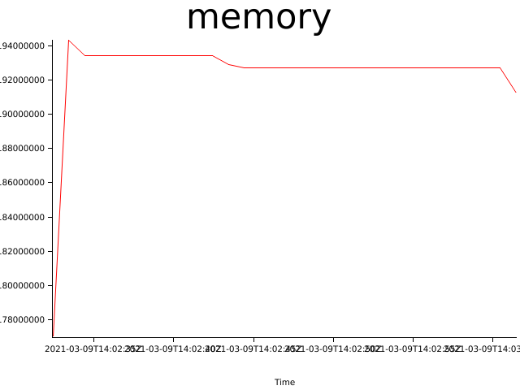
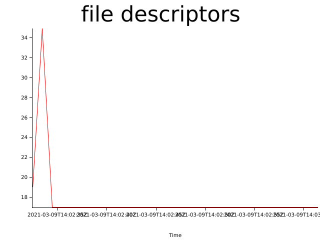

# Test results (Tue, 09 Mar 2021 14:02:06 +0000)


Git Revision | Test Duration (seconds)
------------ | -----------------------
northstar@cb8b995b51cd4fe0461491603bc406723f1ba90d
 | 30
### Test configuration
```yaml
---
time:
  secs: 30
  nanos: 0
cpus:
  - 1
  - 2
  - 3
  - 4
metrics:
  memory:
    freq:
      secs: 1
      nanos: 0
  file_descriptors:
    freq:
      secs: 1
      nanos: 0
containers:
  - name: test00
    start_after:
      secs: 60
      nanos: 0
    stop_after:
      secs: 120
      nanos: 0
    action: sleep
  - name: test01
    start_after:
      secs: 120
      nanos: 0
    stop_after:
      secs: 180
      nanos: 0
    action: sleep
  - name: test03
    start_after:
      secs: 60
      nanos: 0
    stop_after:
      secs: 60
      nanos: 0
    action: sleep
  - name: test04
    start_after:
      secs: 60
      nanos: 0
    stop_after:
      secs: 480
      nanos: 0
    action: sleep
  - name: test05
    start_after:
      secs: 30
      nanos: 0
    stop_after:
      secs: 540
      nanos: 0
    action: sleep
  - name: test06
    start_after:
      secs: 60
      nanos: 0
    stop_after:
      secs: 3000
      nanos: 0
    action: sleep
  - name: test07
    start_after:
      secs: 30
      nanos: 0
    stop_after:
      secs: 3600
      nanos: 0
    action: sleep
out_dir: results
error_context_lines: 3
```

## Memory consumption


## Files open


## Log Errors

```
2021-03-09 15:02:33,452 INFO  [northstar::runtime::state] Stopped test05:0.0.1 Signaled(SIGKILL)
2021-03-09 15:02:33,452 INFO  [northstar::runtime::state] Stopping test04:0.0.1
2021-03-09 15:02:33,452 ERROR [northstar::runtime::state] Failed to stop test04: Process: Os("Failed to SIGTERM 559743", Sys(ESRCH))
2021-03-09 15:02:33,452 INFO  [northstar::runtime::state] Stopping test03:0.0.1
2021-03-09 15:02:33,452 ERROR [northstar::runtime::state] Failed to stop test03: Process: Os("Failed to SIGTERM 559746", Sys(ESRCH))
2021-03-09 15:02:33,452 INFO  [northstar::runtime::state] Stopping test06:0.0.1
```
```
2021-03-09 15:02:33,452 ERROR [northstar::runtime::state] Failed to stop test04: Process: Os("Failed to SIGTERM 559743", Sys(ESRCH))
2021-03-09 15:02:33,452 INFO  [northstar::runtime::state] Stopping test03:0.0.1
2021-03-09 15:02:33,452 ERROR [northstar::runtime::state] Failed to stop test03: Process: Os("Failed to SIGTERM 559746", Sys(ESRCH))
2021-03-09 15:02:33,452 INFO  [northstar::runtime::state] Stopping test06:0.0.1
2021-03-09 15:02:33,452 ERROR [northstar::runtime::state] Failed to stop test06: Process: Os("Failed to SIGTERM 559749", Sys(ESRCH))
2021-03-09 15:02:33,452 INFO  [northstar::runtime::state] Stopping test01:0.0.1
```
```
2021-03-09 15:02:33,452 ERROR [northstar::runtime::state] Failed to stop test03: Process: Os("Failed to SIGTERM 559746", Sys(ESRCH))
2021-03-09 15:02:33,452 INFO  [northstar::runtime::state] Stopping test06:0.0.1
2021-03-09 15:02:33,452 ERROR [northstar::runtime::state] Failed to stop test06: Process: Os("Failed to SIGTERM 559749", Sys(ESRCH))
2021-03-09 15:02:33,452 INFO  [northstar::runtime::state] Stopping test01:0.0.1
2021-03-09 15:02:33,452 ERROR [northstar::runtime::state] Failed to stop test01: Process: Os("Failed to SIGTERM 559752", Sys(ESRCH))
2021-03-09 15:02:33,453 INFO  [northstar::runtime::state] Stopping test07:0.0.1
```
```
2021-03-09 15:02:33,452 ERROR [northstar::runtime::state] Failed to stop test06: Process: Os("Failed to SIGTERM 559749", Sys(ESRCH))
2021-03-09 15:02:33,452 INFO  [northstar::runtime::state] Stopping test01:0.0.1
2021-03-09 15:02:33,452 ERROR [northstar::runtime::state] Failed to stop test01: Process: Os("Failed to SIGTERM 559752", Sys(ESRCH))
2021-03-09 15:02:33,453 INFO  [northstar::runtime::state] Stopping test07:0.0.1
2021-03-09 15:02:33,453 ERROR [northstar::runtime::state] Failed to stop test07: Process: Os("Failed to SIGTERM 559755", Sys(ESRCH))
2021-03-09 15:02:33,457 INFO  [northstar::runtime::console] [::1]:57872: Connection closed
```
```
2021-03-09 15:02:33,452 ERROR [northstar::runtime::state] Failed to stop test01: Process: Os("Failed to SIGTERM 559752", Sys(ESRCH))
2021-03-09 15:02:33,453 INFO  [northstar::runtime::state] Stopping test07:0.0.1
2021-03-09 15:02:33,453 ERROR [northstar::runtime::state] Failed to stop test07: Process: Os("Failed to SIGTERM 559755", Sys(ESRCH))
2021-03-09 15:02:33,457 INFO  [northstar::runtime::console] [::1]:57872: Connection closed
2021-03-09 15:02:33,457 INFO  [northstar::runtime::console] [::1]:57882: Connection closed
2021-03-09 15:02:33,457 INFO  [northstar::runtime::console] Connection to [::1]:57872 closed
```
