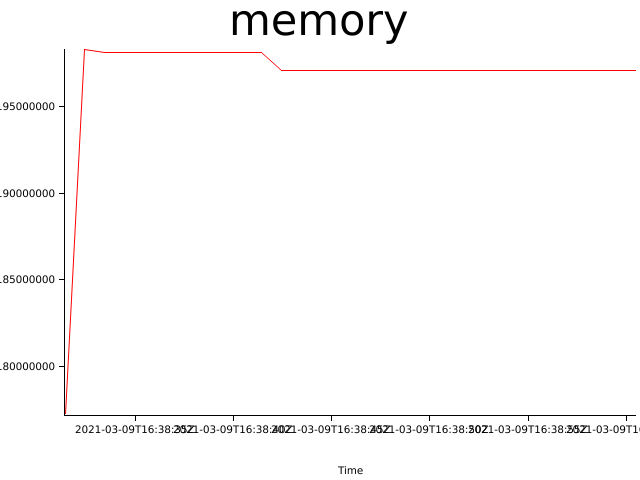
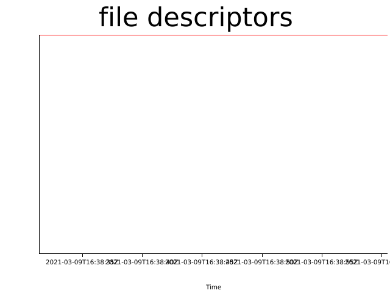

# Test results (Tue, 09 Mar 2021 16:38:06 +0000)


Git Revision | Test Duration (seconds)
------------ | -----------------------
northstar@226947a8977bb849ee09e62803f852444ca5e648 | 30

### Test configuration
```yaml
---
time:
  secs: 30
  nanos: 0
cpus:
  - 1
  - 2
  - 3
  - 4
metrics:
  memory:
    freq:
      secs: 1
      nanos: 0
  file_descriptors:
    freq:
      secs: 1
      nanos: 0
containers:
  - name: test00
    start_after:
      secs: 60
      nanos: 0
    stop_after:
      secs: 120
      nanos: 0
    action: sleep
  - name: test01
    start_after:
      secs: 120
      nanos: 0
    stop_after:
      secs: 180
      nanos: 0
    action: sleep
  - name: test03
    start_after:
      secs: 60
      nanos: 0
    stop_after:
      secs: 60
      nanos: 0
    action: sleep
  - name: test04
    start_after:
      secs: 60
      nanos: 0
    stop_after:
      secs: 480
      nanos: 0
    action: sleep
  - name: test05
    start_after:
      secs: 30
      nanos: 0
    stop_after:
      secs: 540
      nanos: 0
    action: sleep
  - name: test06
    start_after:
      secs: 60
      nanos: 0
    stop_after:
      secs: 3000
      nanos: 0
    action: sleep
  - name: test07
    start_after:
      secs: 30
      nanos: 0
    stop_after:
      secs: 3600
      nanos: 0
    action: sleep
out_dir: results
error_context_lines: 3

```

## Memory consumption


## Files open


## Log Errors

