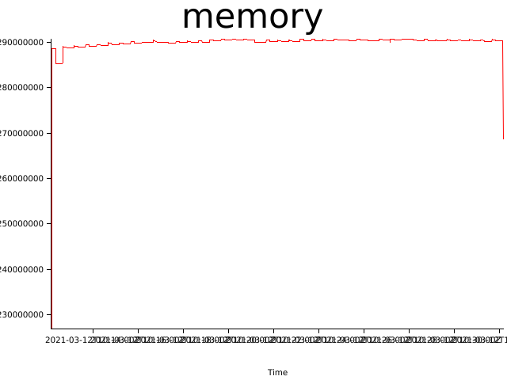
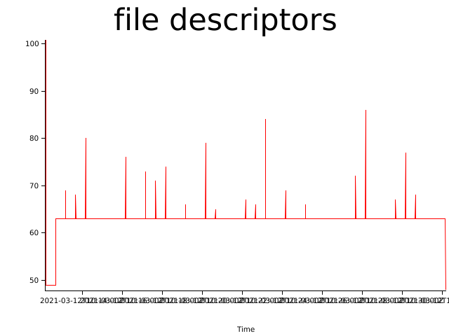

# Test results (Fri, 12 Mar 2021 10:11:24 +0000)


Git Revision | Test Duration (seconds)
------------ | -----------------------
northstar@e4fcb93de7198a702c61f31e09bcac81cf6fbb16 | 1200

### Test configuration
```yaml
---
time:
  secs: 1200
  nanos: 0
cpus:
  - 1
  - 2
  - 3
  - 4
metrics:
  memory:
    freq:
      secs: 1
      nanos: 0
  file_descriptors:
    freq:
      secs: 1
      nanos: 0
containers:
  - name: test00
    start_after:
      secs: 30
      nanos: 0
    stop_after:
      secs: 60
      nanos: 0
    action: sleep
  - name: test01
    start_after:
      secs: 30
      nanos: 0
    stop_after:
      secs: 30
      nanos: 0
    action: sleep
  - name: test03
    start_after:
      secs: 30
      nanos: 0
    stop_after:
      secs: 30
      nanos: 0
    action: sleep
  - name: test04
    start_after:
      secs: 30
      nanos: 0
    stop_after:
      secs: 60
      nanos: 0
    action: sleep
  - name: test05
    start_after:
      secs: 30
      nanos: 0
    stop_after:
      secs: 30
      nanos: 0
    action: sleep
  - name: test06
    start_after:
      secs: 30
      nanos: 0
    stop_after:
      secs: 30
      nanos: 0
    action: sleep
  - name: test07
    start_after:
      secs: 30
      nanos: 0
    stop_after:
      secs: 60
      nanos: 0
    action: sleep
  - name: test08
    start_after:
      secs: 30
      nanos: 0
    stop_after:
      secs: 30
      nanos: 0
    action: sleep
  - name: test09
    start_after:
      secs: 30
      nanos: 0
    stop_after:
      secs: 30
      nanos: 0
    action: sleep
  - name: test10
    start_after:
      secs: 30
      nanos: 0
    stop_after:
      secs: 60
      nanos: 0
    action: sleep
  - name: test11
    start_after:
      secs: 30
      nanos: 0
    stop_after:
      secs: 30
      nanos: 0
    action: sleep
  - name: test12
    start_after:
      secs: 30
      nanos: 0
    stop_after:
      secs: 30
      nanos: 0
    action: sleep
  - name: test13
    start_after:
      secs: 30
      nanos: 0
    stop_after:
      secs: 30
      nanos: 0
    action: sleep
  - name: test14
    start_after:
      secs: 30
      nanos: 0
    stop_after:
      secs: 60
      nanos: 0
    action: sleep
  - name: test15
    start_after:
      secs: 30
      nanos: 0
    stop_after:
      secs: 30
      nanos: 0
    action: sleep
  - name: test16
    start_after:
      secs: 30
      nanos: 0
    stop_after:
      secs: 30
      nanos: 0
    action: sleep
  - name: test17
    start_after:
      secs: 30
      nanos: 0
    stop_after:
      secs: 60
      nanos: 0
    action: sleep
  - name: test18
    start_after:
      secs: 30
      nanos: 0
    stop_after:
      secs: 30
      nanos: 0
    action: sleep
  - name: test19
    start_after:
      secs: 30
      nanos: 0
    stop_after:
      secs: 30
      nanos: 0
    action: sleep
  - name: test20
    start_after:
      secs: 30
      nanos: 0
    stop_after:
      secs: 60
      nanos: 0
    action: sleep
results:
  out_dir: results
  entry_name: ~
error_context_lines: 3
strace: false

```

## Memory consumption


## Files open


## Log Errors

