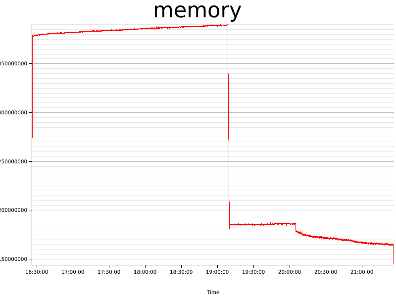
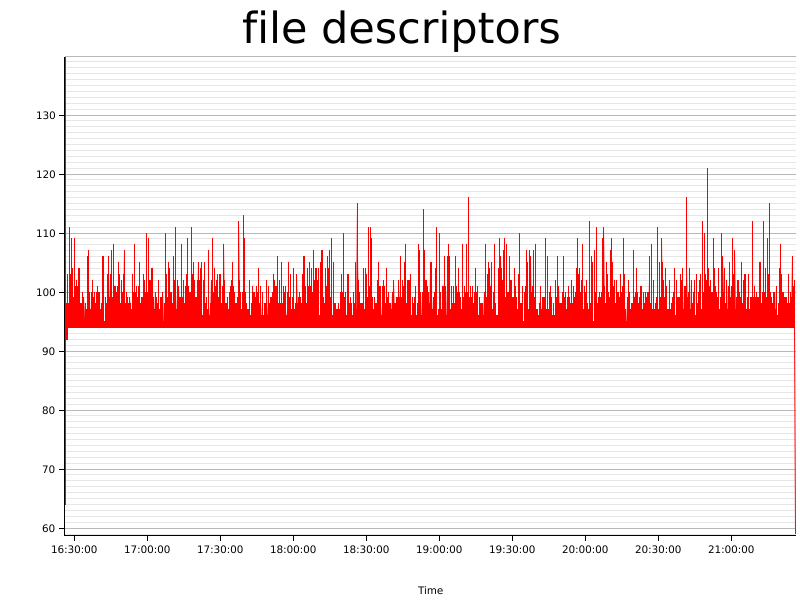

# Test results (Fri, 12 Mar 2021 16:25:11 +0000)


Git Revision | Test Duration (seconds)
------------ | -----------------------
northstar@962042d1332870af573d7c0a20d5d51ed10c7377 | 18000

### Test configuration
```yaml
---
time:
  secs: 18000
  nanos: 0
cpus:
  - 1
  - 2
  - 3
  - 4
metrics:
  memory:
    freq:
      secs: 1
      nanos: 0
  file_descriptors:
    freq:
      secs: 1
      nanos: 0
containers:
  - name: test00
    start_after:
      secs: 5
      nanos: 0
    stop_after:
      secs: 5
      nanos: 0
    action: sleep
  - name: test01
    start_after:
      secs: 1
      nanos: 0
    stop_after:
      secs: 1
      nanos: 0
    action: sleep
  - name: test02
    start_after:
      secs: 1
      nanos: 0
    stop_after:
      secs: 2
      nanos: 0
    action: sleep
  - name: test03
    start_after:
      secs: 2
      nanos: 0
    stop_after:
      secs: 3
      nanos: 0
    action: sleep
  - name: test04
    start_after:
      secs: 2
      nanos: 0
    stop_after:
      secs: 4
      nanos: 0
    action: sleep
  - name: test05
    start_after:
      secs: 2
      nanos: 0
    stop_after:
      secs: 5
      nanos: 0
    action: sleep
  - name: test06
    start_after:
      secs: 3
      nanos: 0
    stop_after:
      secs: 6
      nanos: 0
    action: sleep
  - name: test07
    start_after:
      secs: 3
      nanos: 0
    stop_after:
      secs: 7
      nanos: 0
    action: sleep
  - name: test08
    start_after:
      secs: 4
      nanos: 0
    stop_after:
      secs: 8
      nanos: 0
    action: sleep
  - name: test09
    start_after:
      secs: 4
      nanos: 0
    stop_after:
      secs: 9
      nanos: 0
    action: sleep
  - name: test10
    start_after:
      secs: 5
      nanos: 0
    stop_after:
      secs: 10
      nanos: 0
    action: sleep
  - name: test11
    start_after:
      secs: 5
      nanos: 0
    stop_after:
      secs: 11
      nanos: 0
    action: sleep
  - name: test12
    start_after:
      secs: 6
      nanos: 0
    stop_after:
      secs: 12
      nanos: 0
    action: sleep
  - name: test13
    start_after:
      secs: 6
      nanos: 0
    stop_after:
      secs: 13
      nanos: 0
    action: sleep
  - name: test14
    start_after:
      secs: 7
      nanos: 0
    stop_after:
      secs: 14
      nanos: 0
    action: sleep
  - name: test15
    start_after:
      secs: 7
      nanos: 0
    stop_after:
      secs: 15
      nanos: 0
    action: sleep
  - name: test16
    start_after:
      secs: 8
      nanos: 0
    stop_after:
      secs: 16
      nanos: 0
    action: sleep
  - name: test17
    start_after:
      secs: 8
      nanos: 0
    stop_after:
      secs: 1
      nanos: 0
    action: sleep
  - name: test18
    start_after:
      secs: 9
      nanos: 0
    stop_after:
      secs: 2
      nanos: 0
    action: sleep
  - name: test19
    start_after:
      secs: 9
      nanos: 0
    stop_after:
      secs: 3
      nanos: 0
    action: sleep
  - name: test20
    start_after:
      secs: 10
      nanos: 0
    stop_after:
      secs: 5
      nanos: 0
    action: sleep
  - name: test21
    start_after:
      secs: 10
      nanos: 0
    stop_after:
      secs: 8
      nanos: 0
    action: sleep
  - name: test22
    start_after:
      secs: 11
      nanos: 0
    stop_after:
      secs: 13
      nanos: 0
    action: sleep
  - name: test23
    start_after:
      secs: 11
      nanos: 0
    stop_after:
      secs: 21
      nanos: 0
    action: sleep
  - name: test24
    start_after:
      secs: 12
      nanos: 0
    stop_after:
      secs: 1
      nanos: 0
    action: sleep
  - name: test25
    start_after:
      secs: 12
      nanos: 0
    stop_after:
      secs: 2
      nanos: 0
    action: sleep
  - name: test26
    start_after:
      secs: 13
      nanos: 0
    stop_after:
      secs: 3
      nanos: 0
    action: sleep
  - name: test27
    start_after:
      secs: 13
      nanos: 0
    stop_after:
      secs: 5
      nanos: 0
    action: sleep
  - name: test28
    start_after:
      secs: 14
      nanos: 0
    stop_after:
      secs: 7
      nanos: 0
    action: sleep
  - name: test29
    start_after:
      secs: 14
      nanos: 0
    stop_after:
      secs: 11
      nanos: 0
    action: sleep
  - name: test30
    start_after:
      secs: 15
      nanos: 0
    stop_after:
      secs: 13
      nanos: 0
    action: sleep
results:
  out_dir: results
  entry_name: ~
error_context_lines: 3
strace: false

```

## Memory consumption


## Files open


## Log Errors

